# CloudStack

# 云计算的出现

基本上，云计算只是一种把 IT 资源当作服务来提供的手段。几乎所有 IT 资源都可以作为云服务来提供：应用程序、计算能力、存储容量、联网、编程工具，以至于通信服务和协作工具。

云计算最早为 Google、Amazon 等其他扩建基础设施的大型互联网服务提供商所采用。于是产生一种架构：大规模扩展、水平分布的系统资源，抽象为虚拟 IT 服务，并作为持续配置、合用的资源进行管理。

就最终用户而言，云计算意味着没有硬件购置成本、没有需要管理的软件许可证或升级、不需要雇佣新的员工或咨询人员、不需要租赁设施、没有任何种类的基建投资，而且还没有隐性成本。只是一种用仪表测量出来的、根据使用情况支付的订购费或固定的订购费。只是用您所需的量，而且只按使用量付费。

云计算体系结构图如下：

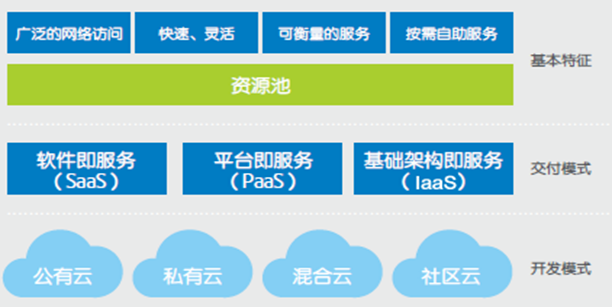


# 基础设施当做服务（IaaS）

基础设施当作服务 (IaaS) 处于最低层级，而且是一种作为标准化服务在网上提供基本存储和计算能力的手段。服务器、存储系统、交换机、路由器和其他系统协作 (例如，通过虚拟化技术) 处理特定类型的工作负载 — 从批处理到峰值负载期间的服务器/存储扩大。

最著名的商业示例是 Amazon Web 服务 (AWS)，其 EC2 和 S3 服务分别提供基本计算和存储服务。国内代表阿里云、腾讯云、百度云、金山云等。

**优势：**

- 利用率更高 — 在虚拟化之前，企业数据中心的服务器和存储利用率一般平均不到 50% (事实上，通常利用率为 10% 到 15%)。通过虚拟化，可以把工作负载封装一并转移到空闲或使用不足的系统，这就意味着可以整合现有系统，因而可以延迟或避免购买更多服务器容量。
- 资源整合 — 虚拟化使得整合多个 IT 资源成为可能。除服务器和存储整合之外，虚拟化提供一个整合系统架构、应用程序基础设施、数据和数据库、接口、网络、桌面系统甚至业务流程，因而可以节约成本和提高效率。
- 节省电能/成本 — 运行企业级数据中心所需的电能不再无限制地使用，而成本呈螺旋式上升趋势。在服务器硬件上每花一美元，就会在电费上增加一美元 (包括服务器运行和散热方面的成本)。利用虚拟化进行整合使得降低总能耗和节约大量资金成为可能。
- 节约空间 — 服务器膨胀仍然是多数企业数据中心面临的一个严重问题，可扩大数据中心并不总是一个良好的选择，因为每增大一平方米空间，就会平均增加很多成本。虚拟化通过把多个虚拟系统整合到较少物理系统上，可以缓解空间压力。
- 灾难恢复 (Disaster recovery) /业务连续 (Business Continuity) — 虚拟化可提高总体服务级利用率，并提供灾难恢复解决方案新选项。


# CloudStack介绍

官网：http://cloudstack.apache.org/

CloudStack是一个开源的具有高可用性及扩展性的云计算平台CloudStack 是一个开源的云操作系统，它可以帮助用户利用自己的硬件提供类似于Amazon EC2那样的公共云服务。CloudStack可以通过组织和协调用户的虚拟化资源，构建一个和谐的环境。

## CloudStack功能

### 多种Hypervisor

Cloudstack支持管理大部分主流的hypervisors，如KVM，XenServer，VMware，Oracle VM，Xen等。

（1）支持多种hypervisor，包括Xenserver，Hyperv，KVM，Vmware，BareMetal，Ovm，LXC

（2）在XenServer、VMware这两种受控环境下，无需安装任何软件。因为其包含强大的虚拟机管理功能，Cloudstack可以直接与其通信调用其管理接口

（3）KVM，Xen的受控机必须安装CloudStack-Agent之后，才能被CloudStack管理

（4）你可以在所有的宿主机上用同一种，也可以用不同的Hypervisor，但在同一个CloudStack群集（Cluster）内，只能用同一种Hypervisor


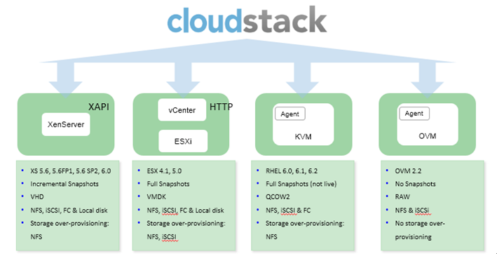


### 多种存储类型

  虚拟机使用的主存储可以使用计算服务器本地的磁盘，也可以挂载ISCSI、光纤、NFS；存放ISO镜像及模板文件的二级存储可以使用NFS，也可以使用Openstack的Swift组件。


### 大规模可拓展的管理架构

（1）CloudStack可以管理数万台服务器，这些服务器可以部署在不同地域的数据中心里。

（2）处于中心位置的管理服务器可以线性拓展，这样就消除了对中间层集群级别管理服务器的依赖。

（3）任何一个组件失效不会导致云平台的服务暂停，对于管理服务器的定期维护不会对云平台中的正在运行的虚拟机造成影响。


### 自动化配置管理

（1）CloudStack会对客户虚拟机的网络和存储进行自动化配置。

（2）CloudStack内部提供的虚拟设备池用来支持云平台自身功能，这些虚拟设备可以提供的服务有防火墙，路由、DHCP、×××访问、控制台管理、存储访问以及存储备份等。虚拟设备的大量使用简化了安装、配置和持续的云平台部署管理流程。


### API及其拓展性

  CloudStack提供丰富的api接口，详情可以查看http://cloudstack.apache.org/docs/api/index.html 。


### 高可用性

  CloudStack平台有很多功能来增加系统的可用性。管理服务器自身可以在前端均衡的前提下部署在多个节点上，MySQL可以配置使用备份来提供在数据库丢失的情况下的手工故障恢复。对于主机CloudStack平台提供网卡绑定及为存储使用单独网络，这类似于ISCSI的多路径。


## CloudStack架构


Cloudstack 部署图如下：

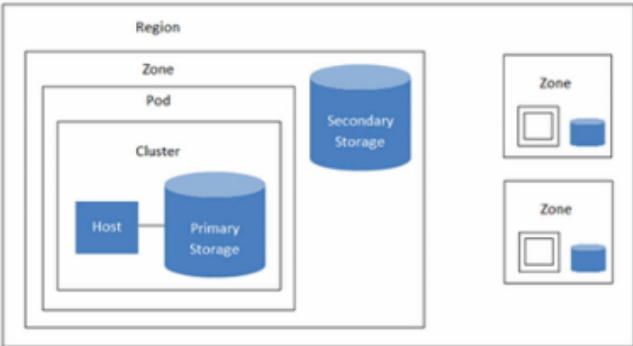


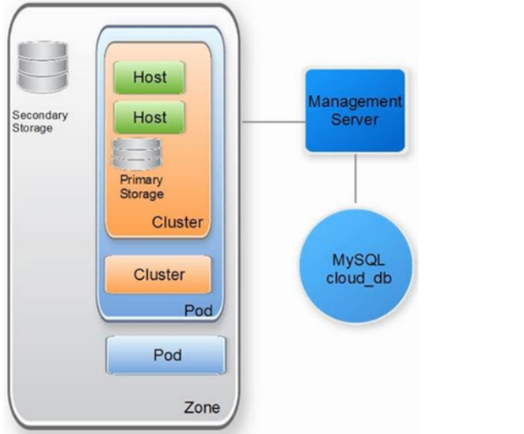


### 管理服务节点（Management Server）

（1）是cloudstack云管理平台的核心，接收用户和管理员的操作，包括对硬件、虚拟机和网络的全面管理操作，整个IaaS平台的工作统一汇总在管理服务节点中处理。

（2）对收到的操作请求进行处理，并将其发送给对应的计算节点或系统虚拟机去执行。

（3）在MySQL数据库中记录整个CloudStack系统的所有信息，并监控计算节点、存储及虚拟机的状态，以及网络资源的使用情况，从而帮助用户和管理员了解目前整个系统各个部分的运行情况。

（4）管理服务程序是用java写的，前端页面使用js，通过tomcat容器发布。当安装管理程序，会自动安装和配置Tomcat。安装完成后，打开浏览器就可以进行管理了、

（5）由于CloudStack采用集中式管理架构，所有的模块都封装在管理节点的程序中，便于安装和管理，安装的时候使用几条命令就可以完成管理程序的安装，所以在节点只需要分别安装管理服务程序，MySQL数据库和Usage服务程序（可选）即可

（6）管理服务器本身并不记录CloudStack的系统数据信息，而是全部储存在数据库中。所以，当管理服务节点down掉以后，所有的计算节点、存储网络及网络功能都会在维持现状的情况下正常运行，只是可能无法接收新的请求，用户所使用的虚拟机仍然可以在计算服务器上保持正常的通信和运行。但是数据库记录的数据是整个云平台的全部数据，如果数据库损坏且无法恢复，那就是灾难性的。

- 管理服务程序：基于Java编写，包括Tomcat服务、API服务、管理整个系统工作流程的Server服务、管理各类Hypervisor的核心服务等组件。
- MySQL数据库：记录CloudStack系统中的所有信息
- Usage服务程序：主要用于记录用户使用各种资源的情况，为计费提供数据，所以当不需要计费功能时可以不安装此程序。
- 生产环境建议：安装多个管理服务程序并使其成为一个集群，在前端使用负载均衡设备，可以负载大量的Web访问或API访问；将MySQL数据库安装在独立的服务器上，并搭建主从；将Usage服务程序安装在独立的服务器上，用于分担管理服务器的压力。

### 资源区域（Zone）

（1）区域是CloudStack中最大的组织单位，一个区域通常与一个数据中心对应，可以**理解为一个机房**。

（2）区域可提供物理隔离和冗余，一个区域由一个或多个提供点以及由区域中的所有提供点共享一个辅助存储服务器组成，其中每个提供点中包含多个宿主机集群机和主存储服务器，二级存储是在资源域下的所有提供点共享的。

（3）登录CloudStack的第一件事就是创建区域，对整个区域需要有一个很好的规划，既要满足现在的使用需求，还需要适应未来的扩展需求。

（4）在一个CloudStack系统中可以添加多个区域，区域之间可以完全实现物理隔离，硬件资源、网络配置、虚拟机也都是独立的。

（5）在建立一个区域的时候，只能选择一种网络架构，基本网络或是高级网络。如果系统有多个区域，每个区域还可以使用不同的网络架构。根据这一特点，CloudStack可以实现对多个物理机房的统一管理。从业务的需求上来说，也可以在一个机房内划分出两个独立的区域，供完全隔离的两个系统使用。由于区域之间是相互独立的，所以如果需要进行通信，只能在网络设备上打通区域的公共网络。

（6）区域间只能复制ISO和模板文件，虚拟机之间不能进行区域之间的迁移操作，如果需要进行这些操作，应将虚拟机转换为模板，然后复制到另一个区域内

（7）区域对用户是可见的，管理员创建区域的时候可以配置该区域是对所有用户可见的公共区域，或是只对某组用户可见的私有区域。如果一个用户能够看到多个区域，在创建虚拟机时就可以选择在某个区域中创建虚拟机。


### 提供点（Pods）

（1）提供点是CloudStack区域内的第二级逻辑组织单元，**通常代表一个物理机架**，参照物理机架的概念，在CloudStack中也有“网络边界”的概念，即提供点内的计算服务器、系统虚拟机都在同一个子网，一般来说，提供点上的服务器连接在同一个或一组二层交换机上，很多实际部署也都是以一个物理机架来进行规划的。

（2）每个区域必须包含一个或多个提供点，提供点中包含主机和主存储服务器，CloudStack的内部管理通信配置一个预留IP地址范围，预留的IP范围对云中的每个区域来说必须唯一

（3）一个区域内可以有多个提供点，提供点的数量没有上限。一个提供点可以由一个或多个集群构成，一个提供点中的集群数量也没有上限。为了实现网络的灵活扩展，提供点是不可或缺的一个层级。另外，机架对最终用户而言是不可见的。


### 集群（Cluster）

（1）Cluster是多个主机组成的一个集群

（2）同一个cluster中的主机有相同的硬件，相同的Hypervisor，和共用同样的存储

（3）同一个cluster中的虚拟机，可以实现无中断服务的从一个主机迁移到另外一个上

（4）集群由一个或多个宿主机和一个或多个主要存储服务器构成。集群的大小取决于下层虚拟机软件

（5）当使用VMware时，每个VMware集群都被vCenter服务器管理。管理员必须在本产品中登记vCenter。每个Zone下可以有多个vCenter服务器。每个vCenter服务器可能管理多个VMware集群


### **主存储（Primary Storage）**

（1）一级存储与Cluster关联，它为该Cluster中宿主机的全部虚拟机提供磁盘卷

（2）一个cluster至少有一个一级存储，且在部署时位置要临近主机以提供高性能

（3）ISCSI和FC-San存储在XenServer中被加载为ClusterLVM格式，此种格式下，不能支持存储的超配。如果存储本身支持XenServer的thin-provisioning，CloudStack也可以支持存储超配。

（4）在全局配置中，有storage.overprovisioning.factor项用来配置超配的比例。默认为2.即支持超配的存储格式，可以使用的存储为该存储的N倍。

（5）配置完成后，可以在UI的Dasehoard中查看存储信息。Primary Storage Allocated项是超配后的所有主存储的总和，Storage项是所有主存储实际大小的总和。


### 辅助存储（Secondary Storage）

#### 二级存储虚拟机（Secondary Storage VM）

   （1）二级存储虚拟机简称ssvm，作为系统虚拟机的一种，在CloudStack中扮演了很重要的角色，没有它很多功能都无法实现。简单来说ssvm主要用来管理二级存储，也就是对二级存储相关的操作都会通过它来完成

   （2）每一个资源可以有多个ssvm，当ssvm被删除或停止，它会自动被重建并启动

   （3）二级存储与 zone 关联，它存储模板文件，ISO 镜像和磁盘卷快照。


#### CloudStack如何访问二级存储虚拟机

   CloudStack是通过ssh访问直接访问ssvm，系统虚拟机模板已经植入了一个ssh的private key，此时CloudStack只需要通过自己的public key访问就可以了，端口为3922，这里xen与vmware的机制有些不同，由于默认vmware是禁止ssh登陆的，所以对于vmware来说，可以通过CloudStack的Management Server直接访问ssvm的public ip。在配置完ssmv后，CloudStack会让ssvm重新生成一对public key和private key，以后就使用新的key来访问ssvm。在ssvm中有一个java进程，专门负责与CloudStack的8250端口进行通讯，而这个java进程，以及相关shell脚本都是在通过创建完ssvm之后，由CloudStack注入进去的。如vmware，会有一个system.iso，这里面就存放着所有系统虚拟机需要的文件，在mount上二级存储之后，会将这个文件拷到ssvm中，在ssvm解压，并将相关文件存到指定路径下

#### 二级存储里面有哪些东西

   （1）二级存储与zone关联，它存储模板文件，ISO镜像和磁盘卷快照，也就是说对这些资源的管理都是通过SSVM进行的。

   （2）模板文件：可以启动虚拟机的操作系统镜像，也包括了诸如已安装应用的其余配置信息

   （3）ISO镜像：包含操作系统数据或启动媒质的磁盘镜像

   （4）磁盘卷快照：虚拟机数据的已储副本，能用于数据恢复或者创新模板。


#### ssvn如何管理二级存储

   （1）ssvm管理二级存储其实也就是对存放在二级存储里面的资源进行管理，首先ssvm会将二级存储mount到本地，之后对二级存储的操作也就转换成对本地文件夹的操作，从功能上讲，ssvm负责管理snapshot，volume，iso，template，下面将分别从上传，下载，查询，删除这4个角度说明对这些资源如何管理的。

   （2）上传资源：当用户选择上传资源时，Managerment Server会将url传递给ssvm，这样ssvm就可以通过wget从指定的url中下载资源。

   （3）下载资源：当用户选择下载指定资源的时候，management server 首先从数据库中查找该资源对应的路径，并将该路径传递给ssvm，ssvm使用内置的apache server来提供资源上传服务。这样用户就可以通过ssvm下载所需要的资源了

   （4）查询资源：ssvm会定期向Management Server上传自己的状态信息

   （5）删除资源：由于二级存储已经挂载到ssvm中，这样它就可以直接将二级存储里面的内容删除


#### 如何验证ssvm

在ssvm中有一个ssvm-check.sh，这个shell文件主要负责对ssvm的相关配置进行验证。验证内容包括：dns，mount的二级存储，与Management Server的连接，相关java进程。

### 物理网络（Physical Networks）

每个区域可以分配一个（极限与高级资源域）或者多个物理网络。这个网络对应宿主主机的一个网卡。每个物理网络可以承载一种或多种网络流量。每个网络流量的类型的选项由你选择的是基本网络与高级网络与而不同，物理网络是连接到资源与真实的网络硬件，一个资源域能有多个物理网络。


## CloudStack网络类型

网络的设计规划是CloudStack的一个亮点，也是CloudStack被广泛商业应用的一个主要原因，CloudStack根据不同的数据流量类型设计了管理，公共，来宾及存储网络。可以简称为PMGS（public，Managerment，Guest，Storage）网络。


### 公用网络（Public Network）

当虚拟机需要访问Internet或外部网络时，需要通过公共网络，这就说明客户虚拟机必须被分配某种形式的外网IP，用户可以在CloudStack的UI上获得一个IP来做NAT映射，也可以在Public之间做负载均衡。所有的Hypervisor都需要共享Public VLAN以保证虚拟机对外的访问

### 来宾网络（Guest Network）

最终用户运行CloudStack创建的虚拟机实例时产生Guest流量，虚拟机实例之间的相互通信通过客户网络

### 管理网络（Management Network）

CloudStack 内部资源相互通信会产生Management流量，这些流量包括管理服务器节点与Hypervisor集群之间的通信，与系统虚拟机之间的通信或与其它组件之间的通信等；集群规模较小时管理流量只占用很少的带宽。

### 存储网络（Storage Network）

主存储与Hypervisor之间互联互通的流量；主存储与二级存储之间也产生Storage流量，比如虚拟机模板和快照的搬移


## CloudStack网络模式

CloudStack中网络模式可以分成基本网络和高级网络两种，其中MGS（Management，Guest，Storage）三种网络对于基本网络及高级网络通用，而P（Public）则只是针对高级网络才存在。


### 基本网络与高级网络

（1）基本网络，类似于AWS类型的网络，提供一个单一网络，在这个网络里客户通过提供的三层方式进行隔离，比如借安全组方式（源IP地址过滤）

（2）高级网络，为更复杂的网络拓扑设计，网络模型提供了更为灵活的客户定义网络

（3）这里强烈建议不同的流量类型单独设置网卡，而对于存储网络最好用网卡绑定（NIC bonding），这样在系统的稳定性和性能方面都会有极大的提高


### 基本网络模式下IP地址规划

 如果打算使用基本网络模式建立CloudStack云计算环境，那就意味着客户虚拟机实例将会和CloudStack，Hypervisor整体架构拥有相同的CIDR段，这样在规划IP地址时每个资源都要预留足够的IP地址，假设你规划有8个资源域，每个资源域容纳2000台虚拟机，那Ip地址CIDR可规划成192.168.0.0/20，这样就能保证最多16个资源域，每个资源域IP数量有2^12-1=4095个，除去机架，系统虚拟机，主机占用的IP，提供2000个VM的IP绰绰有余。

注：具体环境中采用哪个段的IP地址可能要与IT环境相一致

### 高级网络模式下的IP地址规划

 （1）高级网络模式相对比较复杂，在这种模式下，每个账号都要分配：

   1：公网IP，这为了保证对外网的访问，通常这个IP设置在虚拟路由器上

   2：Guest网络IP范围，比如默认的10.1.1.0/24

   3：Guest网络隔离的Vlan ID

  注：以上默认的Guest网络IP范围对于所有账户都是一样的，只有管理员可以进行更改 （2）不同账号使用不同的Guest网络Ip范围

一个账户下的客户虚拟机实例通过它专属的Vlan进行相互之间的访问或与这个账户的虚拟路由器互通。客户虚拟机可以运行在资源域内任意一台主机上，通过二层交换的Vlan端口汇聚（Trunk）功能，可以保证一个Vlan下所有的虚拟机互联互通。

### 预留系统IP地址

​    当配置一个机架时，需要为系统虚拟机保留一些IP地址，这部分是管理网络也称为私有IP地址。通常情况下10个IP地址对一个机架时足够用了。这些IP地址会被ssvm（二级存储系统虚拟机）和CPVM（控制台系统虚机），如果系统很庞大，CPVM会被自动部署多台来分担负载。

在整个云计算环境中，所有的主机和系统虚拟机都必须有一个唯一的IP地址，因此在添加新的资源域时，也需要考虑当前环境中资源域的网络规划。


### 本地网络IP（Link-Local）

​    在使用XenServer或KVM作为主机时，系统虚拟机（SSVM,CPVM，V-Router）会被分配一个本地链路的IP地址，这个地址的CIDR是169.254.0.0/16；这样看来本地链路的IP地址会有2^16-1=65535个，目前看来不太可能超过这个范围。如果一个机架只包含XenServer或KVM集群时，那可以分配给这个机架下的主机一个C类段的地址形如：X.X.X.X/24.如果是VMware的集群，给机架分配的IP地址范围会被系统虚拟机占用一些那么就要考虑比C类段大一些的范围作为机架的IP地址，形如X,X,X,X/21，这样会有2^11-2=2046个IP供给主机，存储以及虚拟系统虚拟机使用。


### 虚拟机隔离

在同一个资源域内，虚拟机有两种方式进行隔离；安全组和VLAN

- **安全组隔离**

当使用安全组时，每一个创建的账户都会有一个默认的安全组生成，以保证通过这个账户创建的虚拟机实例默认要以互连互通。。当用户创建虚拟机实例后，可以对这些虚拟机实例设定一个或多个安全组

用户可以在任意时间创建额外的安全组，但正在运行中的此用户实例不能应用新建的安全组规划，需要关机后更改设置。

同一个安全组下的用户虚拟机实例可以相互通信，安全组通过Imagess和Egress来进行流量控制


- **VLAN**

高级网络模式中默认是通过VLAN进行虚拟机实例之间的相互隔离。但一个账户的第一个虚拟机被创建并运行时，一个隔离的网络也同时创建完成。在一个资源域下，一个账户的虚拟机网络默认的CIDR配置；10.1.1.0/24；在整个云计算环境中，只有系统管理员有权限创建一个隔离的客户虚拟机网络，并指定一个IP范围和一个VLAN

CloudStack中网络是较为复杂的一部分，功能也十分强大，特别是高级网络模式。这里建议大家参考CloudStack3.0的相关文档来更清楚的了解网络部分。


https://blog.51cto.com/zhangdl/1879600


# CloudStack安装


## 管理节点配置

### 安装nfs

```bash
yum -y install nfs-utils
mkdir -p /data1/{secondary,primary}

cat >/etc/exports<<EOF
/data1/secondary *(rw,async,no_root_squash,no_subtree_check)
/data1/primary *(rw,async,no_root_squash,no_subtree_check)
EOF


cat >>/etc/sysconfig/nfs <<EOF
LOCKD_TCPPORT=32803
LOCKD_UDPPORT=32769
MOUNTD_PORT=892
RQUOTAD_PORT=875
STATD_PORT=662
STATD_OUTGOING_PORT=2020
EOF
systemctl start nfs
systemctl start rpcbind 
systemctl enable rpcbind
systemctl enable nfs
```


### 安装和启动mysql-server

```bash
yum -y install mariadb-server mariadb
vi /etc/my.cnf     #在[mysqld]下添加下列参数：
innodb_rollback_on_timeout=1
innodb_lock_wait_timeout=600
max_connections=350
log-bin=mysql-bin
binlog-format= 'ROW'
bind-address = 0.0.0.0

systemctl start mariadb.service
systemctl enable mariadb.service

#安全配置设置数据库密码、删除多余的库
mysql_secure_installation
mysql -uroot -p123456 -e "GRANT ALL PRIVILEGES ON *.* TO root@'%' IDENTIFIED BY '123456' WITH GRANT OPTION";
```

### 安装Cloudstack-Management

```bash
cat >/etc/yum.repos.d/cloudstack.repo<<EOF
[cloudstack]
name=cloudstack
baseurl=http://cloudstack.apt-get.eu/centos7/4.16/
enabled=1
gpgcheck=0
EOF

yum -y install cloudstack-management cloudstack-common


#初始化数据库，这一步在数据库中创建cloudstack使用的库表，并创建初始数据。 会在mysql中新创建一个 cloud 用户
cloudstack-setup-databases cloud:123456@localhost --deploy-as=root:123456

#启动management
cloudstack-setup-management

#查看状态
systemctl status cloudstack-management

#查看日志cloudstack运行过程中日志文件写在管理节点日志，可以查看日志判断运行过程错误。
tail -f /var/log/cloudstack/management/management-server.log


```

防火墙策略

```
如果服务器的防火墙开启，需配置防火墙策略，允许NFS客户端访问。编辑文件/etc/sysconfig/iptables

-A INPUT -m state --state NEW -p udp --dport 111 -j ACCEPT
-A INPUT -m state --state NEW -p tcp --dport 111 -j ACCEPT
-A INPUT -m state --state NEW -p tcp --dport 2049 -j ACCEPT
-A INPUT -m state --state NEW -p tcp --dport 32803 -j ACCEPT
-A INPUT -m state --state NEW -p udp --dport 32769 -j ACCEPT
-A INPUT -m state --state NEW -p tcp --dport 892 -j ACCEPT
-A INPUT -m state --state NEW -p tcp --dport 892 -j ACCEPT
-A INPUT -m state --state NEW -p udp --dport 892 -j ACCEPT
-A INPUT -m state --state NEW -p tcp --dport 875 -j ACCEPT
-A INPUT -m state --state NEW -p udp --dport 875 -j ACCEPT
-A INPUT -m state --state NEW -p tcp --dport 662 -j ACCEPT
-A INPUT -m state --state NEW -p udp --dport 662 -j ACCEPT


firewall-cmd --zone=public --add-port=8080/tcp --permanent
firewall-cmd --zone=public --add-port=8250/tcp --permanent
firewall-cmd --zone=public --add-port=8443/tcp --permanent
firewall-cmd --zone=public --add-port=9090/tcp --permanent
firewall-cmd --reload

# firewall-cmd --zone=public --remove-port=80/tcp --permanent
```


### 系统模板导入

模板下载地址：

http://cloudstack.apt-get.eu/systemvm/4.16/


在线导入

```
/usr/share/cloudstack-common/scripts/storage/secondary/cloud-install-sys-tmplt \
-m /data/secondary \
-u http://cloudstack.apt-get.eu/systemvm/4.16/systemvmtemplate-4.16.0-kvm.qcow2.bz2 \
-h kvm -F

```

本地导入

```
/usr/share/cloudstack-common/scripts/storage/secondary/cloud-install-sys-tmplt \
-m /data1/secondary \
-f systemvmtemplate-4.16.0-kvm.qcow2.bz2 \
-h kvm -F

```


## 计算节点配置

注释：所有的计算节点的配置都一样的,除了hostname之外。

- 配置hostname

```
hostnamectl set-hostname node1.bjjf.com
echo "10.159.238.1 node1.bjjf.com" >>/etc/hosts

```


```
cat >/etc/yum.repos.d/cloudstack.repo<<EOF
[cloudstack]
name=cloudstack
baseurl=http://cloudstack.apt-get.eu/centos7/4.16/
enabled=1
gpgcheck=0
EOF


yum -y install cloudstack-agent cloudstack-common
```


cloudstack管理虚拟机，底层的虚拟机创建等还是通过kvm qemu等实现，libvirtd提供接口 访问虚拟机等。因此安装完成要修改相应配置。

CloudStack通过libverd来管理所有的kvm，有两部分需要进行配置， libvirt和QEMU：


```


1） 编辑QEMU VNC配置文件/etc/libvirt/qemu.conf

vim /etc/libvirt/qemu.conf
去掉注释
vnc_listen="0.0.0.0"

2）CloudStack使用libvirt管理虚拟机

配置/etc/libvirt/libvirtd.conf文件

vim /etc/libvirt/libvirtd.conf
listen_tls = 0
listen_tcp = 1
tcp_port = "16509"
auth_tcp = "none"
mdns_adv = 0

配置/etc/sysconfig/libvirtd文件
vim /etc/sysconfig/libvirtd
LIBVIRTD_ARGS="--listen"

3）重启libvirtd 并设置为开机自启

systemctl restart libvirtd
systemctl enable libvirtd

```


# CloudStack使用

登录地址：http://manager:8080/client/ ；初始化，账号密码是 admin password

## 创建zone资源域

登录成功后，证明私有云平台已经搭建成功了，在页面右上角点击Add Zone，根据导航一步步添加信息，最后完成launch，即可完成创建

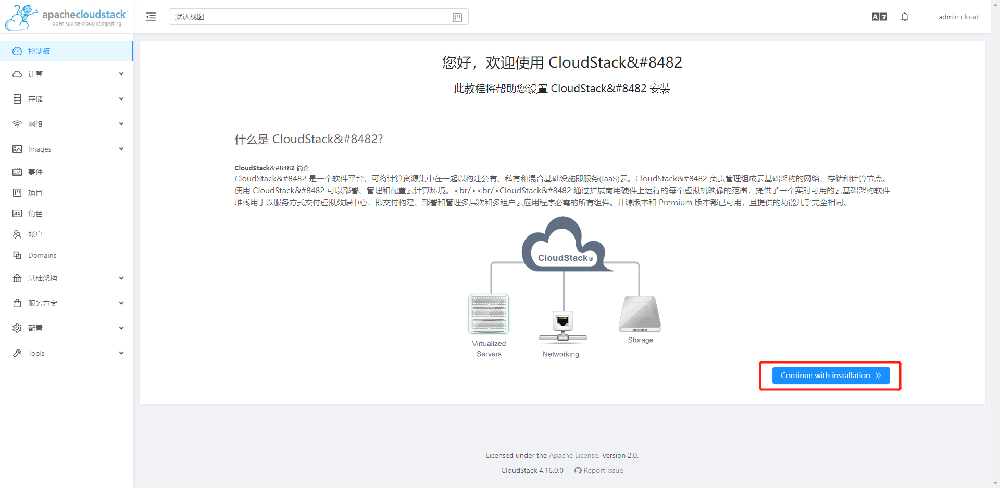


点击添加区域

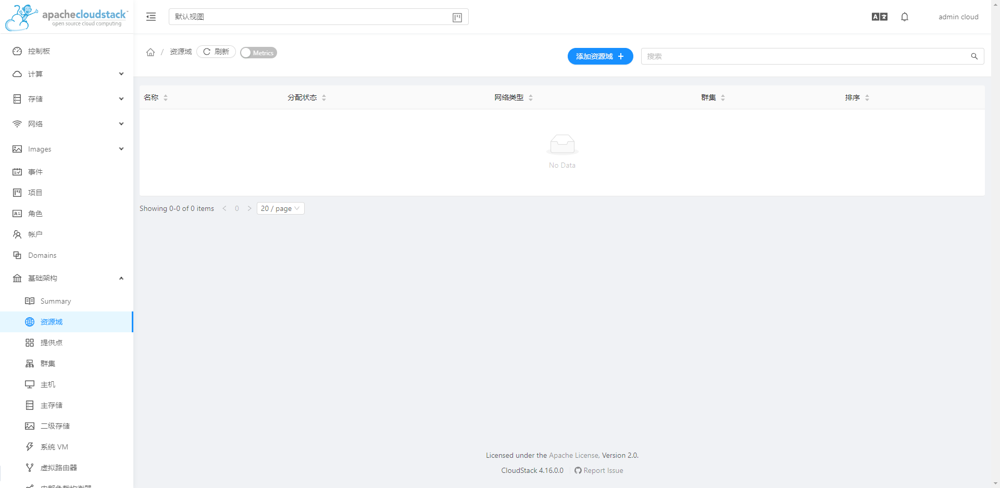


选择基本网络模式

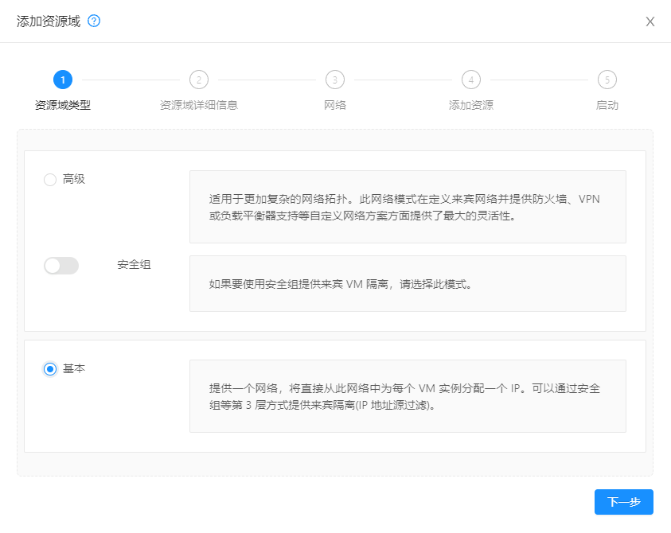

填写区域信息

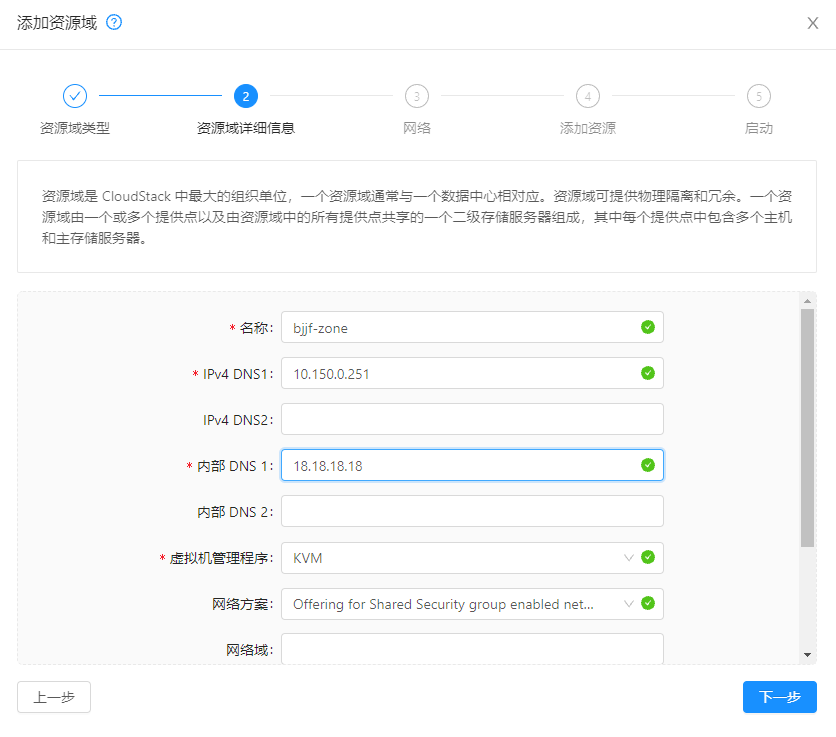

注释:

- 区域名称: 自己随便定义,不过建议是 地区-机房名称   或其他更详细的内容
- 外部dns: 填写外网DNS服务器的IP
- 内部dns: 如有内网的DNS服务器可把ip填到此处,反之则填写个公网的dns即可
- 虚拟机管理程序: 选择默认的Hypervisor类型
- 网络域: 可以把自己公司的域名填上,不填也可以,
- Dedicated: 给某个域或某个用户专用的区域
- 已启用本地存储: 意思是把虚拟机的镜像文件存在某Hypervisor的本地文件系统上,而非共享存储


设置网络流量标签

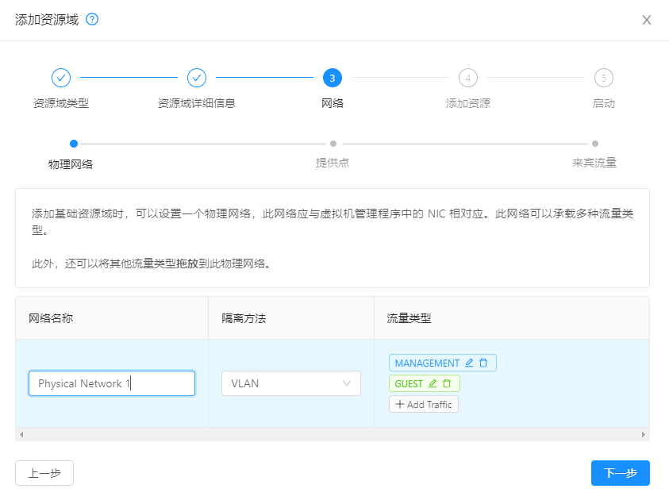

注释:

- 流量标签: 流量标签的意思是让某一个网络的流量从某个接口走
- 默认情况下存储的流量标签是跟管理网络一样,所以这里就没选存储网络


填写提供点信息


注释:

- 提供点名称:可以自己随便定义
- 预留的系统网关: 指的是cloudstack中管理IP的网关
- 预留系统网络掩码: 不解释
- 起始预留系统IP: 不解释
- 结束预留系统IP: 不解释


填写来宾网络信息

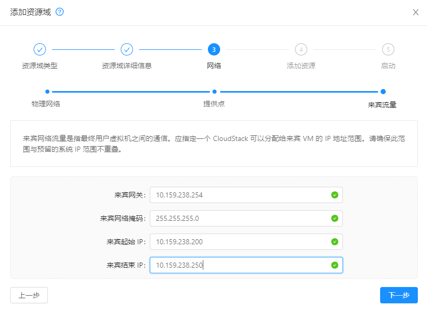

注释:

- 来宾网关: 指的是虚拟机实例的网关
- 来宾网络掩码: 虚机实例
- 来宾起始IP：虚机实例起始地址
- 来宾结束IP：虚机实例结束地址


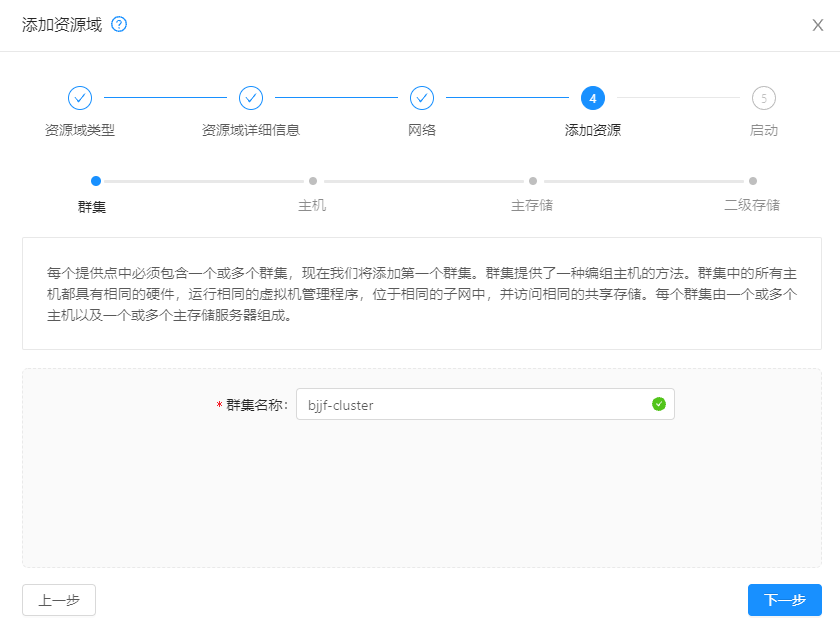


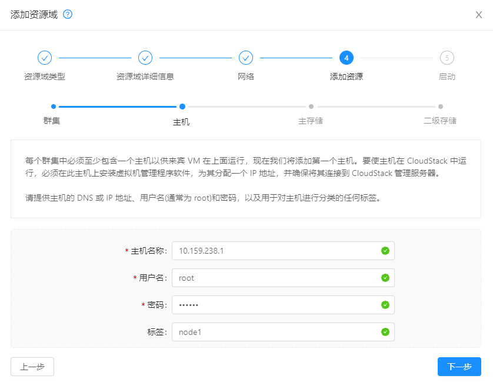


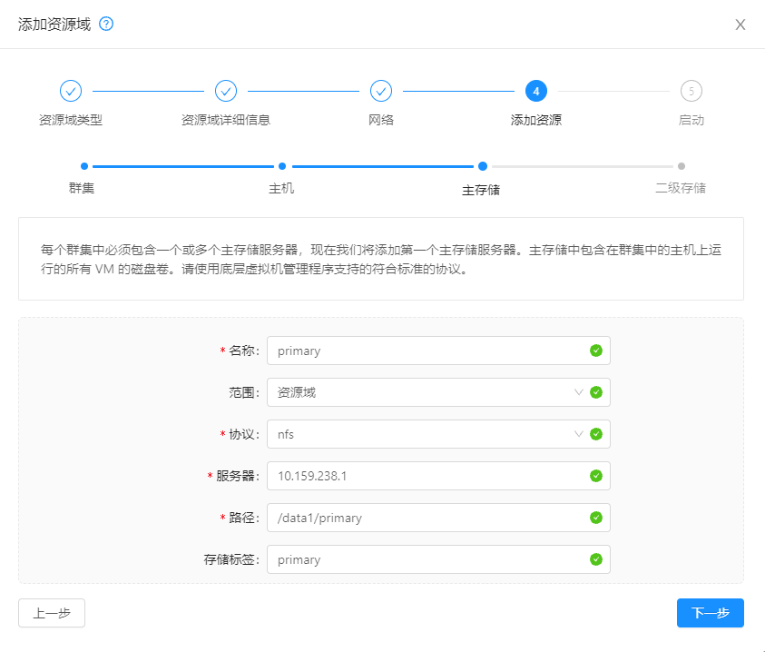


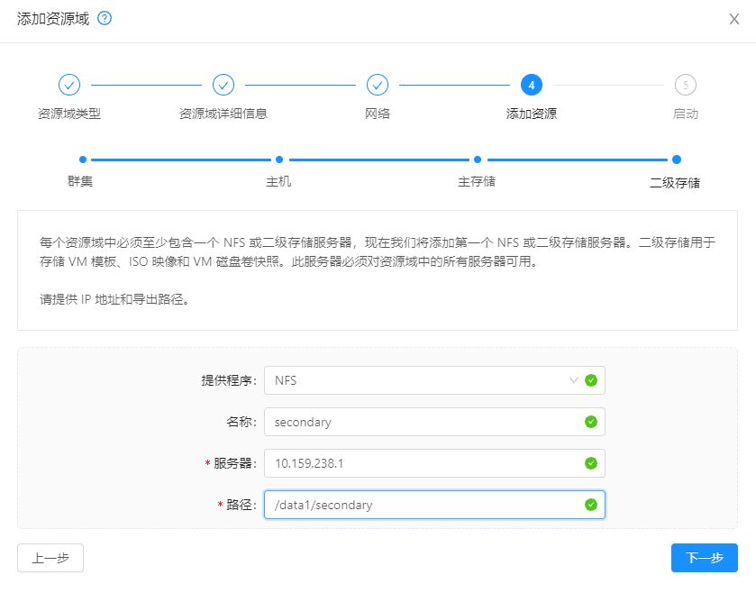


## 上传ISO映像文件

设置secstorage.allowed.internal.sites为0.0.0.0/0，这一步是为了允许上传ISO或模板，否则会提示connection refused。

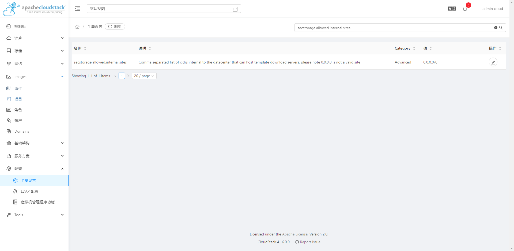

重启cloudstack-management，重新登录。


因为本地无法上传ISO映像文件，借助nginx构建web站点下载。

```
yum -y install nginx

vim /etc/nginx/nginx.conf

# 在 access_log  /var/log/nginx/access.log  main;后面添加：
autoindex           on;
autoindex_exact_size on;
autoindex_localtime on;


rm -rf /usr/share/nginx/html/*
#长传镜像到html站点目录，然后启动nginx。
systemctl enable nginx
systemctl start nginx

```


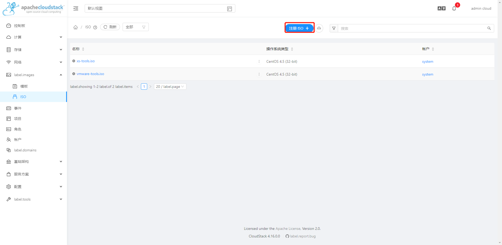	


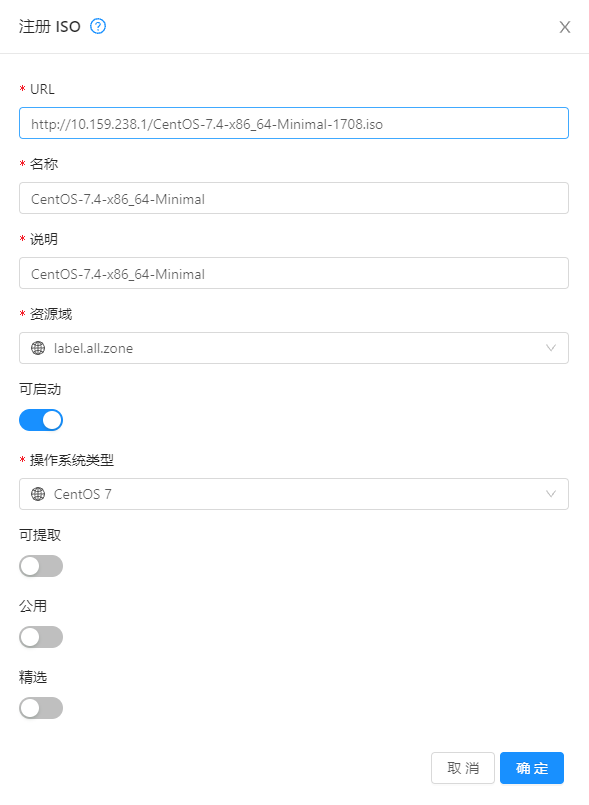


确保状态是ok的。

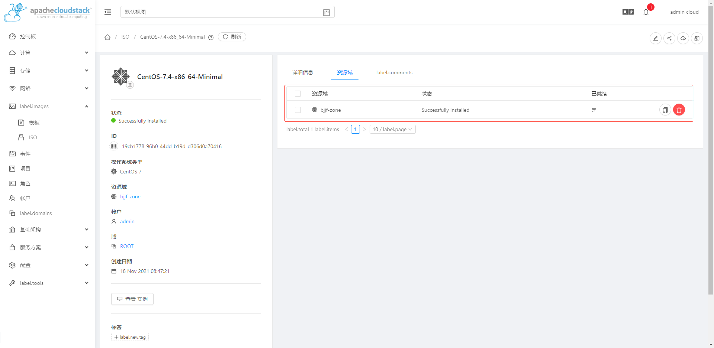


## 创建实例

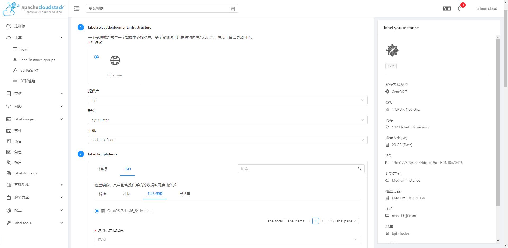

填好实例信息后，启动实例，就会看到和平时安装系统一样的界面。

重启实例前，取消附加的ISO，否则又会进入创建系统界面。

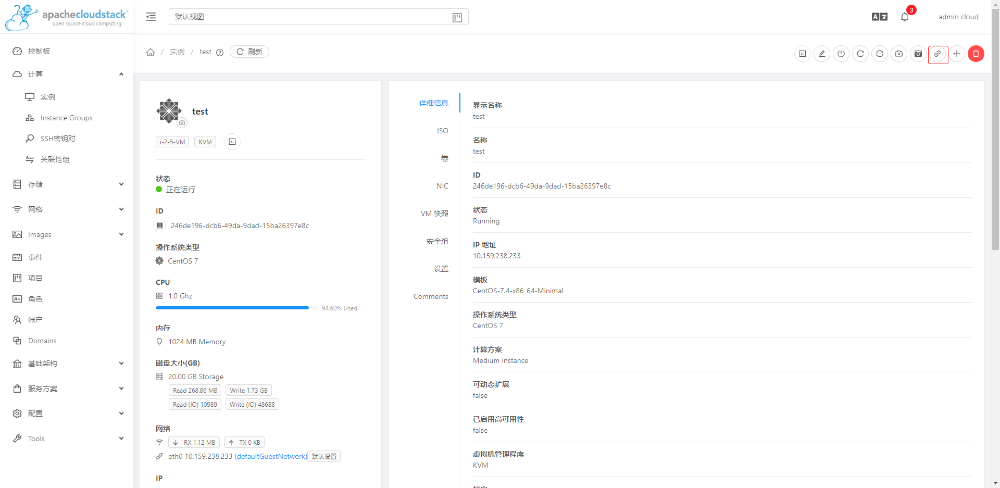


## 虚拟机模板创建

进入cloudstack管理平台，关闭刚才创建好的虚机。

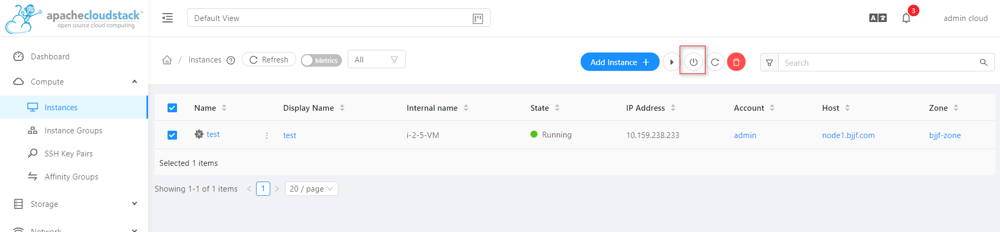


# 文档

http://docs.cloudstack.apache.org/en/latest/index.html