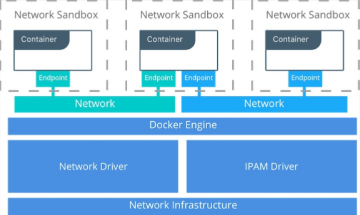
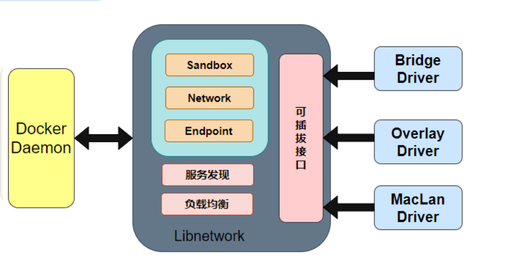
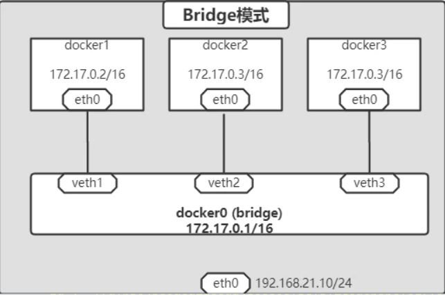
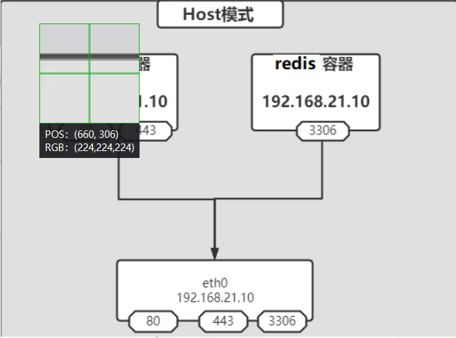
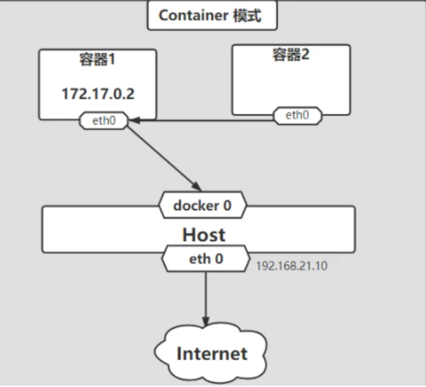

# Docker网络


# 1. 简介

容器网络实质上是由 Docker 为应用程序所创造的虚拟环境的一部分，它能让应用从宿主机操作系统的网络环境中独立出来，形成容器自有的网络设备、IP 协议栈、端口套接字、IP 路由表、防火墙等与网络相关的模块。


## 1.1 CNM

Container Network Model，它是 Docker 网络架构采用的设计规范。只要符合该模型的网络接口就能被用于容器之间通信，而通信的过程和细节可以完全由网络接口来实现。




CNM 的网络组成:

- Sandbox: 提供容器的虚拟网络栈，即端口套接字，IP路由表、iptables配置，DNS等。用于隔离容器网络和宿主机网络
- Network: Docker 虚拟网络，与宿主机网络隔离，只有参与者能够通信
- Endpoint: 容器内的虚拟网络接口，负责与Docker虚拟网络连接


## 1.2 Libnetwork

CNM 的标准实现，由Golang开发，它实现了CNM定义的全部三个组件，还实现了本地服务发现，基于 Ingress 的容器负载均衡，及网络控制层和管理层功能。



libnetwork中的5种内置驱动

1、bridge驱动：此驱动为Docker的默认设置，docker安装时会创建一个名为 docker0 的Linux bridge，新建的容器会自动桥接到这个接口。但与外界通信使用NAT，增加了通信的复杂性，在复杂场景下使用会有诸多限制。

2、host驱动：使用这种驱动的时候，Docker容器和宿主机共用同一个network namespace，使用宿主机的网卡、IP和端口等信息。但是，容器其他方面，如文件系统、进程列表等还是和宿主机隔离的。host模式不存在虚拟化网络带来的额外性能负担。但是host驱动也降低了容器与容器之间、容器与宿主机之间网络层面的隔离性，引起网络资源的竞争与冲突。

3、overlay驱动：此驱动采用IETF标准的VXLAN方式，并且是VXLAN中被普遍认为最适合大规模的云计算虚拟化环境的SDN controller模式。在使用的过程中，需要一个额外的配置存储服务， 还需要在启动Docker daemon的的时候额外添加参数来指定所使用的配置存储服务地址。

4、remote驱动：这个驱动实际上并未做真正的网络服务实现，而是调用了用户自行实现的网络驱动插件，使libnetwork实现了驱动的可插件化。

5、null驱动：使用这种驱动的时候，Docker容器拥有自己的network namespace,但是并不为Docker容器进行任何网络配置。也就是说，这个Docker容器除了network namespace自带的loopback网卡外，没有其他任何网卡、IP、路由等信息，需要用户为Docker容器添加网卡、配置IP等。这种模式如果不进行特定的配置是无法正常使用的，但是优点也非常明显，它给了用户最大的自由度来自定义容器的网络环境。


## 1.3 网络驱动

- 宿主机内部：bridge，host，container，none
- 跨主机：overlay，macvlan (适合swarm等容器编排工具)
- 第三方：flannel，weave，calico


## 1.4 支撑技术

- network namespace：用于隔离容器网络资源（IP、网卡、路由等）。netns可确保同一主机上的两个容器无法相互通信，甚至不能与主机本身进行通信，除非配置为通过docker网络进行通信。CNM网络驱动程序为每个容器实现单独的netns。但是，容器可以共享相同的netns，甚至可以是主机的netns的一部分。
- veth pair：用于不同 netns 间进行通信。veth是全双工链接，在每个名称空间中都有一个接口，充当两个网络名称空间之间的连接线，负责将一个 netns 数据发往另一个 netns 的 veth。如当容器连接到docker网络时，veth的一端放置在容器内部（通常视为ethX接口），而另一端连接到Docker网络(vethxxx)。
- iptables：包过滤，端口映射和负载均衡
  


## 1.5 禁用容器互联

默认情况下，同一台宿主机上的容器，是互通的，如果需要隔离，修改`daemon.json`

```json
{
    "icc": false
}
```


# 2. 四种网络模式

Docker 安装后，会自动创建三个网络

```bash
$ docker network ls
NETWORK ID          NAME                DRIVER              SCOPE
5edf46553116        bridge              bridge              local
3f0e974cff7d        host                host                local
016c2058322a        none                null                local
```

| 网络模式  | 配置                      | 说明                                                         |
| --------- | ------------------------- | ------------------------------------------------------------ |
| bridge    | –net=bridge               | 为每一个容器分配、设置 IP 等，并将容器连接到 docker0 虚拟网桥上，默认模式 |
| host      | –net=host                 | 容器不会创建自己的网卡，配置 IP 等，而是使用宿主机的 IP 和端口 |
| container | –net=container:NAME_or_ID | 容器不会创建自己的网卡，配置 IP 等，而是和一个指定的容器共享 IP和端口 |
| none      | –net=none                 | 关闭网络功能，不进行任何网络设置                             |

## 2.1 bridge

### 2.1.1 默认网桥

守护进程 dockerd:

- 创建虚拟网桥 docker0，新建的容器会自动桥接到该接口下，附加在其上的任何网卡之间都能自动转发数据包。docker0网桥的概念等同于交换机，为连在其上的设备转发数据帧。网桥上的veth网卡设备相当 于交换机上的端口，可以将多个容器或虚拟机连接在其上，这些端口工作在二层(数据链路层)，所以是不需要配置IP信息的。
- 创建一对虚拟设备接口 veth pair，将其中一个接口设置为容器的 eth0 接口（容器网卡），另一个接口放置在宿主机命名空间中，以 vethxxx 这样的名字命名，宿主机上的所有容器都连接到这个内部网络上。veth pair就是一对的虚拟设备接口，它都是成对出现的。一端连着协议栈，一端彼此相连着。
- 分配一个和网桥 docker0在同网段的IP地址给容器，并设置 docker0 的 IP 地址为容器的默认网关，




```bash
$ docker network inspect bridge
[
    {
        "Name": "bridge",
        "Id": "f7dfb594589aca2a86da4ec6800f3ef5f2e0a0b5bcf017f90c71b062d15b2143",
        "Created": "2022-01-17T06:47:16.190293472-05:00",
        "Scope": "local",
        "Driver": "bridge",
        "EnableIPv6": false,
        "IPAM": {
            "Driver": "default",
            "Options": null,
            "Config": [
                {
                    "Subnet": "172.17.0.0/16"
                }
            ]
        },

$ ip addr
5: docker0: <BROADCAST,MULTICAST,UP,LOWER_UP> mtu 1500 qdisc noqueue state UP group default
    link/ether 02:42:2b:c0:7f:c0 brd ff:ff:ff:ff:ff:ff
    inet 172.17.0.1/16 brd 172.17.255.255 scope global docker0
       valid_lft forever preferred_lft forever
    inet6 fe80::42:2bff:fec0:7fc0/64 scope link
       valid_lft forever preferred_lft forever
29: veth85c0fe8@if28: <BROADCAST,MULTICAST,UP,LOWER_UP> mtu 1500 qdisc noqueue master docker0 state UP group default
    link/ether 8e:d8:a5:09:b1:24 brd ff:ff:ff:ff:ff:ff link-netnsid 0
    inet6 fe80::8cd8:a5ff:fe09:b124/64 scope link
       valid_lft forever preferred_lft forever
       
$ ethtool -i docker0
driver: bridge
version: 2.3

$ ethtool -i veth85c0fe8
driver: veth
version: 1.0

$ docker exec -it myweb ip addr
1: lo: <LOOPBACK,UP,LOWER_UP> mtu 65536 qdisc noqueue state UNKNOWN group default qlen 1000
    link/loopback 00:00:00:00:00:00 brd 00:00:00:00:00:00
    inet 127.0.0.1/8 scope host lo
       valid_lft forever preferred_lft forever
28: eth0@if29: <BROADCAST,MULTICAST,UP,LOWER_UP> mtu 1500 qdisc noqueue state UP group default
    link/ether 02:42:ac:11:00:02 brd ff:ff:ff:ff:ff:ff link-netnsid 0
    inet 172.17.0.2/16 brd 172.17.255.255 scope global eth0
       valid_lft forever preferred_lft forever
       
$ docker exec -it myweb route -n
Kernel IP routing table
Destination     Gateway         Genmask         Flags Metric Ref    Use Iface
0.0.0.0         172.17.0.1      0.0.0.0         UG    0      0        0 eth0
172.17.0.0      0.0.0.0         255.255.0.0     U     0      0        0 eth0
```


### 2.1.2 自定义网桥


```bash
$ docker network create --driver bridge --subnet 10.0.0.0/16 --gateway 10.0.0.1 --opt "com.docker.network.bridge.name"="docker1" br1

$ ip addr show docker1
5: docker1: <NO-CARRIER,BROADCAST,MULTICAST,UP> mtu 1500 qdisc noqueue state DOWN group default
    link/ether 02:42:fc:d7:dc:3a brd ff:ff:ff:ff:ff:ff
    inet 10.0.0.1/16 brd 10.0.255.255 scope global docker1
       valid_lft forever preferred_lft forever


$ docker run -it -d --name busybox --network br1 busybox 

$ ip addr
7: vethfaab8cc@if6: <BROADCAST,MULTICAST,UP,LOWER_UP> mtu 1500 qdisc noqueue master docker1 state UP group default
    link/ether 1e:20:f1:46:97:80 brd ff:ff:ff:ff:ff:ff link-netnsid 0
    inet6 fe80::1c20:f1ff:fe46:9780/64 scope link
       valid_lft forever preferred_lft forever

$ docker exec -it busybox ip addr
1: lo: <LOOPBACK,UP,LOWER_UP> mtu 65536 qdisc noqueue qlen 1000
    link/loopback 00:00:00:00:00:00 brd 00:00:00:00:00:00
    inet 127.0.0.1/8 scope host lo
       valid_lft forever preferred_lft forever
6: eth0@if7: <BROADCAST,MULTICAST,UP,LOWER_UP,M-DOWN> mtu 1500 qdisc noqueue
    link/ether 02:42:0a:00:00:02 brd ff:ff:ff:ff:ff:ff
    inet 10.0.0.2/16 brd 10.0.255.255 scope global eth0
       valid_lft forever preferred_lft forever
```


### 2.1.3 端口曝露

即打开了容器的防火墙，外部可通过`ContainerIP:Port`方式访问容器服务。当然，如果镜像本身的Dockerfile文件中已 EXPOSE 了端口，则不需要再次曝露。

```
$ docker run --name web1 -d --expose 80 nginx
$ docker inspect web1 | grep -w IPAddress
            "IPAddress": "172.17.0.2",
$ curl 172.17.0.2
```


### 2.1.4 端口映射

将容器端口，通过NAT方式，映射到宿主机网络。

```bash
$ docker run --name nexus3 -d -p 8081:8081 sonatype/nexus3

$ docker inspect nexus3 | grep -w IPAddress
            "IPAddress": "172.17.0.2",

$ iptables -t nat -vnL
Chain PREROUTING (policy ACCEPT 0 packets, 0 bytes)
 pkts bytes target     prot opt in     out     source               destination
    3   166 DOCKER     all  --  *      *       0.0.0.0/0            0.0.0.0/0            ADDRTYPE match dst-type LOCAL

Chain INPUT (policy ACCEPT 0 packets, 0 bytes)
 pkts bytes target     prot opt in     out     source               destination

Chain OUTPUT (policy ACCEPT 2 packets, 120 bytes)
 pkts bytes target     prot opt in     out     source               destination
    0     0 DOCKER     all  --  *      *       0.0.0.0/0           !127.0.0.0/8          ADDRTYPE match dst-type LOCAL

Chain POSTROUTING (policy ACCEPT 2 packets, 120 bytes)
 pkts bytes target     prot opt in     out     source               destination
    0     0 MASQUERADE  all  --  *      !docker0  172.17.0.0/16        0.0.0.0/0
    0     0 MASQUERADE  tcp  --  *      *       172.17.0.2           172.17.0.2           tcp dpt:8081

Chain DOCKER (2 references)
 pkts bytes target     prot opt in     out     source               destination
    0     0 RETURN     all  --  docker0 *       0.0.0.0/0            0.0.0.0/0
    0     0 DNAT       tcp  --  !docker0 *       0.0.0.0/0            0.0.0.0/0            tcp dpt:8081 to:172.17.0.2:8081
    
# 新增
$ iptables -t nat -A  DOCKER -p tcp --dport 8082 -j DNAT --to-destination 172.17.0.2:8082
$ iptables -t nat -A  DOCKER -p tcp ! -i docker0 --dport 8082 -j DNAT --to-destination 172.17.0.2:8082

$ iptables -t nat -vnL DOCKER --line-number
Chain DOCKER (2 references)
num   pkts bytes target     prot opt in     out     source               destination
1        0     0 RETURN     all  --  docker0 *       0.0.0.0/0            0.0.0.0/0
2        0     0 DNAT       tcp  --  !docker0 *       0.0.0.0/0            0.0.0.0/0            tcp dpt:8081 to:172.17.0.2:8081
3        0     0 DNAT       tcp  --  *      *       0.0.0.0/0            0.0.0.0/0            tcp dpt:8082 to:172.17.0.2:8082
4        0     0 DNAT       tcp  --  !docker0 *       0.0.0.0/0            0.0.0.0/0            tcp dpt:8082 to:172.17.0.2:8082

# 删除
$ iptables -t nat -D DOCKER 3

```

## 2.2 host



host模式可以让容器共享宿主机网络栈，这样的好处是外部主机与容器直接通信，但是容器的网络缺少隔离性。

Remove network isolation between container and host

- Only one container (or application on the host) can use a port at the same time

- Useful for specific applications, such as management container that you want to run on every host

  

不创建任何网络接口，直接与主机共享网络，注意：不能publish port

```bash
$ docker network inspect host
[
    {
        "Name": "host",
        "Id": "79a5bd1d81761313e4a8d8a23f2dc1d6a75cf976b4b009c9cc012f85e5f39321",
        "Created": "2022-01-17T06:47:16.01911432-05:00",
        "Scope": "local",
        "Driver": "host",
        "EnableIPv6": false,
        "IPAM": {
            "Driver": "default",
            "Options": null,
            "Config": []
        },
        
$ docker run -it --net host busybox
/ # ip addr
1: lo: <LOOPBACK,UP,LOWER_UP> mtu 65536 qdisc noqueue qlen 1000
    link/loopback 00:00:00:00:00:00 brd 00:00:00:00:00:00
    inet 127.0.0.1/8 scope host lo
       valid_lft forever preferred_lft forever
    inet6 ::1/128 scope host
       valid_lft forever preferred_lft forever
2: enp1s0: <BROADCAST,MULTICAST,UP,LOWER_UP> mtu 1500 qdisc fq_codel qlen 1000
    link/ether 52:54:00:2b:11:4f brd ff:ff:ff:ff:ff:ff
    inet 192.168.3.130/24 brd 192.168.3.255 scope global noprefixroute enp1s0
       valid_lft forever preferred_lft forever
    inet6 fe80::22ff:1f5b:c34f:f104/64 scope link noprefixroute
       valid_lft forever preferred_lft forever
5: docker0: <BROADCAST,MULTICAST,UP,LOWER_UP> mtu 1500 qdisc noqueue
    link/ether 02:42:2b:c0:7f:c0 brd ff:ff:ff:ff:ff:ff
    inet 172.17.0.1/16 brd 172.17.255.255 scope global docker0
       valid_lft forever preferred_lft forever
    inet6 fe80::42:2bff:fec0:7fc0/64 scope link
       valid_lft forever preferred_lft forever
29: veth85c0fe8@if28: <BROADCAST,MULTICAST,UP,LOWER_UP,M-DOWN> mtu 1500 qdisc noqueue master docker0
    link/ether 8e:d8:a5:09:b1:24 brd ff:ff:ff:ff:ff:ff
    inet6 fe80::8cd8:a5ff:fe09:b124/64 scope link
       valid_lft forever preferred_lft forever
```


## 2.3 container



多个容器共享网络，注意：**–publish is invalid when using --network container:xxx**


```bash
$ docker run --name myweb -p 8080:80 -d nginx
$ docker exec -it myweb ip addr
1: lo: <LOOPBACK,UP,LOWER_UP> mtu 65536 qdisc noqueue state UNKNOWN group default qlen 1000
    link/loopback 00:00:00:00:00:00 brd 00:00:00:00:00:00
    inet 127.0.0.1/8 scope host lo
       valid_lft forever preferred_lft forever
28: eth0@if29: <BROADCAST,MULTICAST,UP,LOWER_UP> mtu 1500 qdisc noqueue state UP group default
    link/ether 02:42:ac:11:00:02 brd ff:ff:ff:ff:ff:ff link-netnsid 0
    inet 172.17.0.2/16 brd 172.17.255.255 scope global eth0
       valid_lft forever preferred_lft forever

$ docker run -it --net=container:myweb busybox
/ # ip addr
1: lo: <LOOPBACK,UP,LOWER_UP> mtu 65536 qdisc noqueue qlen 1000
    link/loopback 00:00:00:00:00:00 brd 00:00:00:00:00:00
    inet 127.0.0.1/8 scope host lo
       valid_lft forever preferred_lft forever
28: eth0@if29: <BROADCAST,MULTICAST,UP,LOWER_UP,M-DOWN> mtu 1500 qdisc noqueue
    link/ether 02:42:ac:11:00:02 brd ff:ff:ff:ff:ff:ff
    inet 172.17.0.2/16 brd 172.17.255.255 scope global eth0
       valid_lft forever preferred_lft forever
```

## 2.4 none

禁用网络功能，只有 lo 接口

```bash
$ docker network inspect none
[
    {
        "Name": "none",
        "Id": "83977c3b875f8e7f2cdd1b8b095933c92aed1c6cbab5a90119cc92614226610a",
        "Created": "2022-01-17T06:47:16.008910468-05:00",
        "Scope": "local",
        "Driver": "null",
        "EnableIPv6": false,
        "IPAM": {
            "Driver": "default",
            "Options": null,
            "Config": []
        },

$ docker run -it --net none busybox
/ # ip addr
1: lo: <LOOPBACK,UP,LOWER_UP> mtu 65536 qdisc noqueue qlen 1000
    link/loopback 00:00:00:00:00:00 brd 00:00:00:00:00:00
    inet 127.0.0.1/8 scope host lo
       valid_lft forever preferred_lft forever
```

# 3. 命令总结

```bash
docker network create
docker network rm 
docker network prune   # 删除主机上全部未使用的网络

docker network ls
docker network inspect

docker network connect
docker network disconnect
```


# 4.Docker自定义网络

自定义网络模式，docker提供了三种自定义网络驱动：bridge、overlay、macvlan

bridge驱动类似默认的bridge网络模式，但增加了一些新的功能。

overlay和macvlan是用于创建跨主机网络。

建议使用自定义的网络来控制哪些容器可以相互通信，还可以自动DNS解析容器名称到IP地址。

## 4.1 创建自定义网桥bridge

1、直接使用bridge，无法支持指定IP运行docker

```
[root@hecs-88473 ~]# docker run -itd --name test1 --network bridge --ip 172.17.0.10 centos:7 /bin/bash
50377eb56ed36913b2fc441aade13573d6ac7545051c8a50f3e82b105db9f22d
/usr/bin/docker-current: Error response from daemon: User specified IP address is supported on user defined networks only.
```

2、可以先自定义网络，再使用指定IP运行docker

支持自定义网段、网关等

```powershell
--subnet	网段
--gateway	网关
```

```bash
# docker network create -d bridge my_net1	#未指定参数直接创建

[root@hecs-88473 ~]# docker network create --subnet=172.18.0.0/24 --gateway 172.18.0.1 my_net1
be61db05e886f586f2c9cc6f24eb65c38558bdcedd8ac99465f853ef813319bc
# 在运行容器时使用–ip参数可以指定容器ip地址，但必须是在自定义网桥上，默认的bridge模式不支持。
[root@hecs-88473 ~]# docker run -itd --name test2 --net my_net1 --ip 172.18.0.10 centos:7 /bin/bash
974d98d98ea9b02b567e4931330256794606809c12b58623ade19b64b115b676
[root@hecs-88473 ~]# docker ps -a
CONTAINER ID        IMAGE               COMMAND                  CREATED             STATUS              PORTS                   NAMES
974d98d98ea9        centos:7            "/bin/bash"              4 seconds ago       Up 3 seconds                                test2
```

**如何让不同网段的容器可以相互通信**

同一网桥上的容器是可以互通的。桥接到不同网桥上的容器，彼此是不通信的。docker在设计上就是要隔离不同network的。

```bash
[root@hecs-88473 ~]# docker network create --subnet=172.19.0.0/24 --gateway 172.19.0.1 my_net2
eb89daf222b62e6eddac0f27485111b36d2376b5e37132f430d0ad20bb15e44c
[root@hecs-88473 ~]# docker run -itd --name test3 --net my_net2 --ip 172.19.0.10 centos:7 /bin/bash
05f66ef909c7d0039a696b081a8a1027ba7c753f931cb3270286a99364169855

[root@hecs-88473 ~]# docker network ls
NETWORK ID          NAME                DRIVER              SCOPE
fef0f1536034        bridge              bridge              local
baef80748cad        host                host                local
be61db05e886        my_net1             bridge              local
eb89daf222b6        my_net2             bridge              local
be2459c0ed12        none                null                local
[root@hecs-88473 ~]# docker ps -a
CONTAINER ID        IMAGE               COMMAND                  CREATED              STATUS              PORTS                   NAMES
92b2bdfa190e        centos:7            "/bin/bash"              About a minute ago   Up About a minute                           test3
974d98d98ea9        centos:7            "/bin/bash"              6 minutes ago        Up 6 minutes                                test2
[root@hecs-88473 ~]# docker inspect test2|grep IPAddress
            "SecondaryIPAddresses": null,
            "IPAddress": "",
                    "IPAddress": "172.18.0.10",
[root@hecs-88473 ~]# docker inspect test3|grep IPAddress
            "SecondaryIPAddresses": null,
            "IPAddress": "",
                    "IPAddress": "172.19.0.10",
                    
[root@hecs-88473 ~]# docker exec -it test2 /bin/bash
[root@974d98d98ea9 /]# ifconfig
eth0: flags=4163<UP,BROADCAST,RUNNING,MULTICAST>  mtu 1500
        inet 172.18.0.10  netmask 255.255.255.0  broadcast 0.0.0.0
        inet6 fe80::42:acff:fe12:a  prefixlen 64  scopeid 0x20<link>
        ether 02:42:ac:12:00:0a  txqueuelen 0  (Ethernet)
        RX packets 9971  bytes 24972513 (23.8 MiB)
        RX errors 0  dropped 0  overruns 0  frame 0
        TX packets 9874  bytes 762679 (744.8 KiB)
        TX errors 0  dropped 0 overruns 0  carrier 0  collisions 0

lo: flags=73<UP,LOOPBACK,RUNNING>  mtu 65536
        inet 127.0.0.1  netmask 255.0.0.0
        inet6 ::1  prefixlen 128  scopeid 0x10<host>
        loop  txqueuelen 1000  (Local Loopback)
        RX packets 125  bytes 12575 (12.2 KiB)
        RX errors 0  dropped 0  overruns 0  frame 0
        TX packets 125  bytes 12575 (12.2 KiB)
        TX errors 0  dropped 0 overruns 0  carrier 0  collisions 0

[root@974d98d98ea9 /]# rpm -qa|wc -l
150
[root@974d98d98ea9 /]# hostname -I
172.18.0.10
[root@974d98d98ea9 /]# ping 172.19.0.11
PING 172.19.0.11 (172.19.0.11) 56(84) bytes of data.
^C
--- 172.19.0.11 ping statistics ---
22 packets transmitted, 0 received, 100% packet loss, time 20999ms

```

让两个不同网段的可以通信的方法就是使用 docker network connect命令为test2容器添加一块my_net2 的网卡（即其中一个容器添加了一个ip）。

```bash
[root@hecs-88473 ~]# docker container attach test2  # 后台容器提到前台
[root@974d98d98ea9 /]# ifconfig
eth0: flags=4163<UP,BROADCAST,RUNNING,MULTICAST>  mtu 1500
        inet 172.18.0.10  netmask 255.255.255.0  broadcast 0.0.0.0
        inet6 fe80::42:acff:fe12:a  prefixlen 64  scopeid 0x20<link>
        ether 02:42:ac:12:00:0a  txqueuelen 0  (Ethernet)
        RX packets 9972  bytes 24972555 (23.8 MiB)
        RX errors 0  dropped 0  overruns 0  frame 0
        TX packets 9897  bytes 764877 (746.9 KiB)
        TX errors 0  dropped 0 overruns 0  carrier 0  collisions 0

eth1: flags=4163<UP,BROADCAST,RUNNING,MULTICAST>  mtu 1500
        inet 172.19.0.2  netmask 255.255.255.0  broadcast 0.0.0.0
        inet6 fe80::42:acff:fe13:2  prefixlen 64  scopeid 0x20<link>
        ether 02:42:ac:13:00:02  txqueuelen 0  (Ethernet)
        RX packets 8  bytes 656 (656.0 B)
        RX errors 0  dropped 0  overruns 0  frame 0
        TX packets 8  bytes 656 (656.0 B)
        TX errors 0  dropped 0 overruns 0  carrier 0  collisions 0

lo: flags=73<UP,LOOPBACK,RUNNING>  mtu 65536
        inet 127.0.0.1  netmask 255.0.0.0
        inet6 ::1  prefixlen 128  scopeid 0x10<host>
        loop  txqueuelen 1000  (Local Loopback)
        RX packets 125  bytes 12575 (12.2 KiB)
        RX errors 0  dropped 0  overruns 0  frame 0
        TX packets 125  bytes 12575 (12.2 KiB)
        TX errors 0  dropped 0 overruns 0  carrier 0  collisions 0

[root@974d98d98ea9 /]# ping 172.19.0.10
PING 172.19.0.10 (172.19.0.10) 56(84) bytes of data.
64 bytes from 172.19.0.10: icmp_seq=1 ttl=64 time=0.087 ms
64 bytes from 172.19.0.10: icmp_seq=2 ttl=64 time=0.061 ms
^C
--- 172.19.0.10 ping statistics ---
2 packets transmitted, 2 received, 0% packet loss, time 1000ms
rtt min/avg/max/mdev = 0.061/0.074/0.087/0.013 ms

```


# 5.Docker容器跨主机通信


