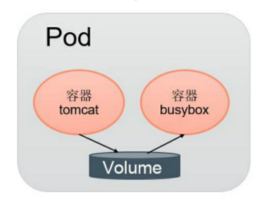
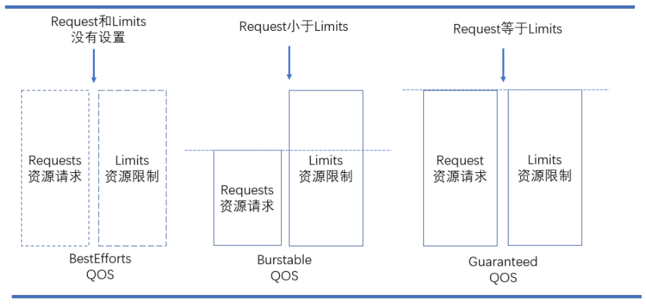

[TOC]


# 第6章 深入掌握Pod


# 1 Pod概念

Pod是Kubernetes创建或部署的最小/最简单的基本单位，一个Pod代表集群上正在运行的一个进程。

一个Pod可以包含一个或多个容器，因此它可以被看作是内部容器的逻辑宿主机。Pod的设计理念是为了支持多个容器在一个Pod中共享网络和文件系统。

Pod中运行容器Container。为建立Service与Pod间的关联关系，首先为每个Pod都有设置一个标签Label，然后给相应的Service定义标签选择器Label Selector。

Pod运行于节点Node环境中，节点可以是物理机或者云或者虚拟机。通常一个节点上运行几百个Pod，每个Pod里运行一个特殊的容器Pause，其他容器则为业务容器，业务容器共享Pause容器的网络栈和Volume挂载卷。

属于一个 Pod 的多个容器应用之间仅需通过 localhost 通信，一组容器被绑定在了一个环境中。


# 2 Pod、容器和Node之间的关系


**Pod中可以共享两种资源：网络和存储**
网络：
　　每个Pod都会被分配一个唯一的IP地址。Pod中的所有容器共享网络空间，包括IP地址和端口。Pod内部的容器可以使用localhost互相通信。Pod中的容器与外界通信时，必须分配共享网络资源（例如使用宿主机的端口映射）。

存储：
　　可以Pod指定多个共享的Volume。Pod中的所有容器都可以访问共享的volume。Volume也可以用来持久化Pod中的存储资源，以防容器重启后文件丢失。


# 3 Pod的定义和基本用法

通过yaml文件或者json描述Pod和其内容器的运行环境和期望状态，例如一个最简单的运行nginx应用的pod，定义如下：

```yml
apiVersion: v1
kind: Pod
metadata:
  name: nginx
  labels:
    app: nginx
spec:
  containers:
  - name: nginx
    image: nginx
    ports:
    - containerPort: 80
```

> 在生产环境中，推荐使用诸如Deployment，StatefulSet，Job或者CronJob等控制器来创建Pod，而不是直接创建。

将上述pod描述文件保存为nginx-pod.yaml，**使用kubectl apply命令运行pod**

```css
# kubectl apply -f nginx-pod.yaml
```

简要分析一下上面的Pod定义文件：

- apiVersion： 使用哪个版本的Kubernetes API来创建此对象
- kind：要创建的对象类型，例如Pod，Deployment等
- metadata：用于唯一区分对象的元数据，包括：name，UID和namespace
- labels：是一个个的key/value对，定义这样的label到Pod后，其他控制器对象可以通过这样的label来定位到此Pod，从而对Pod进行管理。（参见Deployment等控制器对象）
- spec： 其它描述信息，包含Pod中运行的容器，容器中运行的应用等等。不同类型的对象拥有不同的spec定义。详情参见API文档

查看已经创建的Pod：

```bash
# kubectl get pods
NAME    READY   STATUS    RESTARTS   AGE
nginx   1/1     Running   0          23h
```

查看这个Pod的详细信息，可以看到两个容器的定义及创建的过程（Event事件信息)：

```bash
# kubectl describe pod nginx
Name:         nginx
Namespace:    default
Priority:     0
Node:         k8s-node42/10.159.238.42
Start Time:   Mon, 19 Apr 2021 10:34:31 +0800
Labels:       app=nginx
Annotations:  Status:  Running
IP:           10.244.2.2
IPs:
  IP:  10.244.2.2
Containers:
  nginx:
    Container ID:   docker://dd9d831b881294022766fc98a9139773461fc4f3df413f9501125fc74cdcfb98
    Image:          nginx
    Image ID:       docker-pullable://nginx@sha256:75a55d33ecc73c2a242450a9f1cc858499d468f077ea942867e662c247b5e412
    Port:           80/TCP
    Host Port:      0/TCP
    State:          Running
      Started:      Mon, 19 Apr 2021 10:34:52 +0800
    Ready:          True
    Restart Count:  0
    Environment:    <none>
    Mounts:
      /var/run/secrets/kubernetes.io/serviceaccount from default-token-j5xrr (ro)
Conditions:
  Type              Status
  Initialized       True
  Ready             True
  ContainersReady   True
  PodScheduled      True
Volumes:
  default-token-j5xrr:
    Type:        Secret (a volume populated by a Secret)
    SecretName:  default-token-j5xrr
    Optional:    false
QoS Class:       BestEffort
Node-Selectors:  <none>
Tolerations:     node.kubernetes.io/not-ready:NoExecute for 300s
                 node.kubernetes.io/unreachable:NoExecute for 300s
Events:          <none>
```

删除创建Pod：

```bash
# kubectl delete -f nginx-pod.yaml
```

> Kubernetes在每个Pod启动时，会自动创建一个镜像为gcr.io/google_containers/pause:version的容器，所有处于该Pod中的容器在启动时都会添加诸如`--net=container:pause --ipc=contianer:pause --pid=container:pause`的启动参数，因此pause容器成为Pod内共享命名空间的基础。所有容器共享pause容器的IP地址，也被称为Pod IP。


# 4 静态Pod

静态Pod是由kubelet进行创建和管理，并且仅存在于特定Node上的Pod。

不能通过API Server进行管理。

无法与ReplicationController、Deployment或者DaemonSet进行关联，并且kubelet无法对它们进行健康检查。

kubelet 监视每个静态 Pod（在它崩溃之后重新启动）。

> **说明：** 如果你在运行一个 Kubernetes 集群，并且在每个节点上都运行一个静态 Pod， 就可能需要考虑使用 [DaemonSet](https://kubernetes.io/zh/docs/concepts/workloads/controllers/daemonset/) 替代这种方式。

创建静态Pod有两种方式：配置文件方式和HTTP方式。 

## 4.1 配置文件方式 

以配置文件方式部署静态Pod，需要开启kubelet组件的 `--pod-manifest-path=` 参数（kubeadm部署）或`-- config=/etc/kubelet.d/`参数（二进制部署），来配置静态Pod的配置文件目录。配置文件是以标准的JSON 或 YAML 格式定义的Pod。**kubelet会定期扫描静态配置文件目录，根据这个目录添加和移除的JSON或YAML文件来启动和删除静态Pod。**

如果在已经启动的kubelet组件上，没有添加`--pod-manifest-path=/etc/kubernetes/manifests `参数，添加后，重启kubelet即可部署静态Pod。

比如`--pod-manifest-path=/etc/kubernetes/manifests` 而用kubeadm部署的集群，在这个目录下，可以看到`kube-apiserver.yaml 、kube-controller-manager.yaml 、kube-scheduler.yaml`三个静态Pod yaml文件。

模板：

/etc/kubernetes/manifest/static-web.yaml

```yml
apiVersion: v1
kind: Pod
metadata:
  name: static-web
  labels:
    app: static
spec:
  containers:
    - name: web
      image: nginx
      ports:
        - name: web
          containerPort: 80
```

由于静态Pod无法通过API Server直接管理，所以在Master上尝试删除这个Pod时，会使其变成Pending状态，且不会被删除。删除静态Pod只要删除`--pod-manifest-path`目录下的文件即可。

## 4.3 HTTP方式

kubelet 周期地从`–manifest-url=`参数指定的地址下载文件，并且把它翻译成 JSON/YAML 格式的 pod 定义。此后的操作方式与`–pod-manifest-path=`相同，kubelet 会不时地重新下载该文件，当文件变化时对应地终止或启动静态 pod。


## 4.4 静态Pod的作用

由于静态Pod只受所在节点的kubelet控制，可以有效预防通过kubectl、或管理工具操作的误删除，可以用来部署核心组件应用。保障应用服务总是运行稳定数量和提供稳定服务。


# 5 Pod容器共享Volume

同一个Pod中的多个容器能够共享Pod级别的存储卷Volume。Volume可以被定义为各种类型，多个容器各自进行挂载操作，将一个Volume挂载为容器内部需要的目录，如图所示。




在下面的例子中，在Pod内包含两个容器：tomcat和busybox，在Pod级别设置Volume“app-logs”，用于tomcat向其中写日志文件，busybox读日志文件。

配置文件pod-volume-applogs.yaml的内容如下：

```yml
apiVersion: v1
kind: Pod
metadata:
  name: volume-pod
spec:
  containers:
  - name: tomcat
    image: tomcat
    ports:
    - containerPort: 8080
    volumeMounts:
    - name: app-logs
      mountPath: /usr/local/tomcat/logs
  - name: busybox
    image: busybox
    command: ["sh", "-c", "tail -f /logs/catalina*.log"]
    volumeMounts:
    - name: app-logs
      mountPath: /logs
  volumes:
  - name: app-logs
    emptyDir: {}
```


# 1.4 Pod生命周期

## 1.4.1 Pod phase（Pod的相位）

Pod 的 `status` 定义在 **[PodStatus](https://link.zhihu.com/?target=https%3A//kubernetes.io/docs/reference/generated/kubernetes-api/v1.17/%23podstatus-v1-core)** 对象中，其中有一个 `phase` 字段。它简单描述了 Pod 在其生命周期的阶段。熟悉Pod的各种状态对我们理解如何设置Pod的调度策略、重启策略是很有必要的。

Pod 的相位（phase）是 Pod 在其生命周期中的简单宏观概述。该阶段并不是对容器或 Pod 的综合汇总，也不是为了做为综合状态机。

Pod 相位的数量和含义是严格指定的。除了本文档中列举的状态外，不应该再假定 Pod 有其他的 `phase`值。


Pod的生命周期是Replication Controller进行管理的。一个Pod的生命周期过程包括：

- 通过yaml或json对Pod进行描述
- apiserver（运行在Master主机）收到创建Pod的请求后，将此Pod对象的定义存储在etcd中
- scheduler（运行在Master主机）将此Pod分配到Node上运行
- Pod内所有容器运行结束后此Pod也结束


## 1.4.2 Pod状态

在整个过程中，Pod通常处于以下的**五种状态之一**：

- Pending：Pod定义正确，提交到Master，但其所包含的容器镜像还未完全创建。它的**第1个状态是Pending**。也就是说k8s的API已经接受了你的pod请求。但是还没有真正的发起调度。通常，Master对Pod进行调度需要一些时间，Node进行容器镜像的下载也需要一些时间，启动容器也需要一定时间。（写数据到etcd，调度，pull镜像，启动容器）。
- Running：Pod已经被分配到某个Node上，并且所有的容器都被创建完毕，至少有一个容器正在运行中，或者有容器正在启动或重启中。
- Succeeded：Pod中所有的容器都成功运行结束，并且不会被重启。这是Pod的一种最终状态。
- Failed：Pod中所有的容器都运行结束了，其中至少有一个容器是非正常结束的（exit code不是0）。这也是Pod的一种最终状态。
- Unknown：无法获得Pod的状态，通常是由于无法和Pod所在的Node进行通信。

下图是Pod的生命周期示意图，从图中可以看到Pod状态的变化。


## 1.4.3 Pod的创建过程


Pod是Kubernetes的基础单元，了解其创建的过程，更有助于理解系统的运作。

①用户通过kubectl或其他API客户端提交Pod Spec给API Server。

②API Server尝试将Pod对象的相关信息存储到etcd中，等待写入操作完成，API Server返回确认信息到客户端。

③API Server开始反映etcd中的状态变化。

④所有的Kubernetes组件通过"watch"机制跟踪检查API Server上的相关信息变动。

⑤kube-scheduler（调度器）通过其"watcher"检测到API Server创建了新的Pod对象但是没有绑定到任何工作节点。

⑥kube-scheduler为Pod对象挑选一个工作节点并将结果信息更新到API Server。

⑦调度结果新消息由API Server更新到etcd，并且API Server也开始反馈该Pod对象的调度结果。

⑧Pod被调度到目标工作节点上的kubelet尝试在当前节点上调用docker engine进行启动容器，并将容器的状态结果返回到API Server。

⑨API Server将Pod信息存储到etcd系统中。

⑩在etcd确认写入操作完成，API Server将确认信息发送到相关的kubelet。


## 1.4.4 Pod重启策略

Pod的重启策略（RestartPolicy）应用于Pod内的所有容器，并且仅在Pod所处的Node上由kubelet进行判断和重启操作。当某个容器异常退出或者健康检查失败时，kubelet将根据 `RestartPolicy` 的设置来进行相应的操作。

Pod的重启策略包括 `Always`、`OnFailure`和`Never`，默认值为`Always`。

- `Always`：当容器失败时，由kubelet自动重启该容器。
- `OnFailure`：当容器终止运行且退出码不为0时，有kubelet自动重启该容器。
- `Never`：不论容器运行状态如何，kubelet都不会重启该容器。

失败的容器由 kubelet 以五分钟为上限的指数退避延迟（10秒，20秒，40秒…）重新启动，并在成功执行十分钟后重置。


## 1.4.5 Pod中的容器探针

`探针` 是由 `kubelet` 对容器执行的定期诊断。要执行诊断，kubelet 调用由容器实现的 `Handler`。有三种类型的处理程序：

- `ExecAction`：在容器内执行指定命令。如果命令退出时返回码为 0 则认为诊断成功。
- `TCPSocketAction`：对指定端口上的容器的 IP 地址进行 TCP 检查。如果端口打开，则诊断被认为是成功的。
- `HTTPGetAction`：对指定的端口和路径上的容器的 IP 地址执行 HTTP Get 请求。如果响应的状态码大于等于200 且小于 400，则诊断被认为是成功的。

每次探测都将获得以下三种结果之一：

- `Success`：容器诊断通过
- `Failure`：容器诊断失败
- `Unknown`：诊断失败，因此不应采取任何措施

Kubelet 可以选择是否执行在容器上运行的两种探针执行和做出反应：

- `livenessProbe`：指示容器是否正在运行。如果**存活探测**失败，则 kubelet 会杀死容器，并且容器将受到其重启策略的影响。如果容器不提供存活探针，则默认状态为 `Success`。
- `readinessProbe`：指示容器是否准备好服务请求。如果**就绪探测**失败，端点控制器将从与 Pod 匹配的所有 Service 的端点中删除该 Pod 的 IP 地址。初始延迟之前的就绪状态默认为 `Failure`。如果容器不提供就绪探针，则默认状态为 `Success`。

`示例`：

`ExecAction`：

```yaml
apiVersion: apps/v1
kind: Deployment
metadata:
  ***
spec:
      ***
      containers:
        ***
        livenessProbe:            # 健康状态检查
          exec:
            command:
            - touch
            - /tmp/healthy
          initialDelaySeconds: 30 # 初始化时间，单位：秒
          timeoutSeconds: 5       # 探测超时时长，单位：秒
          periodSeconds: 30       # 探测时间间隔，单位：秒
          successThreshold: 1     # 失败后探测成功的最小连续成功次数
          failureThreshold: 5     # 最大失败次数
        readinessProbe:           # 准备状态检查
          exec:
            command:
            - touch
            - /tmp/ok
          initialDelaySeconds: 30
          timeoutSeconds: 5
```

`TCPSocketAction`：

```yaml
apiVersion: v1
kind: Pod
metadata:
  name: liveness-tcp-socket
spec:
  containers:
  - name: nginx
    image: nginx
    ports:
    - containerPort: 80
    livenessProbe:
      tcpSocket:
        port: 80
      initialDelaySeconds: 15
      timeoutSeconds: 1
```

`HTTPGetAction`：

```yaml
apiVersion: apps/v1
kind: Deployment
metadata:
  ***
spec:
      ***
      containers:
        ***
        livenessProbe:
          httpGet:
            path: /healthCheck
            port: 8080
            scheme: HTTP
          initialDelaySeconds: 30
          timeoutSeconds: 5
          periodSeconds: 30
          successThreshold: 1
          failureThreshold: 5
        readinessProbe:
          httpGet:
            path: /healthCheck
            port: 8080
            scheme: HTTP
          initialDelaySeconds: 30
          timeoutSeconds: 5
```


## 1.4.6 Pod终止过程

终止过程主要分为如下几个步骤：

1. 用户发出删除 pod 命令
2. Pod 对象随着时间的推移更新，在宽限期（默认情况下30秒），pod 被视为“dead”状态
3. 将 pod 标记为“Terminating”状态
4. 第三步同时运行，监控到 pod 对象为“Terminating”状态的同时启动 pod 关闭过程
5. 第三步同时进行，endpoints 控制器监控到 pod 对象关闭，将pod与service匹配的 endpoints 列表中删除
6. 如果 pod 中定义了 preStop 钩子处理程序，则 pod 被标记为“Terminating”状态时以同步的方式启动执行；若宽限期结束后，preStop 仍未执行结束，第二步会重新执行并额外获得一个2秒的小宽限期
7. Pod 内对象的容器收到 TERM 信号
8. 宽限期结束之后，若存在任何一个运行的进程，pod 会收到 SIGKILL 信号
9. Kubelet 请求 API Server 将此 Pod 资源宽限期设置为0从而完成删除操作


## 1.4.7 Pod资源申请和Qos服务等级

在Docker的范畴内，我们知道可以对运行的容器进行请求或消耗的资源进行限制。而在Kubernetes中，也有同样的机制，容器或Pod可以进行申请和消耗的资源就是CPU和内存。CPU属于可压缩型资源，即资源的额度可以按照需求进行收缩。而内存属于不可压缩型资源，对内存的收缩可能会导致无法预知的问题。

Pod 中的资源限制也主要是针对 cpu 和 内存。与 docker 不同的是，它提供了 requests 和 limits 两个设置。具体的含义为：

- `requests`：pod 运行所需要的最少资源。例如 kubernetes 在调度 pod 时，就是以这个设置来挑选 node
- `limits`：pod 运行的资源上限。也就说，超过这个 limits, pod 会被 kill 掉。

资源的隔离目前是属于容器级别，CPU和内存资源的配置需要Pod中的容器spec字段下进行定义。其具体字段，可以使用 "requests" 进行定义请求的确保资源可用量。也就是说容器的运行可能用不到这样的资源量，但是必须确保有这么多的资源供给。而 "limits" 是用于限制资源可用的最大值，属于硬限制。

在Kubernetes中，1个单位的CPU相当于虚拟机的1颗虚拟CPU（vCPU）或者是物理机上一个超线程的CPU，它支持分数计量方式，一个核心（1core）相当于1000个微核心（millicores），因此500m相当于是0.5个核心，即二分之一个核心。内存的计量方式也是一样的，默认的单位是字节，也可以使用E、P、T、G、M和K作为单位后缀，或者是Ei、Pi、Ti、Gi、Mi、Ki等形式单位后缀。 

**资源需求举例：**

```yml
apiVersion: v1
kind: Pod
metadata:
  name: nginx-pod
spec:
  containers:
  - name: nginx
    image: nginx
    resources:
      requests:
        memory: "128Mi"
        cpu: "200m"
```

上面的配置清单中，nginx请求的CPU资源大小为200m，这意味着一个CPU核心足以满足nginx以最快的方式运行，其中对内存的期望可用大小为128Mi，实际运行时不一定会用到这么多的资源。考虑到内存的资源类型，在超出指定大小运行时存在会被OOM killer杀死的可能性，于是该请求值属于理想中使用的内存上限。

**资源限制举例：**

容器的资源需求只是能够确保容器运行时所需要的最少资源量，但是并不会限制其可用的资源上限。当应用程序存在Bug时，也有可能会导致系统资源被长期占用的情况，这就需要另外一个limits属性对容器进行定义资源使用的最大可用量。CPU是属于可压缩资源，可以进行自由地调节。而内存属于硬限制性资源，当进程申请分配超过limit属性定义的内存大小时，该Pod将会被OOM killer杀死。如下：

```yml
[root@master ~]# vim memleak-pod.yaml

apiVersion: v1
kind: Pod
metadata:
  name: memleak-pod
  labels:
    app: memleak
spec:
  containers:
  - name: simmemleak
    image: saadali/simmemleak
    resources:
      requests:
        memory: "64Mi"
        cpu: "1"
      limits:
        memory: "64Mi"
        cpu: "1"


[root@master ~]# kubectl apply -f memleak-pod.yaml 
pod/memleak-pod created
[root@master ~]# kubectl get pods -l app=memleak
NAME          READY     STATUS      RESTARTS   AGE
memleak-pod   0/1       OOMKilled   2          12s
[root@master ~]# kubectl get pods -l app=memleak
NAME          READY     STATUS             RESTARTS   AGE
memleak-pod   0/1       CrashLoopBackOff   2          28s
```

Pod资源默认的重启策略为Always，在memleak因为内存限制而终止会立即重启，此时该Pod会被OOM killer杀死，在多次重复因为内存资源耗尽重启会触发Kunernetes系统的重启延迟，每次重启的时间会不断拉长，后面看到的Pod的状态通常为"CrashLoopBackOff"。

**在一个Kubernetes集群上，运行的Pod众多，那么当节点都无法满足多个Pod对象的资源使用时，是按照什么样的顺序去终止这些Pod对象呢？**


Kubernetes是无法自行去判断的，需要借助于Pod对象的优先级进行判定终止Pod的优先问题。根据Pod对象的requests和limits属性，Kubernetes将Pod对象分为三个服务质量类别：

QOS是K8S中的一种资源保护机制，其主要是针对不可压缩资源比如内存的一种控制技术。比如在内存中，其通过为不同的Pod和容器构造OOM评分，并且通过内核策略的辅助，从而实现当节点内存资源不足的时候，内核可以按照策略的优先级，优先kill掉那些优先级比较低（分值越高，优先级越低）的Pod。



**QoS Class:（Quality of service class）服务质量等级**

- Guranteed:优先级最高。pod中每个容器同时定义了cpu和memory的request和limit，并且两者的request=limit；
- Burstable:优先级中等。pod中至少有一个容器定义了cpu或memory的request属性，且二者不一定要相等；
- BestEffort:优先级最低。pod中没有任何一个容器定义了request或limit属性；


# 1.5 Pod控制器

在Kubernetes平台上，我们很少会直接创建一个Pod，在大多数情况下会通过RC、Deployment、DaemonSet、Job等控制器完成对一组Pod副本的创建、调度及全生命周期的自动控制任务。Pod控制器是用于实现管理pod的中间层，确保pod资源符合预期的状态，pod的资源出现故障时，会尝试进行重启，当根据重启策略无效，则会重新新建pod的资源。

在最早的Kubernetes版本里是没有这么多Pod副本控制器的，只有一个Pod副本控制器RC（Replication Controller），这个控制器是这 样设计实现的：RC独立于所控制的Pod，并通过Label标签这个松耦合关联关系控制目标Pod实例的创建和销毁，随着Kubernetes的发 展，RC也出现了新的继任者——Deployment，用于更加自动地完成Pod副本的部署、版本更新、回滚等功能。 

严谨地说，RC的继任者其实并不是Deployment，而是ReplicaSet，因为 ReplicaSet进一步增强了 RC标签选择器的灵活性。 之前RC的标签选择器只能选择一个标签，而ReplicaSet拥有集合式的标签选择器，可以选择多个Pod标签，如下所示： 


ReplicaSet（简称RS）


pod控制器有多种类型：

- : 是Replication Controller 升级版本。代用户创建指定数量的pod副本数量，确保pod副本数量符合预期状态，并且支持滚动式自动扩容和缩容功能。

  ReplicaSet主要三个组件组成：
  - 用户期望的pod副本数量
  - 标签选择器，判断哪个pod归自己管理
  - 当现存的pod数量不足，会根据pod资源模板进行新建帮助用户管理无状态的pod资源，精确反应用户定义的目标数量，但是RelicaSet不是直接使用的控制器，而是使用Deployment。
- Deployment：工作在ReplicaSet之上，用于管理无状态应用，目前来说最好的控制器。支持滚动更新和回滚功能，还提供声明式配置。
- DaemonSet：用于确保集群中的每一个节点只运行特定的pod副本，通常用于实现系统级后台任务,比如ingress,elk.服务是无状态的,服务必须是守护进程。
- Job：一次性任务运行，完成就立即退出，不需要重启或重建。
- Cronjob：周期性任务控制，执行后就退出，不需要持续后台运行。
- StatefulSet：管理有状态应用,比如redis,mysql。


