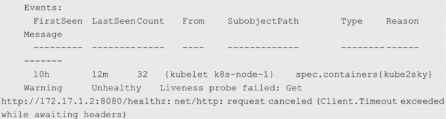
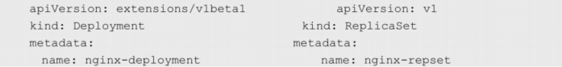
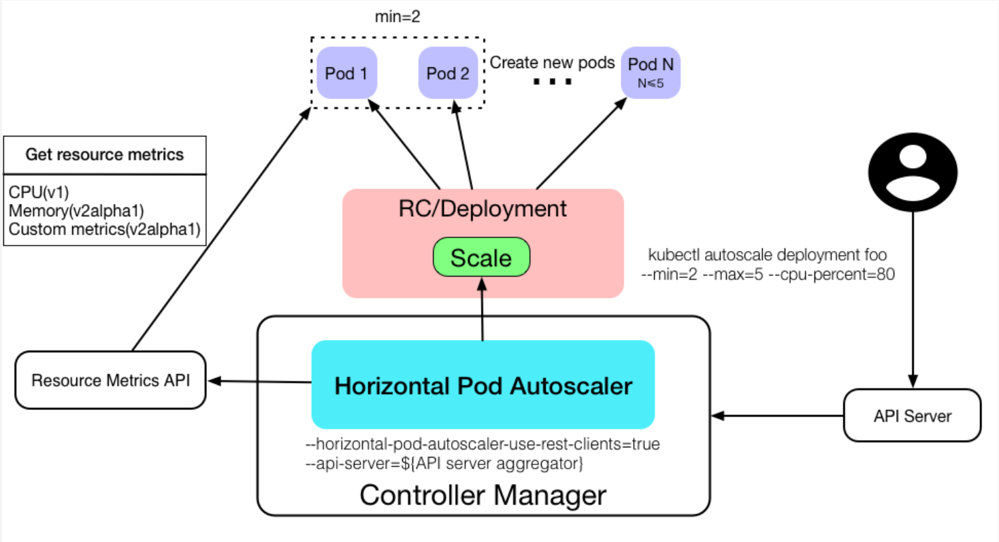

[TOC]


# 第一章 Kubernetes入门

# 1.1 Kubernets介绍
Kubernetes(k8s)是Google2014年开源的容器集群管理系统（谷歌内部:Borg），它主要用于容器容器化应用程序的部署、扩展和管理。

k8s提供了容器编排、资源调度、弹性伸缩、部署管理、服务发现等一系列功能。

k8s的目标是让部署容器化的应用简单并且高效，k8s提供了应用部署、规划、更新、维护的一种机制！

官网地址：<https://kubernetes.io/>


# 1.2 Kubernetes主要功能

| 名词             | 解释                                                         |
| ---------------- | ------------------------------------------------------------ |
| 数据卷           | Pod中容器之间共享数据，可以使用数据卷。                      |
| 应用程序健康检查 | 容器内服务可能进程堵塞无法处理请求，可以设置监控检查策略保证应用健壮性。 |
| 复制应用程序实例 | 控制器维护着Pod副本数量，保证一个Pod或一组同类的Pod数量始终可用。 |
| 弹性伸缩         | 根据设定的指标（CPU利用率）自动缩放Pod副本数。               |
| 服务发现         | 使用环境变量或DNS服务插件保证容器中程序发现Pod入口访问地址。 |
| 负载均衡         | 一组Pod副本分配一个私有的集群IP地址，负载均衡转发请求到后端容器。在集群内部其他Pod可通过这个ClusterIP访问应用。 |
| 滚动更新         | 更新服务不中断，一次更新一个Pod，而不是同时删除整个服务。    |
| 服务编排         | 通过文件描述部署服务，使得应用程序部署变得更高效。           |
| 资源监控         | Node节点组件集成cAdvisor资源收集工具，可通过Heapster汇总整个集群节点资源数据，然后存储到InfluxDB时序数据库，再由Grafana展示。 |
| 提供认证和授权   | 支持角色访问控制（RBAC）认证授权等策略。                     |


# 1.3 Kubernetes架构


上图可以看到如下组件，使用特别的图标表示Service和Label：

| EN                     | CN               |
| ---------------------- | ---------------- |
| Pod                    | 根容器（容器组） |
| Container/docker       | 容器             |
| Label                  | 标签             |
| Replication Controller | 复制控制器       |
| Service                | 服务             |
| Node                   | 节点             |
| Kubernetes Master      | Kubernetes主节点 |


## 1.3.1 分层架构

Kubernetes设计理念和功能其实就是一个类似Linux的分层架构，如下图所示


- 核心层：Kubernetes最核心的功能，对外提供API构建高层的应用，对内提供插件式应用执行环境
- 应用层：部署（无状态应用、有状态应用、批处理任务、集群应用等）和路由（服务发现、DNS解析等）
- 管理层：系统度量（如基础设施、容器和网络的度量），自动化（如自动扩展、动态Provision等）以及策略管理（RBAC、Quota、PSP、NetworkPolicy等）
- 接口层：kubectl命令行工具、客户端SDK以及集群联邦
- 生态系统：在接口层之上的庞大容器集群管理调度的生态系统，可以划分为两个范畴
  - Kubernetes外部：日志、监控、配置管理、CI、CD、Workflow、FaaS、OTS应用、ChatOps等
  - Kubernetes内部：CRI、CNI、CVI、镜像仓库、Cloud Provider、集群自身的配置和管理等


# 1.4 Kubernetes的基本概念和术语

​		Kubernetes中的大部分概念如Node、Pod、Replication Controller、Service等都可以被看作一种资源对象，几乎所有资源对象都可以通过Kubernetes提供的kubectl工具（或者API编程调用）执行增、删、改、查等操作并将其保存在etcd中持久化存储。从这个角度来看Kubernetes其实是一个高度自动化的资源控制系统，它通过跟踪对比etcd库里保存的“资源期望状态”与当前环境中的“实际资源状态”的差异来实现自动控制和自动纠错的高级功能。


## 1.4.1 Master

​		Kubernetes里的Master指的是集群控制节点，在每个Kubernetes集群里都需要有一个Master来负责整个集群的管理和控制，基本上 Kubernetes的所有控制命令都发给它，它负责具体的执行过程，我们后面执行的所有命令基本都是在Master上运行的。Master通常会占据一个独立的服务器（高可用部署建议用3台服务器），如果它宕机或者不可用，那么对集群内容器应用的管理都将失效。 

master节点上主要运行四个组件：api-server、scheduler、controller-manager、etcd。


| 组件               | 作用                                                         |
| ------------------ | ------------------------------------------------------------ |
| kube-apiserver     | 提供了HTTP Rest 接口的关键服务进程，是Kubernetes里所有资源的增、删、改、查等 操作的唯一入口；各组件协调者并提供认证、授权、访问控制、API注册和发现等机制。 |
| scheduler          | 负责资源调度 （Pod调度）的进程，相当于公交公司的“调度室”。   |
| controller-manager | Kubernetes里所有资源对象的自动化控制中心，可以将其理解为资源对象的“大总管”。 |
| etcd               | etcd是一个高可用的键值存储系统，Kubernetes使用它来存储所有资源对象的的状态和数据，从而实现了Restful的API。 |


## 1.4.2 Node

​		Node是Kubernetes集群中的工作负载节点，每个Node都会被Master分配一些工作负载（Docker容器），当某个Node宕机时，其上的工作负载会被Master自动转移到其他节点上。

​		每个Node节点主要由三个模块组成：kubelet、kube-proxy、Container runtime。


| 组件              | 作用                                                         |
| ----------------- | ------------------------------------------------------------ |
| Container runtime | 负责本机的容器创建和管理工作。                               |
| kube-proxy        | 实现Kubernetes Service的通信与负载均衡机制的重要组件。       |
| kubelet           | 负责Pod对应的容器的创建、启停等任务，同时与 Master密切协作，实现集群管理的基本功能。 |

除了核心组件，还有一些推荐的Add-ons（插件）：

- kube-dns负责为整个集群提供DNS服务
- Ingress Controller为服务提供外网入口
- Heapster提供资源监控
- Dashboard提供GUI
- Federation提供跨可用区的集群
- Fluentd-elasticsearch提供集群日志采集、存储与查询


**master与node关系：**


## 1.4.3 Pod

​		**Pod是Kubernetes最重要的基本概念，容器组Pod是最小部署单元，一个Pod有一个或多个容器组成， Pod中容器共享存储和网络，在同一台Docker主机上运行。**


Kubernetes会设计出一个全新的Pod的概念并且有这样特殊的组成结构？ 

1、通过容器组的状态，去解决容器死亡率的问题，更好的判断业务的存活状态；

2、解决多个容器网络通信和文件共享问题；

​		Kubernetes为每个Pod都分配了唯一的IP地址，称之为Pod IP，一个Pod里的多个容器共享Pod IP地址。Kubernetes要求底层网络支持集群内任意两个Pod之间的TCP/IP直接通信，这通常采用虚拟二层网络技术来实现，例如Flannel、OpenvSwitch等，因此我们需要牢记一点：在Kubernetes里，一个Pod里的容器与另外主机上的Pod容器能够直接通信。

Pod有两种类型：**普通的Pod**和**静态Pod**（Static Pod）。静态Pod比较特殊，它并没被存放在Kubernetes的etcd存储里，而是被存放在 某个具体的Node上的一个具体文件中，并且只在此Node上启动、运行。而普通的Pod一旦被创建，就会被放入etcd中存储，随后会被 Kubernetes Master调度到某个具体的Node上并进行绑定（Binding），随后该Pod被对应的Node上的kubelet进程实例化成一组相关的Docker容器并启动。在默认情况下，当Pod里的某个容器停止时，Kubernetes会自动检测到这个问题并且重新启动这个Pod（重启Pod里 的所有容器），如果Pod所在的Node宕机，就会将这个Node上的所有Pod重新调度到其他节点上。

Pod、容器与Node的关系如图所示：


​		每个Pod都可以对其能使用的服务器上的计算资源设置限额，当前可以设置限额的计算资源有CPU与Memory两种，其中CPU的资源单位为CPU（Core）的数量，是一个绝对值而非相对值。

​		Kubernetes里通常以千分之一的CPU配额为最小单位，用m来表示。通常一个容器的CPU配额被定义为100～300m，即占用0.1～0.3个CPU。与CPU配额类似，Memory配额也是一个绝对值，它的单位是内存字节数。 

在Kubernetes里，一个计算资源进行配额限定时需要设定以下两个参数。

- Requests：该资源的最小申请量，系统必须满足要求。 
- Limits：该资源最大允许使用的量，不能被突破，当容器试图使用超过这个量的资源时，可能会被Kubernetes“杀掉”并重启。

示例：

表明MySQL容器申请最少0.25个CPU及64MiB内存，在运行过程中MySQL容器所能使用的资源配额为0.5个CPU及128MiB内存： 

```yml
spec:
  containers:
  - name: db
    image: mysql
    resource:
      requests:
        memory: "64Mi"
        cpu: "250m"
      limits:
        memory: "128Mi"
        cpu: "500m"
```


## 1.4.4 Event

Event是一个事件的记录，记录了事件的最早产生时间、最后重现时间、重复次数、发起者、类型，以及导致此事件的原因等众多信息。Event通常会被关联到某个具体的资源对象上，是排查故障的重要参考信息，之前我们看到Node的描述信息包括了Event，而Pod同样有Event记录，当我们发 现某个Pod迟迟无法创建时，可以用`kubectl describe pod xxxx`来查看它的描述信息，以定位问题的成因，比如下面这个Event记录信息表明Pod里的一个容器被探针检测为失败一次： 




## 1.4.5 **Label** 

Label（标签）是Kubernetes系统中另外一个核心概念。**一个Label是一个key=value的键值对**，其中key与value由用户自己指定。

Label可以被附加到各种资源对象上，例如Node、Pod、Service、RC 等，一个资源对象可以定义任意数量的Label，同一个Label也可以被添加到任意数量的资源对象上。Label通常在资源对象定义时确定， 也可以在对象创建后动态添加或者删除。**每一个对象可以拥有多个标签，但是，key值必须是唯一的。** 

**作用：**通过对资源对象捆绑一个或多个不同的Label来实现多维度的资源分组管理功能，以便灵活、方便地进行资源分配、调度、配置、部署等管理工作。

例如，部署不同版本的应用到不同的环境中；监控和分析应用（日志记录、监控、告警）等。一些常用的Label示例如下：

- 版本标签："release":"stable"、"release":"canary"。 
- 环境标签："environment":"dev"、"environment":"qa"、"environment":"production"。 
- 架构标签："tier":"frontend"、"tier":"backend"、"tier":"middleware"。 
- 分区标签："partition":"customerA"、"partition":"customerB"。 
- 质量管控标签："track":"daily"、"track":"weekly"。 


给某个资源对象定义一个 Label，就相当于给它打了一个标签，随后可以通过Label Selector（标签选择器）查询和筛选拥有某些Label的资源对象，Label Selector可以被类比为SQL语句中的where查询条件，

当前有两种Label Selector表达式：基于等式的（Equality-based）和基于集合的（Set-based）。

**等式类表达式匹配标签：**

- name=redis-slave：匹配所有具有标签name=redis-slave的资源对象。
- env!=production：匹配所有不具有标签env=production的资源对象，比如env=test就是满足此条件的标签之一。 

**集合操作类表达式匹配标签：**

- name in（redis-master, redis-slave）：匹配所有具有标签name=redis-master或者name=redis-slave的资源对象。 
- name not in（php-frontend）：匹配所有不具有标签name=php-frontend的资源对象。 

通过多个Label Selector表达式的组合实现复杂的条件选择，多个表达式之间用“，”进行分隔即可，几个条件之间是“AND”的关系，即同时满足多个条件，比如下面的例子：

```
name=redis-slave,env!=production
name notin (php-frontend),env!=production
```

matchLabels用于定义一组Label，与直接写在Selector中的作用相同；matchExpressions用于定义一组基于集合的筛选条件，可用的条 件运算符包括In、NotIn、Exists和DoesNotExist。如果同时设置了matchLabels和matchExpressions，则两组条件为AND关系，即需要同时满足所有条件才能完成Selector的筛选。 

要查看每个Pod自动生成的标签，运行`kubectl get pods --show-labels`输出。


## 1.4.6 Replication Controller

Replication Controller（简称RC）,是Kubernetes系统中的核心概念之一，即声明某种Pod的副本数量在任意时刻都符合某个预期值，所以RC的定义包括如下几个部分。 

- Pod期待的副本数量
- 用于筛选目标Pod的Label Selector
- 当Pod的副本数量小于预期数量时，用于创建新Pod的Pod模板（template）

示例：

一个完整的RC定义的例子 [frontend-rc.yaml](assets\frontend-rc.yaml) ，即确保拥有tier=frontend标签的这个Pod（运行Tomcat容器）在整个Kubernetes集群中始终只有一个副本：

```yml
apiVersion: v1
kind: ReplicationController
metadata:
  name: frontend
spec:
  replicas: 1
  selector:
    tier: frontend
  template:
    metadata:
      labels:
        app: app-demo
        tier: frontend
    spec:
      containers:
      - name: tomcat-demo
        image: tomcat
        imagePullPolicy: IfNotPresent
        env:
        - name: GET_HOSTS_FROM
          value: dns
        ports:
        - containerPort: 80

```

将RC将其提交到Kubernetes集群中后，Master 上的Controller Manager组件就得到通知，定期巡检系统中当前存活的目标Pod，并确保目标Pod实例的数量刚好等于此RC的期望值，有过多的Pod副本在运行，系统就会停掉一些Pod，少于1个就会自动创建，大大减少了系统管理员在传统IT环境中需要完成的许多手工运维工作（如主机监控脚本、应用监控脚本、故障恢复脚本等）。


`kubectl scale`命令对RC的副本数量进行动态缩放（scaling）：

```bash
kubctl scale rc redis-slave --replicas=3
```

需要注意的是，删除RC并不会影响通过该RC已创建好的Pod。为了删除所有Pod，可以设置replicas的值为0，然后更新该RC。另外，kubectl提供了stop和delete命令来一次性删除RC和RC控制的全部Pod。

**应用场景：**

​		应用升级时，通常会使用一个新的容器镜像版本替代旧版本。我们希望系统平滑升级，比如在当前系统中有10个对应的旧版本的Pod，则最佳的系统升级方式是旧版本的Pod每停止一个，就同时创建一个新版本的Pod，在整个升级过程中此消彼长，而运行中的Pod数量始终是10个，几分钟以后，当所有的Pod都已经是新版本时，系统升级完成。通过RC机制，Kubernetes很容易就实现了这种高级实用的特性，被称为“滚动升级”（Rolling Update）。

**Replica Set和Replication Controller的区别：**

Replica Set与RC当前的唯一区别是，**Replica Sets支持基于集合的Label selector（Set-based selector）**，**而 RC只支持基于等式的Label Selector（equality-based selector）**，这使得Replica Set的功能更强。


## 1.4.7 Deployment

Deployment是Kubernetes在1.2版本中引入的新概念，用于更好地解决Pod的编排问题。是一个更高层次的API对象，它管理ReplicaSets和Pod，并提供声明式更新等功能。官方建议使用Deployment管理ReplicaSets，而不是直接使用ReplicaSets。


Deployment的典型使用场景有以下几个。 

- 创建一个Deployment对象来生成对应的Replica Set并完成Pod副本的创建。 
- 检查Deployment的状态来看部署动作是否完成（Pod副本数量是否达到预期的值）。 
- 更新Deployment以创建新的Pod（比如镜像升级）。 
- 如果当前Deployment不稳定，则回滚到一个早先的Deployment版本。 
- 暂停Deployment以便于一次性修改多个PodTemplateSpec的配置项，之后再恢复Deployment，进行新的发布。 
- 扩展Deployment以应对高负载。 
- 查看Deployment的状态，以此作为发布是否成功的指标。 
- 清理不再需要的旧版本ReplicaSets。 

除了API声明与Kind类型等有所区别，Deployment的定义与Replica Set的定义很类似：



示例：

创建一个名为  [frontend-deployment.yaml](assets\frontend-deployment.yaml) 的Deployment描述文件，内容如下： 

```yml
apiVersion: apps/v1
kind: Deployment
metadata:
  name: frontend
spec:
  replicas: 1
  selector:
    matchLabels:
      tier: frontend
    matchExpressions:
      - {key: tier, operator: In, values: [frontend]}
  template:
    metadata:
      labels:
        app: app-demo
        tier: frontend
    spec:
      containers:
      - name: tomcat-demo
        image: tomcat
        imagePullPolicy: IfNotPresent
        ports:
        - containerPort: 8080

```

创建Deployment：

```bash
# kubectl create -f frontend-deployment.yaml
deployment.apps/frontend created
```

查看Deployment的信息

```bash
# kubectl get deployments
NAME       READY   UP-TO-DATE   AVAILABLE   AGE
frontend   1/1     1            1           23m
```

对上述输出中涉及的数量解释如下。 

- `READY` ：1/1左边1是真正运行的副本数，右边1是期望的副本数即replicas定义的副本数。
- `UP-TO-DATE`：显示已更新以实现期望状态的副本数。
- `AVAILABLE`：显示应用程序可供用户使用的副本数。
- `AGE` ：显示应用程序运行的时间量。

要查看Deployment创建的ReplicaSet（rs），运行`kubectl get rs`输出，看到它的命名与Deployment的名称有关系： 

ReplicaSet 命名规则是：[DEPLOYMENT-NAME]-[RANDOM-STRING]

```bash
# kubectl get rs
NAME                  DESIRED   CURRENT   READY   AGE
frontend-797f47d685   1         1         1       44m
```

查看对应的pod：

发现Pod的命名以Deployment对应的Replica Set的名称为前缀。

```bash
# kubectl get pods
NAME                        READY   STATUS    RESTARTS   AGE
frontend-797f47d685-q5zc6   1/1     Running   0          53m
```

运行kubectl describe deployments，可以清楚地看到Deployment控制的Pod的水平扩展过程。


## 1.4.8 Horizontal Pod Autoscaler

通过手工执行kubectl scale命令，我们可以实现Pod扩容或缩容。 显然不符合谷歌对Kubernetes的定位目标—自动化、智能化。

Kubernetes有一个Horizontal Pod Autoscaling（Pod横向自动扩容，HPA）的资源，可以根据CPU使用率或应用自定义metrics自动扩展Pod数量。

**注意**：从kubernetes1.11开始Heapster被废弃不在使用，metrics-server 替代了heapster。实现HPA首先需要部署metrics-server，一个集群级别的资源利用率数据的聚合器。

Horizontal Pod Autoscaling可以根据CPU使用率或应用自定义metrics自动扩展Pod数量（支持replication controller、deployment和replica set）。

- 控制管理器每隔30s（可以通过–horizontal-pod-autoscaler-sync-period修改）查询metrics的资源使用情况
- 支持三种metrics类型
  - 预定义metrics（比如Pod的CPU）以利用率的方式计算
  - 自定义的Pod metrics，以原始值（raw value）的方式计算
  - 自定义的object metrics
- 支持两种metrics查询方式：Heapster和自定义的REST API
- 支持多metrics




HPA与之前的RC、Deployment一样，也属于一种Kubernetes资源对象。通过追踪分析指定RC控制的所有目标Pod的负载变化情况，来 确定是否需要调整目标Pod的副本数量，这是HPA的实现原理。

**当前，HPA有以下两种方式作为Pod负载的度量指标：**

- **CPU UtilizationPercentage**：是一个算术平均值，即目标Pod所有副本自身的CPU利用率的平均值。 一个Pod自身的CPU利用率是该Pod当前CPU的使用量除以它的Pod Request的值，比如定义一个Pod的Pod Request为0.4，而当前Pod的CPU使用量为0.2，则它的CPU使用率为 50%，如果目标Pod没有定义Pod Request的值，则无法使用 CPU UtilizationPercentage实现Pod横向自动扩容。
- **应用程序自定义的度量指标**：比如服务在每秒内的相应请求数（TPS或QPS）。 


1、根据CPU进行HPA伸缩过程

```bash
# 创建pod和service
# kubectl run php-apache --image=registry.cn-beijing.aliyuncs.com/crazywjj/hpa-example:V1.0 --requests=cpu=200m --expose --port=80

cat >php-apache.yaml<<EOF
apiVersion: apps/v1
kind: Deployment
metadata:
  name: php-apache
spec:
  selector:
    matchLabels:
      run: php-apache
  replicas: 1
  template:
    metadata:
      labels:
        run: php-apache
    spec:
      containers:
      - name: php-apache
        image: registry.cn-beijing.aliyuncs.com/crazywjj/hpa-example:V1.0
        imagePullPolicy: IfNotPresent
        ports:
        - containerPort: 80
        resources:
          limits:
            cpu: 500m
          requests:
            cpu: 200m
---
apiVersion: v1
kind: Service
metadata:
  name: php-apache
  labels:
    run: php-apache
spec:
  ports:
  - port: 80
  selector:
    run: php-apache
EOF

$ kubectl create -f  php-apache.yaml
service "php-apache" created
deployment "php-apache" created

# 命令行创建autoscaler
$ kubectl autoscale deployment php-apache --cpu-percent=50 --min=1 --max=10
deployment "php-apache" autoscaled
或者
vim hpa.yaml
apiVersion: autoscaling/v1
kind: HorizontalPodAutoscaler
metadata:
  name: php-apache
  namespace: default
spec:
  maxReplicas: 10
  minReplicas: 1
  scaleTargetRef:
    kind: Deployment
    name: php-apache
  targetCPUUtilizationPercentage: 50

$ kubectl get hpa
NAME         REFERENCE               TARGETS   MINPODS   MAXPODS   REPLICAS   AGE
php-apache   Deployment/php-apache   0%/50%    1         10        1          16m

# 增加负载,需要一段时间
$ kubectl run -i --tty load-generator --image=busybox /bin/sh
Hit enter for command prompt
$ while true; do wget -q -O- http://php-apache.default.svc.cluster.local; done

# 查看hpa负载
$ kubectl get hpa
NAME         REFERENCE               TARGETS    MINPODS   MAXPODS   REPLICAS   AGE
php-apache   Deployment/php-apache   191%/50%   1         10        1          16m

# 查看hpa详情
$ kubectl describe hpa php-apache

# autoscaler将这个deployment扩展为5个pod
$ kubectl get deployment php-apache
NAME         READY   UP-TO-DATE   AVAILABLE   AGE
php-apache   5/5     5            5           18m

# 删除刚才创建的负载增加pod后会发现负载降低，并且pod数量也自动降回1个（也需要一段时间）
$ kubectl delete pod load-generator
$ kubectl get hpa
NAME         REFERENCE                     TARGET    CURRENT   MINPODS   MAXPODS   AGE
php-apache   Deployment/php-apache/scale   50%       0%        1         10        11m

$ kubectl get deployment php-apache
NAME         READY   UP-TO-DATE   AVAILABLE   AGE
php-apache   1/1     1            1           23m
```


**HPA伸缩过程：**

- 收集HPA控制下所有Pod最近的cpu使用情况（CPU utilization）
- 对比在扩容条件里记录的cpu限额（CPUUtilization） • 调整实例数（必须要满足不超过最大/最小实例数）
- 每隔30s做一次自动扩容的判断 CPU utilization的计算方法是用cpu usage（最近一分钟的平均值，通过metrics可以直接获取到）除以 cpu request（这里cpu request就是我们在创建容器时制定的cpu使用核心数）得到一个平均值，这个 平均值可以理解为：平均每个Pod CPU核心的使用占比。

**HPA进行伸缩算法：**

- 计算公式：TargetNumOfPods = ceil(sum(CurrentPodsCPUUtilization) / Target)
- ceil()表示取大于或等于某数的最近一个整数
- 每次扩容后冷却3分钟才能再次进行扩容，而缩容则要等5分钟后。
- 当前Pod Cpu使用率与目标使用率接近时，不会触发扩容或缩容;
- 触发条件：avg(CurrentPodsConsumption) / Target >1.1 或 <0.9
  

 2、根据自定义指标进行HPA伸缩

使用方法

- 控制管理器开启 `--horizontal-pod-autoscaler-use-rest-clients`
- 控制管理器配置的 `--master` 或者 `--kubeconfig`
- 在 API Server Aggregator 中注册自定义的 metrics API，如 https://github.com/kubernetes-incubator/custom-metrics-apiserver 和 https://github.com/kubernetes/metrics

> 注：可以参考 [k8s.io/metics](https://github.com/kubernetes/metrics) 开发自定义的 metrics API server。

比如 HorizontalPodAutoscaler 保证每个 Pod 占用 50% CPU、1000pps 以及 10000 请求 / s：

```yml
apiVersion: autoscaling/v1
kind: HorizontalPodAutoscaler
metadata:
  name: php-apache
  namespace: default
spec:
  scaleTargetRef:
    apiVersion: apps/v1beta1
    kind: Deployment
    name: php-apache
  minReplicas: 1
  maxReplicas: 10
  metrics:
  - type: Resource
    resource:
      name: cpu
      targetAverageUtilization: 50
  - type: Pods
    pods:
      metricName: packets-per-second
      targetAverageValue: 1k
  - type: Object
    object:
      metricName: requests-per-second
      target:
        apiVersion: extensions/v1beta1
        kind: Ingress
        name: main-route
      targetValue: 10k
status:
  observedGeneration: 1
  lastScaleTime: <some-time>
  currentReplicas: 1
  desiredReplicas: 1
  currentMetrics:
  - type: Resource
    resource:
      name: cpu
      currentAverageUtilization: 0
      currentAverageValue: 0
```


https://kubernetes.io/docs/tasks/run-application/horizontal-pod-autoscale/#support-for-custom-metrics


# 1.4 基本对象概念

**基本对象：**

|   名称    | 概念                                                         |
| :-------: | :----------------------------------------------------------- |
|    Pod    | 容器组Pod是最小部署单元，一个Pod有一个或多个容器组成， Pod中容器共享存储和网络，在同一台Docker主机上运行。 |
|  Service  | Service一个应用服务抽象，定义了Pod逻辑集合和访问这个Pod集合的策略。<br/>Service代理Pod集合对外表现是为一个访问入口，分配一个集群IP地址，来自这个IP的请求将负载均衡转发后端Pod中的容器。<br/>Service通过Lable Selector选择一组Pod提供服务。 |
|  Volume   | 数据卷，共享Pod中容器使用的数据。分为临时卷、本地卷和网络卷，临时卷和本地卷位于Node本地，常用于数据缓存 |
| Namespace | 命名空间将对象逻辑上分配到不同Namespace，可以是不同的项目、用户等区分管理，并设定控制策略，从而实现多租户。命名空间也称为虚拟集群。同一类型资源对象的Name必须唯一，逻辑分组，默认名称空间是default |
|   Lable   | 标签用于区分对象（比如Pod、 Service），是key/values数据；每个对象可以有多个标签，通过标签关联对象。标签可以在创建一个对象的时候直接给与，也可以在后期随时修改，每一个对象可以拥有多个标签，但是，key值必须是唯一的。 |


**基于基本对象更高层次抽象：**

| 名称        | 概念                                                         |
| ----------- | ------------------------------------------------------------ |
| ReplicaSet  | 下一代Replication Controller。确保任何给定时间指定的Pod副本数量，并提供声明式更新等功能。RC与RS唯一区别就是lable selector支持不同， RS支持新的基于集合的标签， RC仅支持基于等式的标签。 |
| Deployment  | Deployment是一个更高层次的API对象，它管理ReplicaSets和Pod，并提供声明式更新等功能。官方建议使用Deployment管理ReplicaSets，而不是直接使用ReplicaSets，这就意味着可能永远不需要直接操作。 |
| StatefulSet | StatefulSet适合持久性的应用程序，有唯一的网络标识符（IP），持久存储，有序的部署、扩展、删除和滚动更新。 |
| DaemonSet   | DaemonSet确保所有（或一些）节点运行同一个Pod。当节点加入Kubernetes集群中， Pod会被调度到该节点上运行，当节点从集群中。移除时， DaemonSet的Pod会被删除。删除DaemonSet会清理它所有创建的Pod。 |
| Job         | 一次性任务，运行完成后Pod销毁，不再重新启动新容器。还可以任务定时运行。 |


