[TOC]


# Ambari搭建HDP大数据平台

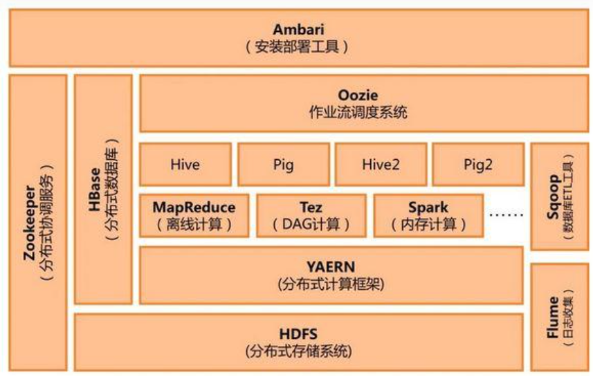


# 1 Ambari介绍

Apache Ambari 是一个基于 Web 的 Apache Hadoop 集群的供应、管理和监控。Ambari 目前已支持大多数 Hadoop 组件，包括 HDFS、MapReduce、Hive、Pig、 Hbase、Zookeper、Sqoop 和 Hcatalog 等。

Apache Ambari 支持 HDFS、MapReduce、Hive、Pig、Hbase、Zookeper、Sqoop 和 Hcatalog 等的集中管理。也是 5 个顶级 hadoop 管理工具之一。

Ambari 主要取得了以下成绩：

- 通过一步一步的安装向导简化了集群供应。
- 预先配置好关键的运维指标（metrics），可以直接查看 Hadoop Core（HDFS 和 MapReduce）及相关项目（如 HBase、Hive 和 HCatalog）是否健康。
- 支持作业与任务执行的可视化与分析，能够更好地查看依赖和性能。
- 通过一个完整的 RESTful API 把监控信息暴露出来，集成了现有的运维工具。
- 用户界面非常直观，用户可以轻松有效地查看信息并控制集群。

Ambari 使用 Ganglia 收集度量指标，用 Nagios 支持系统报警，当需要引起管理员的关注时（比如，节点停机或磁盘剩余空间不足等问题），系统将向其发送邮件。

此外，Ambari 能够安装安全的（基于 Kerberos）Hadoop 集群，以此实现了对 Hadoop 安全的支持，提供了基于角色的用户认证、授权和审计功能，并为用户管理集成了 LDAP 和 Active Directory。


# 2 Hadoop介绍

```
Hadoop是一个开发和运行处理大规模数据的软件平台，是Apache的一个用java语言实现开源软件框架，实现在大量计算机组成的集群中对海量数据进行分布式计算。Hadoop框架中最核心设计就是：MapReduce和HDFS。MapReduce提供了对数据的分布式计算，HDFS提供了海量数据的分布式存储。
在Hadoop家族中，收入了20多个用于计算、分析、存储、监控、管理等组件和工具，这些家族成员极大的丰富了Hadoop的各方面的功能。
```

**Hadoop常见家族成员**

下面简单的列举几个常见的组件：

```html
Apache Hadoop: 是Apache开源组织的一个分布式计算开源框架，提供了一个分布式文件系统子项目(HDFS)和支持MapReduce分布式计算的软件架构。
Apache Hive: 是基于Hadoop的一个数据仓库工具，可以将结构化的数据文件映射为一张数据库表，通过类SQL语句快速实现简单的MapReduce统计，不必开发专门的MapReduce应用，十分适合数据仓库的统计分析。
Apache Pig: 是一个基于Hadoop的大规模数据分析工具，它提供的SQL-LIKE语言叫Pig Latin，该语言的编译器会把类SQL的数据分析请求转换为一系列经过优化处理的MapReduce运算。
Apache HBase: 是一个高可靠性、高性能、面向列、可伸缩的分布式存储系统，利用HBase技术可在廉价PC Server上搭建起大规模结构化存储集群。
Apache Sqoop: 是一个用来将Hadoop和关系型数据库中的数据相互转移的工具，可以将一个关系型数据库（MySQL ,Oracle ,Postgres等）中的数据导进到Hadoop的HDFS中，也可以将HDFS的数据导进到关系型数据库中。
Apache Zookeeper: 是一个为分布式应用所设计的分布的、开源的协调服务，它主要是用来解决分布式应用中经常遇到的一些数据管理问题，简化分布式应用协调及其管理的难度，提供高性能的分布式服务
Apache Mahout:是基于Hadoop的机器学习和数据挖掘的一个分布式框架。Mahout用MapReduce实现了部分数据挖掘算法，解决了并行挖掘的问题。
Apache Cassandra:是一套开源分布式NoSQL数据库系统。它最初由Facebook开发，用于储存简单格式数据，集Google BigTable的数据模型与Amazon Dynamo的完全分布式的架构于一身
Apache Avro: 是一个数据序列化系统，设计用于支持数据密集型，大批量数据交换的应用。Avro是新的数据序列化格式与传输工具，将逐步取代Hadoop原有的IPC机制
Apache Ambari: 是一种基于Web的工具，支持Hadoop集群的供应、管理和监控。
Apache Chukwa: 是一个开源的用于监控大型分布式系统的数据收集系统，它可以将各种各样类型的数据收集成适合 Hadoop 处理的文件保存在 HDFS 中供 Hadoop 进行各种 MapReduce 操作。
Apache Hama: 是一个基于HDFS的BSP（Bulk Synchronous Parallel)并行计算框架, Hama可用于包括图、矩阵和网络算法在内的大规模、大数据计算。
Apache Flume: 是一个分布的、可靠的、高可用的海量日志聚合的系统，可用于日志数据收集，日志数据处理，日志数据传输。
Apache Giraph: 是一个可伸缩的分布式迭代图处理系统， 基于Hadoop平台，灵感来自 BSP (bulk synchronous parallel) 和 Google 的 Pregel。
Apache Oozie: 是一个工作流引擎服务器, 用于管理和协调运行在Hadoop平台上（HDFS、Pig和MapReduce）的任务。
Apache Crunch: 是基于Google的FlumeJava库编写的Java库，用于创建MapReduce程序。与Hive，Pig类似，Crunch提供了用于实现如连接数据、执行聚合和排序记录等常见任务的模式库
Apache Whirr: 是一套运行于云服务的类库（包括Hadoop），可提供高度的互补性。Whirr学支持Amazon EC2和Rackspace的服务。
Apache Bigtop: 是一个对Hadoop及其周边生态进行打包，分发和测试的工具。
Apache HCatalog: 是基于Hadoop的数据表和存储管理，实现中央的元数据和模式管理，跨越Hadoop和RDBMS，利用Pig和Hive提供关系视图。
Cloudera Hue: 是一个基于WEB的监控和管理系统，实现对HDFS，MapReduce/YARN, HBase, Hive, Pig的web化操作和管理。
```


# 3 CDH和HDP平台对比

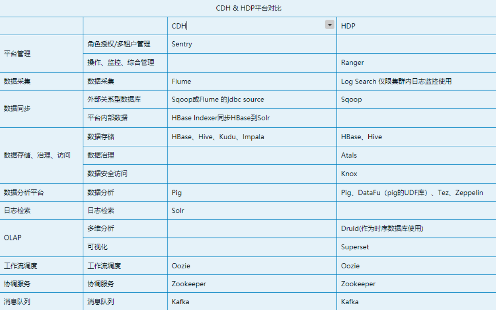


部署一套大数据架构是相当麻烦的事情，各种组件、服务配置相当多而杂，由此诞生了能简化各种服务部署和配置的的工具，也就是大数据平台框架。

**CDH**

CDH （ Cloudera Distribution Hadoop ）是 Cloudera 公司提供的包含 Apache Hadoop 及其相关项目的软件发行版本。还有一种说法是 CDH 是 Cloudera Distribution including Apache Hadoop 的缩写。

CDH 的所有组件都是 100% 开源的（Apache License），是唯一提供统一批处理、交互式 SQL、交互式搜索以及基于角色的访问控制的 Hadoop 解决方案。通过将 Hadoop 与十几个其他关键开源项目集成，Cloudera 创建了一个功能先进的系统，可以帮忙你执行端到端的大数据工作流。

CDH 特性
灵活性：存储任何类型的数据，并使用各种不同的计算框架进行操作，包括批处理、交互式SQL、文本搜索、机器学习和统计计算。
集成：在完整的 Hadoop 平台上快速启动和运行，该平台可与广泛的硬件和软件解决方案配合使用。
安全性：处理和控制敏感数据。
可扩展性：启用广泛的应用程序，并根据要求进行扩容扩展。
高可用性：能够胜任关键地方的业务任务。
兼容性：利用现有的 IT 基础设施和资产。

CDH 6.3 是 CDH 的最后一个主要版本。CDH是Apache hadoop和相关项目中最完整、最稳定、最流行的发行版。

**CDH 6.3.2 对应的各组件版本号——**
Apache Avro 1.8.2
Apache Flume 1.9.0
Apache Hadoop 3.0.0
Apache HBase 2.1.4
HBase Indexer 1.5
Apache Hive 2.1.1
Hue 4.3.0
Apache Impala 3.2.0
Apache Kafka 2.2.1
Kite SDK 1.0.0
Apache Kudu 1.10.0
Apache Solr 7.4.0
Apache Oozie 5.1.0
Apache Parquet 1.9.0
Parquet-format 2.4.0
Apache Pig 0.17.0
Apache Sentry 2.1.0
Apache Spark 2.4.0
Apache Sqoop 1.4.7
Apache ZooKeeper 3.4.5

**HDP**

HDP是Hortonworks公司的代表产品，是一个企业级的Hadoop发行版。

|        | CDH                                              | HDP                                                          |
| ------ | ------------------------------------------------ | ------------------------------------------------------------ |
| 相同点 | 两者都是免费版。                                 | 更易于维护，管理，且稳定性高。                               |
| 不同点 | 文档详细，但区分免费版和企业版，企业版只有试用期 | HDP版本是比较新的版本，目前最新版（HDP3.1.5）与apache基本同步，因为Hortonworks内部大部分员工都是apache代码贡献者。 |

其他区别：

1. CDH支持的存储组件更丰富
2. HDP支持的数据分析组件更丰富
3. HDP对多维分析及可视化有了支持，引入Druid和Superset
4. HDP的HBase数据使用Phoenix的jdbc查询；CDH的HBase数据使用映射Hive到Impala的jdbc查询，但分析数据可以存储Impala内部表，提高查询响应
5. 多维分析Druid纳入集群，会方便管理；但可视化工具Superset可以单独安装使用
6. CDH没有时序数据库，HDP将Druid作为时序数据库使用

**CDP**

CDP（Cloudera Data Platform）是 CDH 的继任者。CDP 是面向企业的云计算平台。它提供集成的多功能自助服务工具，以分析和集中数据。它在企业层面带来了安全和治理，所有这些都托管在公共、私有和多云部署上。

如果启动一项新项目，建议从 CDP 开始，因为这是 Cloudera 最新一代的技术。根据其官方网站，CDP 可以做到：

1. 必要时自动生成工作负载并在完成后暂停其操作，从而控制云成本
2. 使用分析和机器学习来优化工作负载
3. 显示所有云和瞬态集群的数据血缘关系
4. 使用单一的管理平台来使用混合云和多云
5. 可以扩展到 PB 级数据和成千上万多种多样的用户
6. 使用多云和混合环境集中控制客户和操作数据
7. CDP 有两个版本：CDP 公共云和 CDP 私有云。

CDP私有云的部署依赖ClouderaManager。

**相对于CDH/HDP，CDP有什么改进:**

CDP是原先两个最好的企业级数据分析平台CDH和HDP融合在一起，同时增加一些新的功能，形成的一个新平台。这个平台有40多个组件，是可以提供更多功能的企业级分析平台。这个平台集合了CDH和HDP的精华来创建，把一些过时的技术淘汰掉，再融合新的技术，把双方差异性的技术保留下来，同时升级共享一些技术得到最新版本。

值得一提的是，前两年官方已经声明，会逐渐停止对CDH和HDP的升级和维护。现在估计已经完全停了。


## 3.1 Ambari版本介绍

> （注：Ambari各个版本对产品的支持可在[Ambari版本支持界面](https://links.jianshu.com/go?to=https%3A%2F%2Fsupportmatrix.hortonworks.com%2F)查看）


# 4 准备环境


## 4.1 服务器和软件准备

**1、服务器信息**

| 主机名           | IP            | 系统            | 功能                                  | 配置                        |
| ---------------- | ------------- | --------------- | ------------------------------------- | --------------------------- |
| node1.ambari.com | 10.159.238.10 | CentOS 7.6.1810 | yum源，Ambari Server，mysql，java环境 | 4c16g+100g系统盘+200g数据盘 |
| node2.ambari.com | 10.159.238.11 | CentOS 7.6.1810 | 节点，java环境                        | 4c16g+100g系统盘+200g数据盘 |
| node3.ambari.com | 10.159.238.12 | CentOS 7.6.1810 | 节点，java环境                        | 4c16g+100g系统盘+200g数据盘 |


**2、软件信息**

|    组件    |     版本     |
| :--------: | :----------: |
|   Ambari   |    2.7.5     |
|    HDP     |  3.1.5.6091  |
|   MySQL    |     5.7      |
| OracleJDK8 | JDK1.8.0_144 |
|            |              |

**安装包下载：** 已打包到百度网盘

```
百度网盘下载：https://pan.baidu.com/s/1x4RdWn2i8f3FkXmHuygEFQ?pwd=p5i1 
提取码：p5i1
```

以下为官网相关链接

官网地址：https://docs.cloudera.com/HDPDocuments/Ambari-2.7.5.0/bk_ambari-installation/content/ambari_repositories.html

**（1）Ambari 2.7.5**

| **OS**   | Version Number | **Format**                                                   | **URL**                                                      |
| -------- | -------------- | ------------------------------------------------------------ | ------------------------------------------------------------ |
| CentOS 7 | Ambari 2.7.5   | Repo File                                                    | https://archive.cloudera.com/p/ambari/centos7/2.x/updates/2.7.5.0/ambari.repo |
|          | Ambari 2.7.5   | Tarball [md5](https://archive.cloudera.com/p/ambari/centos7/2.x/updates/2.7.5.0/ambari-2.7.5.0-centos7.tar.gz.md5) | https://archive.cloudera.com/p/ambari/centos7/2.x/updates/2.7.5.0/ambari-2.7.5.0-centos7.tar.gz.asc)https://archive.cloudera.com/p/ambari/centos7/2.x/updates/2.7.5.0/ambari-2.7.5.0-centos7.tar.gz |

**（2）Table 3.1. HDP Repository URLs**

| OS        | Version Number | Repository Name | Format                                                       | URL                                                          |
| :-------- | :------------- | :-------------- | :----------------------------------------------------------- | :----------------------------------------------------------- |
| Red Hat 7 | HDP-3.1.5.6091 | HDP             | Repo URL                                                     | https://archive.cloudera.com/p/HDP/centos7/3.x/updates/3.1.5.6091/hdp.repo |
|           | HDP-3.1.5.6091 | HDP             | Tarball [md5](https://archive.cloudera.com/p/HDP/centos7/3.x/updates/3.1.5.6091/HDP-3.1.5.6091-centos7-rpm.tar.gz.md5) \|[ asc](https://archive.cloudera.com/p/HDP/centos7/3.x/updates/3.1.5.6091/HDP-3.1.5.6091-centos7-rpm.tar.gz.asc) | https://archive.cloudera.com/p/HDP/centos7/3.x/updates/3.1.5.6091/HDP-3.1.5.6091-centos7-rpm.tar.gz |
|           |                | HDP-UTILS       | Tarball [md5](https://archive.cloudera.com/p/HDP-UTILS/1.1.0.22/repos/centos7/HDP-UTILS-1.1.0.22-centos7.tar.gz.md5) \|[ asc](https://archive.cloudera.com/p/HDP-UTILS/1.1.0.22/repos/centos7/HDP-UTILS-1.1.0.22-centos7.tar.gz.asc) | https://archive.cloudera.com/p/HDP-UTILS/1.1.0.22/repos/centos7/HDP-UTILS-1.1.0.22-centos7.tar.gz |
|           |                | HDP-GPL         | Tarball [md5](https://archive.cloudera.com/p/HDP-GPL/centos7/3.x/updates/3.1.5.6091/HDP-GPL-3.1.5.6091-centos7-gpl.tar.gz.md5) \|[ asc](https://archive.cloudera.com/p/HDP-GPL/centos7/3.x/updates/3.1.5.6091/HDP-GPL-3.1.5.6091-centos7-gpl.tar.gz.asc) | https://archive.cloudera.com/p/HDP-GPL/centos7/3.x/updates/3.1.5.6091/HDP-GPL-3.1.5.6091-centos7-gpl.tar.gz |

（3）在[OracleJDK8下载地址](https://links.jianshu.com/go?to=https%3A%2F%2Fwww.oracle.com%2Ftechnetwork%2Fcn%2Fjava%2Fjavase%2Fdownloads%2Fjava-archive-javase8-2177648-zhs.html)下载安装jdk-8u202-linux-x64.tar.gz版本的安装包。


## 4.2 系统优化设置

**1、修改主机名**

```shell
hostnamectl set-hostname node1.ambari.com
hostnamectl set-hostname node2.ambari.com
hostnamectl set-hostname node3.ambari.com
```

**2、添加hosts解析(所有节点)**

```shell
cat >/etc/hosts<<EOF
127.0.0.1   localhost localhost.localdomain localhost4 localhost4.localdomain4
::1         localhost localhost.localdomain localhost6 localhost6.localdomain6
10.159.238.10 node1.ambari.com
10.159.238.11 node2.ambari.com
10.159.238.12 node3.ambari.com
EOF
```

**3、添加节点信任关系**

本操作只需要在node1 节点上进行，设置 root 账户可以无密码登录**所有节点**：

```bash
ssh-keygen -t rsa
ssh-copy-id root@node1.ambari.com
ssh-copy-id root@node2.ambari.com
ssh-copy-id root@node3.ambari.com
```

**4、关闭firewalld及selinux(所有节点)**

 在每台机器上关闭防火墙，清理防火墙规则，设置默认转发策略 

```shell
systemctl stop firewalld
systemctl disable firewalld
setenforce 0
sed -i  '/^SELINUX/s#enforcing#disabled#g' /etc/selinux/config
```

**5、关闭swap分区(所有节点)**

```shell
swapoff -a
sed -ri 's/.*swap.*/#&/' /etc/fstab
```

**6、配置ntp时钟同步**

```bash
# 所有机器安装：yum -y install ntp
# 选择node1服务器作为NTP Server
# 配置如下 vim /etc/ntp.conf
driftfile /var/lib/ntp/drift
restrict default nomodify notrap nopeer noquery
restrict 127.0.0.1
restrict ::1
server 127.127.1.0
fudge 127.127.1.0 stratum 10
includefile /etc/ntp/crypto/pw
keys /etc/ntp/keys
disable monitor

# 其他节点配置如下：vim /etc/ntp.conf
driftfile /var/lib/ntp/drift
restrict default nomodify notrap nopeer noquery
restrict 127.0.0.1
restrict ::1
server 10.159.238.10
includefile /etc/ntp/crypto/pw
keys /etc/ntp/keys
disable monitor

# 所有节点启动ntpd并添加开机自启
systemctl start ntpd
systemctl enable ntpd

#验证所有节点NTP是否同步成功
[root@node1 ~]# ntpq -p
     remote           refid      st t when poll reach   delay   offset  jitter
==============================================================================
*LOCAL(0)        .LOCL.          10 l   38   64   17    0.000    0.000   0.000

[root@node2 ~]# ntpq -p
     remote           refid      st t when poll reach   delay   offset  jitter
==============================================================================
 node1.ambari.co LOCAL(0)        11 u   18   64    7    0.698   -2.003   0.056

[root@node3 ~]# ntpq -p
     remote           refid      st t when poll reach   delay   offset  jitter
==============================================================================
 node1.ambari.co LOCAL(0)        11 u   16   64    3    0.668   -2.460   0.081

```


**7、禁用THP(所有节点)**

THP 的本意是为提升内存的性能，但是在 Hadoop 环境中发现，此功能会将 CPU 占用率增大，进而影响 Hadoop 性能，因此建议将其关闭。

（1）首先检查THP的启用状态：

```powershell
[root@localhost ~]# cat /sys/kernel/mm/transparent_hugepage/defrag
[always] madvise never
[root@localhost ~]# cat /sys/kernel/mm/transparent_hugepage/enabled
[always] madvise never
```

如果输出结果为[always]表示透明大页启用了。[never]表示透明大页禁用、[madvise]表示（只在MADV_HUGEPAGE标志的VMA中使用THP
这个状态就说明都是启用的。

（2）在运行时禁用THP(Transparent HugePages)
运行以下命令即时禁用THP，该命令适用于其它Linux系统：

```powershell
echo never > /sys/kernel/mm/transparent_hugepage/enabled
echo never > /sys/kernel/mm/transparent_hugepage/defrag
```

（3）永久禁用THP(Transparent HugePages )
编辑rc.local文件：

```powershell
[root@localhost ~]# vim /etc/rc.d/rc.local
```

增加下列内容：

```powershell
if test -f /sys/kernel/mm/transparent_hugepage/enabled; then
echo never > /sys/kernel/mm/transparent_hugepage/enabled
fi
if test -f /sys/kernel/mm/transparent_hugepage/defrag; then
echo never > /sys/kernel/mm/transparent_hugepage/defrag
fi
```

（4）保存退出，然后赋予rc.local文件执行权限：

```powershell
[root@localhost ~]# chmod +x /etc/rc.d/rc.local
```

（5）最后重启系统，以后再检查THP应该就是被禁用了

```powershell
[root@localhost ~]# cat /sys/kernel/mm/transparent_hugepage/enabled
always madvise [never]
[root@localhost ~]# cat /sys/kernel/mm/transparent_hugepage/defrag 
always madvise [never]
```

（6）另一种方式查看是否被禁用看是否为0

```powershell
cat /proc/sys/vm/nr_hugepages
sysctl vm.nr_hugepages
```

查看使用的内存

```powershell
cat /proc/meminfo && grep AnonHugePages /proc/meminfo 
```

**8、修改文件描述符打开数(所有节点)**

```bash
echo 'ulimit -SHn 512000' >>/etc/profile

# 调整大小都增大10倍
cat >>/etc/security/limits.conf<<\EOF
* soft nofile 600000
* hard nofile 655350
* soft nproc 600000
* hard nproc 655350
EOF
# 使用命令是修改生效
source /etc/profile

# 修改内核配置
cat >>/etc/sysctl.conf<<\EOF
fs.file-max = 65535000
fs.nr_open = 1000000
net.core.somaxconn = 30000
vm.swappiness = 0
net.core.rmem_max = 16777216
net.core.wmem_max = 16777216
net.ipv4.tcp_rmem = 4096 87380 16777216
net.ipv4.tcp_wmem = 4096 16384 16777216
net.core.netdev_max_backlog = 16384
net.ipv4.tcp_max_syn_backlog = 8192
net.ipv4.tcp_syncookies = 1
net.ipv4.tcp_tw_reuse = 1
net.ipv4.tcp_tw_recycle = 1
net.ipv4.ip_local_port_range = 1024 65000
net.ipv6.conf.all.disable_ipv6=1
net.ipv6.conf.default.disable_ipv6=1
net.ipv6.conf.lo.disable_ipv6=1
EOF
# 执行命令让配置生效
sysctl -p

#最后重启服务器
```


## 4.4 安装Ambari&HDP

### 4.4.1 安装JDK(所有节点)

```bash
# 创建目录
mkdir /usr/java

# 上传jdk-8u202-linux-x64.tar.gz并解压到/usr/java
tar -zxvf jdk-8u202-linux-x64.tar.gz -C /usr/java/

# 设置环境变量
[root@node1 java]# 
cat >>/etc/profile<<\EOF
#JAVA
export JAVA_HOME=/usr/java/jdk1.8.0_202
export PATH=$PATH:$JAVA_HOME/bin
EOF

[root@node1 java]# source /etc/profile
[root@node1 java]# java -version
java version "1.8.0_202"
Java(TM) SE Runtime Environment (build 1.8.0_202-b08)
Java HotSpot(TM) 64-Bit Server VM (build 25.202-b08, mixed mode)
```


### 4.4.2 安装httpd(node1节点)

```bash
yum install yum-utils createrepo -y
yum repolist
# 使用yum安装httpd
yum install httpd -y
systemctl start httpd
```


### 4.4.3 配置本地yum源(node1节点)

- 解压并创建本地源

```bash
tar -zxvf  ambari-2.7.5.0-centos7.tar.gz -C /var/www/html/
tar -zxvf  HDP-3.1.5.0-centos7-rpm.tar.gz -C /var/www/html/
tar -zxvf  HDP-GPL-3.1.5.0-centos7-gpl.tar.gz -C /var/www/html/
tar -zxvf  HDP-UTILS-1.1.0.22-centos7.tar.gz -C /var/www/html/

# 创建本地yum源
createrepo /var/www/html/ambari/
createrepo /var/www/html/HDP/
createrepo /var/www/html/HDP-GPL/
createrepo /var/www/html/HDP-UTILS/
```

- 创建libtirpc-devel本地源

```
mkdir /var/www/html/libtirpc
cd /var/www/html/libtirpc
wget http://mirror.centos.org/centos/7/os/x86_64/Packages/libtirpc-0.2.4-0.16.el7.x86_64.rpm
wget http://mirror.centos.org/centos/7/os/x86_64/Packages/libtirpc-devel-0.2.4-0.16.el7.x86_64.rpm
createrepo /var/www/html/libtirpc

```


- 制作本地repo

```bash
# 备份其他源
mkdir -p /etc/yum.repos.d/bak
mv /etc/yum.repos.d/*.repo /etc/yum.repos.d/bak

# 配置ambari.repo
cat >/etc/yum.repos.d/ambari.repo<<EOF
[Ambari-2.7.5.0]
name=Ambari-2.7.5.0
baseurl=http://node1.ambari.com/ambari/centos7/2.7.5.0-72/
gpgcheck=0
enabled=1
priority=1
EOF

# 配置HDP和HDP-TILS
cat >/etc/yum.repos.d/HDP.repo<<EOF
[HDP-3.1.5.0]
name=HDP Version - HDP-3.1.5.0
baseurl=http://node1.ambari.com/HDP/centos7/3.1.5.0-152/
gpgcheck=0
enabled=1
priority=1

[HDP-UTILS-1.1.0.22]
name=HDP-UTILS Version - HDP-UTILS-1.1.0.22
baseurl=http://node1.ambari.com/HDP-UTILS/centos7/1.1.0.22/
gpgcheck=0
enabled=1
priority=1

[HDP-GPL-3.1.5.0]
name=HDP-GPL Version - HDP-GPL-3.1.5.0
baseurl=http://node1.ambari.com/HDP-GPL/centos7/3.1.5.0-152
gpgcheck=0
enabled=1
priority=1
EOF


#配置libtirpc.repo
cat >/etc/yum.repos.d/libtirpc.repo<<EOF
[libtirpc_repo]
name=libtirpc-0.2.4-0.16
baseurl=http://node1.ambari.com/libtirpc/
gpgcheck=0
enabled=1
priority=1
EOF
```

- 分发repo文件

```
scp /etc/yum.repos.d/*.repo node2.ambari.com:/etc/yum.repos.d/
scp /etc/yum.repos.d/*.repo node3.ambari.com:/etc/yum.repos.d/
yum clean all
yum makecache
```


### 4.4.3 安装mariadb(node1节点)

```bash
rpm -qa |grep -i mysql
rpm -qa |grep -i mariadb
# 卸载旧版本包
rpm -e --nodeps 旧包

# 安装MySQL 5.7
wget -i -c http://dev.mysql.com/get/mysql57-community-release-el7-10.noarch.rpm
yum -y install mysql57-community-release-el7-10.noarch.rpm
rpm --import https://repo.mysql.com/RPM-GPG-KEY-mysql-2022
yum -y install mysql-community-server

# 启动MySQL
systemctl start mysqld.service
systemctl enable mysqld.service
systemctl status mysqld.service

获取MySQL root用户的初始密码
grep 'password' /var/log/mysqld.log

# 登录MySQL并修改密码为 'root123'
（注：MySQL默认需修改初始密码后才能对数据库进行操作）
mysql>  set global validate_password_policy=0;
mysql>  set global validate_password_length=1;
mysql>  ALTER USER 'root'@'localhost' IDENTIFIED BY 'root123';

# 卸载Yum Repository，以避免每次yum操作都进行自动更新
yum -y remove mysql57-community-release-el7-10.noarch

# 配置MySQL编码格式为utf8
vi /etc/my.cnf
#在[mysqld]中添加
collation_server=utf8_general_ci
character_set_server=utf8
default-storage-engine=INNODB
#创建[client]并添加
[client]
default_character-set=utf8

#重启MySQL
systemctl restart mysqld.service

```


### 4.4.4 安装mysql-connection-java(node1节点)

```
yum -y install mysql-connector-java
或者上传离线安装包执行
yum --disablerepo=* localinstall -y *.rpm
```

> **注：稍后会使用，没有该包则MySQL与ambari无法连接！**

- 查看是否下载成功
  `ls /usr/share/java`
  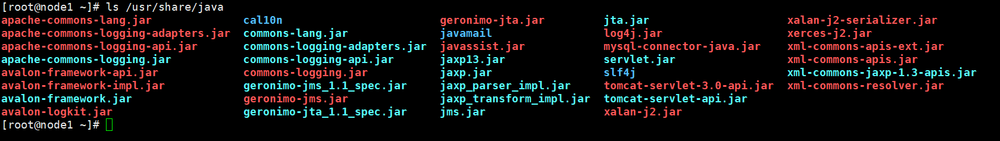


### 4.4.5 安装ambari-server(node1节点)

**1、在node1安装ambari-server**

```bash
yum -y install ambari-server
```


- 配置/etc/ambari-server/conf/ambari.properties，添加如下行

```bash
echo 'server.jdbc.driver.path=/usr/share/java/mysql-connector-java.jar' >>/etc/ambari-server/conf/ambari.properties
```

- 执行安装：

```bash
[root@node1 2.7.5.0-72]# ambari-server setup --jdbc-db=mysql --jdbc-driver=/usr/share/java/mysql-connector-java.jar
Using python  /usr/bin/python
Setup ambari-server
Copying /usr/share/java/mysql-connector-java.jar to /var/lib/ambari-server/resources/mysql-connector-java.jar
If you are updating existing jdbc driver jar for mysql with mysql-connector-java.jar. Please remove the old driver jar, from all hosts. Restarting services that need the driver, will automatically copy the new jar to the hosts.
JDBC driver was successfully initialized.
Ambari Server 'setup' completed successfully.

```

其实这步就是复制mysql-jdbc驱动到/var/lib/ambari-server/resources/

```sh
cp /usr/share/java/mysql-connector-java.jar /var/lib/ambari-server/resources/
```


- 初始化ambari-server

```bash
[root@node1 2.7.5.0-72]# ambari-server setup
Using python  /usr/bin/python
Setup ambari-server
Checking SELinux...
SELinux status is 'disabled'
# 提示是否自定义设置
Customize user account for ambari-server daemon [y/n] (n)? y
# ambari-server账号
Enter user account for ambari-server daemon (root):root
Adjusting ambari-server permissions and ownership...
Checking firewall status...
Checking JDK...
[1] Oracle JDK 1.8 + Java Cryptography Extension (JCE) Policy Files 8
[2] Custom JDK
==============================================================================
# 选择自定义jdk
Enter choice (1): 2
WARNING: JDK must be installed on all hosts and JAVA_HOME must be valid on all hosts.
WARNING: JCE Policy files are required for configuring Kerberos security. If you plan to use Kerberos,please make sure JCE Unlimited Strength Jurisdiction Policy Files are valid on all hosts.
# 输入自定义jdk目录
Path to JAVA_HOME: /usr/java/jdk1.8.0_202
Validating JDK on Ambari Server...done.
Check JDK version for Ambari Server...
JDK version found: 8
Minimum JDK version is 8 for Ambari. Skipping to setup different JDK for Ambari Server.
Checking GPL software agreement...
GPL License for LZO: https://www.gnu.org/licenses/old-licenses/gpl-2.0.en.html
Enable Ambari Server to download and install GPL Licensed LZO packages [y/n] (n)? y
Completing setup...
Configuring database...
# 是否配置数据库
Enter advanced database configuration [y/n] (n)? y
Configuring database...
==============================================================================
Choose one of the following options:
[1] - PostgreSQL (Embedded)
[2] - Oracle
[3] - MySQL / MariaDB
[4] - PostgreSQL
[5] - Microsoft SQL Server (Tech Preview)
[6] - SQL Anywhere
[7] - BDB
==============================================================================
# 选择mysql，输入数据库名、用户和密码
Enter choice (1): 3
Hostname (localhost): node1.ambari.com
Port (3306): 3306
Database name (ambari): ambari
Username (ambari): ambari
Enter Database Password (bigdata): ambari123
Re-enter password:ambari123
Configuring ambari database...
Configuring remote database connection properties...
WARNING: Before starting Ambari Server, you must run the following DDL directly from the database shell to create the schema: /var/lib/ambari-server/resources/Ambari-DDL-MySQL-CREATE.sql
Proceed with configuring remote database connection properties [y/n] (y)? y
Extracting system views...
ambari-admin-2.7.5.0.72.jar
....
Ambari repo file doesn't contain latest json url, skipping repoinfos modification
Adjusting ambari-server permissions and ownership...
Ambari Server 'setup' completed successfully.


# 查看开机自启动项发现ambari已经添加
chkconfig
```

> 注：
> 1.选择JDK时选（2）自定义jdk，并填写jdk安装路径/usr/java/jdk1.8.0_202/
> 2.Enter advanced databse configration[y/n]?时选择y,进入到数据库选择界面，在Enter choice后选择3，配置hostname为node1.ambari.com，使用默认端口，Database name为ambari，密码为ambari123


**2、创建ambari和hive数据库**

登录mysql创建如下数据库：mysql  -uroot  -p'root123'

- 创建ambari数据库
  用户名： **ambari**
  密码： **ambari123**

```sql
set global validate_password_policy=0;
set global validate_password_length=1;
create database ambari character set utf8;
CREATE USER 'ambari'@'%'IDENTIFIED BY 'ambari123';
GRANT ALL PRIVILEGES ON ambari.* TO 'ambari'@'%'; 
GRANT ALL PRIVILEGES ON ambari.* TO 'ambari'@'localhost' IDENTIFIED BY 'ambari123';
GRANT ALL PRIVILEGES ON ambari.* TO 'ambari'@'%' IDENTIFIED BY 'ambari123';
FLUSH PRIVILEGES;
```

- 创建hive数据库
  用户名： **hive**
  密码： **hive123**

```sql
create database hive character set utf8;
CREATE USER 'hive'@'%'IDENTIFIED BY 'hive123';
GRANT ALL PRIVILEGES ON hive.* TO 'hive'@'%';
GRANT ALL PRIVILEGES ON hive.* TO 'hive'@'localhost' IDENTIFIED BY 'hive123';
GRANT ALL PRIVILEGES ON hive.* TO 'hive'@'node1.ambari.com' IDENTIFIED BY 'hive123';
FLUSH PRIVILEGES;
```

- 查看已经创建的数据库
  `mysql> show databases;`
  输出中若含有**ambari**和**hive**则表明创建成功


**3、导入ambari数据库表**

```sql
use ambari;
source /var/lib/ambari-server/resources/Ambari-DDL-MySQL-CREATE.sql;
```


**4、启动ambari-server**

```bash
[root@node1 2.7.5.0-72]# ambari-server start
Using python  /usr/bin/python
Starting ambari-server
Ambari Server running with administrator privileges.
Organizing resource files at /var/lib/ambari-server/resources...
Ambari database consistency check started...
Server PID at: /var/run/ambari-server/ambari-server.pid
Server out at: /var/log/ambari-server/ambari-server.out
Server log at: /var/log/ambari-server/ambari-server.log
Waiting for server start.........................................
Server started listening on 8080

DB configs consistency check: no errors and warnings were found.
Ambari Server 'start' completed successfully.

#查看状态
[root@node1 data]# ambari-server status
Using python  /usr/bin/python
Ambari-server status
Ambari Server running
Found Ambari Server PID: 17930 at: /var/run/ambari-server/ambari-server.pid
```


### 4.4.6 安装ambari-agent(所有节点)

```bash
yum -y install ambari-agent
systemctl start ambari-agent
systemctl enable ambari-agent
```


## 4.5 通过Ambari部署Hadoop3.x集群

1、登录界面：http://10.159.238.10:8080
默认管理员账户登录， 账户：admin 密码：admin

### 4.5.1 创建集群名称

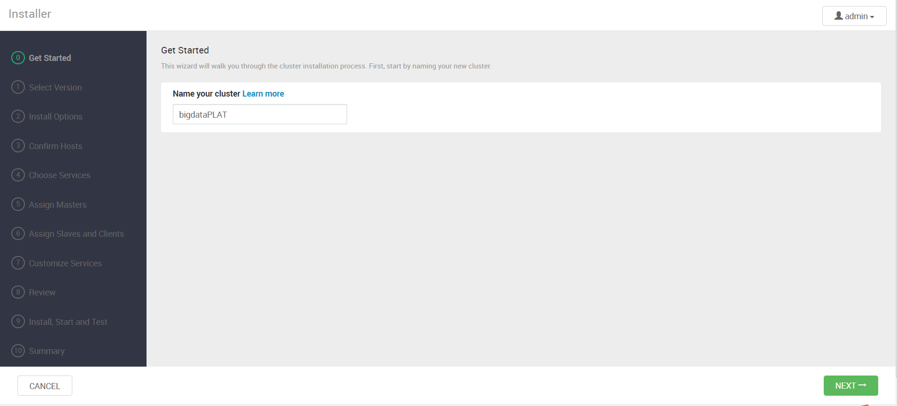


### 4.5.2 选择版本，配置yum源

选HDP-3.1(Default Version Definition);
选Use Local Repository;
选redhat7:

最终我们只保留 "readhat7" 的仓库，接下来要把直接部署 yum 本地仓库的地址填进去，同时**不要勾选**最下面的两个高级选项，如下图：

```
http://node1.ambari.com/HDP/centos7/3.1.5.0-152/
http://node1.ambari.com/HDP-GPL/centos7/3.1.5.0-152/
http://node1.ambari.com/HDP-UTILS/centos7/1.1.0.22/
```

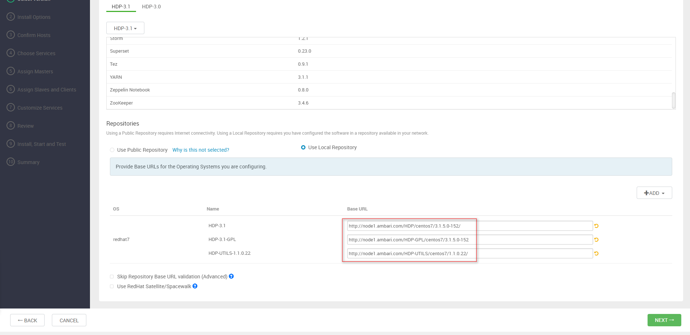


### 4.5.3 配置节点和密钥

下载主节点的/root/.ssh/id_rsa，并上传！点击下一步，进入确认主机界面
也可直接cat /root/.ssh/id_rsa 粘贴即可

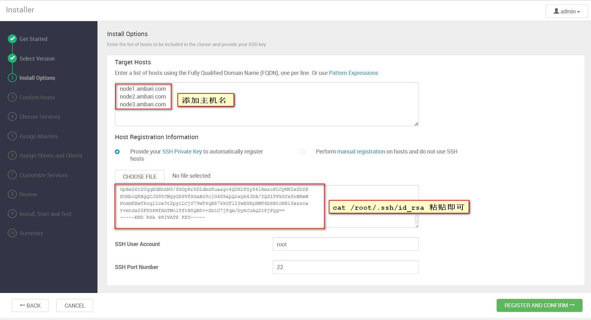


### 4.5.4 确保结果正常

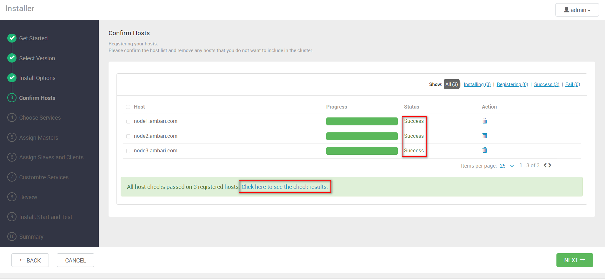

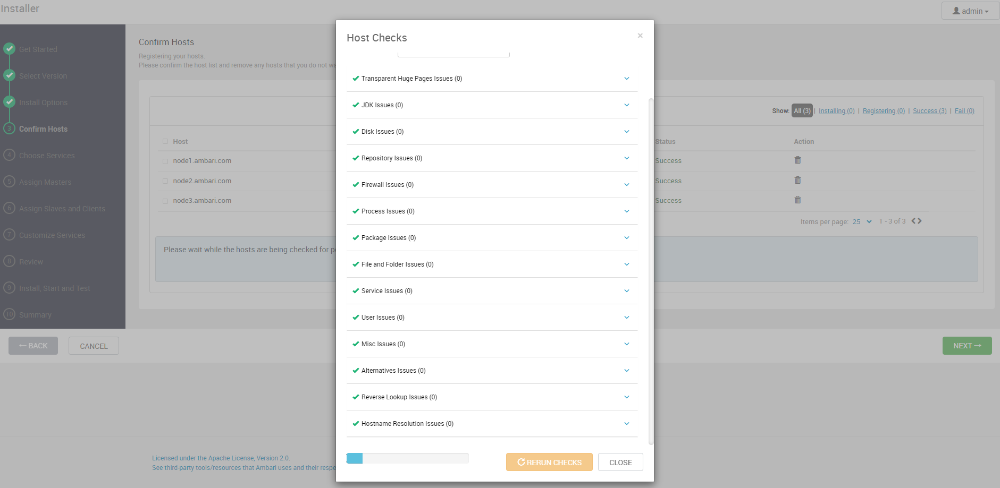


### 4.5.5 勾选需要安装的服务

YARN + MapReduce2、Hive、HBase、Zookeeper、Kakfa、Spark2；并依据提示选择其他必备组件

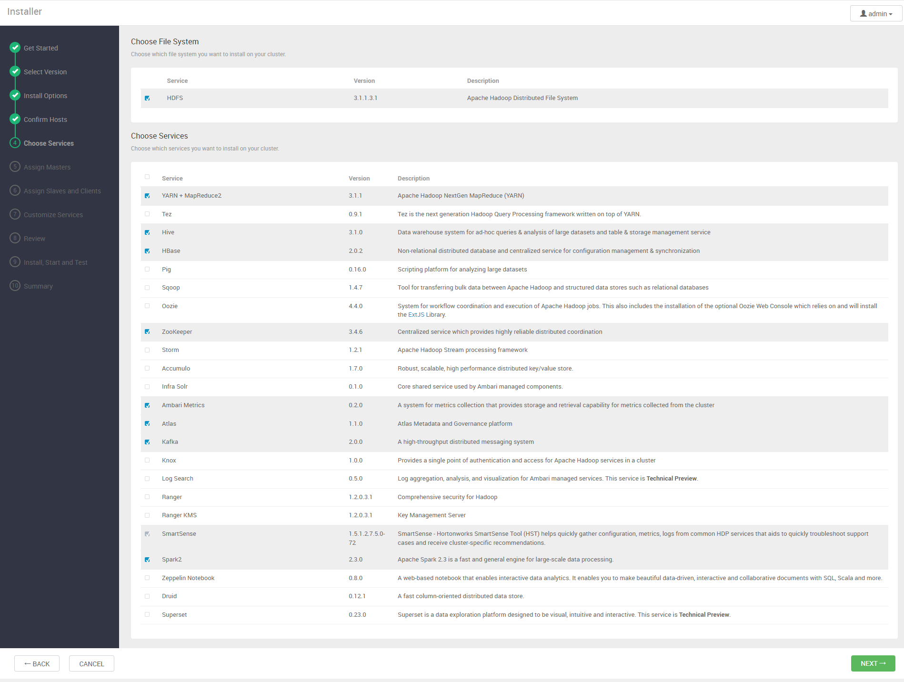


### 4.5.6 分配master服务

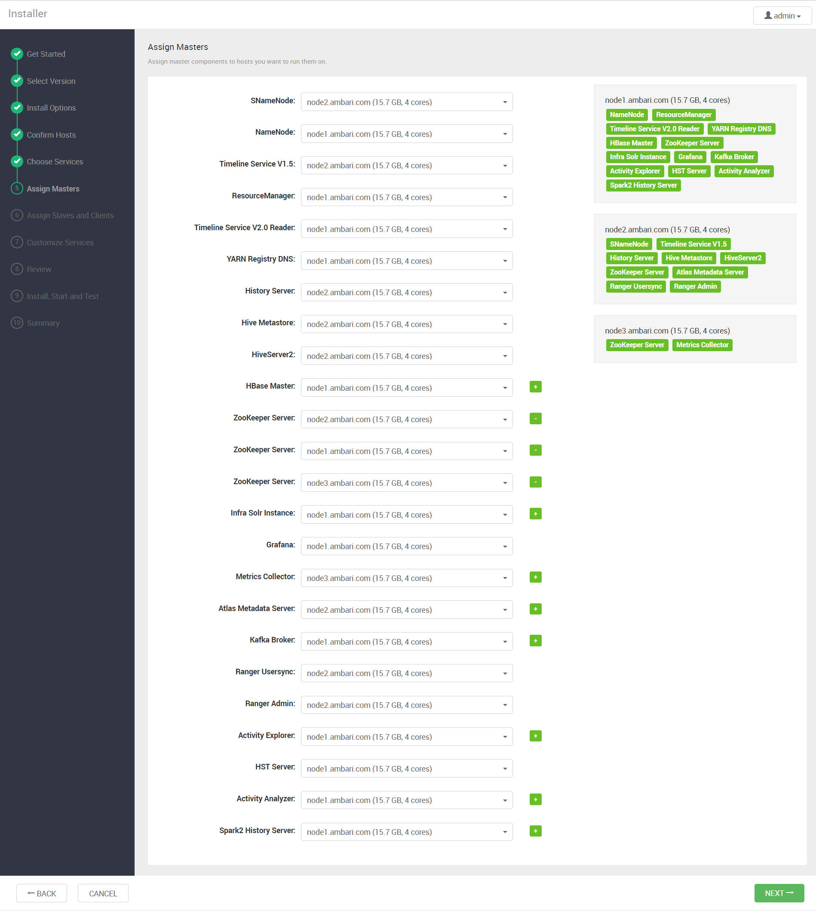


### 4.5.7 分配slaves服务

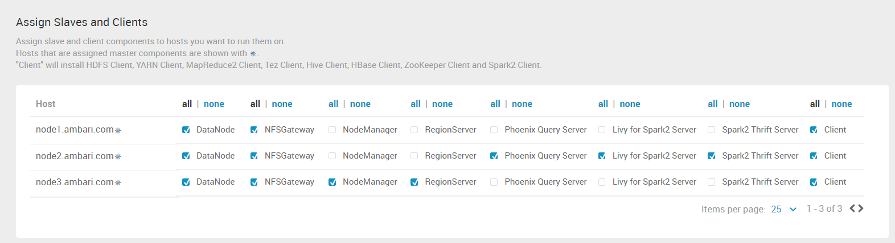


### 4.5.8 设置相关服务的密码

|                           | Username | Password   | Confirm Password |
| ------------------------- | -------- | ---------- | ---------------- |
| Grafana Admin             | admin    | grafana123 | grafana123       |
| Hive Database             | hive     | hive123    | hive123          |
| Activity Explorer's Admin | N/A      | admin@123  | admin@123        |


### 4.5.9 与已有的hive数据库连接

在Hive Database中选择 **Exisiting MySQL/MariaDB**

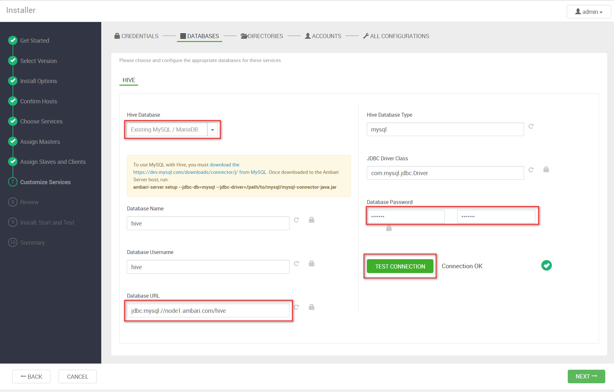


### 4.5.10 定义存储路径

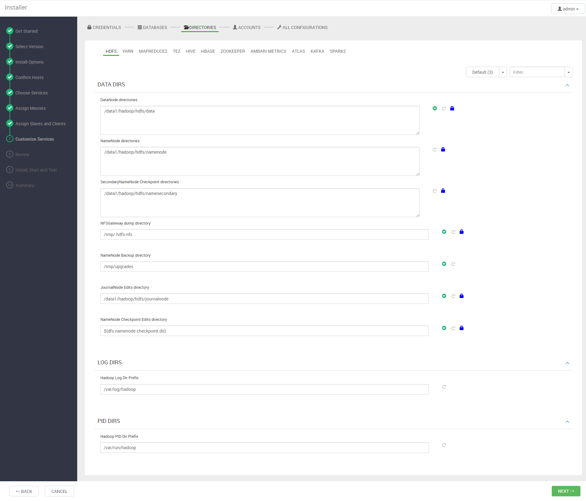


### 4.5.11 集群整体概况

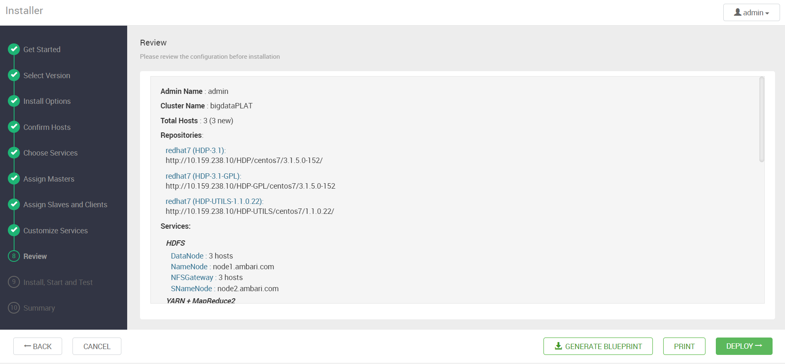

- 点击DEPLOY进行部署,等待部署完成即


### 4.5.12 部署完成

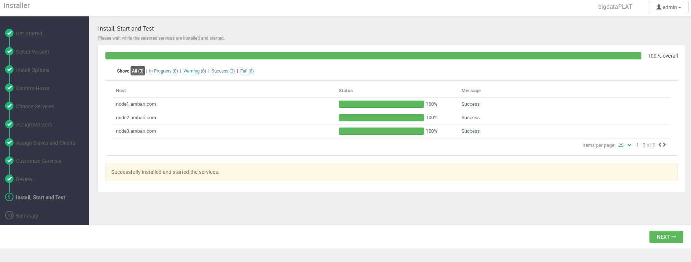

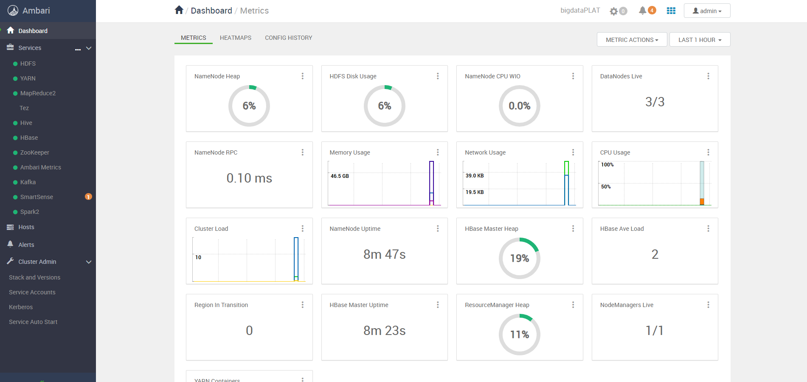


### 4.5.13 服务自启动

如果让托管给Ambari的服务自动启动，则可以按照下图操作：

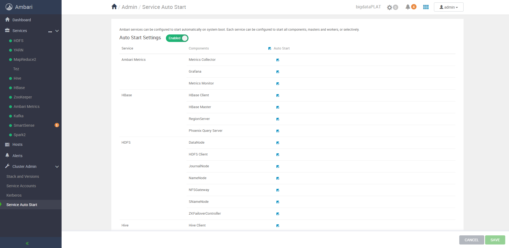


# 常见报错

## Requires: redhat-lsb

```
stderr:   /var/lib/ambari-agent/data/errors-676.txt
2024-01-15 17:37:39,583 - The 'hadoop-hdfs-datanode' component did not advertise a version. This may indicate a problem with the component packaging.
Traceback (most recent call last):
  File "/var/lib/ambari-agent/cache/stacks/HDP/3.0/services/HDFS/package/scripts/datanode.py", line 126, in <module>
    DataNode().execute()
  File "/usr/lib/ambari-agent/lib/resource_management/libraries/script/script.py", line 352, in execute
    method(env)
  File "/var/lib/ambari-agent/cache/stacks/HDP/3.0/services/HDFS/package/scripts/datanode.py", line 45, in install
    self.install_packages(env)
  File "/usr/lib/ambari-agent/lib/resource_management/libraries/script/script.py", line 853, in install_packages
    retry_count=agent_stack_retry_count)
  File "/usr/lib/ambari-agent/lib/resource_management/core/base.py", line 166, in __init__
    self.env.run()
  File "/usr/lib/ambari-agent/lib/resource_management/core/environment.py", line 160, in run
    self.run_action(resource, action)
  File "/usr/lib/ambari-agent/lib/resource_management/core/environment.py", line 124, in run_action
    provider_action()
  File "/usr/lib/ambari-agent/lib/resource_management/core/providers/packaging.py", line 30, in action_install
    self._pkg_manager.install_package(package_name, self.__create_context())
  File "/usr/lib/ambari-agent/lib/ambari_commons/repo_manager/yum_manager.py", line 219, in install_package
    shell.repository_manager_executor(cmd, self.properties, context)
  File "/usr/lib/ambari-agent/lib/ambari_commons/shell.py", line 753, in repository_manager_executor
    raise RuntimeError(message)
RuntimeError: Failed to execute command '/usr/bin/yum -y install hadoop_3_1_5_0_152', exited with code '1', message: 'Repository base is listed more than once in the configuration

Error: Package: hadoop_3_1_5_0_152-3.1.1.3.1.5.0-152.x86_64 (HDP-3.1-repo-5)

           Requires: redhat-lsb
```


```
yum -y install sendmail* redhat-lsb
```


4、通过Ambari扩容hadoop集群节点

5、通过Ambari在hadoop集群中新增hive/hbase/tez服务组件

6、通过Ambari在hadoop中新增spark计算引擎

7、通过Ambari管理hadoop集群中的各种组件和服务

8、通过Ambari修改hadoop集群各个组件配置参数

9、在Ambari平台配置监控告警、并设置通知策略


