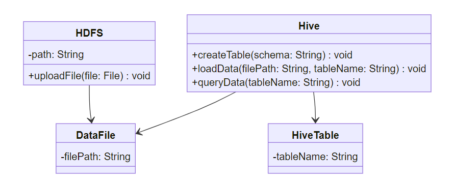

# Hive 数据仓库实战


介绍

hive是基于Hadoop的一个数据仓库工具，用来进行数据提取、转化、加载，这是一种可以存储、查询和分析存储在Hadoop中的大规模数据的机制。hive数据仓库工具能将结构化的数据文件映射为一张数据库表，并提供SQL查询功能，能将SQL语句转变成MapReduce任务来执行。Hive的优点是学习成本低，可以通过类似SQL语句实现快速MapReduce统计，使MapReduce变得更加简单，而不必开发专门的MapReduce应用程序。hive十分适合对数据仓库进行统计分析。


# 一、Hive与HDFS的数据映射

1.Hive对象与HDFS关系
数据库：每个数据库在HDFS中对应一个目录
目录的名字：库名.db
表：每张表在数据库中对应的目录下建立一个与表同名的目录
表的数据：映射的是HDFS上的文件

2.元数据映射
所有Hive中数据库、表与HDFS的映射关系存储在元数据中，Hive服务端会读取元数据找到这张表对应的HDFS数据

3.元数据映射过程

```
1.先检索数据库的信息
2.再检索表的信息
3.通过表的SD_ID来获取这张表映射的HDFS的地址
4.将整个表的目录中的 所有数据进行读取并返回
```


# 二、Hive转换与MapReduce过程

1.基本映射关系

| MapReduce | SQL               |
| --------- | ----------------- |
| Input     | from              |
| Map       | select,from       |
| Shuffle   | group by,order by |
| Reduce    | having，limit     |
| Output    | 将SQL结果保存     |

2.执行解析

```
select region,count(*) as numb from tb_house where region != '浦东' group by region order by numb;
```

3.查看执行计划

```
explain select region,count(*) as numb from tb_house where region != '浦东' group by region order by numb;
```

# 三、元数据：metastore的功能和存储方式

1.metastore功能
Hive中的元数据记录了Hive中所有对象信息，包括数据库信息，表的信息，字段的信息，重点记录了Hive表和HDFS文件的映射关系
每次创建表关联文件，Hive都会自动创建表的元数据
每次查询表的数据，Hive都会从元数据中获取表的对应的HDFS信息

2.metastore的存储方式
方式：
嵌入式数据库：Local/Embedded Metastore Database(Derby)
存储在derby
本地数据库
存储在MySQL中，可以直接访问
远程Metastore服务
存储在MySQL中，但是通过一个进程来访问
位置：
默认位置：Hive自带的Derby数据库
缺点：不能共享，不能启动多个实例，一般不用
自定义位置：自定义将元数据存储到其他数据库中
类型：MySQl、Oracle、PostGrepSQL，工作中一般存储到MySQL中

3.metastore的功能？
存储Hive中所有对象的信息：数据库、表、列
存储Hive中表与HDFS的映射关系

# 四、元数据：metastore共享问题

1.工作中的应用场景
工作中不使用Hive来实现数据仓库中的分布式计算，
使用替代品：SparkSQL、Impala、Presto，因为他们计算更快，性能更好，语法都兼容Hive的语法

2.如果用SparkSQL来处理Hive数据仓库中的表，SparkSQL怎么知道Hive中有哪些表？
让SparkSQL读取Hive元数据

3.如何SparkSQL获取了Hive的元数据，SparkSQL怎么知道这个元数据的含义是什么？
解析元数据的含义

4.如果多个框架都需要访问Hive的元数据，每个框架都封装解析代码，就非常冗余，如何解决这个问题？
通过metastore服务，实现元数据共享

# 五、元数据：metastore服务

1.metastore功能
实现元数据共享服务，专门负责管理Hive的元数据，接收所有需要访问元数据的请求

2.metastore的配置

```
#编辑hive-site.xml文件，添加以下内容
<property>
    <name>hive.metastore.uris</name>
    <value>thrift://node3:9083</value>
</property>
```

3.metastore的启动

```
#1.先启动metastore服务
hive --service metastore
#2.再启动Hive的服务端和客户端
hive
#3.查看metastore端口开放情况
netstat -atunlp | grep 9083
```

# 六、Hive客户端与服务端

1.Hive Shell
功能：
Hive特殊的客户端，启动时会自动包含启动服务端

命令：

```
hive
```

2.Beeline与hiveserver2
功能：
Beeline：纯客户端
hiveserver2：Hive中独立的服务进程
命令：
beeline启动Hive服务端：

```
#1.第一种方式
beeline -u jdbc地址 -n  用户名  -p 密码
#2.第二种方式
beeline
	!connect jdbc地址
	用户名
	密码
```

hiveserver2启动Hive服务端：

```
#1.第一种方式
hive --service hiveserver2
#2.第二种方式
hiveserver2
```


https://blog.51cto.com/u_12865/6791087


# HDFS数据文件导入Hive表

整体流程
下面是将HDFS数据文件导入Hive表的整体流程：

| 步骤               | 描述                                         |
| ------------------ | -------------------------------------------- |
| 1.创建Hive表       | 在Hive中创建一个表，用于存储导入的数据文件。 |
| 2.指定数据文件位置 | 指定HDFS中数据文件的位置。                   |
| 3.加载数据文件     | 将数据文件加载到Hive表中。                   |
| 4.验证导入结果     | 验证数据文件是否成功导入到Hive表中。         |

步骤一：创建Hive表

在这一步中，我们需要在Hive中创建一个表，用于存储将要导入的数据。我们可以使用Hive的DDL语句来创建表。

```
-- 创建一个名为my_table的表
CREATE TABLE my_table (
  id INT,
  name STRING,
  age INT
)
ROW FORMAT DELIMITED
FIELDS TERMINATED BY ','
STORED AS TEXTFILE;
```

上述代码中，我们创建了一个名为my_table的表，它包含了三个列（id、name和age）。ROW FORMAT DELIMITED语句指定了数据文件的字段分隔符为逗号，STORED AS TEXTFILE语句指定了数据文件的存储格式为文本文件。


步骤二：指定数据文件位置
在这一步中，我们需要指定HDFS中数据文件的位置。你需要将数据文件上传到HDFS，并记住它的路径。

步骤三：加载数据文件
在这一步中，我们需要将HDFS中的数据文件加载到Hive表中。我们可以使用Hive的LOAD DATA语句来完成这个操作。

```
-- 将数据文件加载到my_table表中
LOAD DATA INPATH 'hdfs://localhost:9000/path/to/data_file.csv' INTO TABLE my_table;
```

上述代码中，我们使用LOAD DATA INPATH语句将位于HDFS上指定路径的数据文件加载到my_table表中。

步骤四：验证导入结果
在这一步中，我们需要验证数据文件是否成功导入到Hive表中。我们可以使用SELECT语句查询表中的数据，以确认导入结果。

```
-- 查询my_table表中的数据
SELECT * FROM my_table;
```

上述代码中，我们使用SELECT语句查询my_table表中的所有数据。你可以检查查询结果，确认数据文件是否成功导入到表中。


类图
下面是一个表示HDFS数据文件导入Hive表的类图。




上述类图中，HDFS类表示HDFS文件系统，它包含一个路径属性（path）和一个上传文件方法（uploadFile）。Hive类表示Hive数据仓库，它包含创建表方法（createTable）、加载数据方法（loadData）和查询数据方法（queryData）。DataFile类表示数据文件，它包含一个文件路径属性（filePath）。HiveTable类表示Hive表，它包含一个表名属性（tableName）。


# hive使用beeline建表

一、Hive建表语句
（1）创建内部表

（2）创建外部表

```
drop table yum_area_dw.dw_community_base_info_aoi_clean;
CREATE EXTERNAL TABLE `yum_area_dw.dw_community_base_info_aoi_clean`(
  `id` bigint comment '小区id',
  `community_name` string comment '小区名称',
  `city_id` bigint comment '城市id')
  comment '表备注'
PARTITIONED BY (
dt string comment '日期分区')
  row format delimited fields terminated by '\u0001' lines terminated by '\n'
stored as textfile;
```


二、数据导入
1、Hive客户端中将数据导入hive表：根据数据源不同划分
（1）从本地文件系统中导入数据到hive表中：

```
load data local inpath "path" [OVERWRITE] into table tablename;
```


（2）从HDFS上导入数据到hive表中：

```
load data inpath "path" [OVERWRITE] into table tablename;
```


（3）从别的表查询出来的数据导入到hive表中：

```
insert overwrite table tablename_1 partition() 
select .... from tablename_2 where ......
```


三、内部表和外部表
1、Hive内部表和外部表区别：主要分为两方面，数据加载load、删除表drop。

数据加载：创建内部表时，会将数据移动到hive指向的路径，并且由hive来管理数据的生命周期。

​                   创建外部表时，只是记录数据所在的路径，不对数据位置做改变。

删除表：删除内部表，数据和元数据会一起删除掉。

​               删除外部表，只是删除元数据，数据不会删除。

四、分区和分桶
1、分区：分区是指按照数据表的某列或某些列分为多个区，区从形式上可以理解为文件夹，比如我们要收集某个大型网站的日志数据，一个网站每天的日志数据存在同一张表上，由于每天会生成大量的日志，导致数据表的内容巨大，在查询时进行全表扫描耗费的资源非常多。那其实这个情况下，我们可以按照日期对数据表进行分区，不同日期的数据存放在不同的分区，在查询时只要指定分区字段的值就可以直接从该分区查找，避免全表扫描，可以提高查询效率。

注意：分区只是添加了一个伪列，这个伪劣使我们人为规定的，只在查询的时候显示，实际在表中并不存在这个列。不能按照某个数据表中真实存在的列，如userid来分区。

　　分区的目的就是提高查询效率，查询分区数据的方式就是指定分区名，指定分区名之后就不再全表扫描，直接从指定分区（如name=jack的分区）中查询，从hdfs的角度看就是从相应的文件系统中（如name=jack文件夹下）去查找特定的数据

```
create table dept_partition(deptno  int , dname string,loc string)
partitioned by (month string)
row format delimited fields terminated  by '\t';
```


2、分桶：分桶是相对分区进行更细粒度的划分。分桶将整个数据内容按照某列属性值的hash值进行区分，如要按照name属性分为3个桶，就是对name属性值的hash值对3取摸，按照取模结果对数据分桶。如取模结果为0的数据记录存放到一个文件，取模为1的数据存放到一个文件，取模为2的数据存放到一个文件。

注意：分桶的列是表中已存在的列，而不是伪列。分桶的信息在hdfs上看不到相关的文件，但是可以查询到分桶中的数据，说明确实分桶了。

```
create table test_bucket (
id int comment 'ID', 
name string comment '名字'
)
comment '测试分桶'
clustered by(id) into 4 buckets
ROW FORMAT DELIMITED FIELDS TERMINATED BY ',' ;
```


3、分区和分桶的区别：

（1）分区是指定伪列进行分区，分桶是表格中真实存在的列。

（2）分区信息在hdfs上显示的是分区文件夹，而分桶在hdfs上看不到，但是查询分桶数据们可以查询到。

（3）分桶是数据的更精细的划分。

4、分桶的使用场景：

（1）当使用分区进行数据划分的时候，出现有些分区数据过多，而有些分区数据过少的时候，这时候可以采用分桶，对数据进行划分。

（2）提升Join查询的效率，若两个表都在连接的字段上进行了分桶，那么在join的时候可以使用 Map 端连接 （Map-side join）高效的实现。比如Join 操作。对于Join 操作两个表有一个相同的列，如果对这两个表都进行了分桶操作。那么将保存相同列值的桶进行Join 操作就可以，可以大大减少Join 数据量。

（3）方便抽样：使取样（sampling）更高效。在处理大规模数据集时，在开发和修改查询的阶段，如果能在数据集的一小部分数据上试运行查询，会带来很多方便。


# Hive的基础操作

Hive的交互方式

方式1

```
hive   #个人测试
```

方式2（生产环境）

```
hive -e "show databases;"  #直接执行HiveSQL命令
hive -f  test1.sql    #直接执行HiveSQL脚本 （生产环境）
```

方式3-beeline

```
1、beenline是Hive的第二代客户端    #个人测试
2、操作方式
[root@node3 ~]# beeline

beeline> !connect jdbc:hive2://node3:10000
Connecting to jdbc:hive2://node3:10000
Enter username for jdbc:hive2://node3:10000: root
Enter password for jdbc:hive2://node3:10000:123456

3、我们可以使用expect脚本来实现一键进入beenline
```


Hive的数据库操作

概念

```
1、当我们在hive中创建一个数据库，则Hive默认会自动会在/user/hive/warehouse/目录下创建一个数据库目录
  create database if not exists  myhive; #/user/hive/warehouse/myhive.db
2、当我们在Hive中创建一个数据库，则Hive会在MySQL中记录一条元数据
```

操作

```
-- 1、创建数据库
create database if not exists  myhive;

-- 2、创建数据库并手动指定数据库存放目录
create database if not exists  myhive2 location '/myhive2'

--3、查看数据库的元数据信息
desc database myhive;


--4、删除数据库
drop database mytest;            -- 只能删除空数据库
drop database myhive2 cascade ;  -- 可以删除任何数据库（强删）
```


Hive的表操作
Hive的数据类型

```
Hive中常见的数据类型有三种：string、int/tinyint 、 double/decimal(10,2)
```

（重点）Hive表操作1-内部表和外部表
前置内容

```
1、Hive表文件默认的分隔符是'\001'
2、Hive默认不允许对数据进行删除和修改，不支持update和delete
delete  from stu where id = 2;             #报错  
update stu set name = 'ls2' where id = 2;   #报错

truncate table stu;  #不会报错，支持


3、Hive中创建表，自动在HDFS的数据库目录创建对应的表目录（如果加了location关键字则除外），默认表目录的名字和表名一样
```

内部表

```
1、内部表是私有表，一旦给表加载数据之后，内部表认为这份数据就是他独占的，表一旦删除，表数据文件会跟着全部删除，如果在应用中，数据是部门内部的，或者个人的，则表可以设置为内部表，不会对其他人造成影响。
2、外部表创建语法： create  table 表
```


```
use myhive;
-- 1、创建内部表-使用默认分隔符:'\001'
create table stu(id int, name string);
-- 加载数据
insert into stu values (1,'zs');
insert into stu values (2,'ls');
select * from stu;

-- 2、创建内部表-使用指定分隔符: ','

create table stu2(id int, name string)
row format delimited fields terminated by ',';
insert into stu2 values (1,'zs');
insert into stu2 values (2,'ls');

-- 开启本地模式
set hive.stats.column.autogather=false;
set hive.exec.mode.local.auto=true;  --开启本地mr


-- 3、通过复制表结构来建表
create table stu3 as select * from stu2;  -- 即复制表结构，又复制数据
create table stu4 like stu2;   -- 仅复制表结构

-- 4、查看表的元数据信息
 desc   stu2;          -- 查看字段信息(简单)
 desc formatted stu2;  -- 查看详细的元数据信息


-- 5、删除表
-- 内部表删除，将表数据和元数据全部删除
drop table stu2;
select * from stu;

-- 6、给表加载数据(最正式的) - 本地 -复制

create table stux(id int, name string)
row format delimited fields terminated by '\t';


-- 从本地加载--复制
load data local inpath '/export/data/hivedatas/1.txt' into table stux;
select * from stux;


-- 6、给表加载数据(最正式的) - HDFS - 剪切
create table stuy(id int, name string)
row format delimited fields terminated by '\t';

load data  inpath '/input/hivedatas/1.txt' into table stuy;

select * from stuy;
```

外部表

```
1、外部表是公有表，一旦给表加载数据之后，外部表认为这份数据大家的，表一旦删除，表数据文件不会删除，只删除表和文件之间的映射关系，如果在应用中，数据是各部门共享，则可以设置为外部表，你的表只是对文件有访问权。
2、外部表创建语法： create external table 表...
```

```
-- 1、创建外部表
create external table teacher
(
    tid   string,
    tname string
) row format delimited fields terminated by '\t';

create external table student
(
    sid    string,
    sname  string,
    sbirth string,
    ssex   string
) row format delimited fields terminated by '\t';

-- 加载数据
load data local inpath '/export/data/hivedatas/student.txt' into table student;
load data local inpath '/export/data/hivedatas/teacher.txt' into table teacher;

select * from student;
select * from teacher;


-- 删除表,只删除元数据，不会删除表数据
drop table teacher;
```


