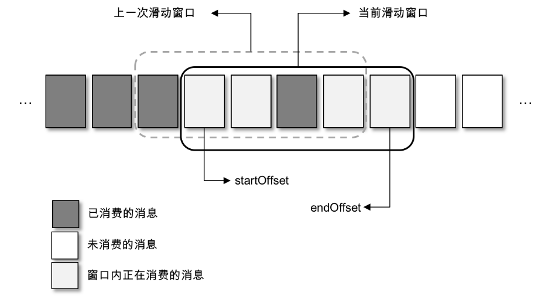

# Kafka消息丢失与重复消费


## kafka的结构如下


`Kafka`作为一个消息中间件，在某些情况下可能会丢失消息，如果在一些重要的业务场景中，消息的丢失可能会带来重大的问题，因此我们简单分析下丢消息的场景以及如何避免：


## 生产者丢消息

对于生产者来说，一般丢消息指的是生产者认为消息已经发送，但是其实由于网络不通，网络抖动等消息并没有发送成功，这样的场景便是消息的丢失。对于生产者来说，出现这样的场景一般都在于调用了同步的`send()`方法而没有去管返回的结果。

明白了原因，解决方案便很简单，那就是对于每个同步发送方法，都需要获取其发送结果，同时对结果进行判断，增加失败重试的机制。


## Broker 丢消息

`Broker`端丢消息的原因主要在于`Broker`如果突然`Down`机，而导致的丢消息。`Kafka`的`Broker`端通过消息的冗余实现了高可用。而这种高可用是依赖于主从同步实现的，因此如果当一条消息发送到`Broker`之后，`Leader`突然挂掉，由于消息还没有来得及同步到`follower`端，因此这条消息便会丢失。

解决方案便是再给生产者返回发送成功的消息之前，需要确定消息至少同步到了一个`follower`中再返回，也就是配置`acks=1`,当然，如果业务场景非常重要，则可以配置`acks=all`，但是牺牲的是性能。


## 消费者丢消息

消费者丢消息的情况比较多，且比较复杂，因此这里先简单介绍下消费者的消费方式。

默认情况下，消费消息的步骤如下：

- 消费者主动调用`poll()`方法拉取消息
- 消费者拉取消息后，主动上报目前的消费进度到`Broker`端
- `Broker`端收到消费进度后，将该**分区**的消费进度持久化


一般来说，消费者所调用的`poll()`方法默认情况下是自动提交，通过参数`enable.auto.commit`配置，并且并不是每`poll()`一次就提交一次，而是每个时间段统一提交，通过参数`auto.commit.interval.ms`控制。

> 这里带来一个问题，如果消息不是每次`poll()`都提交，那么第一次`poll()`和第二次`poll()`不会拉到相同的数据么？因为`offset`并没有提交。
>
> 但是实际并不会这样，因为提交`offset`一是为了再均衡后将消费位移共享给其他客户端，二是为了消费者重启后，能获取上一次的消费进度。
>
> 而平时，消费者都会在内存中保留了每次`poll()`后的位移，因此每次调用`poll()`返回后，都会更新此位移。


**自动提交带来的问题： **

自动提交虽然方便，但是由于消费者客户端并不知道客户端的业务逻辑是否真正处理完成，因而可能会出现以下情况：

`poll()`拉取到100条消息，客户端同时进行逻辑处理，然后5s后客户端才处理完50条消息，此时由于到达了应该提交的时间，因此消费者客户端上报目前消费`offset`为100，上报完成后，正好客户端崩溃，当客户端重启后，从`Broker`获取到的同步位移却是100，此时便出现了消息的丢失。

自动提交主要的矛盾是并不知道消息是否真正的在业务逻辑上消费完成便提交了进度，从而导致了消息的丢失。解决的办法比较简单，那就是修改为手动提交。

**手动提交带来的问题：**

想要手动提交数据，需要先将参数`enable.auto.commit`设置为`false`，然后使用如下方式手动提交：

```
while (isRunning.get()) {
    ConsumerRecords<String, String> records = consumer.poll(1000);
    for (ConsumerRecord<String, String> record : records) {
        //do some logical processing.
    }
    consumer.commitSync();
}
```

关于手动提交，`Kafka`提供了两种方式，同步提交和异步提交，需要注意的是提交位移也有可能会失败。如果失败了则需要进行重试，但是重试需要需要**位移覆盖**的问题，解决位移覆盖的问题的方法便是使用全局递增位移记录，当需要重试的时候对比当前重试的位移和已提交的位移的大小，如果比已提交的位移小，则不用再进行提交。

`Kafka`消费者客户端提供了几种重载的位移提交方法：

```
commitSync();   //无参数手动提交，默认提交当前最大的消费进度
commitSync(final Map<TopicPartition, OffsetAndMetadata> offsets)     //指定分区，指定位移提交
commitAsync();   //无参异步提交，同commitSync
commitAsync(OffsetCommitCallback callback); //通过回调告知返回结果的异步提交
commitAsync(final Map<TopicPartition, OffsetAndMetadata> offsets,
            OffsetCommitCallback callback);       //通过回调告知返回结果的指定分区，指定位移提交  
```

> 注意，对于手动提交，需要提交的`offset`不是最后一次获取的消息位移，而是下一次消费需要拉取的位置，也就是`lastConsumedOffset +1`
>
> 在`Kafka`中，对于位移的概念基本都是xxx+1，比如`HW`,`LEO`等

手动提交虽然解决了消息丢失的问题，但是会带来重复消费的问题，因为消息位移依然是批量手动提交的，因此如果有些消息实际上已经经过业务逻辑处理，但是由于位移还没有提交，此时如果消费者客户端崩溃，则会使得之前已经处理的消息会再次被处理。

**手动提交带来的问题2：**

前面说了，可以通过手动提交位移，但是如果这个客户端拉取的消息被多线程消费，那么多线程的手动提交依然会有问题。

典型的模型如下：


`Consumer`会作为一个生产者不断的拉取消息，然后线程池中的线程不断地消费消息。

此时就会有一个问题便是如果线程A消费的是1-10的消息，而线程B消费的是10-20消息，那么如果线程B比线程A先消费完，此时线程B应该怎么提交？

此时便可以通过一个滑动窗口的模型来解决这个问题：




主要思想便是将乱序改为有序。但是这样会造成其他线程的一定的等待时间。

**再均衡带来的消息重复消费**

`Kafka`提供了消费者组的概念，然而对于消费者组来说，消费者客户端的数量是会动态变化的，而每个消费者则是对应着每个分区，同时在再均衡过程中，整个消费者组会变得不可用。

在再均衡发生的时候，如果某个分区拉取了并处理了消息，但是还没有来得及提交，此时消费者客户端会丢失这些状态，并变得不可用，当再均衡完成后，又会重新拉取消息进行消费，也就发生了消息重复消费的情况。

`Kafka`专门提供了再均衡监听器接口(`ConsumerRebalanceListener`)，用来解决这个问题。再均衡监听器主要在调用`subscribe()`方法的时候设置。其主要包含两个方法：

```
onPartitionsRevoked(Collection<TopicPartition> partitions);  //在再均衡开始之前和消费者停止读取消息之后被调用，可以通过这个回调来处理消费位移的提交,partitions 表示再均衡之前分配到的分区

opPartitionsAssigend(Collection<TopicPartition> partitions): //在重新分配分区之后和消费者开始读取消费之前被调用,partitions 表示再均衡之后分配到的分区
```


## 问题分析


### 重复消费

消息重复主要发生在三个阶段：

1、生产者阶段

2、broker阶段

3、消费者阶段


导致kafka的重复消费问题原因在于，已经消费了数据，但是offset没来得及提交（比如Kafka没有或者不知道该数据已经被消费）。
总结以下场景导致Kakfa重复消费：

- 原因1：强行kill线程，导致消费后的数据，offset没有提交（消费系统宕机、重启等）。

- 原因2：设置offset为自动提交，关闭kafka时，如果在close之前，调用 consumer.unsubscribe() 则有可能部分offset没提交，下次重启会重复消费。

  例如：

  ```php
  try {    consumer.unsubscribe();} catch (Exception e) {}
  
  
  
  try {    consumer.close();} catch (Exception e) {}
  ```

  上面代码会导致部分offset没提交，下次启动时会重复消费。

  解决方法：设置offset自动提交为false

  整合了Spring配置的修改如下配置
  spring配置：

  ```sql
  spring.kafka.consumer.enable-auto-commit=falsespring.kafka.consumer.auto-offset-reset=latest
  ```

  整合了API方式的修改enable.auto.commit为false
  API配置：

  ```javascript
  Properties props = new Properties();props.put("bootstrap.servers", "localhost:9092");props.put("group.id", "test");props.put("enable.auto.commit", "false");
  ```

  一旦设置了 enable.auto.commit 为 true，Kafka 会保证在开始调用 poll 方法时，提交上次 poll 返回的所有消息。从顺序上来说，poll 方法的逻辑是先提交上一批消息的位移，再处理下一批消息，因此它能保证不出现消费丢失的情况。

- 原因3:（重复消费最常见的原因）：消费后的数据，当offset还没有提交时，partition就断开连接。比如，通常会遇到消费的数据，处理很耗时，导致超过了Kafka的session timeout时间（0.10.x版本默认是30秒），那么就会re-blance重平衡，此时有一定几率offset没提交，会导致重平衡后重复消费。

- 原因4：当消费者重新分配partition的时候，可能出现从头开始消费的情况，导致重发问题。

- 原因5：当消费者消费的速度很慢的时候，可能在一个session周期内还未完成，导致心跳机制检测报告出问题。

- 原因6：并发很大，可能在规定的时间（session.time.out默认30s）内没有消费完，就会可能导致reblance重平衡，导致一部分offset自动提交失败，然后重平衡后重复消费。

解决方案：

1、消息使用唯一的id标识

2、生产者ack=all代表至少成功发送一次

3、消费者offset手动提交，业务逻辑成功处理后，提交offset

4、落表（主键或唯一索引的方式，避免重复数据）

5、业务逻辑处理（选择唯一主键存储到redis或mongdb中，先查询是否存在，若存在则不处理，若不存在，先插入redis或mongdb中，在进行业务逻辑处理）


### 消息丢失

常见的Kafka环节丢失数据的原因有：

1、producer 端发送消息给kafka server 端，中间网络出现问题，消息无法送达；

2、如果auto.commit.enable=true，当consumer fetch了一些数据但还没有完全处理掉的时候，刚好到commit interval出发了提交offset操作，接着consumer crash掉了。这时已经fetch的数据还没有处理完成但已经被commit掉，因此没有机会再次被处理，数据丢失。

3、网络负载很高或者磁盘很忙写入失败的情况下，没有自动重试重发消息。没有做限速处理，超出了网络带宽限速。kafka一定要配置上消息重试的机制，并且重试的时间间隔一定要长一些，默认1秒钟并不符合生产环境（网络中断时间有可能超过1秒）。

4、如果磁盘坏了，会丢失已经落盘的数据。


5、单批数据的长度超过限制会丢失数据，报kafka.common.MessageSizeTooLargeException异常解决：

Consumer side:fetch.message.max.bytes- this will determine the largest size of a message that can be fetched by the consumer.

Broker side:replica.fetch.max.bytes- this will allow for the replicas in the brokers to send messages within the cluster and make sure the messages are replicated correctly. If this is too small, then the message will never be replicated, and therefore, the consumer will never see the message because the message will never be committed (fully replicated).

Broker side:message.max.bytes- this is the largest size of the message that can be received by the broker from a producer.

Broker side (per topic):max.message.bytes- this is the largest size of the message the broker will allow to be appended to the topic. This size is validated pre-compression. (Defaults to broker'smessage.max.bytes.)

6、partition leader在未完成副本数follows的备份时就宕机的情况，即使选举出了新的leader但是已经push的数据因为未备份就丢失了。

Kafka是多副本的，当你配置了同步复制之后。多个副本的数据都在PageCache里面，出现多个副本同时挂掉的概率比1个副本挂掉的概率就很小了。（官方推荐是通过副本来保证数据的完整性的）

7、Kafka的数据一开始就是存储在PageCache上的，定期flush到磁盘上的，也就是说，不是每个消息都被存储在磁盘了，如果出现断电或者机器故障等，PageCache上的数据就丢失了。

可以通过log.flush.interval.messages和log.flush.interval.ms来配置flush间隔，interval大丢的数据多些，小会影响性能但在0.8版本，可以通过replica机制保证数据不丢，代价就是需要更多资源，尤其是磁盘资源，Kafka当前支持GZip和Snappy压缩，来缓解这个问题是否使用replica取决于在可靠性和资源代价之间的balance。

同时Kafka也提供了相关的配置参数，来让你在性能与可靠性之间权衡（一般默认）：

当达到下面的消息数量时，会将数据flush到日志文件中。默认10000

```
log.flush.interval.messages=10000
```

当达到下面的时间(ms)时，执行一次强制的flush操作。interval.ms和interval.messages无论哪个达到，都会flush。默认3000ms

```
log.flush.interval.ms=1000
```

检查是否需要将日志flush的时间间隔

```
log.flush.scheduler.interval.ms = 3000
```

**消息丢失解决方案：**

**Producer端**

1. producer发送消息一定要使用带回调函数的方法，并对发送失败的情况进行处理
2. acks =all 所有的folloer都相应了才认为消息提交成功，即“committed”
3. retried = Max 无限重试，直到你意识到出现了问题
4. max.in.flight.requests.per.connection = 1限制客户端在单个连接上能够发送的未响应请求的个数，设置此值是1 表示kafka broker在响应请求之前client不能再向同一个broker发送请求，注意:设置此参数是为了避免消息乱序
5. unclean.leader.election.enable = false 关闭unclean leader选举，即不允许非ISR中的副本被选举为leader，以避免数据丢失
6. replication.factor>=3 这个完全是个人建议，参考了hadoop及业界通用的三备份原则
7. min.insync.replicas > 1消息至少要被写入到这么多副本才算成功，也是提升数据持久性的一个参数，与acks配合使用保证replication.factor>min.insync.replicas 如果两者相等，当一个副本挂掉了分区也就没法正常工作了，通常设置replication.factor = min.insync,replicas + 1即可。


**Consumer端**

1. enable.auto.commit = false 关闭自动提交位移
2. 在消息被完整处理之后再手动提交位移


