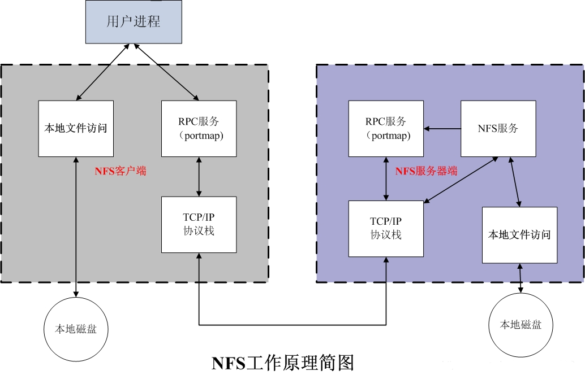
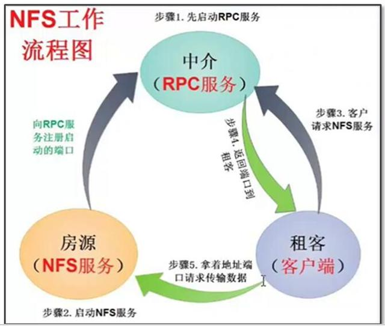
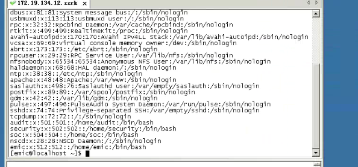

---
tags:
---
[TOC]


# NFS共享存储

# 1 介绍

## 1.1 概念

**网络文件系统**，英文Network File System(NFS)，是由SUN公司研制的UNIX表示层协议(pressentation layer protocol)，能使使用者访问网络上别处的文件就像在使用自己的计算机一样。

NFS在文件传送或信息传送过程中**依赖于RPC协议**。RPC，远程过程调用 (Remote Procedure Call) 是能使客户端执行其他系统中程序的一种机制。NFS本身是没有提供信息传输的协议和功能的。

NFS应用场景，常用于**文件共享**，**多台服务器共享同样的数据**，可扩展性比较差，本身高可用方案不完善，取而代之的数据量比较大的可以采用MFS、TFS、HDFS等等分布式文件系统。

NFS一般用来存储共享视频，图片等静态数据。


## 1.2 NFS的文件传输

NFS这个服务器的端口开在2049，但由于文件系统非常复杂。因此NFS还有其他的程序去启动额外的端口，这些额外的用来传输数据的端口是随机选择的，是小于1024的端口；既然是随机的那么客户端又是如何知道NFS服务器端到底使用的是哪个端口呢？这时就需要通过远程过程调用（Remote Procedure Call,RPC）协议来实现了.RPC服务（portmap 或rpcbind服务）


## 1.3 什么是RPC服务？

RPC（Remote Procedure Call）即远程过程调用。RPC 最主要的功能就是在指定每个 NFS 功能所对应的 port number ，并且回报给客户端，让客户端可以连结到正确的port上去。


# 2 NFS工作流程和原理

图解工作原理：



1）首先服务器端启动RPC服务，并开启111端口

2）服务器端启动NFS服务，并向RPC注册端口信息

3）客户端启动RPC（portmap服务），向服务端的RPC(portmap)服务请求服务端的NFS端口

4）服务端的RPC(portmap)服务反馈NFS端口信息给客户端。

5）客户端通过获取的NFS端口来建立和服务端的NFS连接并进行数据的传输。


图解工作流程：




## 2.1 RPC于NFS如何通讯？

由于NFS启用的功能相当多，所以对应的端口不固定，需要RPC来统一管理NFS端口，PRC最主要的功能就是指定每个NFS功能所对应的port number,并且通知客户端，让客户端可以连接到正常端口上去。

## 2.2 RPC又是如何知道每个NFS功能的端口？

首先当NFS启动后，就会随机的使用一些端口，然后NFS就会向RPC去注册这些端口，RPC就会记录下这些端口，并且RPC会开启111端口，等待客户端RPC的请求，如果客户端有请求，那么服务器端的RPC就会将之前记录的NFS端口信息告知客户端。如此客户端就会获取NFS服务器端的端口信息，就会以实际端口进行数据的传输了。

提示：在启动NFS SERVER之前，首先要启动RPC服务（即portmap服务，下同）否则NFS SERVER就无法向RPC服务区注册，另外，如果RPC服务重新启动，原来已经注册好的NFS端口数据就会全部丢失。因此此时RPC服务管理的NFS程序也要重新启动以重新向RPC注册。

**特别注意：**一般修改NFS主配置文件后，是不需要重启NFS的，直接在命令执行`/etc/init.d/nfs  reload`或`exportfs –rv`即可使修改的/etc/exports生效。

## 2.3 什么是portmap？

**功能：**主要是把RPC程序号转化为Internet的端口号。

**特点：**只在第一次建立连接时候帮助网络应用程序找到正确的port，当双方正确连接时，端口就和应用绑定，portmap就无用。相当于媒婆、中介。


# 3 NFS的优缺点

## 3.1优点

a.节省本地存储空间将常用的数据存放在一台服务器可以通过网络访问

b.简单容易上手

c.方便部署非常快速，维护十分简单

## 3.2缺点

a.局限性容易发生单点故障，及server机宕机了所有客户端都不能访问

b.在高并发下NFS效率/性能有限

c.客户端没用用户认证机制，且数据是通过明文传送，安全性一般（一般建议在局域网内使用）

d.NFS的数据是明文的，对数据完整性不做验证

e.多台机器挂载NFS服务器时，连接管理维护麻烦


# 4 应用场景

在企业集群架构的工作场景中，NFS作为所有前端web服务的共享存储，存储的内容一般包括网站用户上传的图片、附件、头像等。

注意，网站的程序代码就不要放在NFS共享里了，因为网站程序是开发运维人员统一发布，不存在发布延迟问题，直接批量发布到web节点提供访问比共享到NFS里访问效率会更高些。NFS是当前互联网系统架构中常用的数据存储服务之一，中小型网站公示应用频率居高，大公司或门户除了使用NFS外，还可能会使用更为复杂的分布式文件系统。


# 5 部署NFS服务

## 5.1 环境介绍

| 主机名 | 角色   | ip        | 系统    | 安装软件           | 备注                                  |
| ------ | ------ | --------- | ------- | ------------------ | ------------------------------------- |
| c701   | 服务端 | 10.0.0.41 | CentOS7 | nfs-utils、rpcbind |                                       |
| c702   | 客户端 | 10.0.0.42 | CentOS7 | nfs-utils、rpcbind | 客户端可以不启动nfs-utils，但要安装。 |


## 5.2 NFS服务端操作

**（1）安装软件**

```shell
yum -y install nfs-utils rpcbind
```

**（2）手动创建配置文件**

默认没有配置文件。

```shell
vim /etc/exports
/data 10.0.0.0/24(rw,sync,no_root_squash,no_all_squash)
```

- ro 该主机对该共享目录有只读权限
- rw 该主机对该共享目录有读写权限
- root_squash 客户机用root用户访问该共享文件夹时，将root用户映射成匿名用户
- no_root_squash 客户机用root访问该共享文件夹时，映射root用户，不安全，不建议使用
- all_squash 客户机上的任何用户访问该共享目录时都映射成匿名用户，同时他们的uid和gid会变成nobody或者nfsnobody
- anonuid 将客户机上的用户映射成指定的本地用户ID的用户，默认是65534
- anongid 将客户机上的用户映射成属于指定的本地用户组ID，默认是65534
- sync 数据同步写入到内存与硬盘中，保证不丢失数据
- async 优先将数据保存到内存，然后再写入硬盘；这样效率更高，但可能会丢失数据
- insecure 允许从这台机器过来的非授权访问
- /data: 共享目录位置。
- 10.0.0.0/24: 客户端 IP 范围，* 代表所有，即没有限制。

启动nfs后又修改了/etc/exports，不用重启该服务，使用exports命令即可：

```bash
/usr/sbin/exportfs -arv
```

**（3）创建共享目录**

```bash
mkdir -p /data
```

**（4）启动nfs-server服务**

```shell
systemctl enable rpcbind
systemctl enable nfs-server
systemctl restart rpcbind
systemctl restart nfs-server
```

**（5）检查**

```bash
showmount -e
```

showmount命令的用法；

| 参数 | 作用                                      |
| ---- | ----------------------------------------- |
| -e   | 显示NFS服务器的共享列表                   |
| -a   | 显示本机挂载的文件资源的情况NFS资源的情况 |
| -v   | 显示版本号                                |


## 5.3 NFS客户端操作

**（1）安装客户端软件**

```shell
yum -y install nfs-utils rpcbind

systemctl enable rpcbind
systemctl restart rpcbind

#客户端不安装nfs-utils则不能挂载nfs共享目录；但可以不开启
```

**（2）创建挂载点并挂载**

```shell
mkdir -p /data
mount 10.0.0.41:/data /data

#查看挂载情况
[root@ c702 ~]# df -h
Filesystem           Size  Used Avail Use% Mounted on
/dev/mapper/cl-root   17G  2.7G   15G  16% /
devtmpfs             478M     0  478M   0% /dev
tmpfs                489M     0  489M   0% /dev/shm
tmpfs                489M  6.7M  482M   2% /run
tmpfs                489M     0  489M   0% /sys/fs/cgroup
/dev/sda1           1014M  121M  894M  12% /boot
tmpfs                 98M     0   98M   0% /run/user/0
10.0.0.41:/data       17G  1.9G   16G  11% /data
```

**（3）添加到开机自动挂载**

```shell
echo '/bin/mount 10.0.0.41:/data /data'>>/etc/rc.local
chmod +x /etc/rc.local
```


**（4）NFS常用挂载参数介绍**

| 参数                | 说明                                                         | 建议                                                         |
| ------------------- | ------------------------------------------------------------ | ------------------------------------------------------------ |
| soft/hard           | 软挂载方式挂载系统，若NFS请求超时，则客户端向调用程序返回错误；如果使用硬连接方式则客户端一直重新请求直至成功。默认为hard | 对于关键数据业务，不希望业务由于网络延迟或服务器服务重启或短暂的过载等情况而中断，建议挂载时使用hard参数；对于非关键数据业务，希望客户端程序能尽快响应，可以使用soft参数。 |
| timeo/retrans       | 客户端重传请求前等待时间。对于基于TCP的NFS服务，默认等待重传时间为60s。使用TCP协议时，NFS Client不执行任何超时backoff。对于UDP协议，client使用一个合适的算法，为常用的请求类型estimate合适的超时时间。但对不常用的请求类型使用timeo设置。如果timeo没有设置，不常用的请求类型1.1秒以后重试。在每次重发后，NFS Client会将timeout时间加倍，直到最大的60秒。retrans客户端返回错误前的重传次数。默认为重传3次。retrans与soft参数一起使用时才有效。 | timeo、retrans这两个参数选择主要取决于网络性能。对于网络吞吐量小，延时高，抖动高，丢包率大的情况，建议将timeo，retrans两个参数值设置大一些。对于网络吞吐量大，延时低，抖动低，丢包率小的情况，建议将timeo，retrans两个参数值设置小一些。具体设置值因网络状况而定。 |
| resize              | 每个READ命令字向服务器读取文件的最大字节数。实际数据小于或等于此值。resize必须是1024倍数的正整数，小于1024时自动设为4096，大于1048576时自动设为1048576。默认时，服务器和客户端进行协商后设置。 | 通常使用默认值，由客户端和服务器协商设置。对于拥塞的低速网络，可以将该值调小，向服务器发送较短的请求包来提高NFS性能。对于高速网络，可以将该值增大，减少向服务器发送的请求包，获得性能的提升。 |
| wsize               | 每个WRITE命令字向服务器写入文件的最大字节数。实际数据小于或等于此值。resize必须是1024倍数的正整数，小于1024时自动设为4096，大于1048576时自动设为1048576。默认时，服务器和客户端进行协商后设置。 | 通常使用默认值，由客户端和服务器协商设置。对于拥塞的低速网络，可以将该值调小，向服务器发送较小的请求包来提高NFS性能。对于高速网络，可以将该值增大，减少向服务器发送的请求包，获得性能的提升。 |
| async/sync          | 同步、异步挂载，客户端默认异步（async）。对于异步挂载，客户端下发的写数据会先缓存在内存中，达到一定大小或者其他条件（与客户端设置，状态有关），再一起发往服务端。而同步挂载，每次下发的写数据马上发到服务端。 | 建议用默认的异步挂载，可以提高业务性能。对于客户端应用层来说，完全感知不到数据是否发往服务端，只能感知数据已经写成功。同步挂载要求每个请求立即发到服务端，增加了请求连接、发送次数，对于小io场景性能差异很明显（io越小，差异越大，一般都能达到几倍甚至更大的差异）。对于异步挂载，可能在查看io性能显现为性能波动。在客户端写入缓存期间iops可能就低，因为数据还未发到服务端。但是性能是完全正常的，应该说比同步更好。如果是要要追求界面上的平稳，那就建议改为同步挂载。（补充：追求一次小io的数据全部刷到服务端稳定存储时间小，不仅要求客户端同步挂载，还需要服务端共享也是同步导出，否则需要加上手动commit刷盘）。 |
| ac/noac             | 设置是否缓存文件属性。为了提高性能，NFS客户端缓存文件属性（默认ac），然后每隔一段时间去检查文件属性后更新。在缓存有效期内，客户端不检测服务器上文件属性是否改变。默认为ac。 | 当服务器上共享文件的属性频繁地被多个客户端改变时，建议使用noac选项，或者使用ac并配合使用较小的acregmin/acregmax/acdirmin/acdirmax设置，这样就能获得较好的属性一致性。当服务器上共享文件的属性不会被频繁改变时，例如文件共享为只读，或者网络性能较好，建议使用默认的ac选项，然后根据实际的网络状况来调整acregmin/acregmax/acdirmin/acdirmax设置。 |
| Actimeo             | 将acregmin/acregmax/acdirmin/acdirmax四个参数设置为相同时间，单位为秒。 |                                                              |
| cto/nocto           | 设置是否使用“关闭打开”缓存一致的特性。通常客户端打开文件时检查是否存在以及是否有权限，当关闭文件时刷新更改。当设置为nocto时，客户端使用非标准的试探来检查服务器上文件是否改变，对于只读和文件更改较少时情形有助于提高性能。 |                                                              |
| tcp/udp             | proto=tcp和proto=udp选项                                     | 在不稳定的复杂网络推荐使用tcp，稳定的网络下可以使用udp       |
| rdirplus/nordirplus | 设置是否使用NFS3的READDIRPLUS请求。默认为READDIRPLUS         |                                                              |


## 5.5 补充NFS挂载方式soft和hard

NFS挂载参数中包含Hard和Soft选项，这两个选项主要用于NFS客户端处理NFS服务端的故障。

Hard Mount:
当使用Hard参数挂载NFS共享时，如果发生网络故障或者NFS服务故障，将会导致NFS客户端的网络连接断开，NFS客户端的文件IO将会Hang住，直到后端的网络恢复或者NFS服务恢复，NFS客户端的文件IO才会继续执行。从前面的分析可以看出，Hard模式类似于SAN存储的IO处理方式。

优势：

1. 在NFS网络连接断开的情况下，NFS客户端会一直等到NFS服务端重新连接，因此不会丢失数据。
2. 确保数据完整性和消息一致性。

劣势：

1. 如果NFS的网络连接断开时间过长，上层的业务就会出现IO长时间无法处理的情况，这种情况下可能导致业务性能下降或者业务中断。


Soft Mount:
Soft挂载模式通常都是应用在NFS和CIFS这样的网络文件系统中，当NFS客户端使用Soft参数挂载共享时，如果发生网络故障或者NFS服务故障，NFS客户端将会对IO进行重试，当出现以下条件时重试终止，返回业务程序IO错误:

1. NFS客户端与服务端重新建立连接。
2. NFS客户端IO重试次数超出阀值。
3. NFS客户端IO重试超时。

优势：

1. 业务程序能够快速感知错误，不用等待NFS服务恢复。
2. 如果NFS服务不可用，内核可以根据配置的超时时间中断NFS客户端的文件IO。

劣势：

1. 如果NFS客户端有数据缓存，当文件IO重试超时，那么业务程序无法得知当前写入数据的具体信息。
2. 数据损坏或者数据丢失。

从以上分析可以看出，建议默认情况下都使用hard模式，如果业务程序对于快速failover要求很高，并且自身能够保证一致性的情况下，可以使用soft模式。

```bash
1、下面列出mount关于nfs相关的参数
-a:把/etc/fstab中列出的路径全部挂载。
-t:需要mount的类型，如nfs等。
-r:将mount的路径定为read only。
-v mount:过程的每一个操作都有message传回到屏幕上。
rsize-n:在NFS服务器读取文件时NFS使用的字节数，t认值是4096个字节。
wsize=n:向NFS服务器写文件时NFs使用的字节数，黑认值是4096个字节。
timeo=n:从超时后到第1次重新传送占用的1/7秒的数目，默认值是7/7秒。
retry=n:在放弃后台mount操作之前可以尝试的次数，默认值是7 e08次。
soft:使用软挂载的方式挂载系统，若client的请求得不到回应，则重新请求并传回错误信息。
hard:使用硬挂载的方式挂载系统，该值是默认值，重复请求直到NFS服务器回应。
intr:允许NFs中断文件操作和向调用它的程序返回值，默认不允许文件操作被中断。
fg:一直在提示符下执行重复挂载。
bg:如果第1次挂载文件系统失败，继续在后台尝试执行挂载，默认值是失败后不在后台处理。
tcp:对文件系统的挂载使用TCP，而不是t认的UDP。

2、soft和hard模式
当nfs的服务器端出现异常的时候，linux服务器的底层有重发机制，nfs客户端一直去向服务器端请求，判断服务器是否正常，一直阻塞。19.当客户端挂载的时候采用hard模式，服务器端出现异常，则客户端会一直发请求，直到服务器正常。
当客户端挂载的时候采用soft模式，我们可以配置timeo和retry参数，配置超时时间，服务器端出现异常，客户端也会向服务器端发请求，
当超过我们配置的时间,则会返回错误,不会一直阻基。

hard模式挂载:
mount -t nfs -o rw 192.168.1.2: / home/nfs /mnt local_path

soft模式挂载：
mount -t nfs -o rw, soft, timeo=30,retry=3 192.168.1.2:/home/nfs /mnt local_path
# timeo的单位是e.1秒，配置为30就是隔3秒客户端向服务器端请求。
```


# 6 测试共享目录

```shell
#分别两台机器的data目录下创建不同的目录然后查看共享情况

[root@ c701 data]# mkdir www
[root@ c702 data]# mkdir aaa


[root@ c701 data]# ll
total 0
drwxr-xr-x 2 root root 6 2019-11-04 17:31 aaa
drwxr-xr-x 2 root root 6 2019-11-04 17:30 www

[root@ c702 data]# ll
total 0
drwxr-xr-x 2 root root 6 2019-11-04 17:31 aaa
drwxr-xr-x 2 root root 6 2019-11-04 17:30 www
```


# 常见问题

## 1、NFS共享目录权限问题

**问题：**普通用户使用共享目录时的权限问题，之前做nfs共享目录都是给root用户使用，并且设置了no_root_squash，一直没思考过权限问题。

**现象：**xxx系统通过emic普通用户使用nfs共享目录时发现不能在目录里读取、创建、删除，提示`Permission denied`。

**原因：**因为NFS服务是没有用户验证功能的，所以服务器会将客户端的身份进行映射，将其映射为匿名用户nfsnobody。也就是说，当你用root用户去访问共享目录时，其实你已经变成了服务器端的匿名用户nfsnobodoy了，这样你就没有权限访问nfsnobody的文件了。但是，通过建立UID和文件所有者UID相同的用户去访问。也就是伪造文件所有者UID去欺骗nfs服务器。


**解决办法两种：**

方法一：在服务端查看挂载文件夹的主和组

再查看uid和gid，发现nfs服务端启动用户emic的uid和gid为512。



然后在客户端机器上创建相同uid和gid的用户

```bash
# 创建用户并指定uid和gid
# 添加指定gid的组
groupadd -g 512 emic
# 添加指定uid的用户，并加入到指定组、指定家目录,注意/data/sftp/存在才会自动创建emic家目录，否则会失败
useradd emic -u 512 -g 512 -d /data/sftp/emic
或者
# 修改已经创建的用户uid和gid，注意用户家目录uid和gid是否变更，没有的话需要手动更改
usermod -u 512 emic
groupmod -g 512 emic

# 查看用户uid和gid
cat /etc/passwd
```


方法二：在服务端查看挂载文件夹的主和组

服务端查看uid和gid为512后，修改配置文件

```bash
vim /etc/exports

/home/emic/batch/cardopen/  *(rw,sync,all_squash,anongid=512,anonuid=512)
```

然后执行命令更新配置文件

```bash
exportfs -rv
```

**注意：映射id的方法只有在all_squash配置下生效。**

总结：两种方法都可以解决普通用户使用nfs共享目录带来的权限问题。

方法1 相对麻烦，但是更安全，可以实现指定某个普通用户访问共享目录。

方法2 操作最简单，但是有安全隐患，因为其他的普通用户如果可以进/home/emic/batch/cardopen/文件夹也可以删除添加文件，但是我这里共享目录在emic的家目录下其他用户无法进来，所以没有这种隐患。

 

**原理简述**

方法1

nfs会把客户端访问共享目录的用户做一个匹配映射，匹配的原则就是根据uid和gid，假如访问用户uid是1000，而恰好服务器端也有uid1000的用户，则会被映射成服务器端uid1000的用户权限，上文中我服务器端共享目录的权限是775 主用户是emic用户uid和gid是512，所以我把所有客户端服务器需要访问共享目录的用户gid改成512后，再访问共享目录，会匹配到服务器端gid为512的用户组，既emic组，而此组对于共享目录有读写执行权限。

方法2

NFS的用户映射方式还提供了另外的选项：all_squash，即所有的客户端请求到了服务端都会被当作匿名用户，如果直接修改参数，显然也不能解决问题，因为共享目录的权限是740，匿名用户是没有读写权限的。幸运的是，NFS有以下两个配置参数可以使用：

```bash
anonuid=<UID>：指定匿名访问用户的本地用户UID，默认为nfsnobody（65534）；
anongid=<GID>：指定匿名访问用户的本地用户组GID，默认为nfsnobody（65534）；
```

因此最终配置如下，直接在服务器端指定所有访问进来的客户端用户UID和GID都给映射成512，既被映射为共享目录的主用户emic

```bash
vim /etc/exports
/home/emic/batch/cardopen/ *(rw,sync,all_squash,anongid=512,anonuid=512)
```


## 2、NFS固定端口开通防火墙策略

NFS启动时会随机启动多个端口并向RPC注册，为了设置安全组以及iptables规则，需要设置NFS固定端口。
 NFS服务需要开启 mountd,nfs,nlockmgr,portmapper,rquotad这5个服务，其中Portmap端口111 tcp/udp、Nfsd端口 2049 tcp/udp是固定的，另外三个服务的端口是随机分配的，所以需要给mountd,nlockmgr,rquotad设置固定的端口。

确认nfs相关服务组件及端口占用如下：

| 服务名称   | 端口名称 | 协议名称 | 备注                       |
| ---------- | -------- | -------- | -------------------------- |
| nfs        | 2049     | tcp/udp  | 端口固定                   |
| portmapper | 111      | tcp/udp  | 端口固定                   |
| mountd     | 20048    | tcp/udp  | 端口不固定，需人为修改固定 |
| nlockmgr   | 42315    | tcp/udp  | 端口不固定，需人为修改固定 |

注：status对应rpc-statd服务，服务端口暂未找到可固定方法


 其中，给mountd、rquotad设置端口的方式很简单，在`/etc/sysconfig/nfs`中添加一下设置即可：

```
RQUOTAD_PORT=30001
LOCKD_TCPPORT=30002
LOCKD_UDPPORT=30002
MOUNTD_PORT=30003
STATD_PORT=30004
```

重启rpc、nfs的配置与服务：

```bash
systemctl restart rpcbind
systemctl restart nfs-server
```

查看端口使用情况：

```java
rpcinfo -p
```

可以看到mountd服务已经使用了配置的端口，如果nlockmgr的端口还是随机的，还需在/etc/modprobe.d/lockd.conf中添加以下设置：

```
options lockd nlm_tcpport=30002
options lockd nlm_udpport=30002
```

重新加载NFS配置和服务：

```bash
systemctl restart nfs-config
systemctl restart nfs-idmap
systemctl restart nfs-lock
systemctl restart nfs-server
```

然后重启服务器，nlockmgr的端口就是固定的端口了。

编写防火墙规则(firewalld)，开放NFS端口访问

添加规则:

```bash
firewall-cmd --permanent --add-port=2049/tcp
firewall-cmd --permanent --add-port=2049/udp
firewall-cmd --permanent --add-port=111/tcp
firewall-cmd --permanent --add-port=111/udp
firewall-cmd --permanent --add-port=30001/tcp
firewall-cmd --permanent --add-port=30001/udp
firewall-cmd --permanent --add-port=30002/tcp
firewall-cmd --permanent --add-port=30002/udp
firewall-cmd --permanent --add-port=30003/udp
firewall-cmd --permanent --add-port=30003/tcp
firewall-cmd --permanent --add-port=30004/tcp
firewall-cmd --permanent --add-port=30004/udp
firewall-cmd --reload
```

再次查看:

```bash
[root@server1 ~]# firewall-cmd --permanent --list-all
public
  target: default
  icmp-block-inversion: no
  interfaces: 
  sources: 
  services: ssh dhcpv6-client
  ports: 2049/tcp 2049/udp 111/tcp 111/udp 30001/tcp 30001/udp 30002/tcp 30002/udp 30003/udp 30003/tcp 30004/tcp 30004/udp
  protocols: 
  masquerade: no
  forward-ports: 
  source-ports: 
  icmp-blocks: 
  rich rules: 
```

  端口已成功加入。


## 3、NFS阻塞

现象：df -h 查看共享存储的时候，会卡住不动。

原因：nfs默认是hard模式挂载，使用硬挂载的方式挂载系统，该值是默认值，重复请求直到NFS服务器回应，可以改成soft模式挂载设置超时时间任务就会失败而不会阻塞了。


