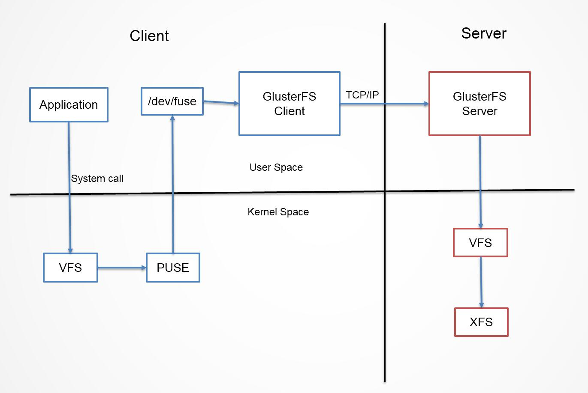
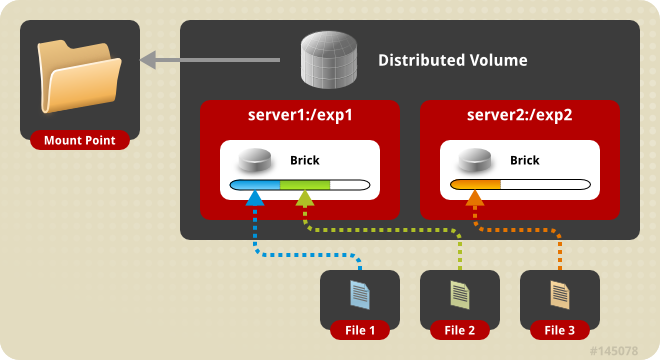
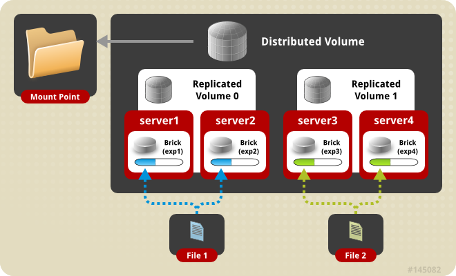
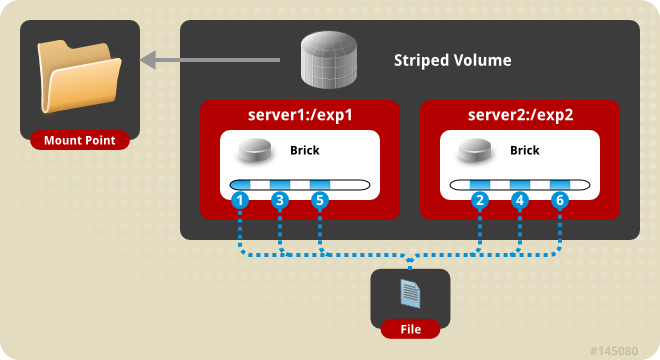
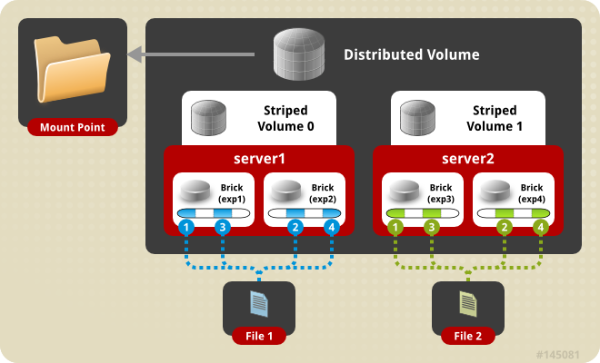

[TOC]


# GlusterFS集群实战

官方主页：

> http://www.gluster.org

官方快速安装文档：

> http://gluster.readthedocs.io/en/latest/Quick-Start-Guide/Quickstart/

官方安装指南：

> http://gluster.readthedocs.io/en/latest/Install-Guide/Overview/

管理员手册：

> http://gluster.readthedocs.io/en/latest/Administrator%20Guide/

YUM源地址：

> http://download.gluster.org/pub/gluster/

架构：

> http://gluster.readthedocs.io/en/latest/Quick-Start-Guide/Architecture/#architecture


# 1 GlusterFS介绍

GlusterFS是Scale-Out存储解决方案Gluster的核心，它是一个开源的分布式文件系统，具有强大的横向扩展能力，通过扩展能够支持数PB存储容量和处理数千客户端。GlusterFS借助TCP/IP或InfiniBandRDMA网络将物理分布的存储资源聚集在一起，使用单一全局命名空间来管理数据。Glusterfs可以解决NFS，GFS，HDFS，MooseFS之类的单点故障。


## 1.1 GlusterFS概述

 GlusterFS系统是一个可扩展的网络文件系统，相比其他分布式文件系统，GlusterFS具有高扩展性、高可用性、高性能、可横向扩展等特点，并且其没有元数据服务器的设计，让整个服务没有单点故障的隐患。

**术语：**

- **Brick:** GFS中的存储单元，通过是一个受信存储池中的服务器的一个导出目录。可以通过主机名和目录名来标识，如'SERVER:EXPORT'
- **Client:** 挂载了GFS卷的设备
- **Extended Attributes:** xattr是一个文件系统的特性，其支持用户或程序关联文件/目录和元数据。
- **FUSE:** Filesystem Userspace是一个可加载的内核模块，其支持非特权用户创建自己的文件系统而不需要修改内核代码。通过在用户空间运行文件系统的代码通过FUSE代码与内核进行桥接。
- **Geo-Replication**
- **GFID:** GFS卷中的每个文件或目录都有一个唯一的128位的数据相关联，其用于模拟inode。
- **Namespace:** 每个Gluster卷都导出单个ns作为POSIX的挂载点。
- **Node: ** 一个拥有若干brick的设备。
- **RDMA:** 远程直接内存访问，支持不通过双方的OS进行直接内存访问。
- **RRDNS:** round robin DNS是一种通过DNS轮转返回不同的设备以进行负载均衡的方法。
- **Self-heal:** 用于后台运行检测复本卷中文件和目录的不一致性并解决这些不一致。
- **Split-brain:** 脑裂。
- **Translator:**
- **Volfile:** glusterfs进程的配置文件。


**1、无元数据设计**

  元数据是用来描述一个文件或给定区块在分布式文件系统中所在的位置，简而言之就是某个文件或某个区块存储的位置。传统分布式文件系统大都会设置元数据服务器或者功能相近的管理服务器，主要作用就是用来管理文件与数据区块之间的存储位置关系。相较其他分布式文件系统而言，GlusterFS并没有集中或者分布式的元数据的概念，取而代之的是弹性哈希算法。集群中的任何服务器和客户端都可以利用哈希算法、路径及文件名进行计算，就可以对数据进行定位，并执行读写访问操作。

  这种设计带来的好处是极大的提高了扩展性，同时也提高了系统的性能和可靠性；另一显著的特点是如果给定确定的文件名，查找文件位置会非常快。但是如果要列出文件或者目录，性能会大幅下降，因为列出文件或者目录时，需要查询所在节点并对各节点中的信息进行聚合。此时有元数据服务的分布式文件系统的查询效率反而会提高许多。

**2、服务器间的部署**

  在之前的版本中服务器间的关系是对等的，也就是说每个节点服务器都掌握了集群的配置信息，这样做的好处是每个节点度拥有节点的配置信息，高度自治，所有信息都可以在本地查询。每个节点的信息更新都会向其他节点通告，保证节点间信息的一致性。但如果集群规模较大，节点众多时，信息同步的效率就会下降，节点信息的非一致性概率就会大大提高。因此GlusterFS未来的版本有向集中式管理变化的趋势。

**3、客户端访问流程**



当客户端访问GlusterFS存储时，首先程序通过访问挂载点的形式读写数据，对于用户和程序而言，集群文件系统是透明的，用户和程序根本感觉不到文件系统是本地还是在远程服务器上。读写操作将会被交给VFS(Virtual File System)来处理，VFS会将请求交给FUSE内核模块，而FUSE又会通过设备/dev/fuse将数据交给GlusterFS Client。最后经过GlusterFS Client的计算，并最终经过网络将请求或数据发送到GlusterFS Server上。


## 1.2 GlusterFS特点

**扩展性和高性能**

- GlusterFS利用双重特性来提供几TB至数PB的高扩展存储解决方案。Scale-Out架构允许通过简单地增加资源来提高存储容量和性能，磁盘、计算和I/O资源都可以独立增加，支持10GbE和InfiniBand等高速网络互联。Gluster弹性哈希（ElasticHash）解除了GlusterFS对元数据服务器的需求，消除了单点故障和性能瓶颈，真正实现了并行化数据访问。

**高可用性**

- GlusterFS可以对文件进行**自动复制**，如镜像或多次复制，从而确保数据总是可以访问，甚至是在硬件故障的情况下也能正常访问。自我修复功能能够把数据恢复到正确的状态，而且修复是以增量的方式在后台执行，几乎不会产生性能负载。GlusterFS没有设计自己的私有数据文件格式，而是采用操作系统中主流标准的磁盘文件系统（如EXT3、ZFS）来存储文件，因此数据可以使用各种标准工具进行复制和访问。

**弹性卷管理**

- 数据储存在逻辑卷中，逻辑卷可以从虚拟化的物理存储池进行独立逻辑划分而得到。存储服务器可以在线进行增加和移除，不会导致应用中断。逻辑卷可以在所有配置服务器中增长和缩减，可以在不同服务器迁移进行容量均衡，或者增加和移除系统，这些操作都可在线进行。文件系统配置更改也可以实时在线进行并应用，从而可以适应工作负载条件变化或在线性能调优。


# 2 Volume管理

数据卷的数据的传输协议支持tcp和infiniband rdma协议。

## 2.1 卷的类型

### 2.1.1 分布式卷（Distributed Volume）

又称哈希卷，近似于RAID0，文件没有分片，文件根据hash算法写入各个节点的硬盘上，优点是容量大，缺点是没冗余。



分布卷可以将某个文件随机的存储在卷内的一个brick内，通常用于扩展存储能力，不支持数据的冗余。除非底层的brick使用RAID等外部的冗余措施。

创建方式：

```bash
# gluster volume create test-volume server1:/exp1 server2:/exp2 server3:/exp3 server4:/exp4
```

### 2.1.2 复制卷（Replicated Volume）

相当于raid1，复制的份数，决定集群的大小，通常与分布式卷或者条带卷组合使用，解决前两种存储卷的冗余缺陷。缺点是磁盘利用率低。

复本卷在创建时可指定复本的数量，通常为2或者3，复本在存储时会在卷的不同brick上，因此有几个复本就必须提供至少多个brick，当其中一台服务器失效后，可以从另一台服务器读取数据，因此复制GlusterFS卷提高了数据可靠性的同时还提供了数据冗余的功能。


创建方式：

```bash
# gluster volume create test-volume replica 2 transport tcp server1:/exp1 server2:/exp2
```

**注意：**在创建复本卷时，brick数量与复本个数必须相等；否则将会报错。另外如果同一个节点提供了多个brick，也可以在同一个结点上创建复本卷，但这并不安全，因为一台设备挂掉，其上面的所有brick就无法访问了。

### 2.1.3 分布式复制卷（Distributed Replicated Volume）

分布式复制GlusterFS卷结合了分布式和复制Gluster卷的特点，看起来类似RAID10，但其实不同，RAID10其实质是条带化，但分布式复制GlusterFS卷则没有。



创建方式：

```bash
# gluster volume create test-volume replica 2 transport tcp server1:/exp1 server2:/exp2 server3:/exp3 server4:/exp4
```

**注意：**复本卷的组成依赖于指定brick的顺序，brick必须为复本数K的N倍,brick列表将以K个为一组，形成N个复本卷


### 2.1.4 条带卷（Striped Volume）

相当于raid0，文件是分片均匀写在各个节点的硬盘上的，优点是分布式读写，性能整体较好。缺点是没冗余，分片随机读写可能会导致硬盘IOPS饱和。



创建方式：

```bash
# gluster volume create test-volume stripe 2 transport tcp server1:/exp1 server2:/exp2
```

注意：stripe后的参数指明切片的分布位置个数；brick的个数必须等于分布位置的个数。


### 2.1.5 分布式条带卷（Distributed Striped Volume）

当单个文件的体型十分巨大，客户端数量更多时，条带卷已经无法满足需求，此时将分布式与条带化结合起来是一个比较好的选择。其性能与服务器数量有关。



创建方式：

```bash
# gluster volume create test-volume stripe 4 transport tcp server1:/exp1 server2:/exp2 server3:/exp3 server4:/exp4 server5:/exp5 server6:/exp6 server7:/exp7 server8:/exp8
```

**注意：**条带卷的组成依赖于指定brick的顺序；brick必须为复本数K的N倍,brick列表将以K个为一组，形成N个切片卷。


## 2.2 卷的管理

**1、启/停/删除卷**

```bash
gluster volume start mamm-volume
gluster volume stop mamm-volume
gluster volume delete mamm-volume
```

**2、扩展收缩卷**

```
gluster volume add-brick mamm-volume [strip|repli <count>] brick1...  
gluster volume remove-brick mamm-volume [repl <count>] brick1...
```

扩展或收缩卷时，也要按照卷的类型，加入或减少的brick个数必须满足相应的要求。

**3、迁移卷**

主要完成数据在卷之间的在线迁移

```
gluster volume replace-brick mamm-volume old-brick new-brick [start|pause|abort|status|commit]
```

迁移需要完成一系列的事务，假如我们准备将mamm卷中的brick3替换为brick5  

- 启动迁移过程  

```
gluster volume replace-brick mamm-volume node3:/exp3 node5:/exp5 start
```

- 暂停迁移过程  

```
gluster volume replace-brick mamm-volume node3:/exp3 node5:/exp5 pause
```

- 中止迁移过程  

```
gluster volume replace-brick mamm-volume node3:/exp3 node5:/exp5 abort
```

- 查看迁移状态  

```
gluster volume replace-brick mamm-volume node3:/exp3 node5:/exp5 status
```

- 迁移完成后提交完成  

```
gluster volume replace-brick mamm-volume node3:/exp3 node5:/exp5 commit
```

 **4、均衡卷**

当对卷进行了扩展或收缩后，需要对卷的数据进行重新均衡。

```
gluster volume rebalane mamm-volume start|stop|status
```

**5、触发副本自愈**

```
gluster volume heal mamm-volume #只修复有问题的文件
gluster volume heal mamm-volume full #修复所有文件
gluster volume heal mamm-volume info#查看自愈详情
gluster volume heal mamm-volume info healed|heal-failed|split-brain
```

**6、选项配置**

```
gluster volume set mamm-volume key value
```

**详细的可设置选项：**

> https://github.com/gluster/glusterfs/blob/master/doc/admin-guide/en-US/markdown/admin_managing_volumes.md

 

# 3 安装部署

## 3.1 环境介绍

| 主机名      | IP            | Selinux | 防火墙 |
| ----------- | ------------- | ------- | ------ |
| GlusterFS01 | 10.159.238.40 | disable | 关闭   |
| GlusterFS02 | 10.159.238.41 | disable | 关闭   |
| GlusterFS03 | 10.159.238.42 | disable | 关闭   |

三台分别添加hosts解析：

```
cat >/etc/hosts<<EOF
127.0.0.1   localhost localhost.localdomain localhost4 localhost4.localdomain4
::1         localhost localhost.localdomain localhost6 localhost6.localdomain6
10.159.238.40 GlusterFS01
10.159.238.41 GlusterFS02
10.159.238.42 GlusterFS03
EOF
```


## 3.2 部署

首先，做好GlusterFS01免密登录其他机器。

```bash
# yum安装
[root@GlusterFS01 ~]# for i in 10.159.238.{40..42};do ssh root@$i 'yum -y install centos-release-gluster';done

[root@GlusterFS01 ~]# for i in 10.159.238.{40..42};do ssh root@$i 'yum install -y glusterfs glusterfs-server glusterfs-fuse glusterfs-rdma';done

[root@GlusterFS01 ~]# for i in 10.159.238.{40..42};do ssh root@$i 'systemctl start glusterd.service && systemctl enable glusterd.service';done

[root@GlusterFS01 ~]# for i in 10.159.238.{40..42};do ssh root@$i 'systemctl status glusterd.service|grep -i running';done

# 将其他节点添加到GlusterFS01信任池
[root@GlusterFS01 ~]# gluster peer probe GlusterFS02
[root@GlusterFS01 ~]# gluster peer probe GlusterFS03

# 创建数据目录
[root@GlusterFS01 ~]# for i in 10.159.238.{40..42};do ssh root@$i 'mkdir -p /data-glusterfs';done

# 创建名为www-volume复制卷（）
[root@GlusterFS01 ~]# gluster volume create www-volume replica 3 GlusterFS01:/data-glusterfs GlusterFS02:/data-glusterfs GlusterFS03:/data-glusterfs force

# 启动复制卷
[root@GlusterFS01 ~]# gluster volume start www-volume

# 查询卷的状态
[root@GlusterFS01 ~]# gluster volume status
Status of volume: www-volume
Gluster process                             TCP Port  RDMA Port  Online  Pid
------------------------------------------------------------------------------
Brick GlusterFS01:/data-glusterfs          49152     0          Y       6866
Brick GlusterFS02:/data-glusterfs            49152     0          Y       15075
Brick GlusterFS03:/data-glusterfs            49152     0          Y       18601
Self-heal Daemon on localhost               N/A       N/A        Y       6883
Self-heal Daemon on GlusterFS03              N/A       N/A        Y       18618
Self-heal Daemon on GlusterFS02              N/A       N/A        Y       15092

Task Status of Volume www-volume
------------------------------------------------------------------------------
There are no active volume tasks

[root@GlusterFS01 ~]# gluster volume info

Volume Name: www-volume
Type: Replicate
Volume ID: 6276421b-b28e-406e-a1a4-745c90f8723c
Status: Started
Snapshot Count: 0
Number of Bricks: 1 x 3 = 3
Transport-type: tcp
Bricks:
Brick1: GlusterFS01:/data-glusterfs
Brick2: GlusterFS02:/data-glusterfs
Brick3: GlusterFS03:/data-glusterfs
Options Reconfigured:
cluster.granular-entry-heal: on
storage.fips-mode-rchecksum: on
transport.address-family: inet
nfs.disable: on
performance.client-io-threads: off

# 验证复制卷可用性
[root@GlusterFS01 mnt]# mount -t glusterfs GlusterFS01:www-volume /mnt
```

