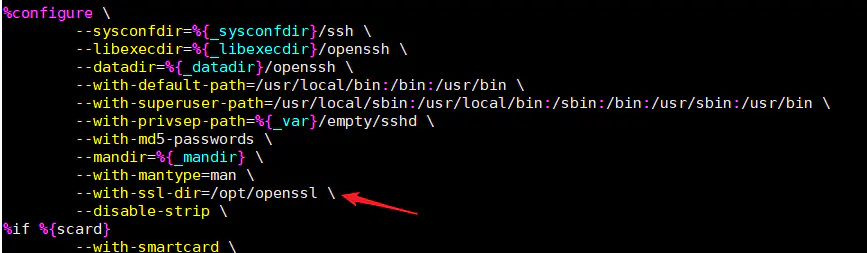

# CentOS7制作RPM包


# 1 RPMBUILD详解


## 1.1 安装介绍


安装工具

```
[root@localhost ~]# yum install rpmdevtools -y
```

执行如下rpmdev-setuptree生成rpmbuild的工作目录

```
[root@localhost ~]# rpmdev-setuptree
```

查看工作目录

```
[root@localhost ~]# tree rpmbuild/
rpmbuild/
├── BUILD       #打包过程中的工作目录
├── RPMS        #存放生成的二进制包
├── SOURCES     #放置打包资源，包括源码打包文件和补丁文件等
├── SPECS       #放置SPEC文档
└── SRPMS       #存放生成的源码包

# rpmdev-newspec ntp //该命令会生成一个ntp.spec的最小模板，然后我们根据这个模板进行修
```


## 1.2 编写spec脚本

生成rpm除了源码外，最重要的就是懂得编写.spec脚本。rpm建包的原理其实并不复杂，可以理解为按照标准的格式整理一些信息，包括：软件基础信息，以及安装、卸载前后执行的脚本，对源码包解压、打补丁、编译，安装路径和文件等。

**实际过程中，最关键的地方，是要清楚虚拟路径的位置，以及宏的定义。**

spec脚本包括很多关键字，主要有：


# 2 RPM包制作

## 2.1 安装依赖包

```bash
yum install openssl-devel pam-devel zlib zlib-devel perl krb5-devel pam-devel gcc make wget  libX11-devel xmkmf libXt-devel initscripts  -y
```

## 2.2 安装openssl（可选）

因为centos7自带的openssl最高版本是1.0.2k，此版本还是会存在许多漏洞，所以在这里我选择编译安装当前的最新稳定版openssl。

1.下载openssl源码包并解压缩

```bash
mkdir -p /tmp/openssl && cd /tmp/openssl
wget https://www.openssl.org/source/openssl-1.1.1i.tar.gz
tar -xvf openssl-1.1.1i.tar.gz
```

2.编译安装

```go
cd openssl-1.1.1i
./config --prefix=/opt/openssl/
make
make install
```

3.复制编译后的相关文件到系统路径下，复制前先备份源文件。

```shell
#备份
mkdir -p /tmp/bakup/openssl/usr/{lib64,bin}
cp /usr/lib64/{libssl.so.1.1,libcrypto.so.1.1} /tmp/bakup/openssl/usr/lib64
cp /usr/bin/openssl /tmp/bakup/openssl/usr/bin

#复制文件并覆盖
cp /opt/openssl/lib/{libssl.so.1.1,libcrypto.so.1.1} /usr/lib64/
cp /opt/openssl/bin/openssl /usr/bin
```


## 2.3 构建openssh的rpm包

```bash
cd ~/rpmbuild/SOURCES/
wget https://src.fedoraproject.org/repo/pkgs/openssh/x11-ssh-askpass-1.2.4.1.tar.gz
wget https://cdn.openbsd.org/pub/OpenBSD/OpenSSH/portable/openssh-8.6p1.tar.gz
tar -zxvf openssh-8.6p1.tar.gz

cp ~/rpmbuild/SOURCES/openssh-8.6p1/contrib/redhat/openssh.spec  ~/rpmbuild/SPECS/
cd ~/rpmbuild/SPECS/
sed -i -e "s/%global no_gnome_askpass 0/%global no_gnome_askpass 1/g"  openssh.spec
sed -i -e "s/%global no_x11_askpass 0/%global no_x11_askpass 1/g"  openssh.spec
```

> 注意：openssh8.3版本中第一次使用`%global`定义变量，而不是`%define`。所以8.3以前的版本构建rpm包应该使用以下命令进行修改参数：
>  `sed -i -e "s/%define no_gnome_askpass 0/%define no_gnome_askpass 1/g" openssh.spec`
>  `sed -i -e "s/%define no_x11_askpass 0/%define no_x11_askpass 1/g" openssh.spec`


- ###### 使用刚刚编译安装的openssl 1.1.1g进行构建

在`openssh.spec`的`%configure`段中(216行)添加一行  `--with-ssl-dir=/opt/openssl \`

```python
vim +216 openssh.spec 
#加入以下行
--with-ssl-dir=/opt/openssl \
```




- 开始构建rpm包

如遇到报错可参照文章最后的报错进行解决。

```bash
rpmbuild -bb openssh.spec    # -bb参数,只构建二进制rpm包
```

成功后在`~/rpmbuild/RPMS/x86_64`路径下查看rpm包：

```bash
[root@localhost x86_64]# ls -lh ~/rpmbuild/RPMS/x86_64
total 4.6M
-rw-r--r--. 1 root root 650K Sep  2 02:45 openssh-8.6p1-1.el7.x86_64.rpm
-rw-r--r--. 1 root root 617K Sep  2 02:45 openssh-clients-8.6p1-1.el7.x86_64.rpm
-rw-r--r--. 1 root root 2.9M Sep  2 02:45 openssh-debuginfo-8.6p1-1.el7.x86_64.rpm
-rw-r--r--. 1 root root 447K Sep  2 02:45 openssh-server-8.6p1-1.el7.x86_64.rpm

```


# 常见报错

1、制作好的OpenSSH包拿到别的机器安装发现报错如下：

```bash
[root@localhost ~]# yum -y install *.rpm
error: Failed dependencies:
	libcrypto.so.1.1()(64bit) is needed by openssh-8.6p1-1.el7.x86_64
	libcrypto.so.1.1(OPENSSL_1_1_0)(64bit) is needed by openssh-8.6p1-1.el7.x86_64
	libcrypto.so.1.1()(64bit) is needed by openssh-clients-8.6p1-1.el7.x86_64
	libcrypto.so.1.1(OPENSSL_1_1_0)(64bit) is needed by openssh-clients-8.6p1-1.el7.x86_64
	libcrypto.so.1.1()(64bit) is needed by openssh-server-8.6p1-1.el7.x86_64
	libcrypto.so.1.1(OPENSSL_1_1_0)(64bit) is needed by openssh-server-8.6p1-1.el7.x86_64
```

解决方法：

```bash
wget https://download-ib01.fedoraproject.org/pub/epel/7/x86_64/Packages/o/openssl11-libs-1.1.1g-3.el7.x86_64.rpm
rpm -ivh openssl11-libs-1.1.1g-3.el7.x86_64.rpm
```

2、构建依赖失败：openssl-devel < 1.1 被 openssh-8.6p1-1.el7.centos.x86_64 需要

解决方法：

把openssh.spec 文件的  BuildRequires: openssl-devel < 1.1 这一行注释掉。