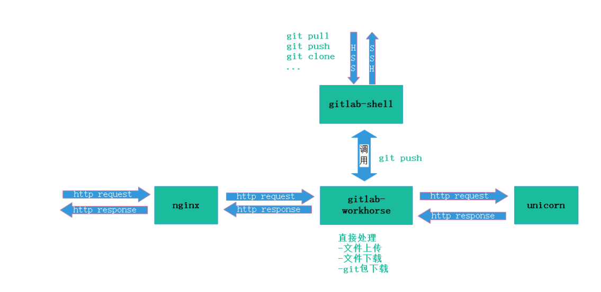

# CentOS7安装Gitlab


*摘要：* GitLab是利用Ruby on Rails一个开源的版本管理系统，实现一个自托管的Git项目仓库，可通过Web界面进行访问公开的或者私人项目，与Github类似。

# 1 GitLab基本介绍

GitLab是利用Ruby on Rails一个开源的版本管理系统，实现一个自托管的Git项目仓库，可通过Web界面进行访问公开的或者私人项目。

与Github类似，GitLab能够浏览源代码，管理缺陷和注释。可以管理团队对仓库的访问，它非常易于浏览提交过的版本并提供一个文件历史库。团队成员可以利用内置的简单聊天程序(Wall)进行交流。

它还提供一个代码片段收集功能可以轻松实现代码复用，便于日后有需要的时候进行查找。

## 1.1 Git的家族成员

**Git**：是一种版本控制系统，是一个命令，是一种工具。

**Gitlib**：是用于实现Git功能的开发库。

**Github**：是一个基于Git实现的在线代码托管仓库，包含一个网站界面，向互联网开放。

**GitLab**：是一个基于Git实现的在线代码仓库托管软件，你可以用gitlab自己搭建一个类似于Github一样的系统，一般用于在企业、学校等内部网络搭建git私服。

## 1.2 Gitlab的服务构成

**Nginx**：静态web服务器。

**gitlab-shell**：用于处理Git命令和修改authorized keys列表。

**gitlab-workhorse**: 轻量级的反向代理服务器。

**logrotate**：日志文件管理工具。

**postgresql**：数据库。

**redis**：缓存数据库。

**sidekiq**：用于在后台执行队列任务（异步执行）。

**unicorn**：An HTTP server for Rack applications，GitLab Rails应用是托管在这个服务器上面的。


## 1.3 GitLab工作流程




## 1.4 GitLab Shell

GitLab Shell有两个作用：为GitLab处理Git命令、修改authorized keys列表。

当通过SSH访问GitLab Server时，GitLab Shell会：

- 限制执行预定义好的Git命令（git push, git pull, git annex）
- 调用GitLab Rails API 检查权限
- 执行pre-receive钩子（在GitLab企业版中叫做Git钩子）
- 执行你请求的动作 处理GitLab的post-receive动作
- 处理自定义的post-receive动作

当通过http(s)访问GitLab Server时，工作流程取决于你是从Git仓库拉取(pull)代码还是向git仓库推送(push)代码。

如果你是从Git仓库拉取(pull)代码，GitLab Rails应用会全权负责处理用户鉴权和执行Git命令的工作；

如果你是向Git仓库推送(push)代码，GitLab Rails应用既不会进行用户鉴权也不会执行Git命令，它会把以下工作交由GitLab Shell进行处理：

1. 调用GitLab Rails API 检查权限
2. 执行pre-receive钩子（在GitLab企业版中叫做Git钩子）
3. 执行你请求的动作
4. 处理GitLab的post-receive动作
5. 处理自定义的post-receive动作

## 1.5 GitLab Workhorse

GitLab Workhorse是一个敏捷的反向代理。它会处理一些大的HTTP请求，比如文件上传、文件下载、Git push/pull和Git包下载。其它请求会反向代理到GitLab Rails应用，即反向代理给后端的unicorn。

 

# 2 部署

1、配置yum源

```bash
vim /etc/yum.repos.d/gitlab-ce.repo
```

```bash
[gitlab-ce]
name=gitlab-ce
baseurl=http://mirrors.tuna.tsinghua.edu.cn/gitlab-ce/yum/el6
Repo_gpgcheck=0
Enabled=1
Gpgkey=https://packages.gitlab.com/gpg.key
```

2、更新本地yum缓存

```bash
sudo yum makecache
```

3、安装GitLab社区版

```bash
sudo yum install gitlab-ce        #自动安装最新版
sudo yum install gitlab-ce-x.x.x    #安装指定版本
```


4、GitLab常用命令

```bash
sudo gitlab-ctl start    # 启动所有 gitlab 组件；
sudo gitlab-ctl stop        # 停止所有 gitlab 组件；
sudo gitlab-ctl restart        # 重启所有 gitlab 组件；
sudo gitlab-ctl status        # 查看服务状态；
sudo gitlab-ctl reconfigure        # 初始化并生成子模块配置；
sudo vim /etc/gitlab/gitlab.rb        # 修改默认的配置文件；
gitlab-rake gitlab:check SANITIZE=true --trace    # 检查gitlab；
sudo gitlab-ctl tail        # 查看日志；
```


5、GitLab修改默认端口

由于gitlab默认占用80和8080；这俩个端口一般都会被web服务占用；因此需要更换默认端口。


gitlab.rb修改

- 配置文件在/etc/gitlab/gitlab.rb。这个文件用于gitlab如何调用80和8080的服务等。

```
## Advanced settings
unicorn['listen'] = '127.0.0.1'
unicorn['port'] = 8082
 
nginx['listen_addresses'] = ['*']
nginx['listen_port'] = 82 # override only if you use a reverse proxy: https://gitlab.com/gitlab-org/omnibus-gitlab/blob/master/doc/settings/nginx.md#setting-the-nginx-listen-port
```


```
[root@localhost gitlab]# egrep -v '^$|^#' gitlab.rb
external_url 'http://10.159.232.1:8082'
unicorn['port'] = 8082
nginx['listen_port'] = 82

```


gitlab-rails修改

- 配置文件/var/opt/gitlab/gitlab-rails/etc/unicorn.rb

```
# What ports/sockets to listen on, and what options for them.
#listen "127.0.0.1:8080", :tcp_nopush => true
listen "127.0.0.1:8082", :tcp_nopush => true
listen "/var/opt/gitlab/gitlab-rails/sockets/gitlab.socket", :backlog => 1024
```

gitlab nginx 修改

- 配置文件 /var/opt/gitlab/nginx/conf/gitlab-http.conf。这个文件是gitlab内置的nginx的配置文件，里面可以影响到nginx真实监听端口号。


# 3 GitLab使用


