[TOC]


# CentOS7配置Shadowsocks代理上网


# 1 Shadowsocks服务端配置

**购买服务器后务必要先配置好Shadowsocks服务器端脚本才能得进行本教程下一步客户端配置！**


**两种脚本任选其一即可：**

**1. [Shadowsocks Python版服务端一键安装脚本](https://www.wangchao.info/1148.html)**

**2. [ShadowsocksR(SSR)服务端一键安装脚本](https://www.wangchao.info/1549.html)**

**安装：**

```bash
wget --no-check-certificate https://raw.githubusercontent.com/teddysun/shadowsocks_install/master/shadowsocks.sh
chmod +x shadowsocks.sh
./shadowsocks.sh 2>&1 | tee shadowsocks.log

```

**安装完成后，脚本提示如下：**

```bsh
Congratulations, Shadowsocks-python server install completed!
Your Server IP        :your_server_ip
Your Server Port      :your_server_port
Your Password         :your_password
Your Encryption Method:your_encryption_method

Welcome to visit:https://teddysun.com/342.html
Enjoy it!
```

**卸载方法：**
使用root用户登录，运行以下命令：

```bsh
./shadowsocks.sh uninstall
```

**单用户配置文件示例：**
配置文件路径：/etc/shadowsocks.json

```
{
    "server":"0.0.0.0",
    "server_port":your_server_port,
    "local_address":"127.0.0.1",
    "local_port":1080,
    "password":"your_password",
    "timeout":300,
    "method":"your_encryption_method",
    "fast_open": false
}
```

**多用户多端口配置文件示例：**
配置文件路径：/etc/shadowsocks.json

```
{
    "server":"0.0.0.0",
    "local_address":"127.0.0.1",
    "local_port":1080,
    "port_password":{
         "8989":"password0",
         "9001":"password1",
         "9002":"password2",
         "9003":"password3",
         "9004":"password4"
    },
    "timeout":300,
    "method":"your_encryption_method",
    "fast_open": false
}
```

**使用命令：**
启动：/etc/init.d/shadowsocks start
停止：/etc/init.d/shadowsocks stop
重启：/etc/init.d/shadowsocks restart
状态：/etc/init.d/shadowsocks status


# 2 Shadowsocks客户端下载/配置

其他各版本Github：https://github.com/shadowsocks/shadowsocks-windows/releases

**配置Shadowsocks客户端（以2.5.8为例）**

解压到平时安装软件的目录，例如D盘（D:\Program Files）并发送到桌面快捷方式，以方便下次使用。

**1.** 打开软件，在任务栏右下角有个小飞机的图标，双击打开编辑服务器信息；

**依次配置：**

```
 服务器IP（云服务器/VPS的IP地址）
 服务器端口（Shadowsocks服务端的端口号，必须和服务器端配置的一致）
 密码（Shadowsocks服务端的密码，必须和服务器端配置的一致）
 加密方式（必须和服务器端配置的一致，一般选择aes-256-cfb）
 备注（就是服务器名字，随意填写）
 代理端口（必须和服务器端配置的一致，默认为1080）
```


配置好后确定保存即可


**2.** 右下角小飞机图标右键“启动系统代理”

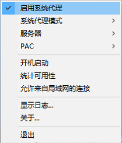

**打开Google等网站，配置没问题就可以正常打开了。**


**Chrome浏览器代理插件Proxy SwitchyOmega**

首先确认能正常打开Google，打开新窗口点击左上角“**应用**”进入“**Chrome 网上应用店**”；

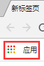

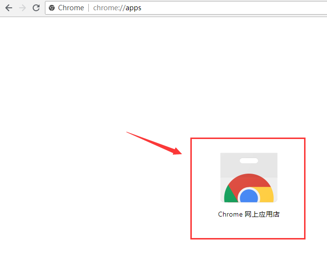

左上角搜索插件“**SwitchyOmega**”并点击按钮“**添加至CHROME**”，弹出对话框点击“**添加扩展程序**”；

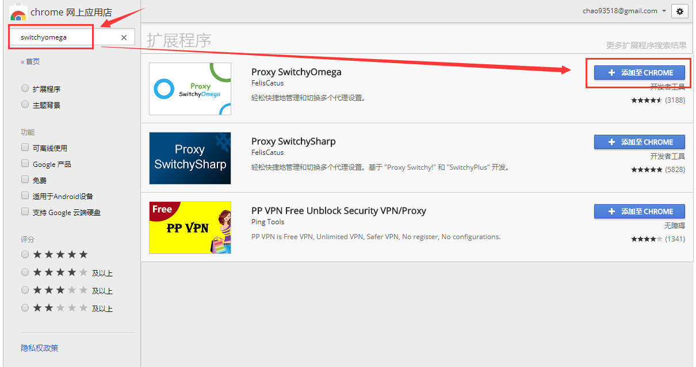

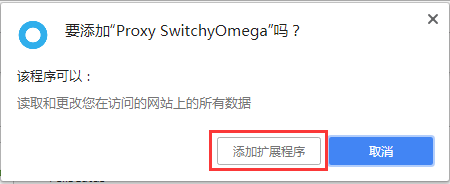

添加好插件插件后点击右上角插件图标 – 选项，默认的两个模式可以全部删掉，也可以留下第一个修改后使用；

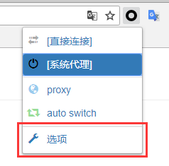

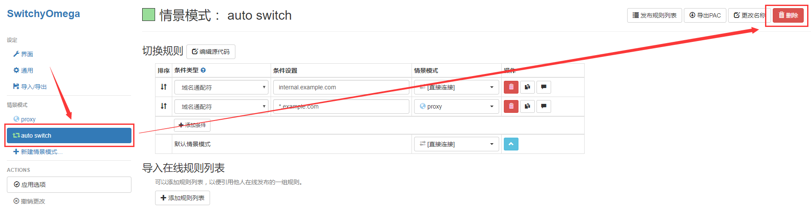

这里我们留了第一个“**proxy**”，把代理协议设置为“**SOCKS5**”，代理服务器是本机Shadowsocks客户端所以填写本机IP“**127.0.0.1**”，代理端口和Shadowsocks服务端及客户端配置的需一致，默认“**1080**”，点击“应用选项”绿色按钮保存；

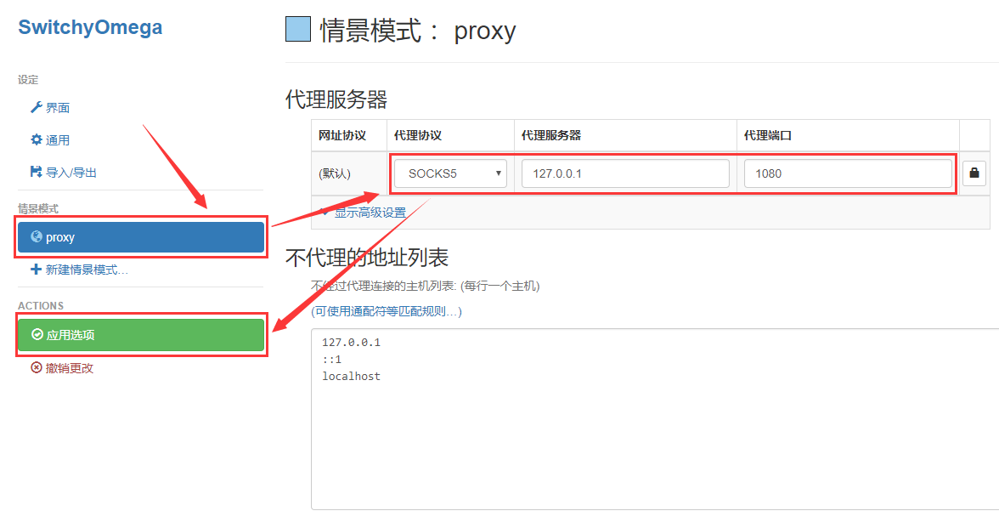

右上角可以更改名称，改什么随意；

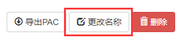

现在就可以随意切换IP了，“**直接连接**”就是使用本地IP直接连接，“**系统代理**”就是使用Shadowsocks客户端的代理模式，Google等网站会自动切换IP，“**系统代理**”就等同于这个关闭这个插件；

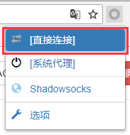

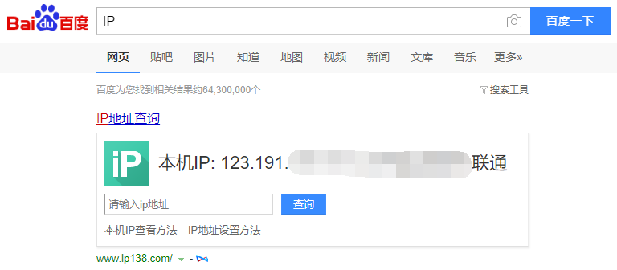

切换成刚才设置好的模式，就是Shadowsocks服务器的IP了。

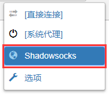

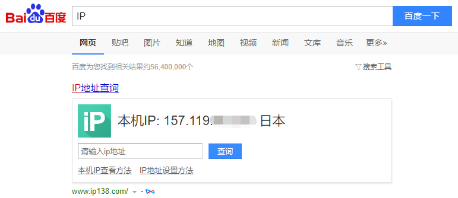

