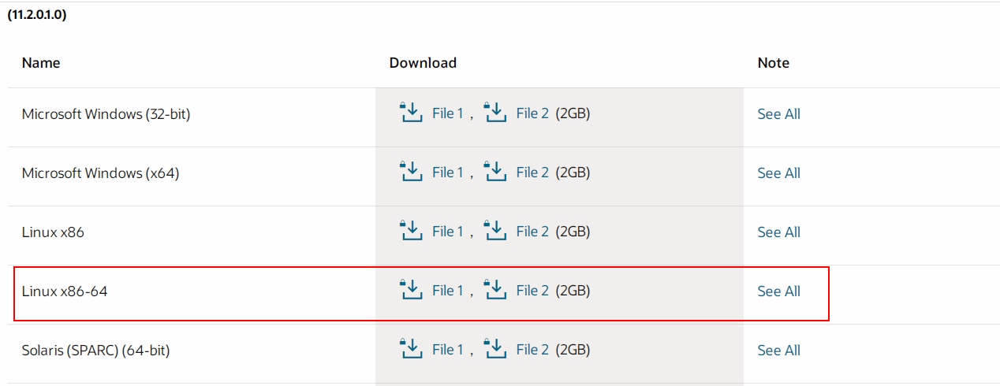

# CentOS7静默安装Oracle11

# 1 环境介绍

| 主机名 | IP地址         | 配置   |      |
| ------ | -------------- | ------ | ---- |
| oracle | 10.165.177.173 | 8核16G |      |


# 2 环境准备

oracle下载

下载Oracle安装文件[官网下载地址](https://www.oracle.com/database/technologies/oracle-database-software-downloads.html)




## 2.1 关闭防火墙和selinux

```bash
systemctl   stop   firewalld.service
systemctl   disable firewalld.service

setenforce 0
sed -i  '/^SELINUX/s#enforcing#disabled#g' /etc/selinux/config
```

## 2.2 修改主机名

```bash
[root@localhost response]#  hostnamectl set-hostname oracle
[root@oracle ~]# cat /etc/hosts
127.0.0.1   localhost localhost.localdomain localhost4 localhost4.localdomain4
::1         localhost localhost.localdomain localhost6 localhost6.localdomain6
10.165.177.173 oracle
```

## 2.3 内存及swap要求

如果没有开启swap；会报错如下：

```bash
[oracle@oracle database]$ ./runInstaller -silent -force -ignorePrereq -responseFile /home/oracle/database/response/db_install.rsp
Starting Oracle Universal Installer...

Checking Temp space: must be greater than 120 MB.   Actual 88057 MB    Passed
Checking swap space: 0 MB available, 150 MB required.    Failed <<<<

Some requirement checks failed. You must fulfill these requirements before

continuing with the installation,
```

解决办法：

```bash
[root@oracle response]# dd if=/dev/zero of=/swapfile bs=1024 count=512k
524288+0 records in
524288+0 records out
536870912 bytes (537 MB) copied, 1.35776 s, 395 MB/s
[root@localhost response]# mkswap /swapfile
Setting up swapspace version 1, size = 524284 KiB
no label, UUID=d257963e-f635-4138-b80a-c6bbb873f9fb
[root@localhost response]# swapon /swapfile
swapon: /swapfile: insecure permissions 0644, 0600 suggested.
[root@localhost response]# swapon -s
Filename				Type		Size	Used	Priority
/swapfile                              	file	524284	0	-1
[root@oracle response]# free -m
              total        used        free      shared  buff/cache   available
Mem:          15886         178        1504          16       14203       15411
Swap:           511           0         511
[root@oracle response]# echo "/swapfile    swap    swap    defaults    0 0" >>/etc/fstab
```


## 2.3 安装依赖

需要安装的依赖包参考官方文档[必须安装的依赖包-官方文档](https://docs.oracle.com/en/database/oracle/oracle-database/12.2/ladbi/supported-red-hat-enterprise-linux-7-distributions-for-x86-64.html#GUID-2E11B561-6587-4789-A583-2E33D705E498)

```bash
yum -y install binutils compat-libcap1 compat-libstdc++-33 compat-libstdc++-33*.i686 bc elfutils-libelf-devel gcc gcc-c++ glibc*.i686 glibc glibc-devel glibc-devel*.i686 ksh libgcc*.i686 libgcc libstdc++ libstdc++*.i686 libstdc++-devel libstdc++-devel*.i686 libaio libaio*.i686 libaio-devel libaio-devel*.i686 make sysstat unixODBC unixODBC*.i686 unixODBC-devel unixODBC-devel*.i686 libXp unzip rlwrap
```


## 2.4 系统设置

### 2.4.1 创建用户用户组

```bash
groupadd oinstall
groupadd dba
useradd -g oinstall -G dba oracle
echo "oracle"|passwd --stdin oracle
id oracle
```

配置oracle用户无密登陆，输入`visudo`写入如下参数

```bash
oracle ALL=(ALL) NOPASSWD: ALL
```

### 2.4.2 创建相应目录

```bash
[root@ oracle ~]# mkdir -p /u01/app/oracle
[root@ oracle ~]# mkdir -p /u01/app/oraInventory   			# 日志目录
[root@ oracle ~]# mkdir -p /u01/app/oracle/oradata			# 数据文件存放目录
[root@ oracle ~]# mkdir -p /u01/app/oracle/recovery_data	# 数据恢复目录
[root@ oracle ~]# chown -R oracle:oinstall /u01/app/
[root@ oracle ~]# chmod -R 755 /u01/app/
```

### 2.4.3 修改内核参数

```bash
cat >>/etc/sysctl.conf<<EOF
fs.aio-max-nr = 1048576
fs.file-max = 6815744
kernel.shmall = 2097152
kernel.shmmax = 4294967295
kernel.shmmni = 4096
kernel.sem = 250 32000 100 128
net.ipv4.ip_local_port_range = 9000 65500
net.core.rmem_default = 262144
net.core.rmem_max = 4194304
net.core.wmem_default = 262144
net.core.wmem_max = 1048576
EOF
#生效
sysctl -p
```

调整oracle用户的进程数与最大文件句柄数

```bash
[root@oracle ~]# vi /etc/security/limits.conf
oracle soft nproc 2047
oracle hard nproc 16384
oracle soft nofile 1024
oracle hard nofile 65536
# soft是最小值，hard是最大值，nofile是文件句柄，也就是这个用户能打开的文件数，nproc是进程数
```

### 2.4.4 增加用户验证

 修改/etc/pam.d/login配置文件，增加如下：

```bash
cat >>/etc/pam.d/login<<EOF
#session required /lib64/security/pam_limits.so
session required pam_limits.so
EOF
```

修改/etc/profile

```bash
vi /etc/profile

#添加以下内容
if [ $USER = "oracle" ]; then
   if [ $SHELL = "/bin/ksh" ]; then
       ulimit -p 16384
       ulimit -n 65535
    else
       ulimit -u 16384 -n 65535
   fi
fi
#使配置生效

source /etc/profile
```

oracle用户登录报错：

```
-bash: ulimit: open files: cannot modify limit: Operation not permitted
```

因为pam已经从limits.conf中设置了上限，而oracle用户登陆的时候尝试修改文件句柄的值，这个值大于了上限。修改/etc/security/limits.conf，将里面修改到大于oracle尝试修改的值即可。

### 2.4.5 配置oracle用户环境变量

```bash
su - oracle
cat >>.bashrc<<\EOF
export ORACLE_BASE=/u01/app/oracle
export ORACLE_HOME=$ORACLE_BASE/product/11.2.0/dbhome01
export ORACLE_SID=orcl
export ORACLE_OWNER=oracle
export LANG=en_US.UTF-8
export PATH=$PATH:$ORACLE_HOME/bin:$HOME/bin
EOF

#使配置生效
source .bashrc
```


# 3 安装

## 3.1 上传到oracle用户家目录并解压

```bash
[root@localhost oracle]# unzip p13390677_112040_Linux-x86-64_1of7.zip
[root@localhost oracle]# unzip p13390677_112040_Linux-x86-64_2of7.zip
[root@localhost oracle]# chown -R oracle:oinstall database
```


## 3.2 配置静默安装响应文件

```bash
[root@ oracle response]# su - oracle
[oracle@oracle database]$ cd /home/oracle/database/response/
[oracle@oracle response]$ cp db_install.rsp{,.bak}
[oracle@oracle response]$ cp netca.rsp{,.bak}
[oracle@oracle response]$ cp dbca.rsp{,.bak}
[oracle@oracle response]$ vim /home/oracle/database/response/db_install.rsp  # 文件中追加如下内容

oracle.install.option=INSTALL_DB_SWONLY
ORACLE_HOSTNAME= oracle
UNIX_GROUP_NAME=oinstall    # 安装组
INVENTORY_LOCATION=/u01/app/oraInventory  # 数据库创建及使用过程中的日志目录
SELECTED_LANGUAGES=en,zh_CN
ORACLE_BASE=/u01/app/oracle
ORACLE_HOME=/u01/app/oracle/product/11.2.0/dbhome01  # 创建安装目录
oracle.install.db.InstallEdition=EE   # 企业版本
oracle.install.db.DBA_GROUP=dba
oracle.install.db.OPER_GROUP=oinstall
oracle.install.db.config.starterdb.type=GENERAL_PURPOSE  # 数据库类型
oracle.install.db.config.starterdb.storageType=FILE_SYSTEM_STORAGE
oracle.install.db.config.starterdb.fileSystemStorage.dataLocation=/u01/app/oracle/oradata
oracle.install.db.config.starterdb.fileSystemStorage.recoveryLocation=/u01/app/oracle/recovery_data
oracle.install.db.config.starterdb.globalDBName=orcl
oracle.install.db.config.starterdb.SID=orcl
oracle.install.db.config.starterdb.memoryLimit=81920    # 自动管理内存的内存(M)
oracle.install.db.config.starterdb.password.ALL=oracle  # 设定所有数据库用户使用同一个密码
SECURITY_UPDATES_VIA_MYORACLESUPPORT=false
DECLINE_SECURITY_UPDATES=true
```


## 3.5 oracle用户下开始安装

```
[oracle@oracle database]$ cd /home/oracle/database
[oracle@oracle database]$ ./runInstaller -silent -force -ignorePrereq -responseFile /home/oracle/database/response/db_install.rsp
```

安装完后显示：

```
The installation of Oracle Database 11g was successful.
Please check '/u01/app/oraInventory/logs/silentInstall2020-09-11_09-22-28AM.log' for more details.

As a root user, execute the following script(s):
	1. /u01/app/oraInventory/orainstRoot.sh
	2. /u01/app/oracle/product/11.2.0/dbhome01/root.sh


Successfully Setup Software.
```

切换root用户执行：

```
/u01/app/oraInventory/orainstRoot.sh
/u01/app/oracle/product/11.2.0/dbhome01/root.sh
```


## 3.6 配置监听

```bash
[oracle@ oracle ~]$ netca -silent -responseFile /home/oracle/database/response/netca.rsp
****DISPLAY environment variable not set!
    Oracle Net Configuration Assistant is a GUI tool
    which requires that DISPLAY specify a location
    where GUI tools can display.
    Set and export DISPLAY, then re-run.
[oracle@ oracle ~]$ export DISPLAY=127.0.0.1:1.0
[oracle@ oracle ~]$ netca -silent -responseFile /home/oracle/database/response/netca.rsp

Parsing command line arguments:
    Parameter "silent" = true
    Parameter "responsefile" = /home/oracle/database/response/netca.rsp
Done parsing command line arguments.
Oracle Net Services Configuration:
Profile configuration complete.
Oracle Net Listener Startup:
    Running Listener Control:
      /u01/app/oracle/product/11.2.0/dbhome01/bin/lsnrctl start LISTENER
    Listener Control complete.
    Listener started successfully.
Listener configuration complete.
Oracle Net Services configuration successful. The exit code is 0
```

查看监听端口

```bash
[oracle@oracle database]$ ss -lntp|grep 1521
LISTEN     0      128         :::1521                    :::*                   users:(("tnslsnr",pid=7041,fd=11))
```

启动监听：lsnrctl start

停止监听：lsnrctl stop

重启监听：lsnrctl reload

查看监听：lsnrctl status


# 4 静默创建数据库

**修改dbca.rsp文件参数**

```bash
vim /home/oracle/database/response/dbca.rsp

[GENERAL]
RESPONSEFILE_VERSION = "11.2.0"
OPERATION_TYPE = "createDatabase"
[CREATEDATABASE]
GDBNAME = "orcl"  
SID = "orcl"
TEMPLATENAME = "General_Purpose.dbc"  # 建库用的模板文件
SYSPASSWORD = "oracle1234"
SYSTEMPASSWORD = "oracle1234"
SYSMANPASSWORD = "oracle1234"
DATAFILEDESTINATION = /u01/app/oracle/oradata    #数据目录
RECOVERYAREADESTINATION= /u01/app/oracle/recovery_data		#数据恢复目录
CHARACTERSET = "AL32UTF8"   # 字符集，重要!!! 建库后一般不能更改，所以建库前要确定清楚。
DATABASETYPE = "MULTIPURPOSE"
TOTALMEMORY = "10240"    # 根据自己机器内存设置，一般为内存的80%
```

执行：

```bash
[oracle@oracle ~]$ dbca -silent -responseFile  /home/oracle/database/response/dbca.rsp
Copying database files
1% complete
3% complete
11% complete
18% complete
26% complete
37% complete
Creating and starting Oracle instance
40% complete
45% complete
50% complete
55% complete
56% complete
60% complete
62% complete
Completing Database Creation
66% complete
70% complete
73% complete
85% complete
96% complete
100% complete
Look at the log file "/u01/app/oracle/cfgtoollogs/dbca/orcl/orcl.log" for further details.
```

再次查看监听状态，会发现有instance被监听。

```bash
[oracle@ oracle oradata]$ lsnrctl status

LSNRCTL for Linux: Version 11.2.0.1.0 - Production on 13-SEP-2020 21:53:31

Copyright (c) 1991, 2009, Oracle.  All rights reserved.

Connecting to (DESCRIPTION=(ADDRESS=(PROTOCOL=IPC)(KEY=EXTPROC1521)))
STATUS of the LISTENER
------------------------
Alias                     LISTENER
Version                   TNSLSNR for Linux: Version 11.2.0.1.0 - Production
Start Date                13-SEP-2020 21:28:50
Uptime                    0 days 0 hr. 24 min. 41 sec
Trace Level               off
Security                  ON: Local OS Authentication
SNMP                      OFF
Listener Parameter File   /u01/app/oracle/product/11.2.0/dbhome01/network/admin/listener.ora
Listener Log File         /u01/app/oracle/diag/tnslsnr/oracle/listener/alert/log.xml
Listening Endpoints Summary...
  (DESCRIPTION=(ADDRESS=(PROTOCOL=ipc)(KEY=EXTPROC1521)))
  (DESCRIPTION=(ADDRESS=(PROTOCOL=tcp)(HOST=oracle)(PORT=1521)))
Services Summary...
Service "orcl" has 1 instance(s).
  Instance "orcl", status READY, has 1 handler(s) for this service...
Service "orclXDB" has 1 instance(s).
  Instance "orcl", status READY, has 1 handler(s) for this service...
The command completed successfully

```


## 4.1 登陆oracle数据库

查看实例进程

```bash
[oracle@oracle database]$ ps -ef | grep ora_ | grep -v grep
oracle    7965     1  0 11:00 ?        00:00:00 ora_pmon_orcl
oracle    7967     1  0 11:00 ?        00:00:00 ora_psp0_orcl
oracle    7970     1  0 11:00 ?        00:00:01 ora_vktm_orcl
oracle    7974     1  0 11:00 ?        00:00:00 ora_gen0_orcl
oracle    7976     1  0 11:00 ?        00:00:00 ora_diag_orcl
oracle    7978     1  0 11:00 ?        00:00:00 ora_dbrm_orcl
oracle    7980     1  0 11:00 ?        00:00:00 ora_dia0_orcl
oracle    7982     1  0 11:00 ?        00:00:00 ora_mman_orcl
oracle    7984     1  0 11:00 ?        00:00:00 ora_dbw0_orcl
oracle    7986     1  0 11:00 ?        00:00:00 ora_lgwr_orcl
oracle    7988     1  0 11:00 ?        00:00:00 ora_ckpt_orcl
oracle    7990     1  0 11:00 ?        00:00:00 ora_smon_orcl
oracle    7992     1  0 11:00 ?        00:00:00 ora_reco_orcl
oracle    7994     1  0 11:00 ?        00:00:00 ora_mmon_orcl
oracle    7996     1  0 11:00 ?        00:00:00 ora_mmnl_orcl
oracle    7998     1  0 11:00 ?        00:00:00 ora_d000_orcl
oracle    8000     1  0 11:00 ?        00:00:00 ora_s000_orcl
oracle    8016     1  0 11:00 ?        00:00:00 ora_qmnc_orcl
oracle    8034     1  0 11:00 ?        00:00:00 ora_cjq0_orcl
oracle    8044     1  0 11:00 ?        00:00:00 ora_q000_orcl
oracle    8046     1  0 11:00 ?        00:00:00 ora_q001_orcl
```

列出Oracle Net Listener的进程

```bash
[oracle@oracle database]$ ps -ef | grep tnslsnr
oracle    7041     1  0 10:29 ?        00:00:00 /u01/app/oracle/product/11.2.0/dbhome01/bin/tnslsnr LISTENER -inherit
oracle    8451  6952  0 11:04 pts/0    00:00:00 grep --color=auto tnslsnr
```

登录sqlplus，查看实例状态

```bash
[oracle@oracle ~]$ sqlplus / as sysdba
SQL> select status from v$instance;

STATUS
------------
OPEN

#查看数据库编码
SQL> select userenv('language') from dual;

#查询数据库
SQL> select name from v$database;


#查看数据库版本信息
SQL> select * from v$version;

#激活scott用户
SQL> alter user scott account unlock;
SQL> alter user scott identified by tiger;
SQL> select username,account_status from all_users;
```

手动启停oracle实例

```bash
# 启动监听
lsnrctl start
su - oracle 
sqlplus /nolog 
conn /as sysdba 
startup  #启动     shutdown immediate 停止
exit
```

## 4.2 设置开机自启

1、查看ORACLE_HOME是否设置

```
[oracle@ oracle oradata]$ echo $ORACLE_HOME
/u01/app/oracle/product/11.2.0/dbhome01
```

2、编辑/etc/oratab文件

```bash
[oracle@ oracle oradata]$ vim /etc/oratab
orcl:/u01/app/oracle/product/11.2.0/dbhome01:N 改为 orcl:/u01/app/oracle/product/11.2.0/dbhome01:Y

# <N|Y>选项代表开机是否自启动  orcl为实例名
```

3、编辑/etc/rc.d/rc.local启动文件

```bash
[root@ oracle ~]# chmod +x /etc/rc.d/rc.local
[root@ oracle ~]# vim /etc/rc.d/rc.local
末尾添加：
su - oracle -lc "/u01/app/oracle/product/11.2.0/dbhome01/bin/lsnrctl start"
su - oracle -lc "/u01/app/oracle/product/11.2.0/dbhome01/bin/dbstart /u01/app/oracle/product/11.2.0/dbhome01"
```

使用dbstart命令启动数据库比较方便，但是在linux上安装好oracle之后，第一次使用dbstart命令可能会报如下错误：

```
ORACLE_HOME_LISTNER is not SET, unable to auto-start Oracle Net Listener Usage: 
/u01/app/oracle/product/11.2.0/dbhome01/bin/dbstart ORACLE_HOME
```

错误提示：ORACLE_HOME_LISTNER 没有设置

