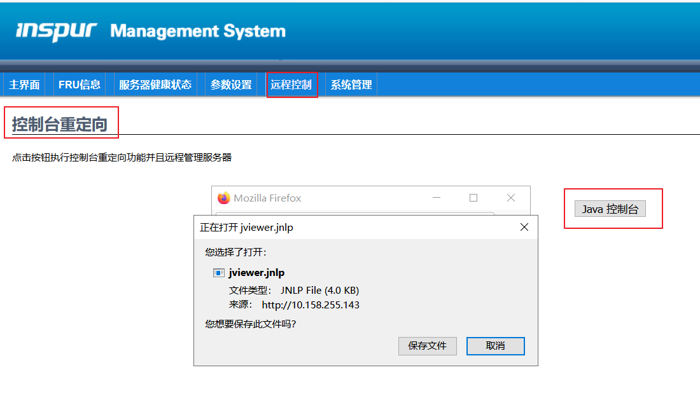
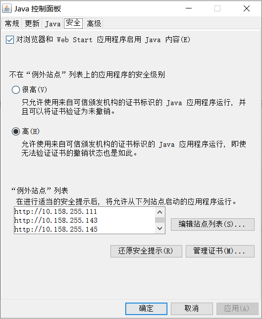
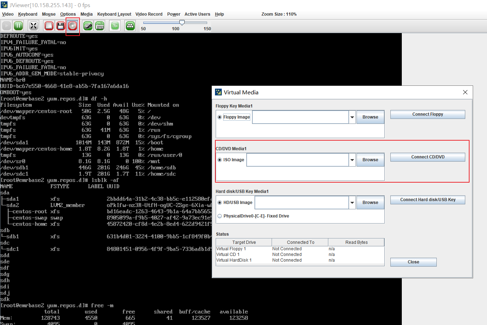
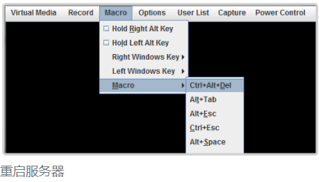

[TOC]

# IPMI远程安装系统

# 1 什么是 IPMI

​    IPMI 是智能平台管理接口(Intelligent Platform Management Interface)，是一种开放标准的硬件管理接口规格，定义了嵌入式管理子系统进行通信的特定方法。IPMI 可以控制服务器电源的开机、关机、重启，远程重装服务器操作系统，并可监视服务器的物理健康特征，如温度、电压、风扇工作状态、电源状态等等功能。当无法使用远程桌面或 ssh 时，则可以通过 IPMI 进行服务器的维护，从而大大减少运维工程师的劳动量！

# 2 使用 IPMI 为服务器安装操作系统

## 2.1  浏览器访问服务器的 IPMI 管理地址

默认用户和密码都是admin。

## 2.2 点击 "启用控制台"

浏览器会下载一个名为 launch.jnlp 的文件

## 2.3 添加到java安全

确保能弹出此页面；然后点击运行

## 2.4 挂载光盘映像（ISO)

​     点击 "Virtual Media" ==> "Virtual Storage"

之后点 Macro -> Ctrl+Alt+Del 重启服务器。开机时按 F11 键进入启动选项界面，选择虚拟光驱。（每个品牌的服务器可能有所区别）

随后进入系统安装流程，安装过程由于需本地上传镜像文件，可能反应会比较慢，耐心等待每一步。安装后别忘了取消装载的系统镜像文件，不然重启会循环进入安装。

