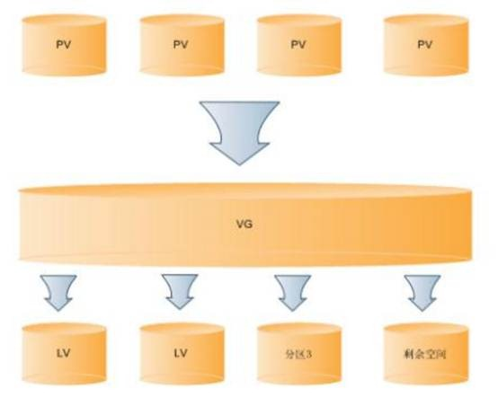
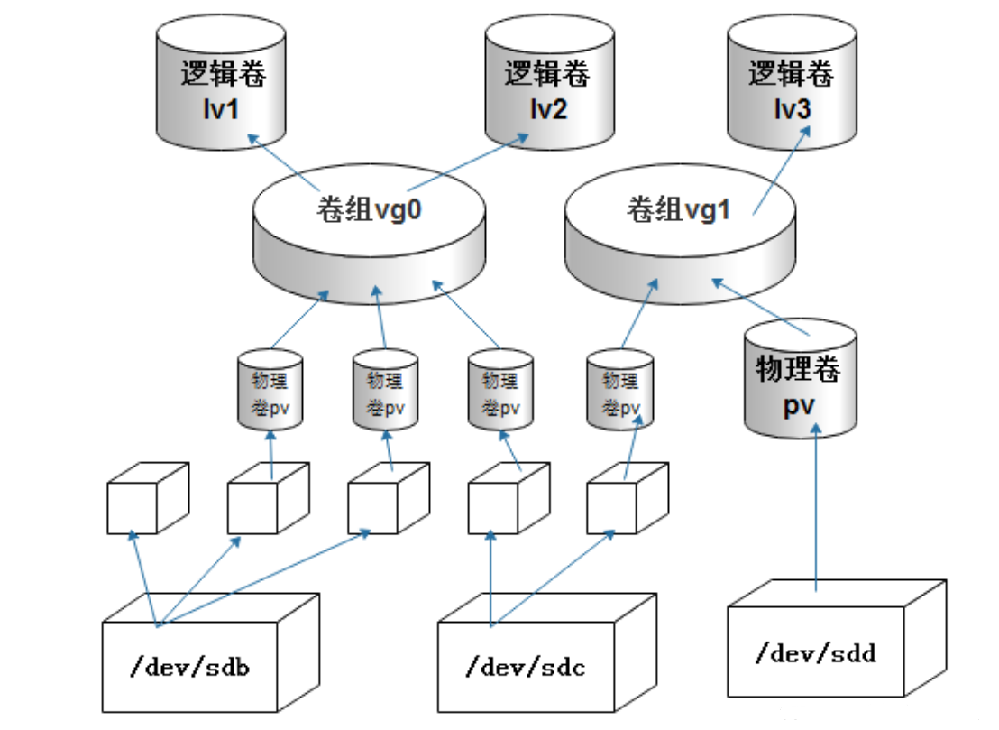
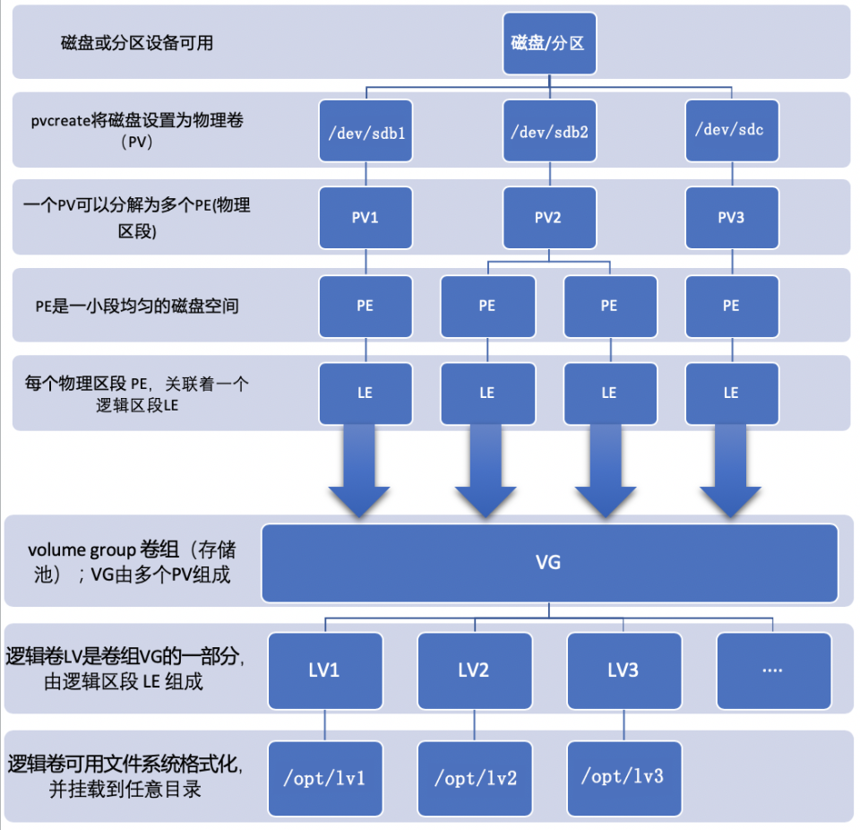

[TOC]


# LVM磁盘逻辑卷管理

# 1 介绍

LVM是 Logical Volume Manager(逻辑卷管理)的简写，它由Heinz Mauelshagen在Linux 2.4内核上实现。LVM将一个或多个硬盘的分区在逻辑上集合，相当于一个大硬盘来使用，当硬盘的空间不够使用的时候，可以继续将其它的硬盘的分区加入其中，这样可以实现磁盘空间的动态管理，相对于普通的磁盘分区有很大的灵活性。

与传统的磁盘与分区相比，LVM为计算机提供了更高层次的磁盘存储。它使系统管理员可以更方便的为应用与用户分配存储空间。在LVM管理下的存储卷可以按需要随时改变大小与移除(可能需对文件系统工具进行升级)。LVM也允许按用户组对存储卷进行管理，允许管理员用更直观的名称(如"sales'、 'development')代替物理磁盘名(如'sda'、'sdb')来标识存储卷。


**工作原理：**

LVM在每个物理卷头部都维护了一个metadata，每个metadata中都包含了整个VG（volume group：卷组）的信息，包括每个VG的布局配置，PV（physical volume：物理卷）的编号，LV（logical volume：逻辑卷）的编号，以及每个PE（physical extends：物理扩展单元）到LE（logical extends：物理扩展单元）的映射关系。同一个VG中的每个PV头部的信息都是相同的，这样有利于故障时进行数据恢复。

LVM对上层文件系统提供LV层，隐藏了操作细节。对文件系统而言，对LV的操作与原先对partition的操作没有差别。当对LV进行写入操作的时候，LVM定位相应的LE，通过PV头部的映射表将数据写入到相应的PE上。LVM实现的关LVM最大的特点就是可以对磁盘进行动态管理。因为逻辑卷的大小是可以动态调整的，而且不会丢失现有的数据。我们如果新增加了硬盘，其也不会改变现有上层的逻辑卷。键在于PE和LE之间建立映射关系，不同的映射规则决定了不同的LVM存储模型。LVM支持多个PV 的stripe和mirror。

LVM最大的特点就是可以对磁盘进行动态管理，因为逻辑卷的大小是可以动态调整的，而且不会丢失现有的数据，如果我们增加了硬盘也不会改变现有的上层逻辑卷。

**LVM的优缺点：**

优点：

1. 文件系统可以跨多个磁盘，因此文件系统大小不会受物理磁盘的限制。

2. 可以在系统运行的状态下动态的扩展文件系统的大小。

3. 可以增加新的磁盘到LVM的存储池中。

4. 可以以镜像的方式冗余重要的数据到多个物理磁盘。

5. 可以方便的导出整个卷组到另外一台机器。

缺点：

1. 在从卷组中移除一个磁盘的时候必须使用reducevg命令（这个命令要求root权限，并且不允许在快照卷组中使用）。

2. 当卷组中的一个磁盘损坏时，整个卷组都会受到影响。**解决办法：用RAID+LVM=既有冗余又有动态扩展。**

3. 因为加入了额外的操作，存贮性能受到影响。


**LVM名词解释**

LVM是在磁盘分区和文件系统之间添加的一个逻辑层，来为文件系统屏蔽下层磁盘分区布局，提供一个抽象的盘卷，在盘卷上建立文件系统。几个LVM术语：

**物理存储介质（The physical media）**：这里指系统的存储设备：硬盘，如：/dev/hda1、/dev/sda等等，是存储系统最低层的存储单元。

**物理卷（physical volume）**：物理卷就是指硬盘分区或从逻辑上与磁盘分区具有同样功能的设备(如RAID)，是LVM的基本存储逻辑块，但和基本的物理存储介质（如分区、磁盘等）比较，却包含有与LVM相关的管理参数。

**卷组（Volume Group）**：LVM卷组类似于非LVM系统中的物理硬盘，其由物理卷组成。可以在卷组上创建一个或多个“LVM分区”（逻辑卷），LVM卷组由一个或多个物理卷组成。

**逻辑卷（logical volume）**：LVM的逻辑卷类似于非LVM系统中的硬盘分区，在逻辑卷之上可以建立文件系统(比如/home或者/usr等)。

**PE（physical extent）**：每一个物理卷被划分为称为PE(Physical Extents)的基本单元，具有唯一编号的PE是可以被LVM寻址的最小单元。PE的大小是可配置的，默认为4MB。

**LE（logical extent）**：逻辑卷也被划分为被称为LE(Logical Extents) 的可被寻址的基本单位。在同一个卷组中，LE的大小和PE是相同的，并且一一对应。

简单来说就是：

PV:是物理的磁盘分区或者整个磁盘。

VG:LVM中的物理的磁盘分区，也就是PV，必须加入VG，可以将VG理解为一个仓库或者是几个大的硬盘。

LV：也就是从VG中划分的逻辑分区。

如下图所示PV、VG、LV三者关系：






**创建LV逻辑卷流程图**




**LVM的写入模式**

**LVM有两种写入模式：线性模式和条带模式**。

- 线性模式即写完一个设备后再写另一个设备
- 条带模式就有点类似于RAID0，即数据是被分散写入到LVM各成员设备上的。
  因为条带模式的数据不具有安全性，且LVM并不强调读写性能，故LVM默认为线性模式，这样即使一个设备坏了，其它设备上的数据还在。


# 2 安装lvm

```
yum install lvm2 -y
```


## 2.1 常用的命令

**管理PV有几个命令**：pvscan、pvdisplay、pvcreate、pvremove和pvmove。

| 功能               | 命令      |
| :----------------- | :-------- |
| 创建PV             | pvcreate  |
| 扫描并列出所有的pv | pvscan    |
| 列出pv属性信息     | pvdisplay |
| 移除pv             | pvremove  |
| 移动pv中的数据     | pvmove    |

其中pvscan搜索目前有哪些pv，扫描之后将结果放在缓存中；pvdisplay会显示每个pv的详细信息，如PV name和pv size以及所属的VG等。

**管理VG也有几个命令：**

| 功能               | 命令      |
| :----------------- | :-------- |
| 创建VG             | vgcreate  |
| 扫描并列出所有的vg | vgscan    |
| 列出vg属性信息     | vgdisplay |
| 移除vg，即删除vg   | vgremove  |
| 从vg中移除pv       | vgreduce  |
| 将pv添加到vg中     | vgextend  |
| 修改vg属性         | vgchange  |

同样，vgscan搜寻有几个vg并显示vg的基本属性，vgcreate是创建vg，vgdisplay是列出vg的详细信息，vgremove是删除整个vg，vgextend用于扩展vg即将pv添加到vg中，vgreduce是将pv移除出vg。除此之外还有一个命令vgchange，用于改变vg的属性，如修改vg的状态为激活状态或未激活状态。


**管理LV：**

有了vg之后就可以根据vg进行分区，即创建LV。管理lv也有类似的一些命令。

| 功能               | 命令               |
| :----------------- | :----------------- |
| 创建LV             | lvcreate           |
| 扫描并列出所有的lv | lvscan             |
| 列出lv属性信息     | lvdisplay          |
| 移除lv，即删除lv   | lvremove           |
| 缩小lv容量         | lvreduce(lvresize) |
| 增大lv容量         | lvextend(lvresize) |
| 改变lv容量         | lvresize           |

对于lvcreate命令有几个选项：

```javascript
lvcreate {-L size(M/G) | -l PEnum} -n lv_name vg_name
选项说明：
-L：根据大小来创建lv，即分配多大空间给此lv
-l：根据PE的数量来创建lv，即分配多少个pe给此lv
-n：指定lv的名称
```


# 3 创建和管理LVM


## 3.1 创建物理卷(PV)

创建PV有两种方式：基于磁盘创建、 基于分区创建。
1、基于磁盘的 ，就不需要划分分区 ，直接通过 pvcreate 来创建物理卷即可；
2、基于分区的 ，需要事先通过fdisk划分分区 ，并将分区格式转化为8e(8e表示的就是Linux lvm)，分区不要mkfs格式化 ，然后再进行 pvcreate 来创建物理卷即可 。

将磁盘转换为物理卷（PV）：

```sh
1.将磁盘转换为物理卷（PV）
[root@localhost ~]# pvcreate /dev/sdb
  Physical volume "/dev/sdc" successfully created.

2.检查PV创建情况
[root@localhost ~]# pvs
  PV         VG     Fmt  Attr PSize   PFree
  /dev/sda2  centos lvm2 a--  <19.00g     0
  /dev/sdb          lvm2 ---   20.00g 20.00g
```


## 3.2 创建卷组(VG)

```bash
1.创建名为datavg的卷组，然后将物理卷加入卷组
[root@localhost ~]# vgcreate datavg /dev/sdb
  Volume group "datavg" successfully created

2.检查卷组（发现存在一个PV卷）
[root@localhost ~]# vgs
  VG     #PV #LV #SN Attr   VSize   VFree
  centos   1   2   0 wz--n- <19.00g      0
  datavg   1   0   0 wz--n- <20.00g <20.00g
[root@localhost ~]# pvs
  PV         VG     Fmt  Attr PSize   PFree  
  /dev/sdb   datavg lvm2 a--  <30.00g <30.00g
```

激活vg

```
[root@localhost ~]# vgchange -a y datavg
  0 logical volume(s) in volume group "datavg" now active
```


## 3.3 创建逻辑卷(LV)

```bash
1.分配datavg逻辑卷，-n指定逻辑卷名称，-L指定逻辑卷大小
[root@localhost ~]# lvcreate -L 1000M -n lv1 datavg
  Logical volume "lv1" created.

2.检查逻辑卷
[root@localhost ~]# lvscan 
 ACTIVE            '/dev/datavg/lv1' [1000.00 MiB] inherit
```


## 3.4 挂载使用

```bash
1.格式化逻辑卷
[root@localhost ~]# mkfs.xfs /dev/datavg/lv1

2.创建目录并挂载
[root@localhost ~]# mkdir /lv1
[root@localhost ~]# mount /dev/datavg/lv1 /lv1
[root@localhost ~]# df -h /lv1/
Filesystem              Size  Used Avail Use% Mounted on
/dev/mapper/datavg-lv1  997M   33M  965M   4% /lv1

```


# 4 LVM卷组管理

## 4.1 扩大卷组

```bash
1.准备新的磁盘加入至PV，然后检查卷组当前的大小
[root@localhost ~]# pvcreate /dev/sdc
[root@localhost ~]# vgs
  VG     #PV #LV #SN Attr   VSize   VFree
  centos   1   2   0 wz--n- <19.00g      0
  datavg   1   1   0 wz--n- <20.00g <19.90g


2.使用vgextend扩展卷组
[root@localhost ~]# vgextend datavg /dev/sdc 
  Volume group "datavg" successfully extended

3.再次检查，发现datavg已经扩大
[root@localhost ~]# vgs
  VG     #PV #LV #SN Attr   VSize   VFree
  centos   1   2   0 wz--n- <19.00g     0
  datavg   2   1   0 wz--n-  39.99g 39.89g

```


## 4.2 迁移卷组

pvmove命令搬移PV中的资料(只限于同一VG中)。

```bash
[root@localhost lv1]# dd if=/dev/zero of=/lv1/test count=200 bs=1M
200+0 records in
200+0 records out
209715200 bytes (210 MB) copied, 0.198245 s, 1.1 GB/s
[root@localhost lv1]# ll
total 204800
-rw-r--r-- 1 root root 209715200 Jul 28 15:54 test
# 迁移前查看lv1还在sdb磁盘
[root@localhost lv1]# lsblk -af
NAME            FSTYPE      LABEL           UUID                                   MOUNTPOINT
sda
├─sda1          xfs                         15f6621f-85a2-4dc9-9331-76de48237d42   /boot
└─sda2          LVM2_member                 iEV8xZ-9QLg-tgpR-OSE6-LSZS-bn3S-0DUcav
  ├─centos-root xfs                         034d24ed-d9cd-40f1-8adc-d8200302fb1e   /
  └─centos-swap swap                        76443ce9-84b1-4d6a-968b-7fbaa2434fd5   [SWAP]
sdb             LVM2_member                 r5vP1O-95MJ-rIJ5-dRHV-RbDc-EbTt-bEt8JG
└─datavg-lv1    xfs                         b40eaf2b-90db-45a4-b76d-250bffc3dff0   /lv1
sdc             LVM2_member                 XyeQMv-xcUO-dJJf-Ck2c-w62Z-8JWx-Sc7gdv

[root@localhost lv1]# pvmove /dev/sdb /dev/sdc
  /dev/sdb: Moved: 20.00%
  /dev/sdb: Moved: 100.00%

# 迁移后查看lv1已经到了sdc磁盘
[root@localhost lv1]# lsblk -af
NAME            FSTYPE      LABEL           UUID                                   MOUNTPOINT
sda
├─sda1          xfs                         15f6621f-85a2-4dc9-9331-76de48237d42   /boot
└─sda2          LVM2_member                 iEV8xZ-9QLg-tgpR-OSE6-LSZS-bn3S-0DUcav
  ├─centos-root xfs                         034d24ed-d9cd-40f1-8adc-d8200302fb1e   /
  └─centos-swap swap                        76443ce9-84b1-4d6a-968b-7fbaa2434fd5   [SWAP]
sdb             LVM2_member                 r5vP1O-95MJ-rIJ5-dRHV-RbDc-EbTt-bEt8JG
sdc             LVM2_member                 XyeQMv-xcUO-dJJf-Ck2c-w62Z-8JWx-Sc7gdv
└─datavg-lv1    xfs                         b40eaf2b-90db-45a4-b76d-250bffc3dff0   /lv1


# 报错：目的端可用空间小于源端
[root@localhost ~]#  pvmove /dev/sdb /dev/sdc
  Insufficient free space: 5119 extents needed, but only 5093 available
  Unable to allocate mirror extents for datavg/pvmove0.
  Failed to convert pvmove LV to mirrored
```


## 4.3 缩减卷组

假设想移除/dev/sdb磁盘，建议先将sdb磁盘数据迁移到sdc磁盘，然后在移除。
注意：同一卷组的磁盘才可以进行在线迁移

```bash
1.检查当前逻辑卷VG中PV使用情况
[root@localhost ~]# pvs
  PV         VG     Fmt  Attr PSize   PFree  
  /dev/sdc   datavg lvm2 a--  <30.00g <29.90g
  /dev/sdd   datavg lvm2 a--  <30.00g <30.00g

2.pvmove在线数据迁移，将sdb的数据迁移至sdc
[root@localhost ~]# pvmove /dev/sdb /dev/sdc
  /dev/sdc: Moved: 48.00%


3.检查是否将sdb数据迁移至sdc
[root@localhost lv1]#  pvs
  PV         VG     Fmt  Attr PSize   PFree
  /dev/sda2  centos lvm2 a--  <19.00g      0
  /dev/sdb   datavg lvm2 a--  <20.00g <20.00g
  /dev/sdc   datavg lvm2 a--  <20.00g <19.02g

4.从卷组中移除sdc
[root@localhost ~]# vgreduce datavg /dev/sdb
  Removed "/dev/sdb" from volume group "datavg"
```


## 4.4 删除卷组

```bash
[root@localhost ~]# vgchange -a n datavg  # 要想删除vg，需要先关闭vg才能移除，这里先关闭
  0 logical volume(s) in volume group "datavg" now active
[root@localhost ~]# vgremove datavg
  Volume group "datavg" successfully removed
```


# 5 LVM逻辑卷管理

## 5.1 检查lv映射的块设备

```bash
[root@localhost ~]# lvs -o+devices
  LV   VG     Attr       LSize   Pool Origin Data%  Meta%  Move Log Cpy%Sync Convert Devices
  root centos -wi-ao---- <17.00g                                                     /dev/sda2(512)
  swap centos -wi-ao----   2.00g                                                     /dev/sda2(0)
  lv1  datavg -wi-ao---- <20.10g                                                     /dev/sdb(0)
  lv1  datavg -wi-ao---- <20.10g                                                     /dev/sdc(0)
```


## 5.2 扩展逻辑卷

lvextend命令的作用是在线扩展逻辑卷的空间大小，而不中断应用程序对逻辑卷的访问。

使用lvextend命令动态在线扩展磁盘空间，整个空间扩展过程对于应用程序来说是完全透明的。

**语法格式 :** lvextend [参数] [逻辑卷]

常用参数：

| -L   | 指定逻辑卷的大小，单位为“kKmMgGtT”字节 |
| ---- | -------------------------------------- |
| -l   | 指定逻辑卷的大小（LE数）               |

**扩展逻辑卷：取决于vg卷中是否还有剩余的容量，lvextend可以在线扩容逻辑卷，不需要关闭，也不需要停服务。**
**注意：扩展逻辑卷不能超过卷组VG的总大小**

==**情况一、vg足够拉伸**==

```bash
[root@localhost lv1]# vgs
  VG     #PV #LV #SN Attr   VSize   VFree
  datavg   1   1   0 wz--n- <30.00g <29.90g
1.扩张lv逻辑卷，增加800M分配给逻辑卷
[root@localhost lv1]# lvextend -L +800M /dev/datavg/lv1
[root@localhost lv1]# lvextend -l +100%FREE /dev/datavg/lv1

2.扩展逻辑卷后需要更新xfs文件系统
[root@localhost lv1]# xfs_growfs /dev/datavg/lv1	#xfs文件格式扩展
[root@localhost lv1]# resize2fs /dev/datavg/lv1	    #ext文件格式扩展
```


==**情况二、vg不够拉伸，得先扩大设备，在扩大系统**==

```bash
[root@localhost ~]# pvcreate /dev/vdb2
  Physical volume "/dev/vdb2" successfully created
[root@localhost ~]# vgextend vg0 /dev/vdb2               ##添加物理卷到物理卷组
  Volume group "vg0" successfully extended
[root@localhost ~]# lvextend -L 1500M /dev/vg0/lv0       ##划分物理卷 & 扩展逻辑卷大小
  Extending logical volume lv0 to 1.46 GiB
  Logical volume lv0 successfully resized
```


## **5.3 删除逻辑卷**

```bash
1.先卸载挂载点，然后在移除逻辑卷
[root@localhost lv1]# umount /dev/datavg/lv1 
[root@localhost lv1]# lvremove /dev/datavg/lv1

2.删除vg
[root@localhost lv1]# vgremove datavg

3.删除pv
[root@localhost lv1]# pvremove /dev/sdc
[root@localhost lv1]# pvremove /dev/sdb
```


