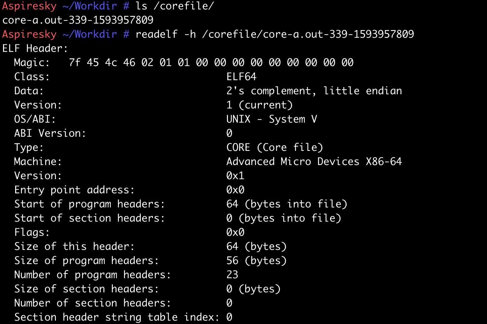
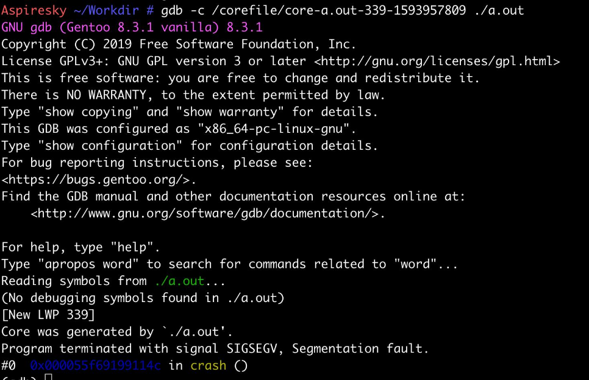
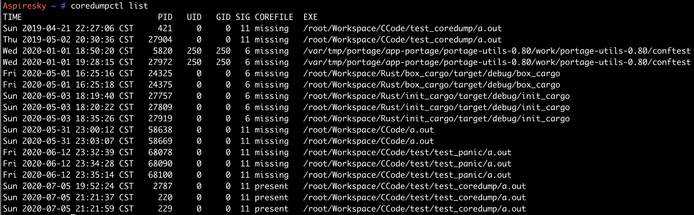
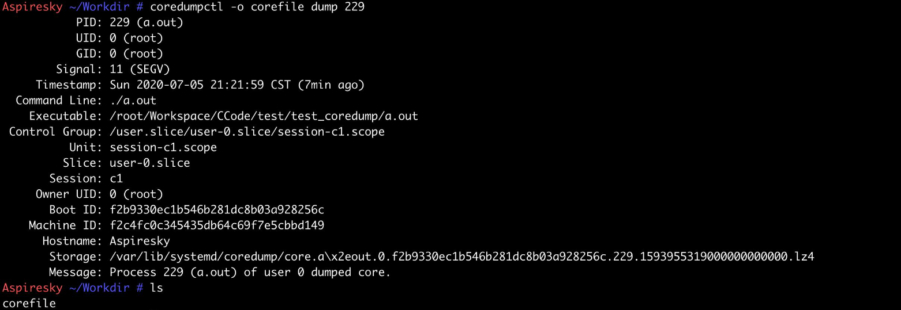
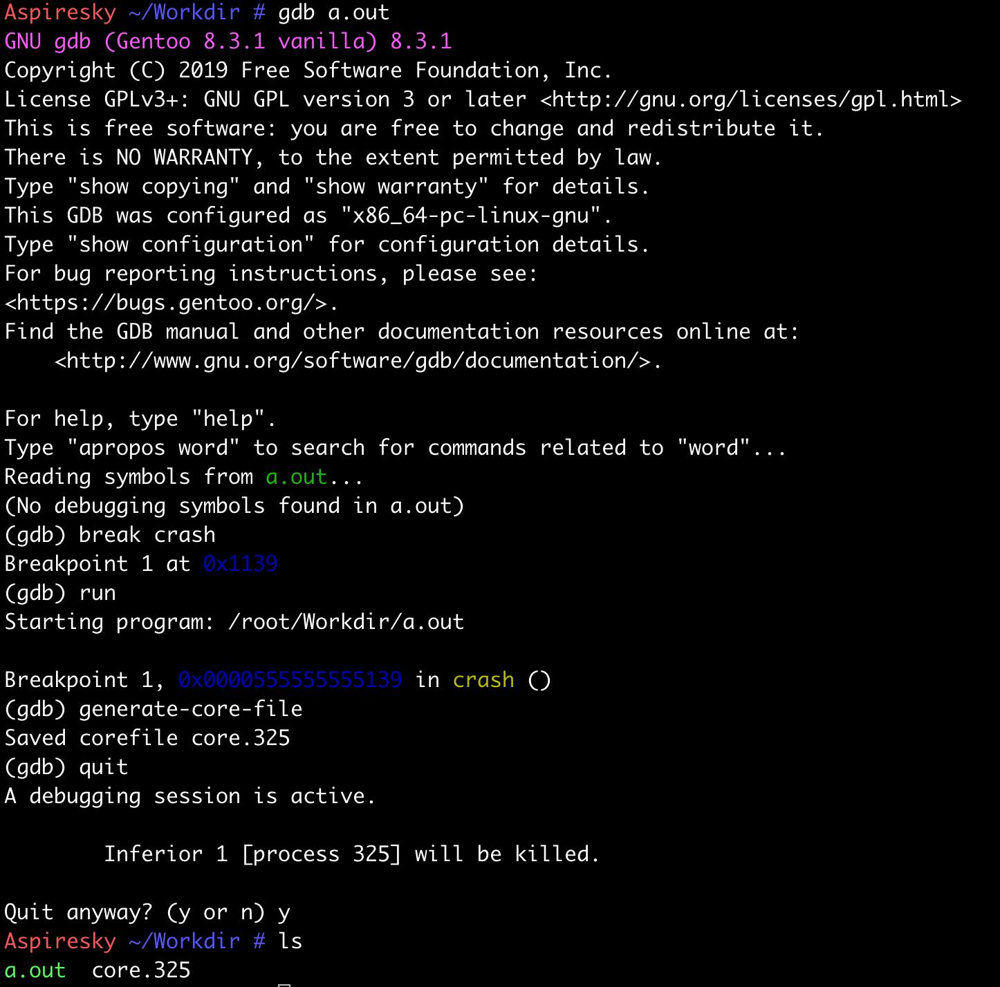

# Linux开启和关闭core dump

# 概述

当程序在运行的过程中出现异常终止或崩溃，系统会将程序当时的状态记录下来，保存在一个core文件中，这种机制称为Core Dump，又称“核心转储”。Core dump机制记录了程序异常时的内存数据、寄存器状态以及运行堆栈等信息，开发人员可以使用调试工具分析Core文件来快速定位程序异常原因。在生产环境中建议关闭core dump，否则会因为程序异常导致core文件占满磁盘。

Linux系统默认开始core dump，也可在创建系统的时候选择关闭dump。

默认的情况下, Linux 会把 core dump 的资讯储存在 /var/crash/ 目录, 而透过 systemd 启动的服务, 则会储存在 /var/lib/systemd/coredump/ 目录.


# CORE DUMP基本配置

### CORE文件的生成开关和大小限制

`ulimit`命令的`-c`选项专门用于控制core文件的生成以及对core文件大小进行限制：

- 使用`ulimit -c`命令可查看core文件的生成开关。若结果为0，则表示关闭了此功能，不会生成core文件；
- 使用`ulimit -c filesize`命令，可以限制core文件的大小（filesize的单位为kbyte）。如果生成的信息超过此大小，将会被裁剪，最终生成一个不完整的core文件，在调试此core文件的时候，gdb会提示错误。若设置成`ulimit -c unlimited`，则表示core文件的大小不受限制。

```bash
ulimit -c 0 #不产生core文件
ulimit -c 1024 #产生core大小为1024kb
ulimit -c unlimited #产生core文件不受限制
```

需要注意的，上述的配置是临时性的，在系统重启后就会丢失，为了配置永久有效，需要将修改保存到配置文件中。这里修改方式有两种：

- 修改/etc/profile文件：在/etc/profile文件中，添加`ulimit -c unlimited`，然后保存退出即可。如果要让配置立即生效，可以执行`source /etc/profile`命令；
- 修改/etc/security/limits.conf文件：将`#* soft core 0`修改成：`* soft core unlimited`即可。


# CORE文件的名称和生成路径

core文件生成路径:

输入可执行文件运行命令的同一路径下。

若系统生成的core文件不带其它任何扩展名称，则全部命名为core。新的core文件生成将覆盖原来的core文件。

(1)/proc/sys/kernel/core_uses_pid可以控制core文件的文件名中是否添加pid作为扩展。文件内容为1，表示添加pid作为扩展名，生成的core文件格式为core.xxxx；为0则表示生成的core文件同一命名为core。

可通过以下命令修改此文件：

```
echo "0" > /proc/sys/kernel/core_uses_pid
/proc/sys/kernel/core_pattern可以控制core文件保存位置和文件名格式。
```

(2)指定生成文件的路径和名字
执行# vim /etc/sysctl.conf，进入编辑模式，加入下面两行

```
kernel.core_pattern=/var/core/core_%e_%p
kernel.core_uses_pid=0
```

在var下创建core目录，用`sysctl -p /etc/sysctl.conf`，是修改马上生效。


**关闭：**

```
ulimit -c 0
echo "ulimit -c 0" >>/etc/profile
source /etc/profile
echo "0" > /proc/sys/kernel/core_uses_pid
echo "kernel.core_uses_pid=0" >>/etc/sysctl.conf
sysctl -p /etc/sysctl.conf
```

补充

```
limits.conf 及 sysctl 关闭 core dump
Disabling core dumps on Linux

1. 开启 /etc/security/limits.conf 档案, 加入以下 2 行:
* hard core 0
* soft core 0

2. 开启 /etc/sysctl.d/9999-disable-core-dump.conf 或 /etc/sysctl.conf, 加入以下 2 行:
fs.suid_dumpable=0
kernel.core_pattern=|/bin/false

3. 执行以下指令使以上变更生效:
sysctl -p /etc/sysctl.d/9999-disable-core-dump.conf

关闭 systemd 服务 core dump
透过 systemd 启动的服务会忽略 limites.conf, 所以需要以下设定来关闭。
1. 建立 /etc/systemd/coredump.conf.d/ 目录:
$ sudo mkdir /etc/systemd/coredump.conf.d/
2. 建立 /etc/systemd/coredump.conf.d/custom.conf 档案:
$ sudo vim /etc/systemd/coredump.conf.d/custom.conf
3. 输入以下内容:
[Coredump]
Storage=none
ProcessSizeMax=0
4. 最后执行以下指令重新加载 systemctl:
$ sudo systemctl daemon-reload
```


# CORE文件的名称和生成路径

默认情况下，core文件生成在可执行文件运行命令的同一路径下。若系统生成的core文件不带其它任何扩展名称，则全部命名为core，并且新的core文件生成将覆盖原来的core文件。Linux在proc文件系统中提供了入口用以支持对core文件的名称以及生成路径进行配置：

- **/proc/sys/kernel/core_uses_pid**：该参数用于控制core文件的文件名中是否添加pid作为扩展。文件内容为1，表示添加pid作为扩展名；
- **/proc/sys/kernel/core_pattern**：该参数用于控制core文件保存位置和文件名格式，也是core dump的主要配置入口。

为了配置core文件保存到特定的目录下，可以通过以下命令修改`/proc/sys/kernel/core_pattern`文件的内容（需要注意的是配置的路径必须是有效的，否则core文件无法生成）：


上述的命令会让系统在进程崩溃时将core文件统一生成到/corefile目录下，并且产生的core文件名格式为core-命令名-pid-时间戳，其中使用到了一些格式化参数。core_pattern文件支持的参数及其意义罗列如下：

- %p：添加core dump进程的进程ID
- %u：添加core dump进程的用户ID
- %g：添加从热 dump进程的组ID
- %s：添加触发进程core dump的信号类型
- %t：添加进程core dump的时间
- %h：添加主机名
- %e：添加可执行程序文件名


# 使用SYSCTL进行配置

sysctl命令用于运行时配置内核参数，这些参数位于/proc/sys目录下，因此也可以使用sysctl配置core文件：


除了直接使用命令的方式，sysctl支持使用/etc/sysctl.conf配置文件的方式对内核参数进行配置，对应的参数项依次为：

1. kernel.core_uses_pid
2. kernel.core_pattern


# CORE文件的生成与使用

准备测试程序：

```
#include <stdio.h>
#include <stdlib.h>

int crash()
{
    char *crash_info = "crash!!!";

    crash_info[1] = 'D';

    return 0;
}

int main()
{
    crash();

    return 0;
}
```


由于程序访问了只读数据，执行上述程序会触发程序崩溃，程序的运行结果中出现了`core dumped`字眼，说明core文件已经生成:


查看生成的core文件以及信息如下：




# COREDUMP文件的使用

完成core文件的收集后，后续就是调试工具对core文件进行分析查找程序崩溃的原因了。使用gdb工具读取core文件的命令如下：




对于gdb的使用，不是本文的重点，网上也有很多资料可以查找，在此跳过。

# 使用SYSTEMD的系统下获取CORE文件

在使用systemd的系统中，`/proc/sys/kernel/core_pattern`的文件内容可能是如下的结果：


这里core_pattern被配置成以`|`管道字符开头的字符串，意味着程序的coredump信息将会作为标准输入交由systemd-coredump程序进行处理。systemd-coredump默认会为所有进程在`/var/lib/systemd/coredump`目录下以特定的压缩格式生成core文件。

### 使用COREDUMPCTL获取CORE文件

systemd提供了专门的命令`coredumpctl`用于查找和获取coredump文件信息。使用coredumpctl列出系统已捕获的core信息：



systemd控制生成的core文件使用特定的格式进行了压缩，为了获取原生可调试的coredump文件，需要使用`coredumpctl`命令进行获取：




# 使用GDB生成CORE DUMP文件

在一些情况下，可能希望获取程序正常运行过程中的信息，gdb支持使用子命令`generate-core-file`在调试程序的过程中生成core文件，示例如下：




