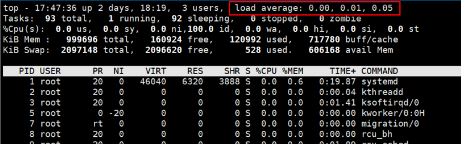
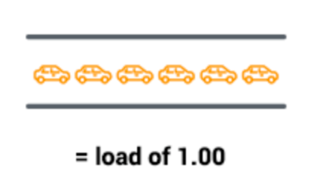
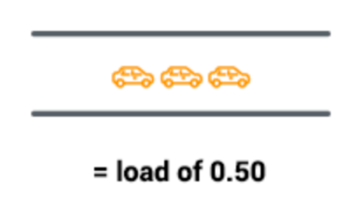
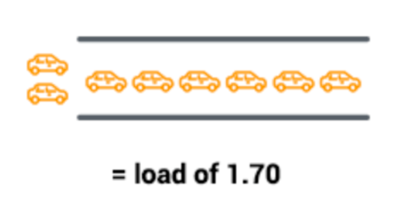
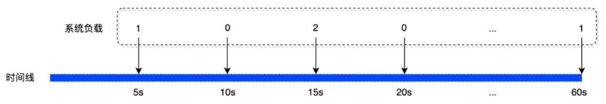

# Linux系统平均负载

# 1 什么是系统平均负载

负载是查看 Linux 服务器运行状态时很常用的一个性能指标。在观察线上服务器运行状况的时候，我们也是经常把负载找出来看一看。在线上请求压力过大的时候，经常是也伴随着负载的飙高。

我们经常会使用 `top` 命令来查看系统的性能情况，在 `top` 命令的第一行可以看到 `load average` 这个数据，如下图所示：



输出中的 Load Avg 就是我们常说的负载，也叫系统平均负载。因为单纯某一个瞬时的负载值并没有太大意义。所以 Linux 是计算了过去一段时间内的平均值，load average` 包含 3 列，分别表示 1 分钟、5 分钟和 15 分钟的 `系统平均负载。


那么 top 命令展示的数据数是如何来的呢？事实上，top 命令里的负载值是从 /proc/loadavg 这个伪文件里来的。通过 strace 命令跟踪 top 命令的系统调用可以看的到这个过程。

```bash
# strace top
...
openat(AT_FDCWD, "/proc/loadavg", O_RDONLY) = 7
```

内核中定义了 loadavg 这个伪文件的 open 函数。当用户态访问 /proc/loadavg 会触发内核定义的函数，在这里会读取内核中的平均负载变量，简单计算后便可展示出来。

伪文件 /proc/loadavg 在 kernel 中定义是在 /fs/proc/loadavg.c 中。在该文件中会创建 /proc/loadavg，并为其指定操作方法 loadavg_proc_fops。

```bash
//file: fs/proc/loadavg.c
static int __init proc_loadavg_init(void)
{
 proc_create("loadavg", 0, NULL, &loadavg_proc_fops);
 return 0;
}
```

在 loadavg_proc_fops 中包含了打开该文件时对应的操作方法。

```bash
//file: fs/proc/loadavg.c
static const struct file_operations loadavg_proc_fops = {
 .open  = loadavg_proc_open,
 ......
};
```

当在用户态打开 /proc/loadavg 文件时，都会调用 loadavg_proc_fops 中的 open 函数指针 - loadavg_proc_open。loadavg_proc_open 接下来会调用 loadavg_proc_show 进行处理，核心的计算是在这里完成的。

```bash
//file: fs/proc/loadavg.c
static int loadavg_proc_show(struct seq_file *m, void *v)
{
 unsigned long avnrun[3];

 //获取平均负载值
 get_avenrun(avnrun, FIXED_1/200, 0);

 //打印输出平均负载
 seq_printf(m, "%lu.%02lu %lu.%02lu %lu.%02lu %ld/%d %d\n",
  LOAD_INT(avnrun[0]), LOAD_FRAC(avnrun[0]),
  LOAD_INT(avnrun[1]), LOAD_FRAC(avnrun[1]),
  LOAD_INT(avnrun[2]), LOAD_FRAC(avnrun[2]),
  nr_running(), nr_threads,
  task_active_pid_ns(current)->last_pid);
 return 0;
}
```

在 loadavg_proc_show 函数中做了两件事。

- 调用 get_avenrun 读取当前负载值
- 将平均负载值按照一定的格式打印输出

这样用户通过访问 /proc/loadavg 文件就可以读取到内核计算的负载数据了。其中获取 get_avenrun 只是在访问 avenrun 这个全局数组而已。

```bash
//file:kernel/sched/core.c
void get_avenrun(unsigned long *loads, unsigned long offset, int shift)
{
 loads[0] = (avenrun[0] + offset) << shift;
 loads[1] = (avenrun[1] + offset) << shift;
 loads[2] = (avenrun[2] + offset) << shift;
}
```

现在可以总结一下我们开篇中的一个问题: **内核是如何暴露负载数据给应用层的**？

**内核定义了一个伪文件 /proc/loadavg，每当用户打开这个文件的时候，内核中的 loadavg_proc_show 函数就会被调用到，接着访问 avenrun 全局数组变量 并将平均负载从整数转化为小数，并打印出来。**


对于系统平均负载这个数值，可能很多同学并不完全理解其意义，并不知道数值达到多少时才表示系统负载过高。


《Understanding Linux CPU Load（链接在文章最后）》这篇文章已经非常通俗的解释了什么是 `系统平均负载`，这里借用一下此文中的例子。

如果将 CPU 比作是桥梁，对于单核的 CPU 就好比是单车道的桥梁。每次桥梁只能让一辆汽车通过，并且要以规定的速度通过。那么：

- 如果每个时刻都只有一辆汽车通过，那么所有汽车都不用排队，此时桥梁的使用率最高。以平均负载 1.0 表示，如下图所示：




- 如果每隔一段时间才有一辆汽车通过，那么表示桥梁部分时间处于空闲的情况。并且间隔的时间越长，表示桥梁空闲率越高。此时的平均负载小于 1.0，如下图所示：




- 当有大量的汽车通过桥梁时，有些汽车需要等待其他车辆通过后才能继续通行，这时表示桥梁超负荷工作。此时平均负载大于1.0，如下图所示：



系统的平均负载与上面的例子一样，在单核 CPU 的环境下：

- 当平均负载等于 1.0 时，表示 CPU 使用率最高。
- 当平均负载小于 1.0 时，表示 CPU 使用率处于空闲状态。
- 当平均负载大于 1.0 时，表示 CPU 使用率已经超过负荷。

对于**单核 CPU** 来说，平均负载 1.0 表示使用率最高。但对于多核 CPU 来说，平均负载要乘以核心数。比如在 4 核 CPU 的系统中，当平均负载为 4.0 时，才表示 CPU 的使用率最高。


# 2 Linux 平均负载计算原理

在介绍系统平均负载的计算原理前，先要介绍一下什么是系统负载。在 Linux 系统中，系统负载表示 **系统中当前正在运行的进程数量**，其包括 `可运行状态` 的进程数和 `不可中断休眠状态` 的进程数的和。注意：不可中断休眠状态的进程一般是在等待 I/O 完成的进程。

```javascript
系统负载 = 可运行状态进程数 + 不可中断休眠状态进程数
```

复制

知道了什么是 `系统负载`，那么 `系统平均负载` 就容易理解了。比如每 5 秒统计一次系统负载，1 分钟内会统计 12 次。如下所示：

```javascript
第5秒  -> 系统负载
第10秒 -> 系统负载
第15秒 -> 系统负载
...
第60秒 -> 系统负载
```

复制

然后把每次统计到的系统负载加起来，再除以统计次数，即可得出 `系统平均负载`。如下图所示：




但这种计算方式有些缺陷，就是预测系统负载的准确性不够高，因为越老的数据越不能反映现在的情况。打个比方，要预测某条公路今天的车流量，使用昨天的数据作为预测依据，会比使用一个月之前的数据作为依据要准确得多。

**所以，时间越近的数据，对未来的预测准确性越高。**

Linux 内核使用一种名为 `指数平滑法` 的算法来解决这个问题，指数平滑法的核心思想是对新老数据进行加权，越老的数据权重越低。

> 指数平滑法：是由 Robert G..Brown 提出的一种加权移动平均法，有兴趣了解其数学原理的可以搜索相关资料，本文不作详细介绍。


其计算公式如下（来源于 Linux 内核代码 kernel/sched/core.c）：

```javascript
load1 = load0 * e + active * (1 - e)
```

复制

解释一下上面公式的意思：

- **load1**：表示时间 t + 1 的系统负载。
- **load0**：表示时间 t 的系统负载。
- **e**：表示衰减系数。
- **active**：表示系统中的活跃进程数（可运行状态进程数 + 不可中断休眠状态进程数）。

所以，我们就可以使用上面的公式来预测任何时间的系统平均负载了。比如，我们要预测时间点 n 的系统平均负载，那么可以这样来计算：

```javascript
load1 = load0 * e + active * (1 - e)
load2 = load1 * e + active * (1 - e)
load3 = load2 * e + active * (1 - e)
...
loadn = loadn-1 * e + active * (1 - e)
```

现在就只剩下 `衰减系数` 该如何计算了。

从 Linux 内核的注释可以了解到，计算 1 分钟内系统平均负载的 `衰减系数` 的计算方式如下：

```javascript
1 / exp(5sec / 1min)
```

其中：

- **5sec**：表示统计的时间间隔，5秒。
- **1min**：表示统计的时长，1分钟。
- **exp**：表示以自然常数 e 为底的指数函数。

也就是说，要计算一分钟的系统平均负载时，需要使用上面的 `衰减系数`。对于 5 分钟和 15 分钟的 `衰减系数` 的计算方式分别为：

```javascript
1 / exp(5sec / 5min)
1 / exp(5sec / 15min)
```

Linux 内核已经把 1 分钟、5 分钟和 15 分钟的 `衰减系数` 结果计算出来，并且定义在 `include/linux/sched.h` 文件中，如下所示：

```javascript
#define EXP_1       1884        /* 1/exp(5sec/1min) as fixed-point */
#define EXP_5       2014        /* 1/exp(5sec/5min) */
#define EXP_15      2037        /* 1/exp(5sec/15min) */
```

通过上述公式计算出来的 `衰减系数` 是个浮点数，而在内核中是不能进行浮点数运行的。解决方法是先对 `衰减系数` 进行扩大，然后在展示时最缩小。所以，上面的 `衰减系数` 数值是经过扩大 2048 倍后的结果。


# 3 Linux 平均负载计算实现

**万事俱备，只欠东风**。上面我们已经把所有的知识点介绍了，现在来分析一下 Linux 内核代码是怎样实现的。

## 3.1 数据存储

在 Linux 内核中，使用了 `avenrun` 数组来存储 1 分钟、5 分钟和 15 分钟的系统平均负载，如下代码所示：

```javascript
unsigned long avenrun[3];
```

如元素 `avenrun[0]` 用于存储 1 分钟内的系统平均负载，而元素 `avenrun[1]` 用于存储 5 分钟的系统平均负载，如此类推。

## 3.2 统计过程

由于统计需要定时进行，所以内核把统计过程放置到 `时钟中断` 中进行。当 `时钟中断` 触发时，将会调用 `do_timer()` 函数，而 `do_timer()` 函数将会调用 `calc_global_load()` 来统计系统平均负载。

我们来看看 `calc_global_load()` 函数的实现：

```javascript
void calc_global_load(unsigned long ticks)
{
    long active, delta;

    // 1. 如果还没到统计的时间间隔，那么将不进行统计（5秒统计一次）
    if (time_before(jiffies, calc_load_update + 10))
        return;

    // 2. 获取活跃进程数
    delta = calc_load_fold_idle();
    if (delta)
        atomic_long_add(delta, &calc_load_tasks);

    active = atomic_long_read(&calc_load_tasks);
    active = active > 0 ? active * FIXED_1 : 0;

    // 3. 统计各个时间段系统平均负载
    avenrun[0] = calc_load(avenrun[0], EXP_1, active);
    avenrun[1] = calc_load(avenrun[1], EXP_5, active);
    avenrun[2] = calc_load(avenrun[2], EXP_15, active);

    // 4. 更新下次统计的时间（增加5秒）
    calc_load_update += LOAD_FREQ;

    ...
}
```

`calc_global_load()` 函数主要完成 4 件事情：

1. 判断当前时间是否需要进行统计，如果还没到统计的时间间隔，那么将不进行统计（5秒统计一次）。
2. 获取活跃进程数（可运行状态进程数 + 不可中断休眠状态进程数）。
3. 统计各个时间段系统平均负载（1分钟、5分钟和15分钟）。
4. 更新下次统计的时间（增加5秒）。

从上面的分析可知，`calc_global_load()` 函数将会调用 `calc_load()` 来计算系统平均负载。其代码如下：

```javascript
/*
 * a1 = a0 * e + a * (1 - e)
 */
static unsigned long
calc_load(unsigned long load, unsigned long exp, unsigned long active)
{
    load *= exp;
    load += active * (FIXED_1 - exp);
    load += 1UL << (FSHIFT - 1);

    return load >> FSHIFT;
}
```

`calc_load()` 函数的各个参数意义如下：

- **load**：`t-1` 时间点的系统负载。
- **exp**：衰减系数。
- **active**：活跃进程数。

可以看出，`calc_load()` 函数的实现并不是我们所以为的传统的平均数的计算方法，而是采用的一种**指数加权移动平均（Exponential Weighted Moving Average，EMWA）**的平均数计算法。


# 4 平均负载和 CPU 消耗的关系

现在很多同学都将平均负载和 CPU 给联系到了一起。认为负载高、CPU 消耗就会高，负载低，CPU 消耗就会低。

在很老的 Linux 的版本里，统计负载的时候确实是只计算了 runnable 的任务数量，这些进程只对 CPU 有需求。在那个年代里，负载和 CPU 消耗量确实是正相关的。负载越高就表示正在 CPU 上运行，或等待 CPU 执行的进程越多，CPU 消耗量也会越高。

但是前面我们看到了，本文使用的 3.10 版本的 Linux 负载平均数不仅跟踪 runnable 的任务，而且还跟踪处于 uninterruptible sleep 状态（不可中断的状态）的任务。而 uninterruptible 状态的进程其实是不占 CPU 的。

**所以说，负载高并一定是 CPU 处理不过来，也有可能会是因为磁盘等其他资源调度不过来而使得进程进入 uninterruptible 状态的进程导致的！**


# 5 总结

把负载工作原理分成了如下三步。

- 1.内核定时汇总每 CPU 负载到系统瞬时负载
- 2.内核使用指数加权移动平均快速计算过去1、5、15分钟的平均数
- 3.用户进程通过打开 loadavg 读取内核中的平均负载

我们再回头来总结一下开篇提到的几个问题。

**1.负载是如何计算出来的?**
是定时将每个 CPU 上的运行队列中 running 和 uninterruptible 的状态的进程数量汇总到一个全局系统瞬时负载值中，然后再定时使用指数加权移动平均法来统计过去 1 分钟、过去 5 分钟、过去 15 分钟的平均负载。

**2.负载高低和 CPU 消耗正相关吗？**
负载高低表明的是当前系统上对系统资源整体需求更情况。如果负载变高，可能是 CPU 资源不够了，也可能是磁盘 IO 资源不够了。所以不能说看着负载变高，就觉得是 CPU 资源不够用了。

**3.内核是如何暴露负载数据给应用层的？**
内核定义了一个伪文件 /proc/loadavg，每当用户打开这个文件的时候，内核中的 loadavg_proc_show 函数就会被调用到，该函数中访问 avenrun 全局数组变量，并将平均负载从整数转化为小数，然后打印出来。


> **参考文献：**

- 《Understanding Linux CPU Load》 https://scoutapm.com/blog/understanding-load-averages
- 《Linux系统平均负载是如何计算的》 https://blog.csdn.net/rikeyone/article/details/108309665


# Linux实例负载高问题排查和异常处理

本文档介绍Linux云服务器负载高导致ECS实例运行变慢、自动关机或重启、无法登录等异常问题的排查方法和解决方案。

**问题描述**

在您使用ECS实例过程中，可能会遇到实例系统负载较高的情况，负载过高，可能会引发一系列异常问题，简单说明如下：

- **CPU使用率或负载过高**：一般来说，当CPU使用率≥80%时，定义为CPU使用率过高。CPU使用率持续过高，可能会导致实例运行速度变慢，自动关机或重启、无法登录等问题。
- **带宽使用率过高**：一般来说，带宽使用率≥当前带宽80%时，定义为带宽使用率过高。带宽使用率持续过高，将影响实例的网络连通性或网络吞吐，例如实例无法远程连接、网速过慢等。
- **内存使用率过高**：一般来说，当内存使用率≥80%时，定义为内存使用率过高。内存使用率过高，可能会出现系统卡顿、内部服务响应速度变慢等问题。
- **I/O使用率过高**：一般来说，当前I/O读写≥该云盘I/O的80%时，定义为I/O使用率过高。I/O使用率过高，可能会出现文件读写变慢、应用性能下降或报错等问题。


