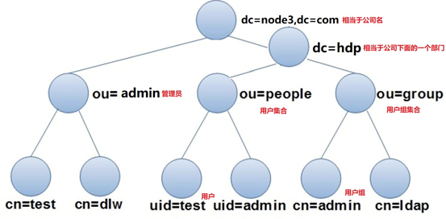
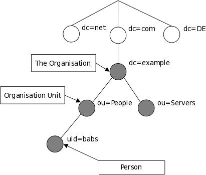
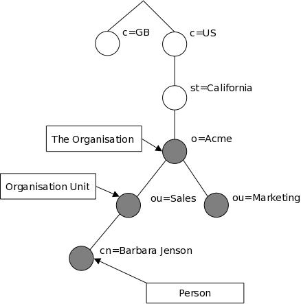
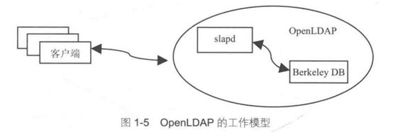
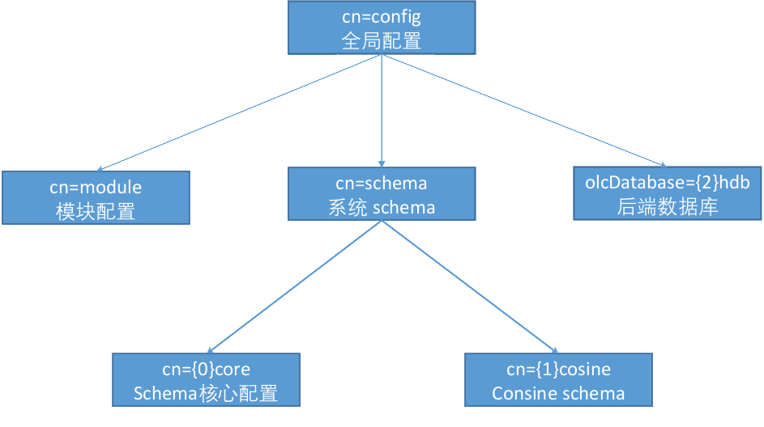
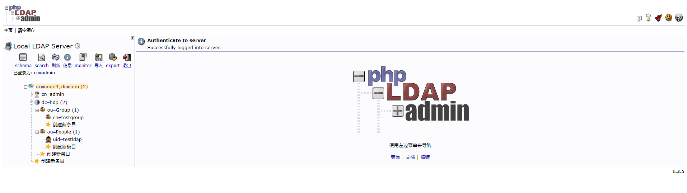
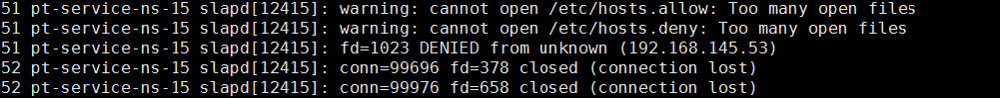
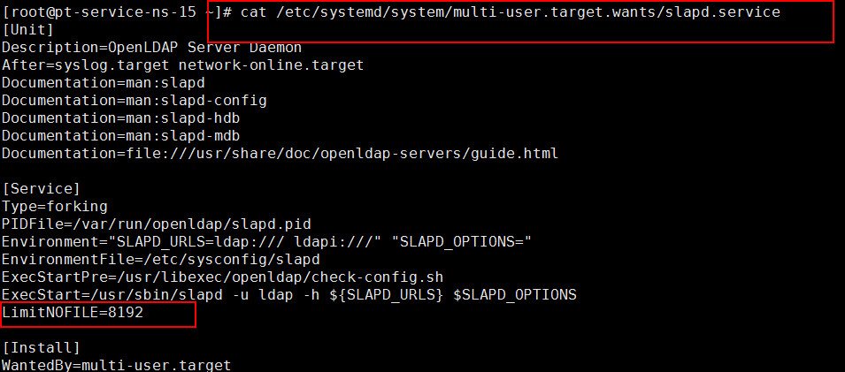

[TOC]


#  OpenLDAP账号统一管理

官方DOC ： https://www.openldap.org/doc/admin24/

# 1 LDAP概述

## 1.1 LDAP 相关概念

OpenLDAP 是一款轻量级目录访问协议（Lightweight Directory Access Protocol，LDAP），属于开源集中账号管理架构的实现，且支持众多系统版本，被广大互联网公司所采用。

  LDAP 具有两个国家标准，分别是X.500 和LDAP。OpenLDAP 是基于X.500 标准的，而且去除了X.500 复杂的功能并且可以根据自我需求定制额外扩展功能，但与X.500 也有不同之处，例如OpenLDAP 支持TCP/IP 协议等，目前TCP/IP 是Internet 上访问互联网的协议。

  OpenLDAP 则直接运行在更简单和更通用的TCP/IP 或其他可靠的传输协议层上，避免了在OSI会话层和表示层的开销，使连接的建立和包的处理更简单、更快，对于互联网和企业网应用更理想。LDAP 提供并实现目录服务的信息服务，目录服务是一种特殊的数据库系统，对于数据的读取、浏览、搜索有很好的效果。目录服务一般用来包含基于属性的描述性信息并支持精细复杂的过滤功能，但OpenLDAP 目录服务不支持通用数据库的大量更新操作所需要的复杂的事务管理或回滚策略等。

  OpenLDAP 默认以Berkeley DB 作为后端数据库，Berkeley DB 数据库主要以散列的数据类型进行数据存储，如以键值对的方式进行存储。Berkeley DB 是一类特殊的数据库，主要用于搜索、浏览、更新查询操作，一般对于一次写入数据、多次查询和搜索有很好的效果。Berkeley DB 数据库是面向查询进行优化，面向读取进行优化的数据库。Berkeley DB 不支持事务型数据库（MySQL、MariDB、Oracle 等）所支持的高并发的吞吐量以及复杂的事务操作。

  OpenLDAP 目录中的信息是按照树形结构进行组织的，具体信息存储在条目（entry）中，条目可以看成关系数据库中的表记录，条目是具有区别名（Distinguished Name，DN）的属性（attribute），DN 是用来引用条目，DN 相当于关系数据库（Oracle/MySQL）中的主键（primary key），是唯一的。属性由类型（type）和一个或者多个值（value）组成，相当于关系数据库中字段的概念。

1）轻型目录访问协议（Lightweight Directory Access Protocol），LDAP是一种通信协议，LDAP能够支持TCP/IP。协议就是标准，在这套标准之下，AD（Active Directory）是微软实现的一套产品。可以把AD理解成是个数据库，也有很多人直接把LDAP说成是数据库（一个树形结构的数据库）。LDAP也有服务端和客户端，服务端用来存放资源，客户端进行相应的控制和操作。

2）LDAP的存储是树形结构的，数据存储在叶子节点上，因此LDAP的应用中主要使用其进行查询，插入删除等操作效率会相对较低。看看下面的样例：

```
LDAP中定义一个记录的位置：树（dc=main）分支（ou=o1,ou=oo1,ou=ooo1）节点（cn=node）
dn: cn=node,ou=o1,ou=oo1,ou=ooo1,dc=main
```

3）ou会有多个值，从树根到达node的位置，可能要经过好几个分支，所以ou可能有多个值，关于dn后面一串，分别是cn，ou，dc；中间使用逗号分隔。

```bash
LDAP树形数据库各描述符说明：
dc：一条记录所属区域（树），一般为公司名，例如：dc=163,dc=com
ou：一条记录所属组织（分支），为组织单元，最多可以有四级，每级最长32个字符，可以为中文
dn：一条记录的详细位置，
cn/uid：一条记录的名字/id（节点），为用户名或者服务器名，最长可以到80个字符，可以为中文
LDAP：目录树的最顶部就是根，就是所谓的“基准DN”
```


| **关键字** | **英文全称**       | **含义**                                                     |
| ---------- | ------------------ | ------------------------------------------------------------ |
| **dc**     | Domain Component   | 域名的部分，其格式是将完整的域名分成几部分，如域名为example.com变成dc=example,dc=com（一条记录的所属位置） |
| **uid**    | User Id            | 用户ID zhansan（一条记录的ID）                               |
| **ou**     | Organization Unit  | 组织单位，组织单位可以包含其他各种对象（包括其他组织单元），如“oa组”（一条记录的所属组织） |
| **cn**     | Common Name        | 公共名称，如“Thomas Johansson”（一条记录的名称）             |
| **sn**     | Surname            | 姓，如“许”                                                   |
| **dn**     | Distinguished Name | “uid=zhansan,ou=oa组,dc=example,dc=com”，一条记录的位置（唯一） |
| **rdn**    | Relative dn        | 相对辨别名，类似于文件系统中的相对路径，它是与目录树结构无关的部分，如“uid=tom”或“cn= Thomas Johansson” |


## 1.2. LDAP 应用场景

我们知道，账号是登录linux系统的唯一入口。要登录系统，首先系统要存在登录所使用的账号（/etc/passwd）及密码信息（/etc/shadow），然后经过系统查找顺序（/etc/nsswith.conf）及认证模块（/etc/pam.d/*）验证，得到授权后方可登录系统。如果多个用户登录系统，就需要在每个系统上创建用户名和密码；否则，就无法登录系统。

  对于账号管理人员而言，维护10 台、100 台机器的账号，或许勉强可以维护、管理。如果机器数量达到1000 以上时，对于账号的创建、回收、权限的分配、密码策略、账号安全审计等一系列操作，账号管理人员就心有余而力不足了。此时OpenLDAP 账号集中管理软件就应用而生，它可以实现账号集中维护、管理，只需要将被管理的机器加入到服务器端即可，此后所有与账号相关的策略均在服务端实现，从而解决了运维案例所产生的众多管理问题。

  关于账号的添加、删除、修改、权限的赋予等一系列操作只需要在服务端操作即可，无须在客户端机器进行单独操作。客户端账号及密码均通过OpenLDAP 服务器进行验证，从而实现账号集中认证管理，此时账号管理员只须维护OpenLDAP 服务器条目即可。

  OpenLDAP 属于开源软件，且OpenLDAP 支持LDAP 最新标准、更多模块扩展功能、自定义schema 满足需求、权限管理、密码策略及审计管理、主机控制策略管理、第三方应用平台管理以及与第三方开源软件结合实现高可用负载均衡平台等诸多功能，这也是商业化管理软件无可比拟的。所以关于账号的管理OpenLDAP 是企业唯一的选择。目前各大著名公司都在使用OpenLDAP实现账号的集中管理，如PPTv、金山[GOOGL]、Facebook 等。

由于LDAP使用树形结构存储数据，因此查询的效率更高（参考关系型数据库中的索引原理：B树/B+树），因此在某些特定的场景中，使用这种树形结构进行存储更有优势，**例如：需要存储大量的静态数据，数据相对稳定，无需进行频繁的修改，能够进行快速查找。**LDAP与传统的关系型数据库相比，结构上的特点决定了其能承担需要速检索的应用场景，比如域验证。

- 网络服务：DNS服务
- 统一认证服务
- Linux PAM（ssh，login, cvs…）
- Apache访问控制
- 各种服务登录（ftpd， php based, perl based, python based…）
- 个人信息类，比如地址簿
- 服务器信息，如账号管理，邮件服务等


## 1.3 LDAP 目录服务优点

- OpenLDAP 是一个跨平台的标准互联网协议，它基于X.500 标准协议。
- OpenLDAP 提供静态数据查询搜索，不需要像在关系数据中那样通过SQL 语句维护数据库信息。
- OpenLDAP 基于推和拉的机制实现节点间数据同步，简称复制（replication）并提供基于TLS、SASL 的安全认证机制，实现数据加密传输以及Kerberos 密码验证功能。
- OpenLDAP 可以基于第三方开源软件实现负载（LVS、HAProxy）及高可用性解决方案，24 小时提供验证服务，如Headbeat、Corosync、Keepalived 等。
- OpenLDAP 数据元素使用简单的文本字符串（简称LDIF 文件）而非一些特殊字符，便于维护管理目录树条目。 章
- OpenLDAP 可以实现用户的集中认证管理，所有关于账号的变更，只须在OpenLDAP 服务器端直接操作，无须到每台客户端进行操作，影响范围为全局。
- OpenLDAP 默认使用协议简单如支持TCP/ZP 协议传输条目数据，通过使用查找操作实现对目录树条目信息的读写操作，同样可以通过加密的方式进行获取目录树条目信息。
- OpenLDAP 产品应用于各大应用平台（Nginx、HTTP、vsftpd、Samba、SVN、Postfix、OpenStack、Hadoop 等）、服务器（HP、IBM、Dell 等）以及存储（EMC、NetApp 等）控制台，负责管理账号验证功能，实现账号统一管理。
- OpenLDAP 实现具有费用低、配置简单、功能强大、管理容易及开源的特点。
- OpenLDAP 通过ACL（Access Control List）灵活控制用户访问数据的权限，从而保证数据的安全性。


## 1.4 LDAP 基本模型

LDAP的基本模型是建立在"条目"（Entry）的基础上。一个条目是一个或多个属性的集合，并且具有一个全局唯一的"可区分名称"（用dn表示）。与关系型数据（后面简称数据库）进行类比，一个条目相当于数据库中的一条记录，而dn相当于数据库中记录的关键字，属性相当于数据库中的字段。

注意：dn必须是全局唯一的。

LDAP中，将数据组织成一个树形结构，这与现实生活中的很多数据结构可以对应起来，而不像设计关系型数据库的表，需要进行多种变化。如下图所展示的就是一个树形结构的数据。



在上图所示的树形结构中，树的根结点是一个组织的域名（node3.com，可以根据自己意愿配），其下分为2个部分，分别是ou=admin和dc=hdp，dc=hdp下面又分ou=people和ou=group。admin用来管理所有管理人员，people用来管理登录系统的用户，group用来管理系统中的用户组。当然，在该图中还可继续增加其他分支。

对于图中所示的树形结构，使用关系数据库来保存数据的话，需要设置多个表，一层一层分别保存，当需要查找某个信息时，再逐层进行查询，最终得到结果。

若使用目录来保存该图中的数据，则更直观。图中每个结点用一个条目来保存，不同类型的结点需要保存的数据可能不同，在LDAP中通过一个称为objectClass的类型来控制不同结点需要的数据（称为属性）。

**传统命名的示例LDAP目录树：**




**基于Internet域名的树结构，常用于DNS服务器：**




就跟上面说的一样，LDAP是树状结构的数据库，所以说如果想要找到其中一个节点，就得通过逐层查询，并且必须保证每一个节点的路径唯一，那么这个节点的路径就称之为dn，dn 的编写路径必须是由下而上编写的，例如：

> cn=scott,ou=marketing,ou=people,dc=mydomain,dc=org

| 关键字 | 英文全称           | 含义                                                         |
| ------ | ------------------ | ------------------------------------------------------------ |
| dc     | Domain Component   | 域名的部分，其格式是将完整的域名分成几部分，如域名为 example.com 那么就是： dc=example,dc=com |
| uid    | User Id            | 用户 ID，如 “tom”                                            |
| ou     | Organization Unit  | 组织单位，类似于 Linux 文件系统中的子目录，它是一个容器对象，组织单位可以包含其他各种对象（包括其他组织单元），如 “market” |
| cn     | Common Name        | 公共名称，如 “Thomas Johansson”                              |
| sn     | Surname            | 姓，如 “Johansson”                                           |
| c      | Country            | 国家，如 “CN” 或“US”等。                                     |
| o      | Organization       | 组织名，如 “Example, Inc.”                                   |
| dn     | Distinguished Name | 惟一辨别名，类似于 Linux 文件系统中的绝对路径，每个对象都有一个惟一的名称，如 “uid= tom,ou=market,dc=example,dc=com”，在一个目录树中 DN 总是惟一的 |
| rdn    | Relative dn        | 相对辨别名，类似于文件系统中的相对路径，它是与目录树结构无关的部分，如 “uid=tom” 或“cn= Thomas Johansson” |


## 1.5 LDAP 工作模型



openLDAP工作模型解释如下：

1. 客户端向OpenLDAP服务器发起验证请求；
2. 服务器接受用户请求后，并通过slapd进程向后端的数据库进行查询；
3. slapd将查询的结果返回给客户端即可。如果有缓存机制，服务器端会先将查询的条目进行缓存，然后再发给客户端。


## 1.6 LDAP 功能

在LDAP 的功能模型中定义了一系列利用LDAP 协议的操作，主要包含以下4 部分。

- 查询操作（ldapsearch）：允许查询目录并取得条目，其查询性能比关系数据库好。
- 更新操作（ldapupdate）：目录树条目支持条目的添加、删除、修改等操作。
- 同步操作：OpenLDAP 是一种典型的分布式结构，提供复制同步，可将主服务器上的数据通过推或拉的机制实现在从服务器上更新，完成数据的同步，从而避免OpenLDAP 服务器出现单点故障，影响用户验证。
- 认证和管理操作：允许客户端在目录中识别自己，并且能够控制一个会话的性质。


# 2 OpenLDAP 服务端部署

环境信息如下：

| 主机名      | IP            | 角色        |
| ----------- | ------------- | ----------- |
| ldap-server | 10.159.238.40 | ldap server |
| ldap-client | 10.159.238.41 | ldap client |
|             |               |             |


## 2.1 OpenLDAP 服务端安装

修改主机名：

```
hostnamectl set-hostname ldap-server
echo '10.159.238.40 ldap-server' >>/etc/hosts
echo '10.159.238.41 ldap-client' >>/etc/hosts
```


1.使用yum命令安装openldap

```bash
yum -y install openldap compat-openldap openldap-clients openldap-servers openldap-devel

# 复制一个默认配置到指定目录下,并授权，这一步一定要做，然后再启动服务，不然生产密码时会报错
cp /usr/share/openldap-servers/DB_CONFIG.example /var/lib/ldap/DB_CONFIG
# 授权给ldap用户,此用户yum安装时便会自动创建
chown -R ldap. /var/lib/ldap/DB_CONFIG
 
# 启动服务，先启动服务，配置后面再进行修改
systemctl start slapd
systemctl enable slapd
systemctl status slapd
```

2、安装包说明

| 安装包名称           | 说明                                                         |
| -------------------- | ------------------------------------------------------------ |
| openldap             | openldap服务端和客户端必须用的库文件。                       |
| openldap-servers     | 用于启动服务和设置. 包含单独的ldap后台守护程序。             |
| openldap-clients     | 用于启动服务和设置. 包含单独的ldap后台守护程序。             |
| openldap-devel       | devel包，可选择进行安装。                                    |
| openldap-servers-sql | 支持sql模块，可进行选择性安装。                              |
| migrationtools       | 通过migrationtools实现OpenLDAP用户及用户组的添加，导入系统账户，可进行选择性安装。 |
| compat-openldap      | openldap兼容性库                                             |

3.查看安装版本

```bash
[root@ldap-server certs]# slapd -VV
@(#) $OpenLDAP: slapd 2.4.44 (Aug 31 2021 14:48:49) $
	mockbuild@x86-02.bsys.centos.org:/builddir/build/BUILD/openldap-2.4.44/openldap-2.4.44/servers/slapd

```


## 2.2 OpenLDAP 服务端配置

OpenLDAP 2.4有两种配置方式：

- 通过配置文件`slapd.conf`进行配置，这是旧版本的配置方式
- 通过修改配置数据库(cn=config)，这是新的推荐的配置方式


### 2.2.1 配置介绍

```
/etc/openldap/slapd.d/*：这下面是/etc/openldap/slapd.conf配置信息生成的文件，每修改一次配置信息，这里的东西就要重新生成
/etc/openldap/schema/*：OpenLDAP的schema存放的地方
/var/lib/ldap/*：OpenLDAP的数据文件
/usr/share/openldap-servers/slapd.conf.obsolete 模板配置文件
/usr/share/openldap-servers/DB_CONFIG.example 模板数据库配置文件
```

  OpenLDAP监听的端口：

   默认监听端口：389（明文数据传输）

   加密监听端口：636（密文数据传输）

这里cn=config的方式。cn=config实际上是将slapd.conf中的内容转换成ldif格式，并组成以`cn=config`为根的目录树，这棵树会有很多节点，如下图所示：




cn=config节点是Global config options。 cn=module{0}节点是动态加载的模块，只有在用`--enable-modules`选项配置的软件才会使用。 cn=schema节点，`cn=schema,cn=config`条目包含了系统的schema定义。`cn=schema,cn=config`的子条目包含的是从配置文件加载或在运行时加载的用户的schema。

配置`cn=config`是一种动态配置的方式，不需要重启slapd进程。可以在/etc/openldap/slapd.d目录下找到文本格式的ldif文件：

```
tree slapd.d/
slapd.d/
├── cn=config
│   ├── cn=schema
│   │   ├── cn={0}core.ldif
│   │   ├── cn={10}openldap.ldif
│   │   ├── cn={11}pmi.ldif
│   │   ├── cn={12}ppolicy.ldif
│   │   ├── cn={1}collective.ldif
│   │   ├── cn={2}corba.ldif
│   │   ├── cn={3}cosine.ldif
│   │   ├── cn={4}duaconf.ldif
│   │   ├── cn={5}dyngroup.ldif
│   │   ├── cn={6}inetorgperson.ldif
│   │   ├── cn={7}java.ldif
│   │   ├── cn={8}misc.ldif
│   │   └── cn={9}nis.ldif
│   ├── cn=schema.ldif
│   ├── olcDatabase={0}config.ldif
│   ├── olcDatabase={-1}frontend.ldif
│   ├── olcDatabase={1}monitor.ldif
│   └── olcDatabase={2}hdb.ldif
└── cn=config.ldif
```

**1、配置语法**

LDIF文件的一般规则适用于配置信息:

- 以“#”字符开头的注释行将被忽略。
- 如果一行从一个空格开始，则认为它是前一行的延续(即使前一行是注释) 。
  条目由空白行分隔。

配置LDIF的总布局如下:

```bash
#全局配置
dn: cn=config

#modules 配置
dn: cn=module,cn=config

#schema 定义
dn: cn=schema,cn=config

#全局数据配置
dn: olcDatabase=config,cn=config

#数据库监控
dn: olcDatabase=monitor,cn=config

#后端数据库
dn: olcDatabase=hdb,cn=config
```

- olc代表 OpenLDAP configure
- 参数由空格分隔，如果参数需要包含空格，需要用双引号括起来，如： “fooher com”


### 2.2.2 生成LDAP管理用户admin密码

从openldap2.4.23版本开始，所有配置都保存在/etc/openldap/slapd.d目录下的cn=config文件夹内，不再使用slapd.conf作为配置文件。配置文件的后缀为 ldif，且每个配置文件都是通过命令自动生成的，任意打开一个配置文件，在开头都会有一行注释，说明此为自动生成的文件，请勿编辑，使用ldapmodify命令进行修改。

安装openldap后，会有三个命令用于修改配置文件，分别为ldapadd，ldapmodify，ldapdelete，顾名思义就是添加，修改和删除。而需要修改或增加配置时，则需要先写一个ldif后缀的配置文件，然后通过命令将写的配置更新到slapd.d目录下的配置文件中去，完整的配置过程如下：

```bash
# 生成管理员密码,记录下这个密码，后面需要用到
slappasswd -s 123456
{SSHA}eyaQ+zJRr4wSCsXNadiy8lQDIeHuFS8P

# 新增修改密码文件,ldif为后缀，文件名随意，不要在/etc/openldap/slapd.d/目录下创建类似文件
# 生成的文件为需要通过命令去动态修改ldap现有配置，如下，我在家目录下，创建文件
mkdir -p /etc/openldap/ldif && cd /etc/openldap/ldif
cat >changepwd.ldif<<\EOF
dn: olcDatabase={0}config,cn=config
changetype: modify
add: olcRootPW
olcRootPW: {SSHA}eyaQ+zJRr4wSCsXNadiy8lQDIeHuFS8P
EOF

# 第一行执行配置文件，这里就表示指定为 cn=config/olcDatabase={0}config 文件。你到/etc/openldap/slapd.d/目录下就能找到此文件
# 第二行 changetype 指定类型为修改
# 第三行 add 表示添加 olcRootPW 配置项
# 第四行指定 olcRootPW 配置项的值,即为slappasswd生成的密码
# 在执行下面的命令前，你可以先查看原本的olcDatabase={0}config文件，里面是没有olcRootPW这个项的，执行命令后，你再看就会新增了olcRootPW项，而且内容是我们文件中指定的值加密后的字符串
 
# 执行命令，修改ldap配置，通过-f执行文件
ldapadd -Y EXTERNAL -H ldapi:/// -f changepwd.ldif
执行修改命令后，有如下输出则为正常：
[root@ldap-server ~]# ldapadd -Y EXTERNAL -H ldapi:/// -f changepwd.ldif
SASL/EXTERNAL authentication started
SASL username: gidNumber=0+uidNumber=0,cn=peercred,cn=external,cn=auth
SASL SSF: 0
modifying entry "olcDatabase={0}config,cn=config"

# 查看olcDatabase={0}config内容，新增了一个olcRootPW项
[root@ldap-server ~]# cat /etc/openldap/slapd.d/cn\=config/olcDatabase\=\{0\}config.ldif
# AUTO-GENERATED FILE - DO NOT EDIT!! Use ldapmodify.
# CRC32 180f0606
dn: olcDatabase={0}config
objectClass: olcDatabaseConfig
olcDatabase: {0}config
olcAccess: {0}to * by dn.base="gidNumber=0+uidNumber=0,cn=peercred,cn=extern
 al,cn=auth" manage by * none
structuralObjectClass: olcDatabaseConfig
entryUUID: 965db09c-0249-103c-9563-8b1e5c79ceb2
creatorsName: cn=config
createTimestamp: 20220105080235Z
olcRootPW:: e1NTSEF9ZXlhUSt6SlJyNHdTQ3NYTmFkaXk4bFFESWVIdUZTOFA=    #新增此行
entryCSN: 20220105084027.953754Z#000000#000#000000
modifiersName: gidNumber=0+uidNumber=0,cn=peercred,cn=external,cn=auth
modifyTimestamp: 20220105084027Z

```

### 2.2.3 导入基本schema

我们需要向ldap中导入一些基本的schema。这些schema文件位于/etc/openldap/schema/目录中，schema控制着条目拥有哪些对象类和属性，可以自行选择需要的进行导入。依次执行下面的命令，导入基础的一些配置，我这里将所有的都导入一下，其中core.ldif是默认已经加载了的，不用导入。

```bash
ldapadd -Y EXTERNAL -H ldapi:/// -f /etc/openldap/schema/cosine.ldif
ldapadd -Y EXTERNAL -H ldapi:/// -f /etc/openldap/schema/nis.ldif
ldapadd -Y EXTERNAL -H ldapi:/// -f /etc/openldap/schema/inetorgperson.ldif
ldapadd -Y EXTERNAL -H ldapi:/// -f /etc/openldap/schema/collective.ldif
ldapadd -Y EXTERNAL -H ldapi:/// -f /etc/openldap/schema/corba.ldif
ldapadd -Y EXTERNAL -H ldapi:/// -f /etc/openldap/schema/duaconf.ldif
ldapadd -Y EXTERNAL -H ldapi:/// -f /etc/openldap/schema/dyngroup.ldif
ldapadd -Y EXTERNAL -H ldapi:/// -f /etc/openldap/schema/java.ldif
ldapadd -Y EXTERNAL -H ldapi:/// -f /etc/openldap/schema/misc.ldif
ldapadd -Y EXTERNAL -H ldapi:/// -f /etc/openldap/schema/openldap.ldif
ldapadd -Y EXTERNAL -H ldapi:/// -f /etc/openldap/schema/pmi.ldif
ldapadd -Y EXTERNAL -H ldapi:/// -f /etc/openldap/schema/ppolicy.ldif
```

###  2.2.4 修改域名

修改域名，新增changedomain.ldif，这里自定义的域名为node1.com，管理员用户账号为admin。如果要修改，则修改文件中相应的dc=node3.com,dc=com为自己的域名。

注意：olcRootPW与`slappasswd -s 123456`生成的保持一致。

```bash
cat >changedomain.ldif<<EOF
dn: olcDatabase={1}monitor,cn=config
changetype: modify
replace: olcAccess
olcAccess: {0}to * by dn.base="gidNumber=0+uidNumber=0,cn=peercred,cn=external,cn=auth" read by dn.base="cn=admin,dc=node3,dc=com" read by * none

dn: olcDatabase={2}hdb,cn=config
changetype: modify
replace: olcSuffix
olcSuffix: dc=node3,dc=com

dn: olcDatabase={2}hdb,cn=config
changetype: modify
replace: olcRootDN
olcRootDN: cn=admin,dc=node3,dc=com

dn: olcDatabase={2}hdb,cn=config
changetype: modify
replace: olcRootPW
olcRootPW: {SSHA}eyaQ+zJRr4wSCsXNadiy8lQDIeHuFS8P

dn: olcDatabase={2}hdb,cn=config
changetype: modify
add: olcAccess
olcAccess: {0}to attrs=userPassword,shadowLastChange by dn="cn=admin,dc=node3,dc=com" write by anonymous auth by self write by * none
olcAccess: {1}to dn.base="" by * read
olcAccess: {2}to * by dn="cn=admin,dc=node3,dc=com" write by * read
EOF
```

执行命令，修改配置:

```bash
[root@ldap-server ~]# ldapmodify -Y EXTERNAL -H ldapi:/// -f changedomain.ldif
SASL/EXTERNAL authentication started
SASL username: gidNumber=0+uidNumber=0,cn=peercred,cn=external,cn=auth
SASL SSF: 0
modifying entry "olcDatabase={1}monitor,cn=config"

modifying entry "olcDatabase={2}hdb,cn=config"

modifying entry "olcDatabase={2}hdb,cn=config"

modifying entry "olcDatabase={2}hdb,cn=config"

modifying entry "olcDatabase={2}hdb,cn=config"

```

### 2.2.5 启用memberof功能

新增add-memberof.ldif，#开启memberof支持并新增用户支持memberof配置

```bash
# 新增add-memberof.ldif, #开启memberof支持并新增用户支持memberof配置
cat >add-memberof.ldif<<EOF
#开启memberof支持
dn: cn=module{0},cn=config
cn: modulle{0}
objectClass: olcModuleList
objectclass: top
olcModuleload: memberof.la
olcModulePath: /usr/lib64/openldap

#新增用户支持memberof配置
dn: olcOverlay={0}memberof,olcDatabase={2}hdb,cn=config
objectClass: olcConfig
objectClass: olcMemberOf
objectClass: olcOverlayConfig
objectClass: top
olcOverlay: memberof
olcMemberOfDangling: ignore
olcMemberOfRefInt: TRUE
olcMemberOfGroupOC: groupOfUniqueNames
olcMemberOfMemberAD: uniqueMember
olcMemberOfMemberOfAD: memberOf
EOF
 
# 新增refint1.ldif文件
cat >refint1.ldif<<EOF
dn: cn=module{0},cn=config
add: olcmoduleload
olcmoduleload: refint
EOF
 
# 新增refint2.ldif文件
cat >refint2.ldif<<EOF
dn: olcOverlay=refint,olcDatabase={2}hdb,cn=config
objectClass: olcConfig
objectClass: olcOverlayConfig
objectClass: olcRefintConfig
objectClass: top
olcOverlay: refint
olcRefintAttribute: memberof uniqueMember  manager owner
EOF
 
# 依次执行下面命令，加载配置，顺序不能错
ldapadd -Q -Y EXTERNAL -H ldapi:/// -f add-memberof.ldif
ldapmodify -Q -Y EXTERNAL -H ldapi:/// -f refint1.ldif
ldapadd -Q -Y EXTERNAL -H ldapi:/// -f refint2.ldif
```

查看当前dn下包含cn=config配置列表会显示出已生效的memberof和refint配置。

```bash
[root@localhost ~]# ldapsearch -Q -LLL -Y EXTERNAL -H ldapi:/// -b cn=config dn   |  grep olcOverlay
dn: olcOverlay={0}memberof,olcDatabase={2}hdb,cn=config
dn: olcOverlay={1}refint,olcDatabase={2}hdb,cn=config
```

以上步骤就完成了OpenLDAP的MemberOf模块启用。

### 2.2.6 创建组织

在上述基础上，我们来创建一个node3 company的组织，node3为域名，并在其下创建一个admin的组织角色(该组织角色内的用户具有管理整个LDAP的权限)和People和Group两个组织单元：

```bash
cat >node3.ldif<<EOF
dn: dc=node3,dc=com
dc: node3
objectClass: top
objectClass: domain
o: node3

dn: cn=admin,dc=node3,dc=com
objectClass: organizationalRole
cn: admin
description: LDAP admin

dn: dc=hdp,dc=node3,dc=com
changetype: add
dc: hdp
objectClass: top
objectClass: dcObject
objectClass: organization
o: hdp

dn: ou=People,dc=hdp,dc=node3,dc=com
ou: People
objectClass: organizationalUnit

dn: ou=Group,dc=hdp,dc=node3,dc=com
ou: Group
objectClass: organizationalUnit
EOF
```

执行命令，添加配置，这里要注意修改域名为自己配置的域名，然后需要输入上面我们生成的密码

```bash
[root@localhost ~]# ldapadd -x -D cn=admin,dc=node3,dc=com -W -f node3.ldif
Enter LDAP Password: 123456
adding new entry "dc=node3,dc=com"

adding new entry "cn=admin,dc=node3,dc=com"

adding new entry "dc=hdp,dc=node3,dc=com"

adding new entry "ou=People,dc=hdp,dc=node3,dc=com"

adding new entry "ou=Group,dc=hdp,dc=node3,dc=com"

```

通过以上的所有步骤，我们就设置好了一个LDAP目录树：

其中**基准dc=node3,dc=com**是该树的跟节点，其下有一个**管理域cn=admin,dc=node3,dc=com**和一个**组织单元dc=hdp,dc=node3,dc=com**, 其下有两个子属性**ou=People,dc=hdp,dc=node3,dc=com**及**ou=Group,dc=hdp,dc=node3,dc=com**。


### 2.2.7 创建用户和用户组的ldif文件

1、先生成一个密码123456：

```bash
[root@ldap-server ~]# slappasswd -s 123456
{SSHA}1XcK2Z+Y0ECEjhTbwygxc8L2bPxmMcQO
```

2、创建新用户的ldif文件

```bash
cat >ldapuser.ldif<<EOF
#这里testUser用户，我将其加入到testgroup组中
# create new
# replace to your own domain name for "dc=***,dc=***" section
dn: uid=testldap,ou=People,dc=hdp,dc=node3,dc=com
objectClass: inetOrgPerson
objectClass: posixAccount
objectClass: shadowAccount
uid: testldap
cn: testgroup
sn: test
userPassword: {SSHA}1XcK2Z+Y0ECEjhTbwygxc8L2bPxmMcQO
loginShell: /bin/bash
uidNumber: 2000
gidNumber: 2000
homeDirectory: /home/testldap

#这是添加一个用户组名为testgroup的cn，在名为Group的ou下
dn: cn=testgroup,ou=Group,dc=hdp,dc=node3,dc=com
objectClass: posixGroup
cn: testgroup
gidNumber: 2000
memberUid: testldap
EOF
```

3、向openldap服务端添加新用户testldap

```bash
[root@ldap-server ~]# ldapadd -x -D cn=admin,dc=node3,dc=com -W -f ldapuser.ldif
Enter LDAP Password:123456
adding new entry "uid=testldap,ou=People,dc=hdp,dc=node3,dc=com"

adding new entry "cn=testgroup,ou=Group,dc=hdp,dc=node3,dc=com"

```

4、为testldap用户修改密码为123456命令为：

```bash
ldappasswd -x -H ldap://10.159.238.40:389 -D "cn=admin,dc=node3,dc=com" -W "uid=testldap,ou=People,dc=hdp,dc=node3,dc=com" -s 123456
```

注：

- ldap://10.159.238.40:389为openldap的服务端ip加端口；
- cn=admin,dc=node3,dc=com为openldap上面设置的管理者节点；
- uid=testldap,ou=People,dc=hdp,dc=node3,dc=com为用户id；
- 123456为修改指定的用户密码。


# 3 OpenLDAP GUI管理工具

针对OpenLDAP图形界面管理，开源组织也提供了GUI管理OpenLDAP软件，目前开源的产品有phpLDAPadmin（web服务）、LDAP Account Manager（web服务）、Apache Directory Studio(依赖JAVA)、LDAP Admin（免安装windows客户端，非常小巧：http://www.ldapadmin.org/download/ldapadmin.html）、LDAPSoft LDAPbrowser （免费，开箱即用）等管理工具。


## 3.1 phpLDAPadmin安装

首先安装Apache和PHP：

```bash
yum -y install httpd php php-ldap php-gd php-mbstring php-pear php-bcmath php-xml
```

然后安装phpldapadmin：

```bash
[root@localhost ~]# yum -y install epel-release
[root@localhost ~]# yum --enablerepo=epel -y install phpldapadmin
```

修改配置文件：

```bash
vim /etc/httpd/conf.d/phpldapadmin.conf
  <IfModule mod_authz_core.c>
    # Apache 2.4
    Require all granted
  </IfModule>

# 修改配置用DN登录ldap
vim /etc/phpldapadmin/config.php
# 398行，默认是使用uid进行登录，我这里改为cn，也就是用户名
$servers->setValue('login','attr','cn');
 
# 460行，关闭匿名登录，否则任何人都可以直接匿名登录查看所有人的信息
$servers->setValue('login','anon_bind',false);
 
# 519行，设置用户属性的唯一性，这里我将cn,sn加上了，以确保用户名的唯一性
$servers->setValue('unique','attrs',array('mail','uid','uidNumber','cn','sn'));

# 启动apache
systemctl start httpd
systemctl enable httpd
```

登录phpldapadmin界面，浏览器访问：http://10.159.238.40/ldapadmin，账号：admin 密码：123456，如下图所示：




ldap-account-manager

安装

1.安装ldap-account-management

```
# apt-get install ldap-account-manager
```

2.浏览器访问

```
http://ip/lam
```


LDAP Admin操作指南  https://blog.csdn.net/vivianliulu/article/details/90640737


# 4 OpenLDAP 客户端部署

修改主机名：

```
hostnamectl set-hostname ldap-server
echo '10.159.238.40 ldap-server' >>/etc/hosts
echo '10.159.238.41 ldap-client' >>/etc/hosts
```


## 4.1 OpenLDAP客户端安装

使用yum命令安装

```bash
yum install -y openldap openldap-clients sssd nss-pam-ldapd
```

## 4.2 OpenLDAP客户端NSS配置

**1. 修改/etc/nslcd.conf**

```bash
cp /etc/nslcd.conf{,.bak$(date +%F)}
cat >/etc/nslcd.conf<<EOF
uid nslcd
gid ldap
uri ldap://10.159.238.40:389
# ldap目录树的基准
base dc=node3,dc=com
# ldap的管理域
binddn cn=admin,dc=node3,dc=com
# ldap管理者密码
bindpw 123456
EOF
```

**2. 启动服务并设置开机自启动**

```bash
chmod 600 /etc/nslcd.conf
systemctl start nslcd
systemctl enable nslcd
systemctl status nslcd
```

**3. 配置/etc/nsswitch.conf**

```bash
cp /etc/nsswitch.conf{,.bak$(date +%F)}
cat >/etc/nsswitch.conf<<EOF
#passwd:     files sss 
#shadow:     files sss
#group:      files sss
#initgroups: files sss
passwd:     files ldap
shadow:     files ldap
group:      files ldap
hosts:      files dns myhostname
bootparams: nisplus [NOTFOUND=return] files

ethers:     files
netmasks:   files
networks:   files
protocols:  files
rpc:        files
services:   files sss

#netgroup:   files sss
netgroup:   nisplus sss
publickey:  nisplus
automount:  files nisplus sss
aliases:    files nisplus
EOF
```

**4. 测试是否可用**

```bash
[root@localhost ~]# getent passwd | grep testldap
testldap:x:2000:3000:testgroup:/home/testldap:/bin/bash

```

## 4.3 OpenLDAP客户端SSSD配置

sssd服务是一个守护进程，该进程可以用来访问多种验证服务器，如LDAP，Kerberos等，并提供授权。SSSD是 介于本地用户和数据存储之间的进程，本地客户端首先连接SSSD，再由SSSD联系外部资源提供者(一台远程服务器) 。

(1) 避免了本地每个客户端程序对认证服务器大量连接，所有本地程序仅联系SSSD，由SSSD连接认证服务器或SSSD缓存，有效的降低了负载。

 (2)允许离线授权。SSSD可以缓存远程服务器的用户认证身份，这允许在远程认证服务器宕机是，继续成功授权用户访问必要的资源。

**1. 修改/etc/sssd/sssd.conf文件，如果文件不存在则新建，执行authconfig命令生成文件内容如下：**

```bash
cp /etc/sssd/sssd.conf{,.bak$(date +%F)}
cat >/etc/sssd/sssd.conf<<EOF
[domain/default]
autofs_provider = ldap
ldap_schema = rfc2307bis
krb5_realm = REDPEAK.COM
ldap_search_base = dc=node3,dc=com
krb5_server = 10.159.238.40
id_provider = ldap 
auth_provider = ldap
chpass_provider = ldap
ldap_uri = ldap://10.159.238.40:389
ldap_id_use_start_tls = False
cache_credentials = True
ldap_tls_cacertdir = /etc/openldap/cacerts
[sssd]
services = nss, pam, autofs
domains = default

[nss]
homedir_substring = /home

[pam]

[sudo]

[autofs]

[ssh]

[pac]

[ifp]

[secrets]
EOF
```

**2. 修改sssd.conf文件权限**

```bash
chmod 600 /etc/sssd/sssd.conf
```

**3. 启动sssd服务并加入系统自启动**

```bash
systemctl start sssd
systemctl enable sssd
systemctl status sssd
```

## 4.4 OpenLDAP与SSH集成

**1. 修改配置文件/etc/ssh/sshd_config，是ssh通过pam认证账号**

```bash
PasswordAuthentication yes
UsePAM yes
```

注意：默认使用的是密码认证方式，在集成SSH登录时需要确保PasswordAuthentication yes配置为yes。

**2. 修改配置文件/etc/pam.d/sshd，以确认调用pam认证文件**

```bash
cp /etc/pam.d/sshd{,.bak$(date +%F)}
cat >/etc/pam.d/sshd<<EOF
#%PAM-1.0
auth       required     pam_sepermit.so
auth       substack     password-auth
auth       include      postlogin
# Used with polkit to reauthorize users in remote sessions
-auth      optional     pam_reauthorize.so prepare
account    required     pam_nologin.so
account    include      password-auth
password   include      password-auth
# pam_selinux.so close should be the first session rule
session    required     pam_selinux.so close
session    required     pam_loginuid.so
# pam_selinux.so open should only be followed by sessions to be executed in the user context
session    required     pam_selinux.so open env_params
session    required     pam_namespace.so
session    optional     pam_keyinit.so force revoke
session    include      password-auth
session    include      postlogin
#加入此行后确保登录成功后创建用户的home目录
session    required     pam_mkhomedir.so
# Used with polkit to reauthorize users in remote sessions
-session   optional     pam_reauthorize.so prepare
EOF
```

**3. 修改配置文件/etc/pam.d/password-auth**

```bash
cp /etc/pam.d/password-auth{,.bak}
[root@localhost ~]# cat >/etc/pam.d/password-auth<<EOF
#%PAM-1.0
# This file is auto-generated.
# User changes will be destroyed the next time authconfig is run.
auth        required      pam_env.so
auth        required      pam_faildelay.so delay=2000000
auth        [default=1 ignore=ignore success=ok] pam_succeed_if.so uid >= 1000 quiet
auth        [default=1 ignore=ignore success=ok] pam_localuser.so
auth        sufficient    pam_unix.so nullok try_first_pass
auth        requisite     pam_succeed_if.so uid >= 1000 quiet_success
#auth        sufficient    pam_sss.so forward_pass
auth        sufficient    pam_ldap.so forward_pass
auth        required      pam_deny.so

account     required      pam_unix.so broken_shadow
account     sufficient    pam_localuser.so
account     sufficient    pam_succeed_if.so uid < 1000 quiet
#account     [default=bad success=ok user_unknown=ignore] pam_sss.so
account     [default=bad success=ok user_unknown=ignore] pam_ldap.so

account     required      pam_permit.so

password    requisite     pam_pwquality.so try_first_pass local_users_only retry=3 authtok_type=
password    sufficient    pam_unix.so sha512 shadow nullok try_first_pass use_authtok
#password    sufficient    pam_sss.so use_authtok
password    sufficient    pam_ldap.so use_authtok

password    required      pam_deny.so

session     optional      pam_keyinit.so revoke
session     required      pam_limits.so
-session     optional      pam_systemd.so
session     optional      pam_mkhomedir.so umask=0077
session     [success=1 default=ignore] pam_succeed_if.so service in crond quiet use_uid
session     required      pam_unix.so
#session     optional      pam_sss.so
session     optional      pam_ldap.so
EOF
```

**5. 重启ssh、sssd和nslcd**

```
systemctl restart sshd
systemctl restart sssd
systemctl restart nslcd
```

到此为止就完成了OpenLDAP与SSH的集成。


## 4.5 验证SSH登录

**1. 确认testldap用户只存在于OpenLDAP**

```
# passwd中不会有testldap用户
more /etc/passwd |grep testldap

id testldap
uid=2000(testldap) gid=2000(testgroup) groups=2000(testgroup)
```

**2. su切换至testldap用户**

```bash
[root@ldap-client ~]# su - testldap
Last login: Fri Jan  7 18:47:58 CST 2022 on pts/0
[testldap@localhost ~]$ id testldap
uid=2000(testldap) gid=3000(testgroup) groups=3000(testgroup)

```

**3. ssh登录**

```bash
# ssh testldap@10.159.238.40

Connecting to 10.159.238.40:22...
Connection established.
To escape to local shell, press 'Ctrl+Alt+]'.

WARNING! The remote SSH server rejected X11 forwarding request.
Creating directory '/home/testldap'.
Last login: Fri Jan  7 18:45:09 2022

[testldap@ldap-client ~]$ pwd
/home/testldap

```


# 5 OpenLDAP 安全配置


## 5.1 OpenLDAP 配置 TLS SSL

**为啥要用TLS?**

Openldap默认使用简单验证，对slapd的所有访问都使用明文密码通过未加密通道进行。为了确保信息安全，需要对信息进行加密传输，SSL（Secure Sockets Layer）是一个可靠的解决方案。

它使用 X.509 证书，由可信任第三方（Certificate Authority (CA)）进行数字签名的一个标准格式的数据。有效的数字签名意味着已签名的数据没有被篡改。如果签名的数据被更改，将不会通过验证

**SSL/TLS 加密原理简介**

SSL/TLS 是基于 PKI 机制的加密方式，包括证书认证、密钥交换、非对称加密、对称加密。SSL/TLS 采用 CA 作为服务端和客户端都信赖的具有权威性的组织，证书的颁发和认证都依赖于 CA，并假定 CA 颁发的证书是可靠的、可信赖的，证书里面的内容是真实的、有效的，并可用于客户机和服务器进行安全的可靠的通信加密。

SSL/TLS 证书用来认证服务器和客户机双方的身份，并用于密钥交换时候的非对称加密。密钥交换完毕之后，就可以用这个密钥做通信数据的对称加密了，具体的加密算法是由客户机和服务器互相协商得来。服务器和客户机由于 SSL/TLS 库的不同以及用户的配置不同，双方支持的算法列表不完全相同，当双方做 SSL/TLS 握手的时候，就需要将自己支持的算法列表及优先顺序告知对方，一旦对方按照优先顺序找到了第一个支持的算法，那么协商完成，否则双方协商失败，SSL/TLS 连接断开。

**关于SSL/TLS**

**LDAP over SSL**：LDAP over SSL 也就是 ldaps，ldap默认不加密情况下是走的389端口，当使用ldaps的时候走的就是636端口了，可以简单理解成http和https的关系，当然ldaps已经淘汰了，不然也不会有LDAP over TLS出现。

**LDAP over TLS**：TLS可以简单理解为ldaps的升级，它默认走389端口，但是会通讯的时候加密，客户端连接LDAP时，需要指明通讯类型为TLS，所以他可以跟不加密的模式一样，任意端口都行。

对比一下连接方式：
ldaps： ldapsearch -H ldaps://127.0.0.1:636
TLS:   ldapsearch -ZZ -H ldap://127.0.0.1:389

OpenLDAP with SSL默认使用tcp 636端口，提前在iptables放行。OpenLDAP 编译需要开启"--with-tls"选项，可通过"./configure --help"查看相关说明。


### 5.1.1 OpenLDAP 服务端配置

openssl生成证书

```bash
#生成 ca 证书
cd /etc/openldap/certs/
openssl genrsa -out rootCA.key 2048
openssl req -x509 -new -nodes -subj "/C=CN/ST=BeiJing/L=BeiJing/O=ldap/OU=LDAP-Security/CN=ldap-ca"  -key rootCA.key -sha256 -days 3650 -out rootCA.pem

#生成 ldap 证书请求
openssl genrsa -out ldap.key 2048
openssl req -new -subj "/C=CN/ST=BeiJing/L=BeiJing/O=ldap/OU=LDAP-Security/CN=10.159.238.40" -key ldap.key -out ldap.csr

#签发 ldap 证书
openssl x509 -req -in ldap.csr -CA rootCA.pem -CAkey rootCA.key -CAcreateserial -out ldap.crt -days 3650 -sha256
chown -R ldap:ldap /etc/openldap/certs/

#通过CA公钥证书验证OpenLDAP服务端证书的合法性
[root@localhost certs]# openssl verify -CAfile /etc/openldap/certs/rootCA.pem /etc/openldap/certs/ldap.crt
/etc/openldap/certs/ldap.crt: OK


#创建 certs.ldif 文档以配置 LDAP 使用自签名证书进行安全通信。
cat >certs.ldif<<EOF
dn: cn=config
changetype: modify
replace: olcTLSCACertificateFile
olcTLSCACertificateFile: /etc/openldap/certs/rootCA.pem
-
replace: olcTLSCertificateFile
olcTLSCertificateFile: /etc/openldap/certs/ldap.crt
-
replace: olcTLSCertificateKeyFile
olcTLSCertificateKeyFile: /etc/openldap/certs/ldap.key
EOF

# 修改openldap条目
ldapmodify -a -v -Y EXTERNAL  -H ldapi:/// -f certs.ldif

# 更改服务配置文件/etc/openldap/ldap.conf
vim /etc/openldap/ldap.conf
# 配置认证方式
TLS_REQCERT  never

#测试配置
slaptest -u

#配置 OpenLDAP 开启 SSL
vi /etc/sysconfig/slapd
SLAPD_URLS="ldapi:/// ldap:/// ldaps:///"

#重启服务
systemctl restart slapd


#确认当前套接字是否能通过CA的验证
[root@ldap-server certs]# openssl s_client -connect 10.159.238.40:636 -showcerts -state -CAfile /etc/openldap/tsl/rootCA.pem
CONNECTED(00000003)
SSL_connect:before/connect initialization
SSL_connect:SSLv2/v3 write client hello A
SSL_connect:SSLv3 read server hello A
depth=1 C = CN, ST = BeiJing, L = BeiJing, O = ldap, OU = LDAP-Security, CN = ldap-ca
verify return:1
depth=0 C = CN, ST = BeiJing, L = BeiJing, O = ldap, OU = LDAP-Security, CN = 10.159.238.40
verify return:1
SSL_connect:SSLv3 read server certificate A
SSL_connect:SSLv3 read server done A
SSL_connect:SSLv3 write client key exchange A
SSL_connect:SSLv3 write change cipher spec A
SSL_connect:SSLv3 write finished A
SSL_connect:SSLv3 flush data
SSL_connect:SSLv3 read server session ticket A
SSL_connect:SSLv3 read finished A

#创建DH参数文件
openssl dhparam -out /etc/openldap/certs/slapd.dh.params.tmp 1024
mv /etc/openldap/certs/slapd.dh.params.tmp  /etc/openldap/certs/slapd.dh.params

#配置LDAP Server的TLS的安全性
cat >tls1.2.ldif<<EOF
dn: cn=config
changetype: modify
add: olcTLSProtocolMin
olcTLSProtocolMin: 3.3
-
add: olcTLSCipherSuite
olcTLSCipherSuite: ECDHE-RSA-AES256-SHA384:AES256-SHA256:!RC4:HIGH:!MD5:!aNULL:!EDH:!EXP:!SSLV2:!eNULL
-
add: olcTLSDHParamFile
olcTLSDHParamFile:  /etc/openldap/certs/slapd.dh.params
EOF


#使用ldapmodify命令导入配置到/etc/openldap/slapd.d/cn=config.ldif文件中
[root@ldap-server certs]# ldapmodify -a -v -Y EXTERNAL  -H ldapi:/// -f tls1.2.ldif
ldap_initialize( ldapi:///??base )
SASL/EXTERNAL authentication started
SASL username: gidNumber=0+uidNumber=0,cn=peercred,cn=external,cn=auth
SASL SSF: 0
add olcTLSProtocolMin:
	3.3
add olcTLSCipherSuite:
	ECDHE-RSA-AES256-SHA384:AES256-SHA256:!RC4:HIGH:!MD5:!aNULL:!EDH:!EXP:!SSLV2:!eNULL
add olcTLSDHParamFile:
	/etc/openldap/certs/slapd.dh.params
modifying entry "cn=config"
modify complete

#使用TLS=required配置OpenLDAP
cat >force-ssl.ldif<<EOF
dn: olcDatabase={2}hdb,cn=config
changetype:  modify
add: olcSecurity
olcSecurity: tls=1
EOF

[root@localhost certs]# ldapmodify -a -v -Y EXTERNAL  -H ldapi:/// -f force-ssl.ldif
ldap_initialize( ldapi:///??base )
SASL/EXTERNAL authentication started
SASL username: gidNumber=0+uidNumber=0,cn=peercred,cn=external,cn=auth
SASL SSF: 0
add olcSecurity:
	tls=1
modifying entry "olcDatabase={2}hdb,cn=config"
modify complete

#重启
systemctl restart slapd


```

**注意：**除了Common Name和Email其他的必须一致，而且服务端的Common Name最好使用IP，如果使用域名，服务器的名称必须和配置的一致。

### 5.1.2 OpenLDAP 客户端配置

**1、配置nss**

```bash
#将OpenLDAP服务器的/etc/openldap/certs目录下的ldap.key和ldap.crt文件拷贝至OpenLDAP所有客户端节点/etc/openldap/cacerts目录下
#复制CA公钥证书到客户端
scp rootCA.pem root@10.159.238.41:/etc/openldap/certs/

vim /etc/openldap/ldap.conf
TLS_CACERTDIR /etc/openldap/certs
TLS_CACERT /etc/openldap/certs/rootCA.pem
TLS_REQCERT never

# TLSCACertificateFile /etc/openldap/cacerts/cacert.pem #配置 CA 证书的路径
# TLSCertificateFile /etc/openldap/cacerts/server.cert #配置 server 证书的路径
# TLSCertificateKeyFile /etc/openldap/cacerts/server.key #配置 server 私钥的路径
# TLSCipherSuite ALL:!TLSv1.1:TLSv1.2:!SSLv2:!aNULL:!eNULL:!MD5:!MEDIUM:!LOW
# :!EXPORT:@STRENGTH #支持的协议密码及不支持的协议和密码，！表示不支持
# TLSVerifyClient never # 设置是否验证 client 的身份，其值可以是 never/allow/try/demand，
# never 不需要验证 client 端的身份，Client 端只需要有 CA 证书就可以了
# allow Server 会要求 client 提供证书，如果 client 端没有提供证书，会话会正常进行
# try    Client 端提供了证书，但是 Server 端有可能不能校验这个证书，这个证书会被忽略，会话正常进行
# demand Server 端需要认证 client 端的身份，Client 端需要有自己的证书和私钥


vim /etc/nslcd.conf
# 增加StartTLS
ssl start_tls
tls_cacertdir /etc/openldap/certs
tls_cacertfile /etc/openldap/certs/rootCA.pem
tls_reqcert never

#重启nslcd
systemctl restart nslcd
```

**2、配置sssd**

```bash
# 所有节点执行如下命令启用sssd服务（在如下参数中--enableldaptls 如果OpenLDAP服务未启用TLS则将此参数修改为--disableldaptls）
# 修改/etc/sssd/sssd.conf文件，在执行authconfig命令时会默认生成，如果文件不存在则新建，文件内容如下:
`authconfig --enablesssd --enablesssdauth --enablerfc2307bis --enableldap --enableldapauth --disableforcelegacy --enableldaptls --disablekrb5 --ldapserver ldap://10.159.238.40 --ldapbasedn "dc=node3,dc=com" --enablemkhomedir --update`

vim /etc/sssd/sssd.conf
[domain/default]
autofs_provider = ldap
ldap_schema = rfc2307bis
krb5_realm = REDPEAK.COM
ldap_search_base = dc=node3,dc=com
krb5_server = 10.159.238.40
id_provider = ldap
auth_provider = ldap
chpass_provider = ldap
ldap_uri = ldap://10.159.238.40:389
ldap_id_use_start_tls = True  #修改
ldap_tls_reqcert = allow  #新增
cache_credentials = True
ldap_tls_cacertdir = /etc/openldap/cacerts
[sssd]
services = nss, pam, autofs
domains = default

[nss]
homedir_substring = /home

[pam]

[sudo]

[autofs]

[ssh]

[pac]

[ifp]

[secrets]


#重启sssd
systemctl restart sssd 


```

**通过客户端匿名测试SSL连接是否正常**

```bash
[root@localhost ~]# ldapwhoami -v -x -Z
ldap_initialize( <DEFAULT> )
anonymous
Result: Success (0)
```

**测试SSL正常**

```bash
[root@localhost ~]# ldapwhoami -D "cn=admin,dc=node3,dc=com" -W -H ldaps://10.159.238.40 -v
ldap_initialize( ldaps://10.159.238.40:636/??base )
Enter LDAP Password:
dn:cn=admin,dc=node3,dc=com
Result: Success (0)

```

**测试TSL**

```bash
如果你不使用-Z选项来启动STARTTLS升级：
会报错TLS需要失败
Confidentiality required (13)
Additional information: TLS confidentiality required

[root@localhost ~]# ldapsearch -H ldap://10.159.238.40 -x -b "dc=node3,dc=com" -LLL -Z dn
dn: dc=node3,dc=com

dn: cn=admin,dc=node3,dc=com

dn: dc=hdp,dc=node3,dc=com

dn: ou=People,dc=hdp,dc=node3,dc=com

dn: ou=Group,dc=hdp,dc=node3,dc=com

dn: uid=testldap,ou=People,dc=hdp,dc=node3,dc=com

dn: cn=testgroup,ou=Group,dc=hdp,dc=node3,dc=com

#查看用户和登录
[root@localhost ldif]# id testldap
uid=2000(testldap) gid=2000(testgroup) groups=2000(testgroup)
[root@localhost ldif]# su - testldap


查看openldap server服务与SSL2/3、TLS等协议通信关系: 扫描IP和端口
openssl s_client -ssl3 -connect 10.159.238.40:389
或
nmap --script ssl-enum-ciphers -p389 10.159.238.40(安装rpm -vhU https://nmap.org/dist/nmap-7.70-1.x86_64.rpm)
输出如下：
[root@ldap-server ~]# nmap --script ssl-enum-ciphers -p389 10.159.238.40
Starting Nmap 7.70 ( https://nmap.org ) at 2022-01-17 11:22 CST
Nmap scan report for ldap-server (10.159.238.40)
Host is up (1400s latency).

PORT    STATE SERVICE
389/tcp open  ldap
| ssl-enum-ciphers:
|   TLSv1.2:
|     ciphers:
|       TLS_RSA_WITH_AES_128_CBC_SHA (rsa 2048) - A
|       TLS_RSA_WITH_AES_128_CBC_SHA256 (rsa 2048) - A
|       TLS_RSA_WITH_AES_128_GCM_SHA256 (rsa 2048) - A
|       TLS_RSA_WITH_AES_256_CBC_SHA (rsa 2048) - A
|       TLS_RSA_WITH_AES_256_CBC_SHA256 (rsa 2048) - A
|       TLS_RSA_WITH_AES_256_GCM_SHA384 (rsa 2048) - A
|       TLS_RSA_WITH_CAMELLIA_128_CBC_SHA (rsa 2048) - A
|       TLS_RSA_WITH_CAMELLIA_256_CBC_SHA (rsa 2048) - A
|     compressors:
|       NULL
|     cipher preference: client
|_  least strength: A

Nmap done: 1 IP address (1 host up) scanned in 0.38 seconds

```


**报错处理：ldif_read_file: checksum error**

```shell
[root@rhel7 cn=config]# slaptest -u
config file testing succeeded
```

如果报`ldif_read_file: checksum error`这样的错误，是因为计算文件的CRC32码来自动校验（文件中前两行中带有校验码），需要更新校验码，这种报错一般由于手动编辑了ldif类型的配置文件。

- 删除掉报错的文件的前两行

  ```bash
  vim /etc/openldap/slapd.d/cn=config.ldif
  # AUTO-GENERATED FILE - DO NOT EDIT!! Use ldapmodify.
  # CRC32 3e515b74
  ```

- 安装crc32工具（perl-Archive-Zip）

  ```shell
  [root@rhel7 cn=config]# yum install perl-Archive-Zip -y
  ```

- 计算新文件的CRC32码

  ```shell
  [root@rhel7 cn=config]# crc32 <(cat /etc/openldap/slapd.d/cn=config.ldif)
  509f92c7
  ```

- 将计算的CRC32码更新到文件中，添加到文件的前两行

  ```bash
  # AUTO-GENERATED FILE - DO NOT EDIT!! Use ldapmodify.
  # CRC32 f38a56d8
  ```

如果配置验证成功，重新启动openldap server

```
systemctl restart slapd
```

​	

## 5.2 OpenLDAPadmin 配置 https 认证


## 5.3 禁止匿名访问

默认情况下匿名用户可以获取所有用户信息，甚至是密码字段，虽然密码字段是经过加密的那也很危险

创建disable_anon.ldif文件

```bash
cat >disable_anon.ldif<<EOF
dn: cn=config
changetype: modify
add: olcDisallows
olcDisallows: bind_anon

dn: cn=config
changetype: modify
add: olcRequires
olcRequires: authc

dn: olcDatabase={-1}frontend,cn=config
changetype: modify
add: olcRequires
olcRequires: authc
EOF
```

导入配置

```
ldapadd -Q -Y EXTERNAL -H ldapi:/// -f disable_anon.ldif 
```


## 5.4 开启日志记录

```bash
echo "local4.* /var/log/ldap.log" >> /etc/rsyslog.conf
cat > loglevel.ldif << EOF
dn: cn=config
changetype: modify
replace: olcLogLevel
olcLogLevel: stats
EOF

ldapmodify -Y EXTERNAL -H ldapi:/// -f loglevel.ldif
systemctl restart rsyslog
systemctl restart slapd
```


# 6 ACL访问权限控制


# 7 OpenLDAP同步

-  OpenLDAP 同步介绍
-  OpenLDAP 主从同步
-  OpenLDAP 镜像同步
- OpenLDAP 多主同步


# 8 KeepAlived+OpenLDAP高可用


# 9 Linux账号集中管理

-  [Linux账号集中管理](https://edu.csdn.net/learn/10606)23:44
-  [Sudo权限配置](https://edu.csdn.net/learn/10606)32:36
-  [定义用户密码策略](https://edu.csdn.net/learn/10606)24:53
-  [定义主机控制列表](https://edu.csdn.net/learn/10606)


# 10 OpenLDAP高级知识（新增）

ansible部署openldap认证

密码策略高级定义


# 11 OpenLDAP的docker 实现（新增）

 docker 安装

使用 Docker 安装 OpenLDAP

Openldap 配置

-  [自助密码修改服务部署（1）
-  [自助密码修改服务部署（2）


# 附录

## 常用命令

root用户执行命令

备份组织结构：

```
ldapsearch -x -D "cn=admin,dc=apache,dc=org" -w 123456 -h node214 -p 389 -b "dc=apache,dc=org" "(objectclass=organizationalUnit)" > apache_ou_bak.ldif
```

备份用户组：

```
ldapsearch -x -D "cn=admin,dc=apache,dc=org" -w 123456 -h node214 -p 389 -b "dc=apache,dc=org" "(objectclass=posixGroup)" > apache_group_bak.ldif
```

备份用户：

```
ldapsearch -x -D "cn=admin,dc=apache,dc=org" -w 123456 -h node214 -p 389 -b "dc=apache,dc=org" "(objectclass=inetOrgPerson)" > apache_people_bak.ldif
```

 还原组织结构：

```
ldapadd -x -H ldap://10.159.238.40:389 -D "cn=admin,dc=apache,dc=org" -w 123456 -f apache_ou_bak.ldif
```

还原用户组：

```
ldapadd -x -H ldap://10.159.238.40:389 -D "cn=admin,dc=apache,dc=org" -w 123456 -f apache_group_bak.ldif
```

还原用户：

```
ldapadd -x -H ldap://10.159.238.40:389 -D "cn=admin,dc=apache,dc=org" -w 123456 -f apache_people_bak.ldif
```

注：

- -H ldap://10.159.238.40:389         ldap server的服务器ip和端口
- -D "cn=admin,dc=apache,dc=org"     用来绑定服务器的DN，通常是admin的DN
- -w 123456                       绑定DN的密码
- -f apache_people_bak.ldif           使用ldif文件进行条目添加的文件


## LDAP常见错误码

```
LDAP_SUCCESS = 0 //成功
LDAP_OPERATIONS_ERROR = 1 //操作错误
LDAP_PROTOCOL_ERROR = 2 //协议错误
LDAP_TIME_LIMIT_EXCEEDED = 3 //超过最大时间限制
LDAP_SIZE_LIMIT_EXCEEDED = 4 //超过最大返回条目数
LDAP_COMPARE_FALSE = 5 //比较不匹配
LDAP_COMPARE_TRUE = 6 //比较匹配
LDAP_AUTH_METHOD_NOT_SUPPORTED = 7 //认证方法未被支持
LDAP_STRONG_AUTH_REQUIRED = 8 //需要强认证
LDAP_PARTIAL_RESULTS = 9 //null
LDAP_REFERRAL = 10 //Referral
LDAP_ADMIN_LIMIT_EXCEEDED = 11 //超出管理员权限
LDAP_UNAVAILABLE_CRITICAL_EXTENSION = 12 //Critical扩展无效
LDAP_CONFIDENTIALITY_REQUIRED = 13 //需要Confidentiality
LDAP_SASL_BIND_IN_PROGRESS = 14 //需要SASL绑定
LDAP_NO_SUCH_ATTRIBUTE = 16 //未找到该属性
LDAP_UNDEFINED_ATTRIBUTE_TYPE = 17 //未定义的属性类型
LDAP_INAPPROPRIATE_MATCHING = 18 //不适当的匹配
LDAP_CONSTRAINT_VIOLATION = 19 //约束冲突
LDAP_ATTRIBUTE_OR_value_EXISTS = 20 //属性或值已存在
LDAP_INVALID_ATTRIBUTE_SYNTAX = 21 //无效的属性语法
LDAP_NO_SUCH_OBJECT = 32 //未找到该对象
LDAP_ALIAS_PROBLEM = 33 //别名有问题
LDAP_INVALID_DN_SYNTAX = 34 //无效的DN语法
LDAP_IS_LEAF = 35 //null
LDAP_ALIAS_DEREFERENCING_PROBLEM = 36 //Dereference别名有问题
LDAP_INAPPROPRIATE_AUTHENTICATION = 48 //不适当的认证
LDAP_INVALID_CREDENTIALS = 49 //无效的Credential
LDAP_INSUFFICIENT_ACCESS_RIGHTS = 50 //访问权限不够
LDAP_BUSY = 51 //遇忙
LDAP_UNAVAILABLE = 52 //无效
LDAP_UNWILLING_TO_PERform = 53 //意外问题
LDAP_LOOP_DETECT = 54 //发现死循环
LDAP_NAMING_VIOLATION = 64 //命名冲突
LDAP_OBJECT_CLASS_VIOLATION = 65 //对象类冲突
LDAP_NOT_ALLOWED_ON_NON_LEAF = 66 //不允许在非叶结点执行此操作
LDAP_NOT_ALLOWED_ON_RDN = 67 //不允许对RDN执行此操作
LDAP_ENTRY_ALREADY_EXISTS = 68 //Entry已存在
LDAP_OBJECT_CLASS_MODS_PROHIBITED = 69 //禁止更改对象类
LDAP_AFFECTS_MULTIPLE_DSAS = 71 //null
LDAP_OTHER = 80 //其它
再来一份十六进制的，大家对照吧。
下面是winldap.h文件中的定义的十六进制错误码，我给其中的绝大部分加上了从活动目录的书上看的汉语说明，。
typedef enum
Unknown macro: {
LDAP_SUCCESS = 0x00,//操作成功
LDAP_OPERATIONS_ERROR = 0x01,//一个未指定的错误发生在处理LDAP请求的服务器上
LDAP_PROTOCOL_ERROR = 0x02,//服务器接受到一个没有正确格式化或顺序出错的包
LDAP_TIMELIMIT_EXCEEDED = 0x03,//操作上指定的时间限制被超出。这不同于服务器没有及时响应时的客户方检测到的超时错误
LDAP_SIZELIMIT_EXCEEDED = 0x04,//搜索返回的项数超过了管理限制或请求限制
LDAP_COMPARE_FALSE = 0x05,//LDAP比较函数(例如ldap_compare())返回FALSE
LDAP_COMPARE_TRUE = 0x06,//LDAP比较函数(例如ldap_compare())返回TRUE
LDAP_AUTH_METHOD_NOT_SUPPORTED = 0x07,//绑定(bind)操作中(例如ldap_bind())请求的认证方法不被服务器支持。如果你使用一个非微软LDAP客户与活动目录通信，这种情况可能发生
LDAP_STRONG_AUTH_REQUIRED = 0x08,//服务器要求一个字符串认证方法而不是一个简单口令
LDAP_REFERRAL_V2 = 0x09,//搜索结果包含LDAPv2引用或者一个部分结果集
LDAP_PARTIAL_RESULTS = 0x09,
LDAP_REFERRAL = 0x0a,//请求操作必须由另一个拥有适当的命名上下文备份的服务器处理
LDAP_ADMIN_LIMIT_EXCEEDED = 0x0b,//管理限制被超出。例如，搜索操作花费的时间超出了服务器所允许的最大时间
LDAP_UNAVAILABLE_CRIT_EXTENSION = 0x0c,//客户请求一个LDAP扩展并且指示该扩展是关键的，但是服务器并不支持扩展
LDAP_CONFIDENTIALITY_REQUIRED = 0x0d,//操作要求某种级别的加密
LDAP_SASL_BIND_IN_PROGRESS = 0x0e,//当一个SASL绑定(bind)已经在客户处理过程中时，请求一个绑定(bind)操作
LDAP_NO_SUCH_ATTRIBUTE = 0x10,//客户尝试修改或者删除一个并不存在的项的一个属性
LDAP_UNDEFINED_TYPE = 0x11,//未定义的类型
LDAP_INAPPROPRIATE_MATCHING = 0x12,//提供的匹配规则对搜索不合适或者对于属性不合适
LDAP_CONSTRAINT_VIOLATION = 0x13,//客户请求一个将违背目录中语义约束的操作。一个经常的原因是不合适的改变了模式--例如当添加一个新类时提供了一个重复的OID(对象识别符)
LDAP_ATTRIBUTE_OR_value_EXISTS = 0x14,//客户尝试添加一个已经存在的属性或值
LDAP_INVALID_SYNTAX = 0x15,//搜索过滤器的语法无效
LDAP_NO_SUCH_OBJECT = 0x20,//客户尝试或者删除一个在目录中并不存在的项
LDAP_ALIAS_PROBLEM = 0x21,//服务器在处理别名时遇到了一个错误
LDAP_INVALID_DN_SYNTAX = 0x22,//请求中指定的可区别名字的格式无效
LDAP_IS_LEAF = 0x23,//函数中指定的项是目录树中的一个叶子项
LDAP_ALIAS_DEREF_PROBLEM = 0x24,//在解除对一个别名的引用时服务器遇到了一个错误。例如，目的项并不存在
LDAP_INAPPROPRIATE_AUTH = 0x30,//认证级别对于操作不足
LDAP_INVALID_CREDENTIALS = 0x31,//绑定(bind)请求中提供的证书是无效的--例如一个无效的口令
LDAP_INSUFFICIENT_RIGHTS = 0x32,//没有执行该操作所需的足够的访问权限
LDAP_BUSY = 0x33,//服务器太忙碌而无法服务该请求。稍后重新尝试
LDAP_UNAVAILABLE = 0x34,//目录服务暂不可用。稍后重新尝试
LDAP_UNWILLING_TO_PERform = 0x35,//由于管理策略约束方面的原因，服务器将不支持该操作--例如，如果在模式修改没有被允许或者没有连接到模式管理器的情况下，试图修改该模式
LDAP_LOOP_DETECT = 0x36,//在追踪引用的过程中，客户引用到它以前已经引用的服务器
LDAP_SORT_CONTROL_MISSING = 0x3C,
LDAP_OFFSET_RANGE_ERROR = 0x3D,
LDAP_NAMING_VIOLATION = 0x40,//客户指定了一个不正确的对象的可区别名字
LDAP_OBJECT_CLASS_VIOLATION = 0x41,//操作违背了类定义中定义的语义规则
LDAP_NOT_ALLOWED_ON_NONLEAF = 0x42,//所请求的操作只可能在一个叶子对象(非容器)上执行
LDAP_NOT_ALLOWED_ON_RDN = 0x43,//在相对可区别名字上不允许该操作
LDAP_ALREADY_EXISTS = 0x44,//客户试图添加一个已经存在的对象
LDAP_NO_OBJECT_CLASS_MODS = 0x45,//客户试图通过改变一个对象的objectClass属性来修改对象的类
LDAP_RESULTS_TOO_LARGE = 0x46,//搜索操作的结果集太大，服务器无法处理
LDAP_AFFECTS_MULTIPLE_DSAS = 0x47,//所请求的操作将影响多个DSA--例如，在一个子树包含一个下级引用，该引用指向另一个命名上下文的情况下，删除该子树将影响多个DSA(目录服务器代理)
LDAP_VIRTUAL_LIST_VIEW_ERROR = 0x4c,
LDAP_OTHER = 0x50,//发生了一些其他的LDAP错误
LDAP_SERVER_DOWN = 0x51,//LDAP服务器已关闭
LDAP_LOCAL_ERROR = 0x52,//客户发生了其他一些未指定的错误
LDAP_ENCODING_ERROR = 0x53,//在将一个LDAP请求编码为ASN.1的过程中发生了一个错误
LDAP_DECODING_ERROR = 0x54,//从服务器接受到的ASN.1编码的数据是无效的
LDAP_TIMEOUT = 0x55,//在指定的时间内服务器不能响应客户
LDAP_AUTH_UNKNOWN = 0x56,//在绑定(bind)请求中指定了一种未知的认证机制
LDAP_FILTER_ERROR = 0x57,//搜索过滤器出现了某种错误
LDAP_USER_CANCELLED = 0x58,//用户取消了操作
LDAP_PARAM_ERROR = 0x59,//函数中指定的某个参数出现了错误。例如，向一个LDAP API函数传递一个NULL指针，但该函数并不希望这样，在这种情况下就产生该错误
LDAP_NO_MEMORY = 0x5a,//客户试图分配内存并且失败了
LDAP_CONNECT_ERROR = 0x5b,//客户试图向服务器建立一个TCP连接并且失败了
LDAP_NOT_SUPPORTED = 0x5c,//所请求的操作不被这种版本的LDAP协议所支持
LDAP_NO_RESULTS_RETURNED = 0x5e,//从服务器接受到一个响应，但是它没有包含结果
LDAP_CONTROL_NOT_FOUND = 0x5d,//从服务器接受到的数据表明有一个LDAP控制出现但是在数据中没有找到一个LDAP控制
LDAP_MORE_RESULTS_TO_RETURN = 0x5f,//因为有太多的结果，所以客户无法检索
LDAP_CLIENT_LOOP = 0x60,//在处理引用时客户检测到一个循环
引用数目超过了限制
LDAP_REFERRAL_LIMIT_EXCEEDED = 0x61//客户追踪的
}
LDAP_RETCODE;
```

| ***Hex\*** | ***Decimal\*** | ***Constant: Description\***                                 |
| ---------- | -------------- | ------------------------------------------------------------ |
| 0x00       | 0              | LDAP_SUCCESS: Indicates the requested client operation completed successfully. 成功，没什么好说的了。 |
| 0x01       | 1              | LDAP_OPERATIONS_ERROR: Indicates an internal error. The server is unable to respond with a more specific error and is also unable to properly respond to a request. It does not indicate that the client has sent an erroneous message. 一个内部错误。Server无法正确的 respond?一个request，也无法生成说明错误类型的 respond?。它不代表client?发送了错误的消息。 In NDS 8.3x through NDS 7.xx, this was the default error for NDS errors that did not map to an LDAP error code. To conform to the new LDAP drafts, NDS 8.5 uses 80 (0x50) for such errors. In NDS 8.3x through NDS 7.xx,?这是一个没有映射到 LDAP错误码的NDS缺省错误。为了符合新的LDAP草案，NDS 8.5使用80 (0x50)?代表这个错误。 |
| 0x02       | 2              | LDAP_PROTOCOL_ERROR: Indicates that the server has received an invalid or malformed request from the client. Server?从 client?收到了一个无效的或者格式不正确的request?。 |
| 0x03       | 3              | LDAP_TIMELIMIT_EXCEEDED: Indicates that the operation's time limit specified by either the client or the server has been exceeded. On search operations, incomplete results are returned. 超出了 Server或者Client指定的时间限制。当进行 serach的时候，返回不完全的结果。 |
| 0x04       | 4              | LDAP_SIZELIMIT_EXCEEDED: Indicates that in a search operation, the size limit specified by the client or the server has been exceeded. Incomplete results are returned. 在查询的时候，超出了Server或者 Client指定的size限制。返回不完全的结果。 |
| 0x05       | 5              | LDAP_COMPARE_FALSE: Does not indicate an error condition. Indicates that the results of a compare operation are false. 不是错误状态。表示比较操作的结果是 false?。 |
| 0x06       | 6              | LDAP_COMPARE_TRUE: Does not indicate an error condition. Indicates that the results of a compare operation are true. 不是错误状态。表示比较操作的结果是 true?。 |
| 0x07       | 7              | LDAP_AUTH_METHOD_NOT_SUPPORTED: Indicates that during a bind operation the client requested an authentication method not supported by the LDAP server. 当进行bind操作时， client指定的认证方式不被LDAP??Server支持。 |
| 0x08       | 8              | LDAP_STRONG_AUTH_REQUIRED: Indicates one of the following:In bind requests, the LDAP server accepts only strong authentication.In a client request, the client requested an operation such as delete that requires strong authentication.In an unsolicited notice of disconnection, the LDAP server discovers the security protecting the communication between the client and server has unexpectedly failed or been compromised.代表下列情况之一：当bind请求，LDAP server?只接受strong authentication?。Client要求执行delete等需要 strong authentication的操作。看不懂，大致是说当没有通知的断开连接，Server发现安全的通信在server?和client之间失败了，或者妥协了。 |
| 0x09       | 9              | Reserved. 保留的                                             |
| 0x0A       | 10             | LDAP_REFERRAL: Does not indicate an error condition. In LDAPv3, indicates that the server does not hold the target entry of the request, but that the servers in the referral field may. 不是错误状态。在LDAPv3?中，代表Server无法得到请求的Entry?目标，但是可以介绍一个可能得到的域(field)。 |
| 0x0B       | 11             | LDAP_ADMINLIMIT_EXCEEDED: Indicates that an LDAP server limit set by an administrative authority has been exceeded. LDAP Server?的被权限管理指定的有限集合被超出。 |
| 0x0C       | 12             | LDAP_UNAVAILABLE_CRITICAL_EXTENSION: Indicates that the LDAP server was unable to satisfy a request because one or more critical extensions were not available. Either the server does not support the control or the control is not appropriate for the operation type. LDAP Server不支持的request?，因为一个或者多个重要的扩展是不允许的。Server?不支持的Control或者Control?对于操作是不恰当的。 |
| 0x0D       | 13             | LDAP_CONFIDENTIALITY_REQUIRED: Indicates that the session is not protected by a protocol such as Transport Layer Security (TLS), which provides session confidentiality. Session没有被诸如Transport Layer Security (TLS)?之类的协议保护，无法提供Session机密性。 |
| 0x0E       | 14             | LDAP_SASL_BIND_IN_PROGRESS: Does not indicate an error condition, but indicates that the server is ready for the next step in the process. The client must send the server the same SASL mechanism to continue the process.? 不是错误状态，代表Server已经为 process的下一步做好了准备。Client必须发送相同的 SASL给Server以继续process?。 |
| 0x0F       | 15             | Not used. 未使用。                                           |
| 0x10       | 16             | LDAP_NO_SUCH_ATTRIBUTE: Indicates that the attribute specified in?the modify?or compare operation does not exist in the entry. 在modify或者 compare操作中指定的属性，在指定Entry中不存在。 |
| 0x11       | 17             | LDAP_UNDEFINED_TYPE: Indicates that the attribute specified in?the modify?or add operation does not exist in the LDAP server's schema. 在modify或者 add操作中指定的属性，在LDAP Server的 Schema中不存在。 |
| 0x12       | 18             | LDAP_INAPPROPRIATE_MATCHING: Indicates that the matching rule specified in the search filter does not match a rule defined for the attribute's syntax. 在Search Filter?中指定的 rule不能和syntax中的rule?定义匹配。 |
| 0x13       | 19             | LDAP_CONSTRAINT_VIOLATION: Indicates that the attribute value specified in?a modify, add, or modify DN operation violates constraints placed on the attribute. The constraint can be one of size or content (string only, no binary). 在modify、 add或者modify DN?操作中指定的属性值，触犯了属性中的限制。那些限制是内容长度或者内容只能是String，不能是binary?等。 |
| 0x14       | 20             | LDAP_TYPE_OR_VALUE_EXISTS: Indicates that the attribute value specified in?a modify?or add operation already exists as a value for that attribute. 在modify或者 add操作中指定的属性值，在属性中已经存在了。 |
| 0x15       | 21             | LDAP_INVALID_SYNTAX: Indicates that the attribute value specified in?an add, compare, or modify operation is an unrecognized or invalid syntax for the attribute. 在add、 compare或者modify?操作中指定的属性值，是不认识或者无效的 syntax?。 |
| ?          | 22-31          | Not used. 未使用。                                           |
| 0x20       | 32             | LDAP_NO_SUCH_OBJECT : Indicates the target object cannot be found. This code is not returned on following operations:Search operations that find the search base but cannot find any entries that match the search filter.Bind operations.无法找到目标Object?。在以下操作中不返回这个代码：Search操作中没有找到任何匹配serach?filter?的entry。Bind操作。 |
| 0x21       | 33             | LDAP_ALIAS_PROBLEM: Indicates that an error occurred when an alias was?dereferenced.? 当一个别名被复引用时发生错误。 |
| 0x22       | 34             | LDAP_INVALID_DN_SYNTAX: Indicates that the syntax of the DN is incorrect. (If the DN syntax is correct, but the LDAP server's structure rules do not permit the operation, the server returns LDAP_UNWILLING_TO_PERFORM.) DN的句法不对。(?如果DN句法正确，但是LDAP Server?的结构规则不许可这个操作，Server返回LDAP_UNWILLING_TO_PERFORM?。 ) |
| 0x23       | 35             | LDAP_IS_LEAF: Indicates that the specified operation cannot be performed on a leaf entry. (This code is not currently in the LDAP specifications, but is reserved for this constant.) 指定的操作不能被实施于一个叶子Entry?上。(?这个错误码不在当前的LDAP?规范中，但是这个常数为此而保留。 ) |
| 0x24       | 36             | LDAP_ALIAS_DEREF_PROBLEM: Indicates that during a search operation, either the client does not have access rights to read the aliased object's name or dereferencing is not allowed. 在search?操作中， client无权读别名了的 对象名或者间接引用是不被许可的。 |
| ?          | 37-47          | Not used. 未使用。                                           |
| 0x30       | 48             | LDAP_INAPPROPRIATE_AUTH: Indicates that during a bind operation, the client is attempting to use an authentication method that the client cannot use correctly. For example, either of the following cause this error:The client returns simple credentials when strong credentials are required.The client returns a DN and a password for a simple bind when the entry does not have a password defined.当bind操作过程中， client试图使用不正确的认证方式。例如，以下情况造成这个error：Client返回简单认证当需要strong credentials?的时候。Client返回 DN和密码为了简单认证，但是 entry没有定义密码。 |
| 0x31       | 49             | LDAP_INVALID_CREDENTIALS: Indicates that during a bind operation one of the following occurred:The client passed either an incorrect DN or password.The password is incorrect because it has?expired,?intruder detection has locked the account, or some other similar reason.当bind操作过程中发生以下情况：Client传送不正确的DN或者 password?。密码不正确，因为它过期了，入侵检测锁住了帐号，或者其他类似原因。 |
| 0x32       | 50             | LDAP_INSUFFICIENT_ACCESS: Indicates that the caller does not have sufficient rights to perform the requested operation. 调用者没有足够的权限执行请求的操作。 |
| 0x33       | 51             | LDAP_BUSY: Indicates that the LDAP server is too busy to process the client request at this time but if the client waits and resubmits the request, the server may be able to process it then. LDAP Server太忙以至于无法处理client?的请求，但是如果client等待然后重新提交请求，Server可能会处理。 |
| 0x34       | 52             | LDAP_UNAVAILABLE: Indicates that the LDAP server cannot process the client's bind request, usually because it is shutting down. LDAP Server不能处理client?的bind请求，通常是因为它down?机了。 |
| 0x35       | 53             | LDAP_UNWILLING_TO_PERFORM: Indicates that the LDAP server cannot process the request because of server-defined restrictions. This error is returned for the following reasons:The add entry request violates the server's structure rules.The modify attribute request specifies attributes that users cannot modify.Password restrictions prevent the action.Connection restrictions prevent the action.LDAP Server不能处理request?，因为Server定义的限制。 这个错误在以下原因下发生：加Entry的request?违反server的结构规则改变属性request指定了不允许用户修改的属性密码限制连接限制 |
| 0x36       | 54             | LDAP_LOOP_DETECT: Indicates that the client discovered an alias or referral loop, and is thus unable to complete this request. client?发现一个别名或者引用是循环的，导致这个request?无法完成。 |
| ?          | 55-63          | Not used. 未使用。                                           |
| 0x40       | 64             | LDAP_NAMING_VIOLATION: Indicates that?the add?or modify DN operation violates the schema's structure rules. For example,The request places the entry subordinate to an alias.The request places the entry subordinate to a container that is forbidden by the containment rules.The RDN for the entry uses a forbidden attribute type.在 add或者 modify DN操作中违反Schema的结构规则。例如：请求放置entry在别名下请求放置entry在被包含规则禁止的容器中Entry的RDN使用了禁止的属性类型 |
| 0x41       | 65             | LDAP_OBJECT_CLASS_VIO LATION: Indicates that?the add, modify, or modify DN operation violates the object class rules for the entry. For example, the following types of request return this error:The add?or modify operation tries to add an entry without a value for a required attribute.The add?or modify operation tries to add an entry with a value for an attribute which the class definition does not contain.The modify operation tries to remove a required attribute without removing the auxiliary class that defines the attribute as required.在 add、 modify或者modify DN操作中违反 entry的object class规则。例如，下面类型的request导致这个错误：在 add或者modify操作中试图加一个没有必须属性值的entry?。在 add或者modify操作中试图加一个有class?定义中没有的值的entry。在 modify操作中试图删除必须属性而没有删除定义这个属性为必须的那个辅助类。 |
| 0x42       | 66             | LDAP_NOT_ALLOWED_ON_NONLEAF: Indicates that the requested operation is permitted only on leaf entries. For example, the following types of requests return this error:The client requests a delete operation on a parent entry.The client request a modify DN operation on a parent entry.请求的操作只允许在叶子entry上执行。例如下面类型的 request导致这个错误：Client请求删除操作在父entry上Client请求改变DN在父entry?上 |
| 0x43       | 67             | LDAP_NOT_ALLOWED_ON_RDN: Indicates that the modify operation attempted to remove an attribute value that forms the entry's relative distinguished name. modify操作试图删除关联着DN?的属性值。 |
| 0x44       | 68             | LDAP_ALREADY_EXISTS: Indicates that the add operation attempted to add an entry that already exists, or that the modify operation attempted to rename an entry to the name of an entry that already exists. add操作试图加一个已经存在的Entry?，或者modify操作试图重命名Entry?为一个已经存在的entry的名字。 |
| 0x45       | 69             | LDAP_NO_OBJECT_CLASS_MODS: Indicates that the modify operation attempted to modify the structure rules of an object class. modify操作试图改变object class?的结构规则。 |
| 0x46       | 70             | LDAP_RESULTS_TOO_LARGE: Reserved for CLDAP.? 为CLDAP保留。   |
| 0x47       | 71             | LDAP_AFFECTS_MULTIPLE_DSAS: Indicates that the modify DN operation moves the entry from one LDAP server to another and thus requires more than one LDAP server. modify DN的操作移动Entry?从一个LDAP Server到另一个，造成需要超过一个LDAP Server?。 |
| ?          | 72-79          | Not used. 未使用                                             |
| 0x50       | 80             | LDAP_OTHER: Indicates an unknown error condition. This is the default value for NDS error codes which do not map to other LDAP error codes.? 一个未知的error状态。这是 NDS中没有映射到其他LDAP错误码上的错误码的缺省值。 |


## 常见报错

问题描述：登录ldap用户登录不上，并且连接ldap服务器执行ldap修改命令卡住，使用命令“netstat -apn | grep slapd”发现ldap服务器的**slapd**与客户端**nslcd**建立的**ESTABLISHED**非常多，并且连接数一直在增长。使用systemctl status slapd，会看到“warning: cannot open /etc/hosts.allow: Too many open files”的提示，如图所示：　



问题原因：连接数过高的时候（默认open files为1024），slapd就会hang死，并且此时打开的文件数也异常之高。服务端一直保持与客户端建立长连接，不主动释放连接，同时客户端默认与服务端是紧耦合的连接方式，会一直尝试连接服务端。

通过“cat  /proc/`pid of slapd`/limits”，可以查看slapd进程的描述符信息，即open files的最大值。

问题解决：在启动脚本的[Service]标签中增加一行LimitNOFILE=8192，并重启服务即可修改原有的文件描述符。启动脚本修改后的内容如下：



重新加载启动脚本并重启服务

```
systemctl daemon-reload
systemctl restart slapd
```


