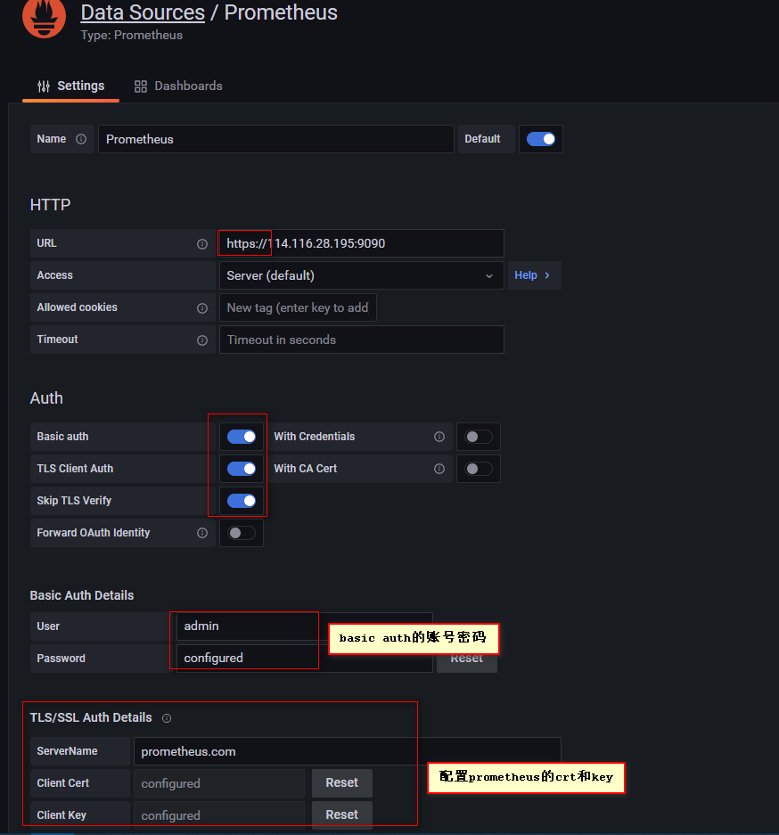
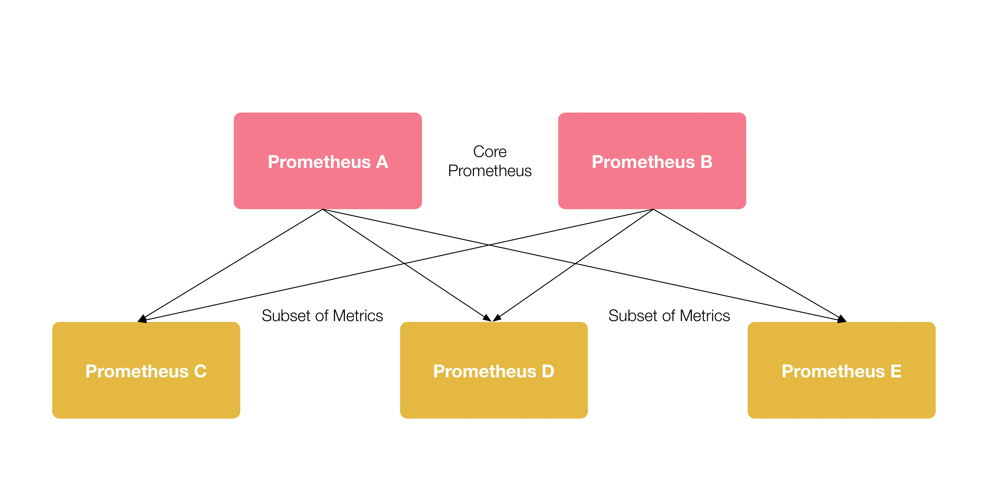
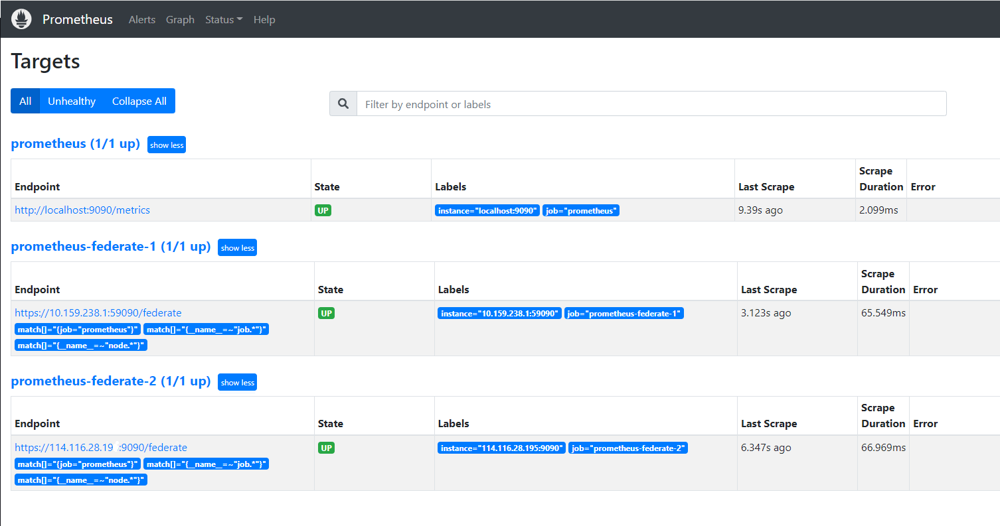

[TOC]


# Prometheus联邦机制和安全机制


# 安全机制

默认prometheus和node_exporter使用的都是http通信，如果暴露在公网非常不安全，现基于basic_auth认证实现用户和密码验证和TLS实现https加密通信。

## 基于basic_auth认证

Basic Auth 支持配置多个用户名密码的。

```bash
[root@localhost ~]# htpasswd -nBC 12 '' | tr -d ':\n'
New password:               # 这里设置密码为123456
Re-type new password: 
$2y$12$6yR84yKSqoYv3B2D70QAOuqggT0QvdpMp1wUNfLwBo63oLYWc1AYy    # 生成加密密码


[root@localhost ~]# mkdir -p /etc/prometheus
[root@localhost ~]# vim /etc/prometheus/config.yml
basic_auth_users:
  admin: $2y$12$MC7nPp809b80SYNphKTLnOFxdJ5wBH1SyOi/LYSzPxhnpEE2WbI9S

# prometheus配置Basic Auth认证
[root@localhost ~]# vim /usr/lib/systemd/system/prometheus.service
[Unit]
Description=Prometheus
Documentation=https://prometheus.io/
After=network.target

[Service]
# Type设置为notify时，服务会不断重启
Type=simple
User=prometheus
# --storage.tsdb.path是可选项，默认数据目录在运行目录的./data目录中
ExecStart=/usr/local/bin/prometheus \
        --config.file=/etc/prometheus/prometheus.yml \
        --storage.tsdb.path=/var/lib/prometheus \
        --storage.tsdb.retention=15d \
        --log.level=info \
        --web.enable-lifecycle \
        --web.listen-address=:59090 \
        --web.config.file=/etc/prometheus/config.yml
Restart=on-failure

[Install]
WantedBy=multi-user.target

# 修改prometheus配置文件，否则无法获取node_exporter的数据
[root@localhost ~]# vim /etc/prometheus/prometheus.yml
...
scrape_configs:
  - job_name: 'prometheus'
    basic_auth:
      username: 'admin'
      password: '123456'
    static_configs:


# node_exporter配置Basic Auth认证
[root@localhost ~]# mkdir -p /etc/node_exporter/
[root@localhost ~]# vim /etc/node_exporter/config.yml
basic_auth_users:
  admin: $2y$12$MC7nPp809b80SYNphKTLnOFxdJ5wBH1SyOi/LYSzPxhnpEE2WbI9S

[root@localhost ~]# chmod 755 /etc/node_exporter
[root@localhost ~]# vim /usr/lib/systemd/system/node_exporter.service
[Unit]
Description=node_exporter
Documentation=https://prometheus.io/
After=network.target

[Service]
Type=simple
User=prometheus
ExecStart=/usr/local/bin/node_exporter \
	--web.listen-address=:59100 \
	--web.config=/etc/node_exporter/config.yml
Restart=on-failure

[Install]
WantedBy=multi-user.target
```


## 基于TLS加密

**1、prometheus使用TLS**

(1) 生成TLS证书

```bash
openssl req -new -newkey rsa:2048 -days 3650 -nodes -x509 -keyout prometheus.key -out prometheus.crt -subj "/C=CN/ST=Beijing/L=Beijing/O=dtdream/CN=localhost"
```

(2) 将tls密钥文件写入config.yml文件内

```bash
cat > ./config.yml<<eof
basic_auth_users:
  # 当前设置的用户名为admin， 可以设置多个
  admin: $2y$12$mMnPuKlOQ97ff4NjDsQTMukAtRS/ILpjxjEQrCN0vefs0CBLe/hi6
tls_server_config:    # TLS加密
  cert_file: prometheus.crt
  key_file: prometheus.key
```

配置之后将key、crt文件拷贝至config.yml文件相同目录。


(3) 修改prometheus配置

```bash
scrape_configs:
  - job_name: 'prometheus'
    basic_auth:
      username: admin
      password: 123456
	  #新增tls配置
    scheme: https   # 修改协议为https
    tls_config:
      ca_file: prometheus.crt    #crt文件名
      insecure_skip_verify: true  # 跳过不安全认证
    static_configs:
    - targets: ['prometheus:9090']
```

(4) 修改服务配置

```bash
cat >/usr/lib/systemd/system/prometheus.service<<\EOF
[Unit]
Description=Prometheus
Documentation=https://prometheus.io/
After=network.target

[Service]
# Type设置为notify时，服务会不断重启
Type=simple
User=prometheus
# --storage.tsdb.path是可选项，默认数据目录在运行目录的./dada目录中
ExecStart=/usr/local/bin/prometheus \
        --config.file=/etc/prometheus/prometheus.yml \
        --storage.tsdb.path=/var/lib/prometheus \
        --storage.tsdb.retention=15d \
        --log.level=info \
        --web.enable-lifecycle \
        --web.listen-address=:59090 \
        --web.config.file=/etc/prometheus/config.yml
Restart=on-failure

[Install]
WantedBy=multi-user.target
EOF

```


(5) 启动并测试

当使用http协议访问9090时，会提示`Client sent an HTTP request to an HTTPS server.`使用https://xxx:59090访问正常


**2、node_exporter使用TLS**

(1) 生成TLS证书--其实也可以共用上边prometheus的证书

```
openssl req -new -newkey rsa:2048 -days 3650 -nodes -x509 -keyout node_exporter.key -out node_exporter.crt -subj "/C=CN/ST=Beijing/L=Beijing/O=dtdream/CN=localhost"
```

(2) 将tls密钥文件写入config.yml文件内

```
cat >/etc/node_exporter/config.yml<<\EOF
tls_server_config:
  cert_file: node_exporter.crt
  key_file: node_exporter.key
basic_auth_users:
  admin: $2y$12$MC7nPp809b80SYNphKTLnOFxdJ5wBH1SyOi/LYSzPxhnpEE2WbI9S
EOF

```

(3) 修改服务配置

```bash
cat >/usr/lib/systemd/system/node_exporter.service<<\EOF
[Unit]
Description=node_exporter
Documentation=https://prometheus.io/
After=network.target

[Service]
Type=simple
User=prometheus
ExecStart=/usr/local/bin/node_exporter \
        --web.listen-address=:59100 \
        --web.config=/etc/node_exporter/config.yml
Restart=on-failure

[Install]
WantedBy=multi-user.target
EOF

```

(4) 修改prometheus配置，让 Prometheus 可以抓取 Node Exporter 暴露的 metrics

```bash
scrape_configs:
  - job_name: 'prometheus'
    scheme: https
    tls_config:
      ca_file: prometheus.crt
      insecure_skip_verify: true
    basic_auth:
      username: 'admin'
      password: 'DtDream@0209'
    static_configs:
    # 修改为prometheus的本机ip
    - targets: ['114.116.28.195:59090']

  - job_name: '减灾中心政务外网'
    scheme: https
    tls_config:
      ca_file: node_exporter.crt
      insecure_skip_verify: true
    basic_auth:
      username: 'admin'
      password: 'DtDream@0209'
    scrape_interval: 10s
    file_sd_configs:
    - files: ['/etc/prometheus/file_sd_configs/*.json']
      refresh_interval: 10s

```


(5) 对接granafa

> 数据源配置处修改http-url，新增勾选"TLS Client Auth"、“Skip TLS Verify”；配置Basic Auth Details修改http-url，将http协议修改为https协议





# 联邦机制

官方介绍文档：

https://prometheus.io/docs/prometheus/latest/federation/

## 简介

在运维中，一个Prometheus服务节点所能接管的主机数量有限。而联邦模式允许 Prometheus 服务器从另一个 Prometheus 服务器抓取特定数据。有分层联邦和跨服务联邦，分层联邦较为常用，且配置简单。


## 应用场景

**1）跨数据中心**

例如，一个联邦设置可能由多个数据中心中的 Prometheus 服务器和一套全局 Prometheus 服务器组成。每个数据中心中部署的 Prometheus 服务器负责收集本区域内细粒度的数据（实例级别），全局 Prometheus 服务器从这些下层 Prometheus 服务器中收集和汇聚数据（任务级别），并存储聚合后的数据。这样就提供了一个聚合的全局视角和详细的本地视角。

  

**2）跨服务**
同一服务器里不同的服务监控指标用不同的prometheus联邦节点收集监控数据

例如，一个运行多种服务的集群调度器可以暴露在集群上运行的服务实例的资源使用信息（例如内存和 CPU 使用率）。另一方面，运行在集群上的服务只需要暴露指定应用程序级别的服务指标。通常，这两种指标集分别被不同的 Prometheus 服务器抓取。利用联邦，监控服务级别指标的 Prometheus 服务器也可以从集群中 Prometheus 服务器拉取其特定服务的集群资源使用率指标，以便可以在该 Prometheus 服务器中使用这两组指标集


## 联邦模式

**分层联邦(Hierarchical federation)**




**跨服务联邦(Cross-service federation)**


## 配置联邦

在任何给定的 Prometheus 服务器上，`/federate`端点允许检索该服务器中一组选定时间序列的当前值。`match[]`必须至少指定一个 URL 参数来选择要公开的系列。每个 `match[]`参数都需要指定一个 [即时向量选择器](https://prometheus.io/docs/prometheus/latest/querying/basics/#instant-vector-selectors)，例如 `up`or `{job="api-server"}`。如果提供了多个`match[]`参数，则选择所有匹配系列的并集。

要将指标从一台服务器联合到另一台服务器，请将您的目标 Prometheus 服务器配置为从`/federate`源服务器的端点抓取，同时启用`honor_labels`抓取选项（不覆盖源服务器公开的任何标签）并传入所需的`match[]` 参数。例如，以下内容`scrape_configs`将带有标签`job="prometheus"`或指标名称的任何系列`job:`从 Prometheus 服务器 at开始联合`source-prometheus-{1,2,3}:9090`到抓取 Prometheus 中：

```
scrape_configs:
  - job_name: 'federate'
    scrape_interval: 15s

    honor_labels: true
    metrics_path: '/federate'

    params:
      'match[]':
        - '{job="prometheus"}'
        - '{__name__=~"job:.*"}'

    static_configs:
      - targets:
        - 'source-prometheus-1:9090'
        - 'source-prometheus-2:9090'
        - 'source-prometheus-3:9090'
```


## prometheus配置文件解析

1) 整体配置文件


```bash
# 全局配置global:
  # 默认抓取周期，可用单位ms、smhdwy #设置每15s采集数据一次，默认1分钟
  [ scrape_interval: <duration> | default = 1m ]
  # 默认抓取超时
  [ scrape_timeout: <duration> | default = 10s ]
  # 估算规则的默认周期 # 每15秒计算一次规则。默认1分钟
  [ evaluation_interval: <duration> | default = 1m ]
  # 和外部系统（例如AlertManager）通信时为时间序列或者警情（Alert）强制添加的标签列表
  external_labels:
    [ <labelname>: <labelvalue> ... ]
 
# 规则文件列表
rule_files:
  [ - <filepath_glob> ... ]
 
# 抓取配置列表
scrape_configs:
  [ - <scrape_config> ... ]
 
# Alertmanager相关配置
alerting:
  alert_relabel_configs:
    [ - <relabel_config> ... ]
  alertmanagers:
    [ - <alertmanager_config> ... ]
 
# 远程读写特性相关的配置
remote_write:
  [ - <remote_write> ... ]
remote_read:
  [ - <remote_read> ... ]
```

2）scrape_configs

一个scrape_config 片段指定一组目标和参数， 目标就是实例，指定采集的端点， 参数描述如何采集这些实例， 主要参数如下：

```bash
scrape_interval: 抓取间隔,默认继承global值。
scrape_timeout: 抓取超时时间,默认继承global值。
metric_path: 抓取路径， 默认是/metrics
scheme: 指定采集使用的协议，http或者https,默认为http
params: 指定url参数。
basic_auth: 指定认证信息。
*_sd_configs: 指定服务发现配置
static_configs: 静态指定服务job。
relabel_config: relabel设置。
```


## 联邦主节点配置


```yaml
# my global config
global:
  scrape_interval: 15s # Set the scrape interval to every 15 seconds. Default is every 1 minute.
  evaluation_interval: 15s # Evaluate rules every 15 seconds. The default is every 1 minute.
  # scrape_timeout is set to the global default (10s).

# Alertmanager configuration
alerting:
  alertmanagers:
    - static_configs:
        - targets:
          # - alertmanager:9093

# Load rules once and periodically evaluate them according to the global 'evaluation_interval'.
rule_files:
  # - "first_rules.yml"
  # - "second_rules.yml"

# A scrape configuration containing exactly one endpoint to scrape:
# Here it's Prometheus itself.
scrape_configs:
  # The job name is added as a label `job=<job_name>` to any timeseries scraped from this config.
  - job_name: "prometheus"

    # metrics_path defaults to '/metrics'
    # scheme defaults to 'http'.

    static_configs:
      - targets: ["localhost:9090"]

  - job_name: "prometheus-federate-1"
    scheme: https
    tls_config:
      ca_file: node_exporter.crt
      insecure_skip_verify: true
    basic_auth:
      username: 'admin'
      password: 'DtDream@0209'

    scrape_interval: 10s
    honor_labels: true
    metrics_path: '/federate'
    params:
      'match[]':
       - '{job="prometheus"}'
       - '{__name__=~"job.*"}'
       - '{__name__=~"node.*"}'
    static_configs:
       - targets: ["10.159.238.1:59090"]
       
  - job_name: "prometheus-federate-2"
    scheme: https
    tls_config:
      ca_file: node_exporter.crt
      insecure_skip_verify: true
    basic_auth:
      username: 'admin'
      password: 'DtDream@0209'

    scrape_interval: 10s
    honor_labels: true
    metrics_path: '/federate'
    params:
      'match[]':
       - '{job="prometheus"}'
       - '{__name__=~"job.*"}'
       - '{__name__=~"node.*"}'
    static_configs:
       - targets: ["114.116.28.19:9090"] 
```


打开联邦主节点可以看到如下信息：




