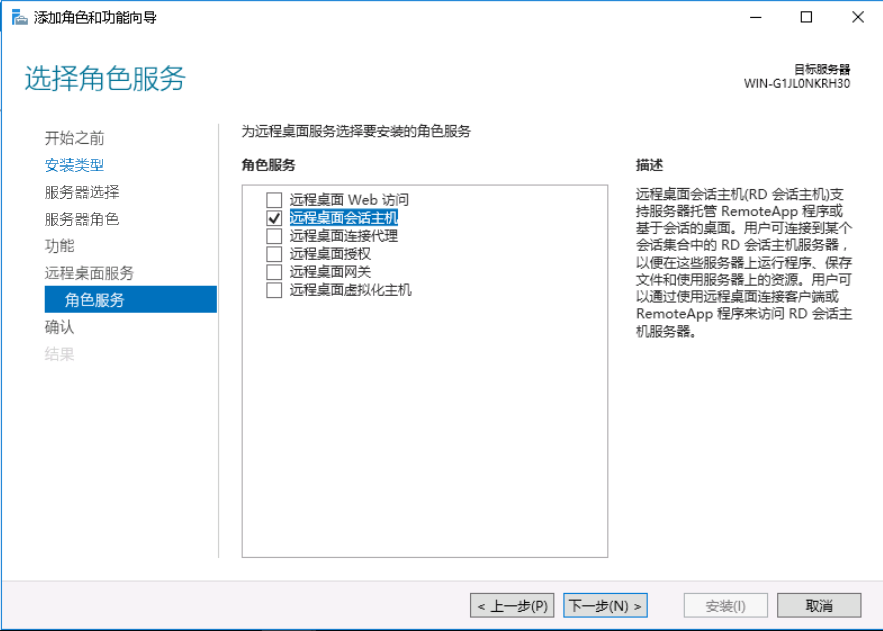

### Windows Server 2016 远程桌面解除多用户限制

1、安装远程桌面服务，在服务管理器，添加角色和功能，下一步，选择“基于角色或基于功能的安装”

选中要安装的服务器：

在服务器角色窗口，勾选“远程桌面服务”。下一步：

选择“远程桌面服务”-->角色服务-->远程桌面会话主机-->下一步-->选中如果需求重启-->安装

这样只能使用119天：

配置组策略，运行框输入gpedit.msc，打开计算机配置–>管理模板—>windows组件—>然后在右边的菜单中选择远程桌面服务；双击打开。双击远程桌面会话主机->连接，点击限制连接的数量，设置如下。

