[TOC]

# Windows Server2008R2 实现多用户远程登陆模式

**第一步：** 开始 → 管理工具 → 远程桌面服务 → 远程桌面会话主机配置

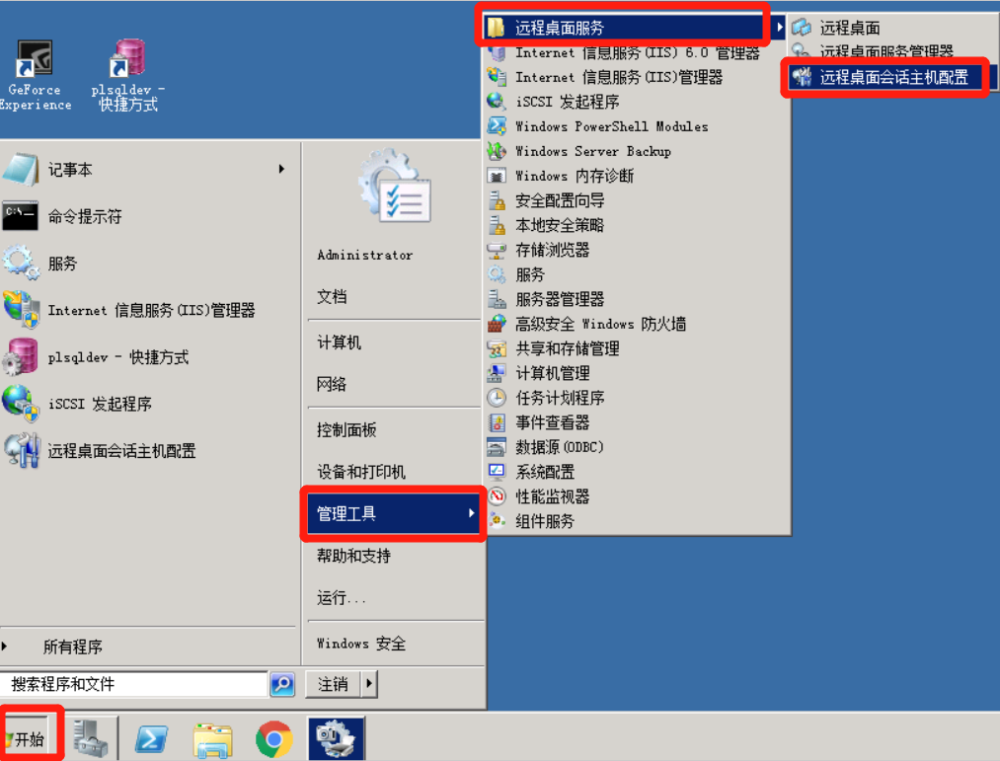

**第二步：**双击限制每个用户只能进行一个会话 → 在弹出的属性框中将限制每个用户只能进行一个会话的勾取消选择 → 点击应用 → 点击确认

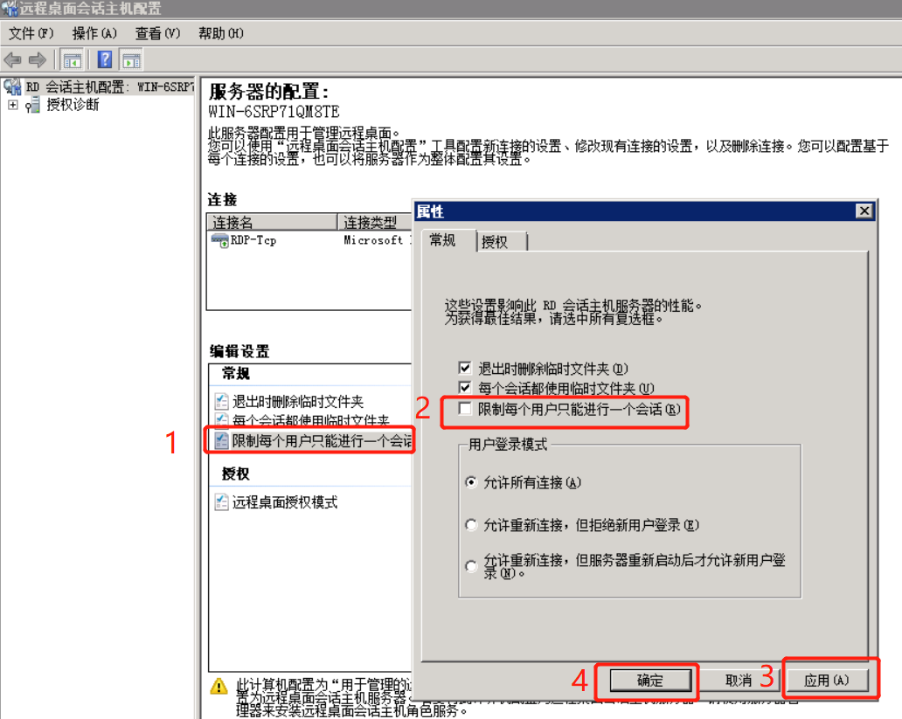

确认之后会弹出这样的提示，继续确定就可以

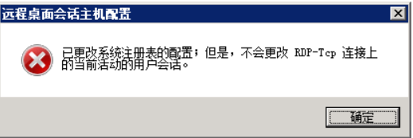

第三步：注：以上只是更改了远程设置，注册表还需要再改一下（有小概率改完这一步就可以实现多用户访问）

在搜索框输入 gpedit.msc  按回车，然后找到计算机配置 → 管理模板 → Windows 组件 → 远程桌面服务 → 远程桌面会话主机 → 连接(双击)  → 限制连接的数量(双击) → 在限制连接的数量框中，选中已启用，根据自己的需要更换允许的RD最大连接数量 → 应用 → 确定
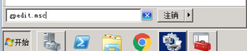

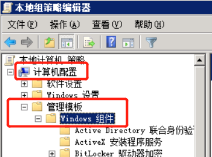

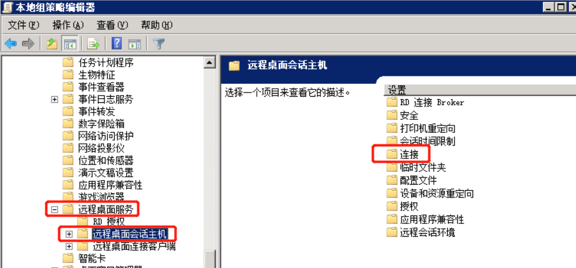

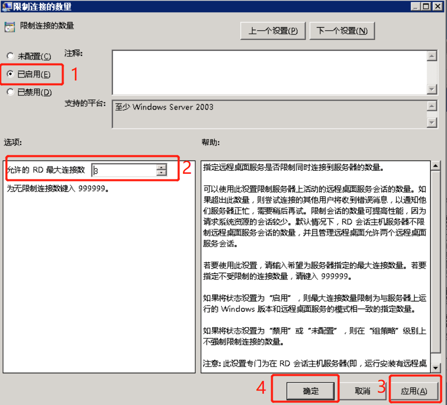

**第四步：**更新注册表 win+r 输入cmd(命令提示符)  输入gpupdate.exe 回车执行就OK了

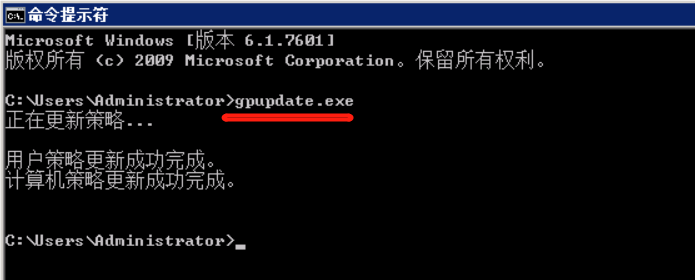

# Windows Server 2016 远程桌面解除多用户限制

**远程多用户配置**

1、安装远程桌面服务，在服务管理器，添加角色和功能，下一步，选择“基于角色或基于功能的安装”

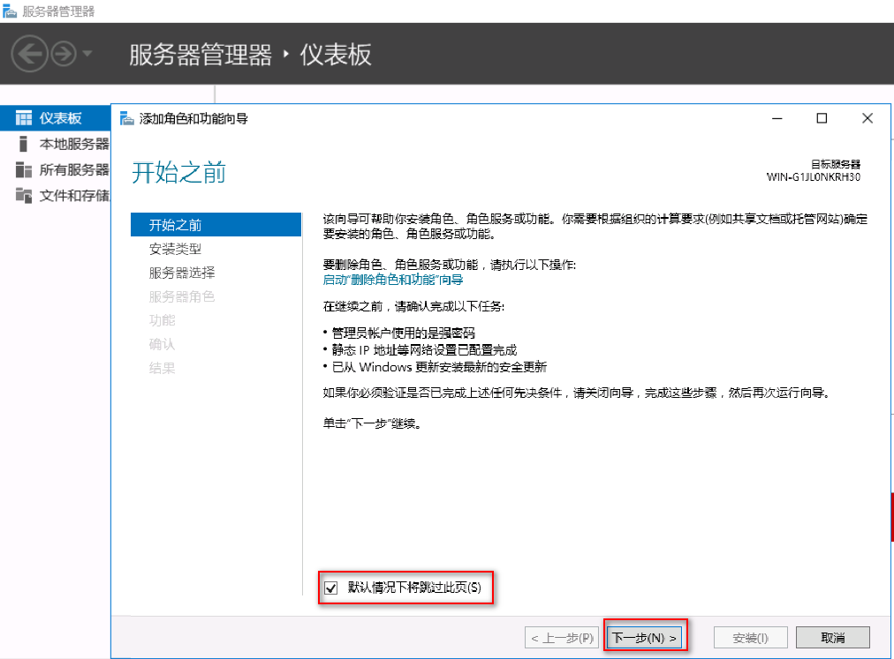

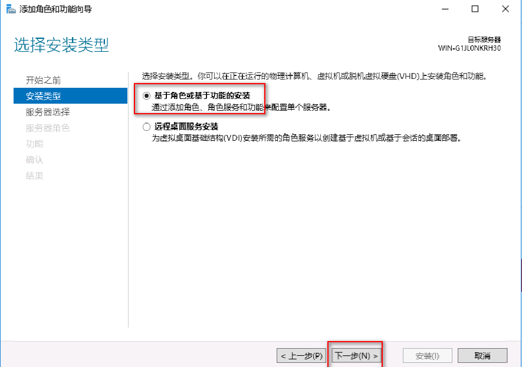

选中要安装的服务器：

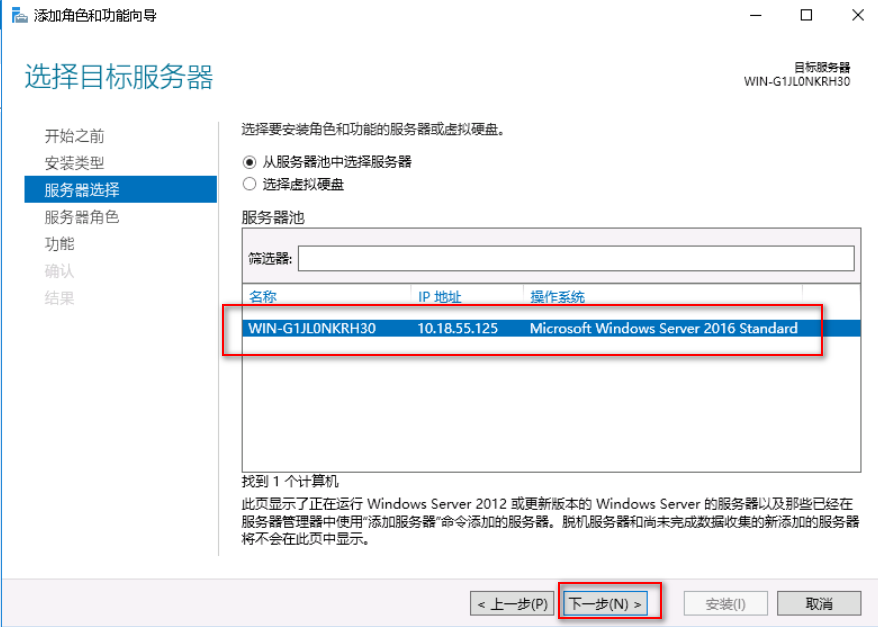

在服务器角色窗口，勾选“远程桌面服务”。下一步：

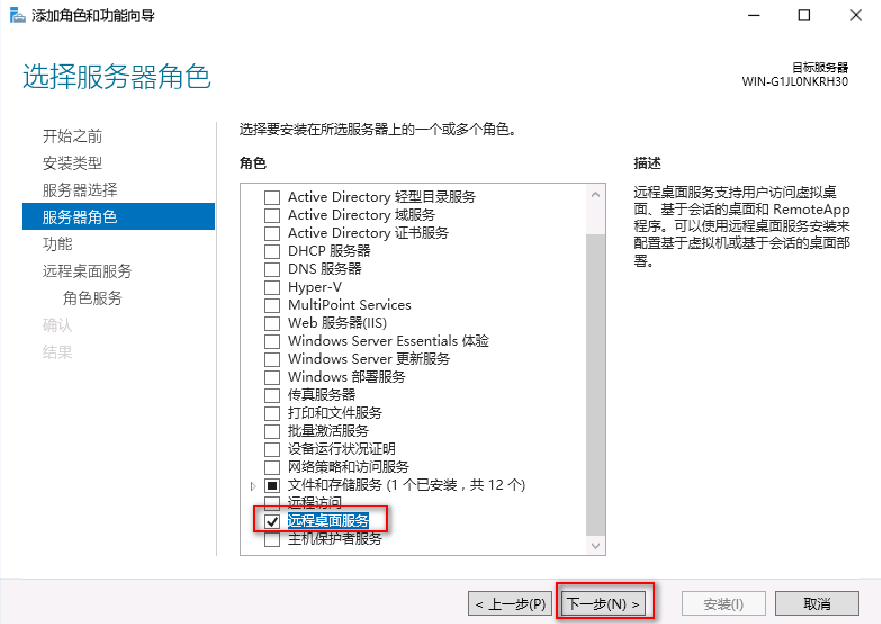

选择“远程桌面服务”-->角色服务-->远程桌面会话主机和远程桌面授权-->下一步-->选中如果需求重启-->安装

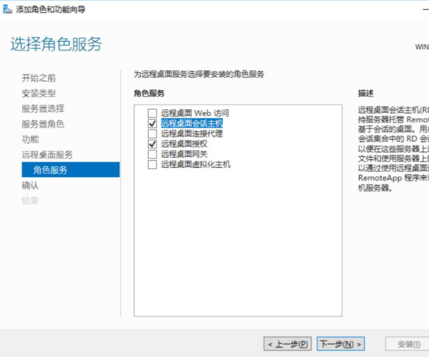

这样只能使用119天：

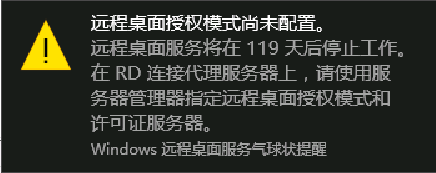

配置组策略，运行框输入gpedit.msc，打开计算机配置–>管理模板—>windows组件—>然后在右边的菜单中选择远程桌面服务；双击打开。双击远程桌面会话主机->连接，点击限制连接的数量，设置如下。

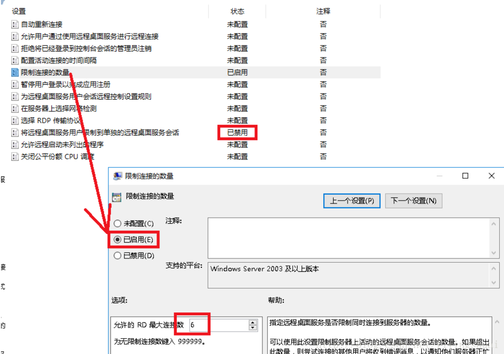

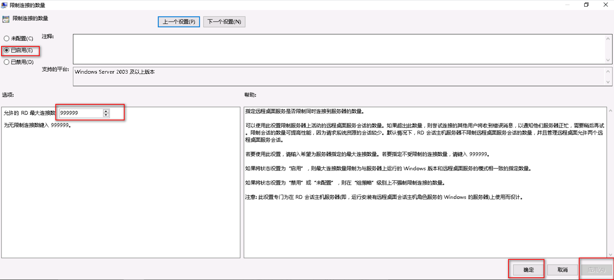

以上配置后即可同时登陆，但期限为120天。

**破解远程桌面时间**

1、调整日期为未来的时间（获得更长的时间，不更改可再次获得120天授权）

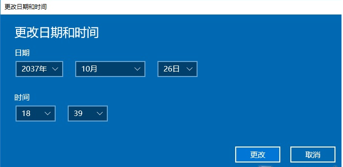

2、删除注册表项

在“运行”输入 "regedit",进入注册表，删除`HKEY_LOCAL_MACHINE\SYSTEM\CurrentControlSet\Control\Terminal Server\RCM\GracePeriod`目录。如过提示权限不够，需进行如下操作

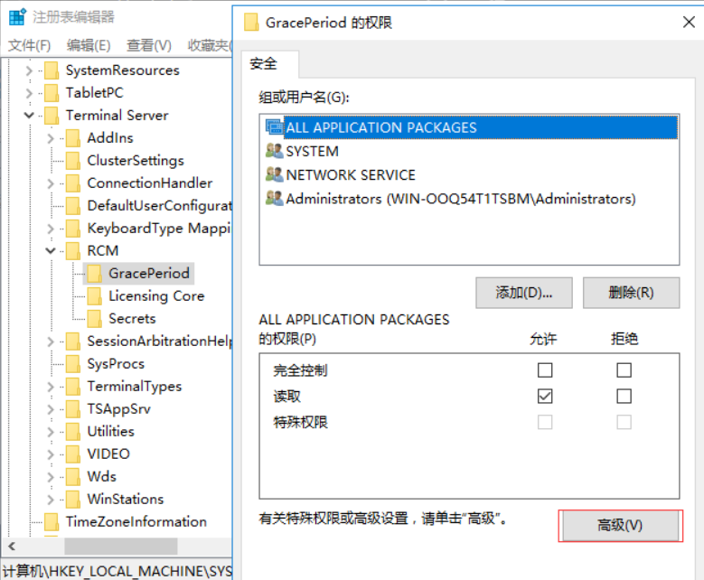

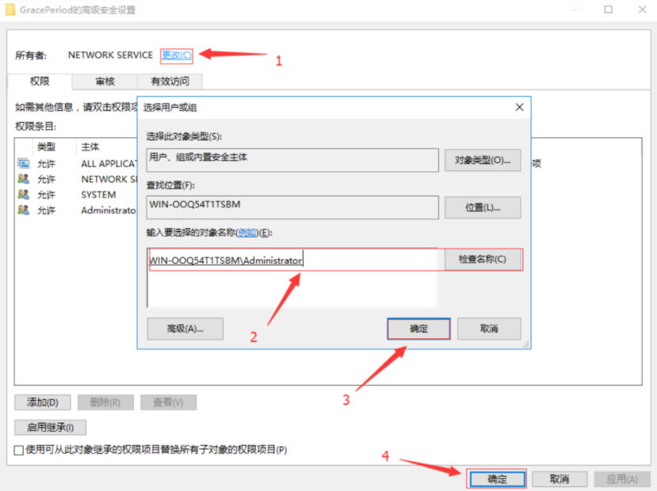

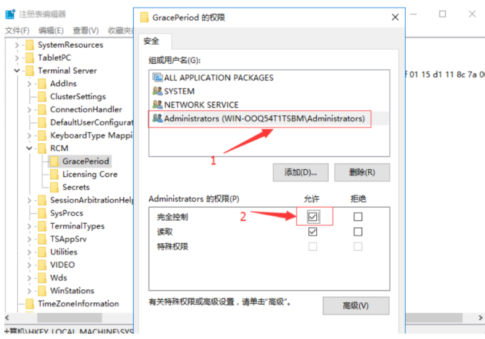

然后，删除 GracePeriod目录。

3、运行 gpedit.msc，在用户配置 - 管理模板 - 系统中修改组织访问注册表编辑工具为已禁用，然后重启服务器。

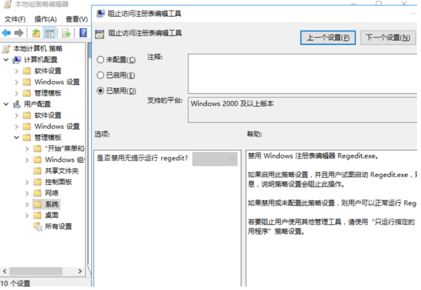

