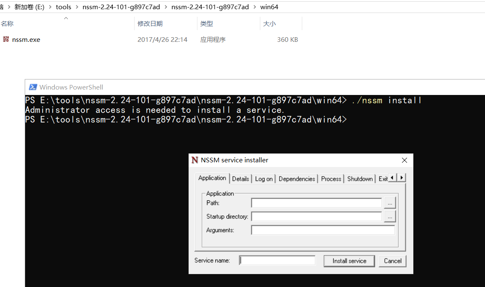

# Windows服务封装工具-nssm详解 

# 一、nssm简介

nssm是一个服务封装程序，它可以将普通exe程序封装成服务，实现开机自启动，同类型的工具还有微软自己的srvany，不过nssm更加简单易用，并且功能强大。

它的特点如下：

支持普通exe程序（控制台程序或者带界面的Windows程序都可以）
安装简单，修改方便
可以自动守护封装了的服务，程序挂掉了后可以自动重启
官网地址：https://nssm.cc/

# 二、nssm配置详解

### 1、下载地址

官网地址：https://nssm.cc/download

### 2、打开命令行，运行nssm程序

管理员权限打开命令行工具，切换到nssm.exe所在路径，运行 nssm install，打开程序配置界面

**配置项说明：**

Path：运行应用程序的程序

Startup directory：应用程序所在的目录

Arguments：应用运行的参数

Service name：生成服务的名称

最后点击install service 完成windows服务安装，在windows服务列表就能看到创建的服务了。

### 3、常用命令

nssm install servername //创建servername服务，弹出配置界面
nssm start servername //启动服务
nssm stop servername //暂停服务
nssm restart servername //重新启动服务
nssm remove servername //删除创建的servername服务
nssm edit servername//更改servername服务，弹出修改界面
nssm set servername 参数名 参数值 //设置服务参数值
sc delete servername//windows删除服务命令
直接使用windows的服务管理也可以实现服务的操作，服务右键属性 - 恢复即可设置服务挂掉重启等内容。

