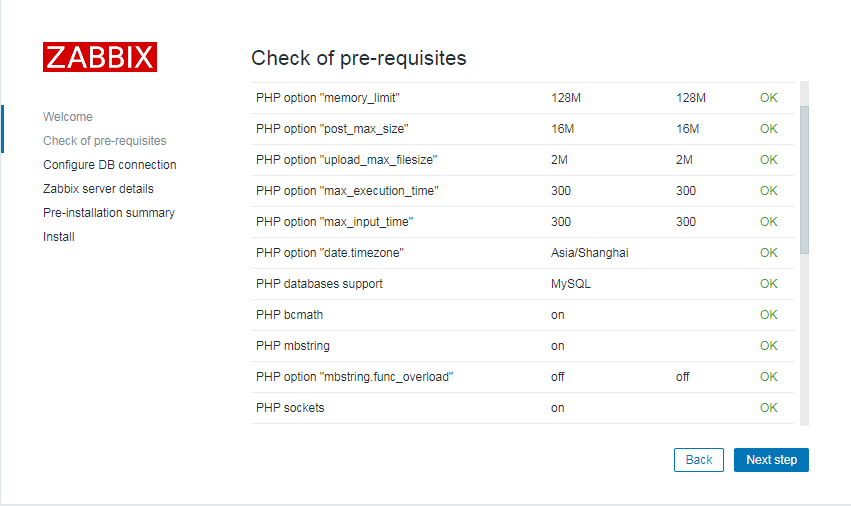

[TOC]


# Zabbix4.0 离线安装

工作中经常会遇到项目没有外网的情况，由于zabbix的包并不在系统镜像中，所以无法通过挂载镜像方式去安装，但是总有办法解决，可以自己将zabbix相关的rpn包上传服务器进行安装。


**以下方式适合CentOS7最小化安装的系统。**


 1、关闭防火墙和selinxu

```bash
systemctl stop firewalld.service
systemctl disable firewalld.service
setenforce 0
sed -i  '/^SELINUX/s#enforcing#disabled#g' /etc/selinux/config
```


2、创建zabbix源并上传rpm包

链接：https://pan.baidu.com/s/13XeR_S7YQuj0YcHJmgS_bw 
提取码：4mbz 

```bash
mkdir -p /usr/local/src/zabbix
tar -zxvf zabbix40.tar.gz -C  /usr/local/src/zabbix
cd /etc/yum.repos.d/
mkdir backup && mv *.repo backup
cat >zabbix.repo<<EOF
[zabbix-local]
name=zabbix
baseurl=file:///usr/local/src/zabbix
enable=1
gpgcheck=0
EOF
yum clean all
yum makecache
```


3、安装mariadb5.5

一般需要删除旧版本的 `yum -y remove mariadb*`

```bash
yum -y install mariadb*
```

自定义数据目录

```bash
sed -i '/datadir=/s#/var/lib/mysql#/data/mysql#g' /etc/my.cnf
mkdir -p /data/mysql
chown -R mysql.mysql /data/mysql
```

启动mariadb并添加开机自启

```bash
systemctl start mariadb.service
systemctl enable mariadb.service
```


4、zabbix安装

```bash
yum -y install zabbix-server-mysql zabbix-web-mysql zabbix-agent
```

初始化数据(默认安装的数据库初始密码为空)

```bash
mysql -e "create database zabbix character set utf8 collate utf8_bin;"
mysql -e "grant all privileges on zabbix.* to zabbix@localhost identified by 'Po13Wfui';"
zcat /usr/share/doc/zabbix-server-mysql-4.0.7/create.sql.gz | mysql -uzabbix -pPo13Wfui zabbix
```

修改配置

```bash
sed -i '/DBPassword=/s#.*#DBPassword=Po13Wfui#g' /etc/zabbix/zabbix_server.conf
sed -i -e 's#Europe/Riga#Asia/Shanghai#g' -e '/^.*# php_value/s#\# php_value#php_value#g' /etc/httpd/conf.d/zabbix.conf
```

重启服务

```bash
systemctl restart zabbix-server zabbix-agent httpd
systemctl enable zabbix-server zabbix-agent httpd
```

5、访问zabbix

浏览器打开 http://ip/zabbix

账号：Admin
密码：zabbix

