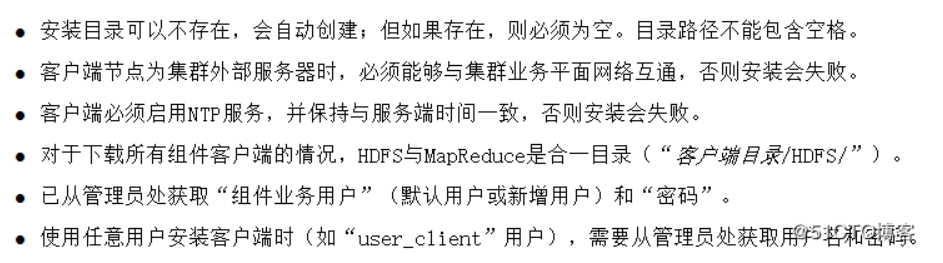
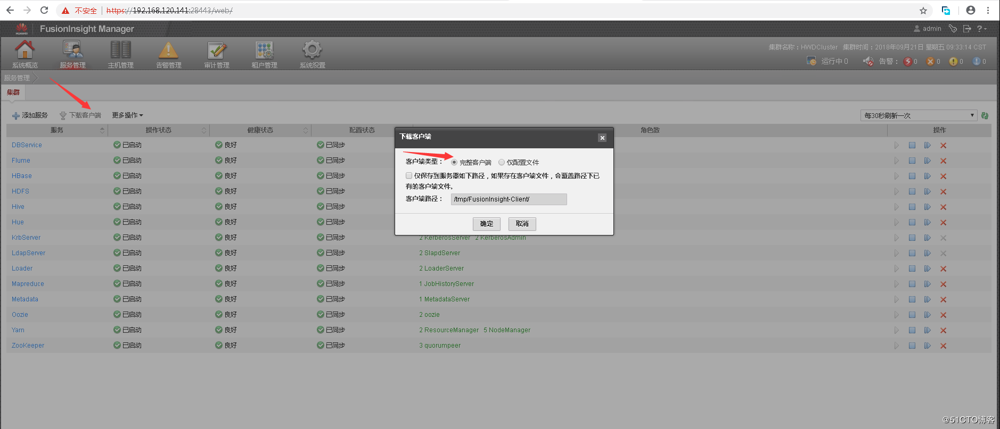

[TOC]


# 减灾华为FusionInsight HD 客户端安装

FusionInsight HD针对不同服务提供了Shell脚本，供开发维护人员在不同场景下登录其对应的服务维护客户端完成对应的维护任务。

**华为官网文档：**

[https://support.huawei.com/hedex/hdx.do?docid=EDOC1100020180&lang=zh&idPath=7919749%7C7941815%7C19942925%7C250430185%7C21110924](https://support.huawei.com/hedex/hdx.do?docid=EDOC1100020180&lang=zh&idPath=7919749|7941815|19942925|250430185|21110924)


# 1 环境信息

| 名称       | IP地址       | 备注                         |
| ---------- | ------------ | ---------------------------- |
| hive客户端 | 10.18.17.150 | 确保此ip与hive服务端网络互通 |


# 2 前提条件




# 3 获取客户端软件包

登录FusionInsight Manager系统，单击“服务管理”，在菜单栏中单击“下载客户端”，弹出“客户端类型”信息提示框。“客户端类型”勾选“完整客户端”。一般需要找华为人员提供。




# 4 安装客户端

将客户端软件包上传至客户端服务器，解压软件包：

```bash
[root@host-10-18-17-150 ~]# mkdir -p /opt/hivepackage/
[root@host-10-18-17-150 ~]# cd /opt/hivepackage/
[root@host-10-18-17-150 hivepackage]# ll
-rw-r--r--. 1 root root 402483200 Oct 13 20:15 FusionInsight_Hive_Client.tar
[root@host-10-18-17-150 hivepackage]# tar xvf FusionInsight_Hive_Client.tar
[root@host-10-18-17-150 hivepackage]# ll
-rw-------. 1 root root 402472960 Sep 30 18:01 FusionInsight_Hive_ClientConfig.tar  #解压出来的包
-rw-------. 1 root root       101 Sep 30 18:01 FusionInsight_Hive_ClientConfig.tar.sha256  #解压出来的包校验码
-rw-r--r--. 1 root root 402483200 Oct 13 20:15 FusionInsight_Hive_Client.tar


#确认包的完整
[root@host-10-18-17-150 hivepackage]# sha256sum -c FusionInsight_Hive_ClientConfig.tar.sha256
FusionInsight_Hive_ClientConfig.tar: OK
[root@host-10-18-17-150 hivepackage]# tar xvf FusionInsight_Hive_ClientConfig.tar
[root@host-10-18-17-150 hivepackage]# ll
total 786100
drwx------. 7 root root      4096 Sep 30 18:01 FusionInsight_Hive_ClientConfig
-rw-------. 1 root root 402472960 Sep 30 18:01 FusionInsight_Hive_ClientConfig.tar
-rw-------. 1 root root       101 Sep 30 18:01 FusionInsight_Hive_ClientConfig.tar.sha256
-rw-r--r--. 1 root root 402483200 Oct 13 20:15 FusionInsight_Hive_Client.tar
```

进入客户端目录，进行安装。这里将客户端安装至`/opt/hiveclient`目录：

```bash
[root@host-10-18-17-150 hivepackage]# cd FusionInsight_Hive_ClientConfig/
[root@host-10-18-17-150 FusionInsight_Hive_ClientConfig]# ./install.sh /opt/hiveclient/
```


# 5 验证安装

上传` user.keytab`到`/opt/hiveclient`：` user.keytab`为用户认证文件，一般为华为人员提供。

配置客户端环境变量：

```bash
[root@host-10-18-17-150 hiveclient]# ll
total 40228
-rwxr-xr-x. 1 root root      883 Oct 13 20:47 bigdata_env
-rwxr-xr-x. 1 root root     4508 Oct 13 20:47 conf.py
drwxr-xr-x. 5 root root     4096 Oct 13 20:47 Fiber
drwxr-xr-x. 7 root root     4096 Oct 13 20:47 Hive
-rwxr-xr-x. 1 root root       18 Oct 13 20:47 install.ini
drwxr-xr-x. 3 root root     4096 Oct 13 20:47 JDK
-rwxr-xr-x. 1 root root 41135585 Oct 13 20:47 jython-standalone-2.7.1.jar
-rw-r--r--. 1 root root     1258 Oct 13 20:47 krb5.conf
drwxr-xr-x. 5 root root     4096 Oct 13 20:47 KrbClient
-rwxr-xr-x. 1 root root     8367 Oct 13 20:47 refreshConfig.sh
-rwxr-xr-x. 1 root root     1774 Oct 13 20:47 switchuser.py
-rw-r--r--. 1 root root      142 Oct 13 20:47 user.keytab
[root@host-10-18-17-150 hiveclient]# source bigdata_env   #每次新开会话，都需要加载变量
[root@host-10-18-17-150 hiveclient]#  pwd
/opt/hiveclient
```

设置kinit认证：

```bash
[root@host-10-18-17-150 hiveclient]# kinit -kt user.keytab jzzx_hive   #jzzx_hive为hive用户，一般华为提供

[root@host-10-18-17-150 hiveclient]# klist 
Ticket cache: FILE:/tmp/krb5cc_0
Default principal: jzzx_hive@HADOOP.COM

Valid starting       Expires              Service principal
10/14/2020 10:39:18  10/15/2020 10:39:18  krbtgt/HADOOP.COM@HADOOP.COM
#注意：每次认证只能使用24H。
```


# 6 连接hive

```bash
[root@host-10-18-17-150 hiveclient]# beeline 
Connecting to jdbc:hive2://10.131.11.15:24002,10.131.11.22:24002,10.131.11.2:24002/;serviceDiscoveryMode=zooKeeper
;zooKeeperNamespace=hiveserver2;sasl.qop=auth-conf;auth=KERBEROS;principal=hive/hadoop.hadoop.com@HADOOP.COM
Debug is  true storeKey false useTicketCache true useKeyTab false doNotPrompt false ticketCache is null isInitiato
r true KeyTab is null refreshKrb5Config is false principal is null tryFirstPass is false useFirstPass is false sto
rePass is false clearPass is false
Acquire TGT from Cache
Principal is jzzx_hive@HADOOP.COM
Commit Succeeded 

Connected to: Apache Hive (version 1.2.1)
Driver: Hive JDBC (version 1.2.1)
Transaction isolation: TRANSACTION_REPEATABLE_READ
Beeline version 1.2.1 by Apache Hive
0: jdbc:hive2://10.131.11.15:21066/> 
```

连接成功就可以执行sql语句。

```bash
0: jdbc:hive2://10.131.11.15:21066/> show databases;
+-------------------------+--+
|      database_name      |
+-------------------------+--+
| dataq                   |
| dataworks_test          |
| default                 |
| demodb                  |
| dev_space               |
| emr_datatrain_autotest  |
| jzzx_hive               |
| prod_space              |
```


# 7 Hive SQL常用语法总结

Hive是一个数据仓库基础的应用工具，在Hadoop中用来处理结构化数据，通过类SQL语言对数据进行操作。Hive将sql语句通过解析器转换成MapReduce作业提交到Hadoop集群上，Hadoop监控作业执行过程，并将执行结果返回给用户。

　　值得注意的是，Hive并不支持行级数据的更新，主要使用场合为大数据集的批处理作业中。

　　下面为Hive中常用的SQL语句，‘[ ]’中的内容根据实际需求来确定要不要写。

```sql
-- 创建数据库
create database name;

-- 常用显示命令
show databases; -- 查看有哪些数据库
show tables;  -- 查看当前数据库下有哪些表
show tables like '*cc*'  -- 正则表达式显示表
show partitions;  -- 查看分区
show functions;
describe extended table_name;    -- 查看表的结构，字段，分区等情况

-- 建表语句
create [external] table [if not exists] table_name   --创建表，指定表名，默认为内部表
[(col_name data_type [comment col_comment], ...)]  -- 创建字段，指定字段类型、注释
[comment table_comment]  -- 表的注释
[partitioned by (col_name data_type [comment col_comment], col_name_2 data_type_2, ...)] -- 指定分区，要注意分区字段不能出现的建表的字段中
[clustered by (col_name, col_name_2, ...)] [sorted by (col_name [ASC|DESC], ...)] into num_buckets buckets] -- 分桶
[row format row_format]
[stored as file_format]  -- 指定存储文件类型
[location hdfs_path]  -- 存储路径

·external 表示创建的表是否为外部表，默认为内部表
·if not exists 表示该表不存在时创建该表，否则忽略异常
·comment 为表、字段增加注释
·row_format
    row format delimited [fields terminated by char]
                         [collection items terminated by char]
                         [map keys terminated by char]
                         [lines terminated by char]
·file_format
   stored as textfile  -- 纯文本数据
   stored as sequencefile  -- 数据需要压缩，节省存储空间

-- like关键字复制表结构
create table table_name like old_table_name;         

-- 更改表名
alter table table_name rename to new_table_name;

-- 增加一个字段 并 添加注释
alter table table_name add columns (col_name data_type comment 'col_comment');

-- 删除列
alter table table_name replace columns (col_name data_type, col_name_2 data_type_2);

-- 增加、删除分区
alter table table_name add [if not exists] partition_name;  -- 增加
alter table table_name drop partition_name, partition_name_2;   -- 删除

-- 插入数据
insert into table_1 select * from table_2;  -- 在table_1后追加数据
insert overwrite table_1 select * from table_2;  -- 先将table_1中数据清空，然后添加数据

-- 提取数据常用语句
select [distinct] select_expr_1, select_expr_2
from table_name
[where condition]   -- 筛选条件
[group by col_list [having condition]]  -- 分组、分组返回的条件
[order by col_list]  -- 排序
[limit num_1, num_2]   -- 返回数据的起始位置(num_1)以及返回数据的记录数(num_2)
```

