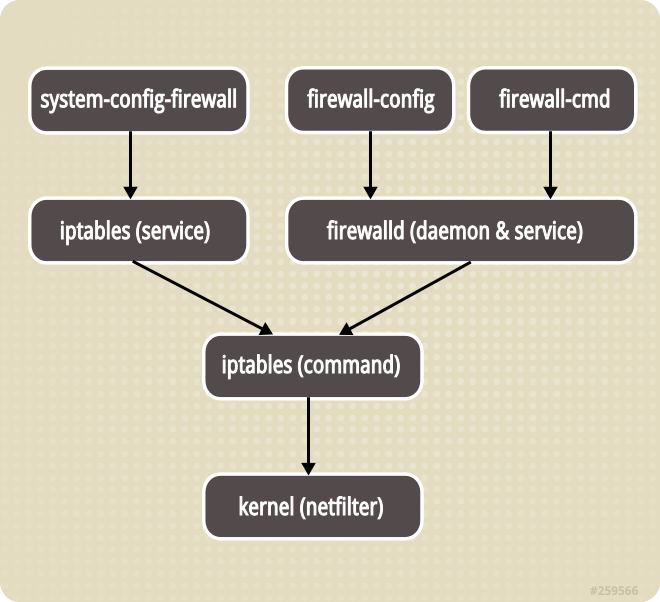

[TOC]


# CentOS7防火墙firewalld实战



# 1 FirewallD介绍

Linux的防火墙体系主要工作在网络层，针对TCP/IP数据包实时过滤和限制，属于典型的包过滤防火墙（或称为网络层防火墙）。Linux系统的防火墙体系基于内核共存：firewalld、iptables、ebtables，默认使用firewalld来管理netfilter子系统。

- netfilter：指的是Linux内核中实现包过滤防火墙的内部结构，不以程序或文件的形式存在，属于“内核态”的防火墙功能体系；
- firewalld：指用来管理Linux防护墙的命令程序，属于“用户态”的防火墙管理体系；


**netfilter**

- netfilter位于Linux内核中的包过滤功能体系，称为Linux防火墙的“内核态”。

- netfilter的主要工作模块位于内核，在网络层的五个位置（prerouting，posrouting，input，output，forware）注册了一些函数，用来抓取函数包

- 把数据包的信息拿出来匹配各个链位置在对应表中规则

- 匹配之后，进行相应的处理ACCEPT、DROP等等

  

**iptables**

- iptables是centos6中用来管理linux防火墙的命令程序，通常为位于/sbin/iptables目录下，属于用户态的防火墙管理体系
- iptables的作用是为包过滤机制的实现提供规则（或策略），告诉netfilter对来自某些源、前往某些目的或具有某些协议特征的数据包应该如何处理


**firewalld**

- firewalld防火墙是centos7系统默认的防火墙管理工具，取代了之前的iptables防火墙
- firewalld也属于包过滤防火墙或者称为网络层防火墙，firewalld和iptables都是用来管理防火墙的工具（属于用户态），来定义防火墙的各种规则
- firewalld的内部规则也指向netfilter网络过滤子系统，以实现包过滤防火墙功能
- firewalld防火墙最大的优点在于支持动态更新以及加入了防火墙的“zone”概念
- firewalld可以通过字符管理工具firewall-cmd和图形化管理工具firewall-config
- firewalld的配置模式分为临时配置和永久配置
  


**(1) firewalld概述**

"firewalld"是firewall daemon。它提供了一个动态管理的防火墙，带有一个非常强大的过滤系统，称为 Netfilter，由 Linux 内核提供。firewalld是自CentOS 7以来带有一个动态的、可定制而无需重新启动防火墙守护程序或服务。firewall-cmd就是iptables/nftable的前端。在CentOS 8中，nftables取代iptables成为默认的Linux网络包过滤框架。

firewalld的作用是为包过滤机制提供匹配规则（或称为策略），通过各种不同的规则，告诉netfilter对来自指定源，前往指定目的或具有某些协议特征的数据包采取何种处理方式。为了更加方便地组织和管理防火墙，firewalld提供了支持网络区域所定义的网络链接以及接口安全等级的动态防火墙管理工具。支持IPv4、IPv6防火墙设置以及以太网桥，并且拥有两种配置模式：

- 运行配置
- 永久配置

还支持服务或应用程序直接添加防火墙规则接口。

**(2) firewalld网络区域**

firewalld将所有的网络数据流量划分为多个区域，从而简化防火墙管理。根据数据包的源IP地址或传入网络接口等条件，将数据流量转入相应区域的防火墙规则。

对于进入系统的数据包，首先检查的就是其源地址：

- 若源地址关联到特定的区域，则执行该区域所制定的规则；
- 若源地址未关联到特定的区域，则使用传入网络接口的区域并执行该区域所制定的规则；
- 若网络接口未关联到特定的区域，则使用默认区域并执行该区域所制定的规则；

默认区域不是单独的区域，而是指向系统上定义的某个其他区域。默认情况下，默认区域是public，但是也可以更改默认区域。以上匹配规则，按照先后顺序，第一个匹配的规则胜出。在每个区域中都可以配置其要打开或者关闭的一系列服务或端口，firewalld的每个预定义的区域都设置了默认打开的服务。

**(3) firewalld预定义区域说明**

**过滤规则集合：zone**

一个zone就是一套过滤规则，数据包必须要经过某个zone才能入站或出站。不同zone中规则粒度粗细、安全强度都不尽相同。可以把zone看作是一个个出站或入站必须经过的安检门，有的严格、有的宽松、有的检查细致、有的检查粗略。

firewalld将网卡对应到不同的区域（zone），zone 默认共有9个，block ,dmz ,drop external,home,internal ,public , trusted , work.

不同的区域之间的差异是其对待数据包的默认行为不同，根据区域名字我们可以很直观的知道该区域的特征，在CentOS7系统中，默认区域被设置为public。每个zones都可以按照指定的标准进行配置，以根据你的要求接受或拒绝某些服务或端口，并且它可以与一个或多个网络接口相关联。默认区域为public区域。

firewalld使用zones和services的概念，而 iptables 使用chain和rules。与 iptables 相比，“FirewallD”提供了一种非常灵活的方式来处理防火墙管理。

| 网络区域         | 网络区域描述                                                 |
| ---------------- | ------------------------------------------------------------ |
| Drop（丢弃）     | 对进入该区域的所有数据包丢弃，并且不进行任何回包，区域内主动发起连接的流入回程数据包允许通过，允许进行出方向的网络连接。 |
| Block（阻塞）    | 任何对该区域的连接请求都会被以 IPv4 的 icmp-host-prohibited 信息或 IPv6 的 icmp6-adm-prohibited 信息所拒绝。只能从系统内部启动网络连接。 |
| Public（公开）   | 公共区域，也是防火墙配置的默认区域，防火墙认为该区域主机不可信。仅仅接收经过选择的连接。同时默认放行 ssh 与 dhcpv6-client 服务产生的连接。 |
| Home（家庭）     | 默认其他同区域内主机可信，仅仅接收经过选择的连接。同时默认放行 ssh、mdns、ipp-client、amba-client 与 dhcpv6-client 服务产生的连接。 |
| Trusted（可信）  | 可信区域，防火墙放行一切流量。等同于关闭防火墙功能。         |
| Work（工作）     | 工作区域，防火墙认为在这个网络上的其它主机不可信。仅仅接收经过选择的连接。同时默认放行 ssh、ipp-client 与 dhcpv6-client 服务产生的连接。 |
| Internal（内部） | 从描述中可以等同于家庭区域。                                 |
| External（外部） | 用于在启用伪装的外部网络上使用，尤其路由器、防火墙认为在这个网络上的其它主机不可信。仅仅接收经过选择的连接。 |
| Dmz（隔离）      | 用于你的隔离区内的电脑，此区域内可公开访问，可以有限地进入你的内部网络，仅仅接收经过选择的连接。 |


# 2 FirewallD安装

CentOS 7 和 Fedora 20+ 已经包含了 FirewallD，但是默认没有激活。可以像其它的 systemd 单元那样控制它。

在Centos 7系统中，可以使用三种方式配置firewalld防火墙：

- firewalld-config图形化工具；
- firewalld-cmd命令行工具；
- /etc/firewalld/中的配置文件；

一般情况下，**不建议直接编辑配置文件**；

**安装**

```bash
yum install firewalld firewall-config
```

**1、 启动服务，并在系统引导时启动该服务：**

```sh
sudo systemctl start firewalld
sudo systemctl enable firewalld
```

要停止并禁用：

```sh
sudo systemctl stop firewalld
sudo systemctl disable firewalld
```

**2、 检查防火墙状态。输出应该是 running或者 not running。**

```sh
sudo firewall-cmd --state
```

**3、 要查看 FirewallD 守护进程的状态：**

```sh
sudo systemctl status firewalld
```

示例输出：

```sh
firewalld.service - firewalld - dynamic firewall daemon
   Loaded: loaded (/usr/lib/systemd/system/firewalld.service; disabled)
   Active: active (running) since Wed 2015-09-02 18:03:22 UTC; 1min 12s ago
 Main PID: 11954 (firewalld)
   CGroup: /system.slice/firewalld.service
   └─11954 /usr/bin/python -Es /usr/sbin/firewalld --nofork --nopid
```

**4、 重新加载 FirewallD 配置：**

```sh
sudo firewall-cmd --reload
```


# 3 FirewallD管理

FirewallD 使用 XML 进行配置。除非是非常特殊的配置，你不必处理它们，而应该使用 firewall-cmd

配置文件位于两个目录中：
/usr/lib/FirewallD下保存默认配置，如默认区域和公用服务。避免修改它们，因为每次 firewall 软件包更新时都会覆盖这些文件。

/etc/firewalld 下保存系统配置文件。 这些文件将覆盖默认配置。


firewalld 配置的防火墙策略，分为：运行时（Runtime）模式、永久（Permanent）模式两种；  

1. 默认的是运行时（Runtime）模式，配置的策略便会立即生效，但是，系统一旦重启就会失效。
2. 永久生效（Permanent）模式，可以使 firewalld 配置永久生效，但是，此模式需要重启系统，或者手动执行 firewall-cmd --reload 命令，配置的策略才会立即生效。

firewalld跟iptables比起来至少有两大好处：

```sh
1.firewalld可以动态修改单条规则，而不需要像iptables那样，在修改了规则后必须得全部刷新才可以生效。
2.firewalld在使用上要比iptables人性化很多，即使不明白“五张表五条链”而且对TCP/ip协议也不理解也可以实现大部分功能。
```

常见操作指令：

```sh
# 查看 firewalld 防火墙的版本
firewall-cmd -V
firewall-cmd --version

#查看服务当前状态
firewall-cmd --state
#running是开启状态

#查看区域信息
firewall-cmd --get-active-zones

#查看指定接口所属区域
firewall-cmd --get-zone-of-interface=eth0


#拒绝所有包/取消拒绝状态/查看是否拒绝
# 拒绝所有包：慎用，因为拒绝所有的包的时候就连xshell都链接不上了
firewall-cmd --panic-on

# 取消拒绝状态
firewall-cmd --panic-off

# 查看是否拒绝
firewall-cmd --query-panic

#更新防火墙规则
#不中断服务的重新加载
firewall-cmd --reload
#中断所有连接的重新加载
firewall-cmd --complete-reload
# 两者的区别就是第一个无需断开连接，就是firewalld特性之一动态添加规则，第二个需要断开连接，类似重启服务
```


# 4  区域(zone)管理

“区域”是针对给定位置或场景（例如家庭、公共、受信任等）可能具有的各种信任级别的预构建规则集。不同的区域允许不同的网络服务和入站流量类型，而拒绝其他任何流量。 首次启用 FirewallD 后，public 将是默认区域。

区域也可以用于不同的网络接口。例如，要分离内部网络和互联网的接口，你可以在 internal 区域上允许 DHCP，但在 external区域仅允许 HTTP 和 SSH。未明确设置为特定区域的任何接口将添加到默认区域。

查看默认区域： 

```bash
sudo firewall-cmd --get-default-zone
```

修改默认区域：

```bash
sudo firewall-cmd --set-default-zone=internal
```

查看所有活动的zone，请运行以下命令：：

```bash
sudo firewall-cmd --get-active-zones
```

查看指定区域的所有配置：

```bash
sudo firewall-cmd --zone=public --list-all
```

查看所有区域的配置： 

```bash
sudo firewall-cmd --list-all-zones
```

通过使用选项"--zone”和“--change-interface”的组合，可以轻松更改zone中的接口。例如，要将“ens33”接口分配给“public”区域，请运行以下命令：

```bash
firewall-cmd --zone=public --change-interface=ens33
firewall-cmd --reload
```

要创建新zone，请使用以下命令。例如，要创建一个名为“test”的新区域，并永久生效，请运行：

```sh
firewall-cmd --permanent --new-zone=test
firewall-cmd --reload
```


# 5 服务(services)管理

FirewallD 可以根据特定网络服务的预定义规则来允许相关流量。你可以创建自己的自定义系统规则，并将它们添加到任何区域。 默认支持的服务的配置文件位于 `/usr/lib /firewalld/services`，用户创建的服务文件在 `/etc/firewalld/services` 中。

Firewalld的服务，你不需要记住任何端口，并且可以一次性允许所有端口。

例如，执行以下命令允许 samba 服务。samba 服务需要启用以下一组端口：“139/tcp 和 445/tcp”以及“137/udp 和 138/udp”。

添加'samba'服务后，所有端口都会同时激活，因为所有端口信息都在samba服务配置中。

下面是Firewalld中预定义的samba的服务配置文件：

```xml
[root@localhost ~]# cat /usr/lib/firewalld/services/samba.xml
<?xml version="1.0" encoding="utf-8"?>
<service>
  <short>Samba</short>
  <description>This option allows you to access and participate in Windows file and printer sharing networks. You need the samba package installed for this option to be useful.</description>
  <port protocol="udp" port="137"/>
  <port protocol="udp" port="138"/>
  <port protocol="tcp" port="139"/>
  <port protocol="tcp" port="445"/>
  <module name="nf_conntrack_netbios_ns"/>
</service>

```

添加和移除服务：

```bash
firewall-cmd --zone=public --add-service=samba --permanent
firewall-cmd --zone=public --remove-service=samba --permanent
firewall-cmd --reload
```

获取有关 samba 服务的更多信息，请运行以下命令：

```bash
[root@localhost ~]# firewall-cmd --info-service=samba
samba
  ports: 137/udp 138/udp 139/tcp 445/tcp
  protocols:
  source-ports:
  modules: netbios-ns
  destination:

```

查看默认的可用服务：

```bash
sudo firewall-cmd --get-services
```

显示当前服务:

```sh
firewall-cmd --list-services
```


 一次添加多个服务，请执行以下命令。例如，要添加 http 和 https 服务，请运行以下命令：

```bash
firewall-cmd --permanent --zone=public --add-service={http,https}
firewall-cmd --reload
```

临时允许 Samba 服务通过 600 秒:

```sh
firewall-cmd --enable service=samba --timeout=600
```


禁止 SSH 服务通过:

```sh
firewall-cmd --delete-service=ssh
```


# 6 端口(port)管理


## 6.1 查看端口

```sh
firewall-cmd --list-all
firewall-cmd --list-ports

#获取public区域中开放的端口列表：
firewall-cmd --zone=public --list-ports 

两种区别就在：
【--list-all】可以看的比较全面，还可以看到除了 ports 之外的 sources、services、interfaces 信息；
【--list-ports】只能看到所有开放的端口
```


## 6.2 开放端口

打开特定端口允许用户从外部访问系统，这代表了安全风险。因此，仅在必要时为某些服务打开所需的端口。

（1）打开80端口

```bash
#临时打开
firewall-cmd --zone=public --add-port=80/tcp

#永久打开
firewall-cmd --permanent --zone=public --add-port=80/tcp
firewall-cmd --reload
```

其中`--permanent`的作用是使设置永久生效，不加的话机器重启之后失效。

（2）查看是否生效

```sh
firewall-cmd --zone=public --query-port=80/tcp
```

（3）批量开放多个端口

```sh
#批量添加多个端口：53、25端口
firewall-cmd --permanent --add-port=53/tcp --add-port=25/tcp
firewall-cmd --reload
```

（4）批量开放端口段

```sh
# 批量开放端口，如从100到500这之间的端口我们全部要打开
firewall-cmd --zone=public --add-port=100-500/tcp --permanent
firewall-cmd --reload
```


## 6.3 限制端口

（1）关闭80端口

```cobol
firewall-cmd --zone=public --remove-port=80/tcp --permanent
firewall-cmd --reload
```

（2）批量限制端口

```cobol
firewall-cmd --zone=public --remove-port=100-500/tcp --permanent
firewall-cmd --reload
```


# 7 IP管理

**1、限制IP地址访问**

（1）限制IP为192.168.0.200的地址禁止访问80端口即禁止访问机器

```bash
firewall-cmd --permanent --add-rich-rule="rule family="ipv4" source address="192.168.0.200" port protocol="tcp" port="80" reject"
firewall-cmd --reload
```

（2）查看已经设置的规则

```cobol
firewall-cmd --zone=public --list-rich-rules
```

**2、解除IP地址限制**

（1）解除刚才被限制的192.168.0.200

```bash
firewall-cmd --permanent --add-rich-rule="rule family="ipv4" source address="192.168.0.200" port protocol="tcp" port="80" accept"
firewall-cmd --reload
```

如设置未生效，可尝试直接编辑规则文件，删掉原来的设置规则，重新载入一下防火墙即可

```sh
vi /etc/firewalld/zones/public.xml
firewall-cmd --reload
```

**3、限制IP地址段**

（1）限制10.0.0.0-10.0.0.255这一整个段的IP，禁止他们访问

```bash
firewall-cmd --permanent --add-rich-rule="rule family="ipv4" source address="10.0.0.0/24" port protocol="tcp" port="80" reject"
firewall-cmd --reload
```

其中10.0.0.0/24表示为从10.0.0.0这个IP开始，24代表[子网掩码]为255.255.255.0，共包含256个地址，即从0-255共256个IP，即正好限制了这一整段的IP地址，具体的设置规则可参考下表

（2）同理，打开限制为

```cobol
firewall-cmd --permanent --add-rich-rule="rule family="ipv4" source address="10.0.0.0/24" port protocol="tcp" port="80" accept"
firewall-cmd --reload
```


# 8 设置NAT和端口转发

1）网络地址转换（NAT）

　　firewalld支持两种类型的网络地址转换(NAT) 伪装和端口转发。可以在基本级别使用常规

　　frewall-cmd规则来同时配置这两者，更高级的转发配置可以使用富规则来完成。

　　这两种形式的NAT会在发送包之前修改包的某些方面如源或目标。
2）伪装（注意：伪装只能和ipv4一起用，ipv6不行）

　　通过伪装系统会将并非直接寻址到自身的包转发到指定接收方同时将通过的包的源地址更改为其自己的公共TP地址。

防火墙对这些传入的包应答时会将目标地址修改为原始主机的地址并发送包。这通常在网络边缘上使用以便为内部网络提供Internet访问。

- 伪装是一种形式的网络地址转换（NAT）

- 端口转发是一种将任何传入网络流量从一个端口转发到另一个内部端口或另一台机器上的外部端口的方法。

**==注意：端口转发必须开启IP伪装。==**

在 `public`区域启用IP伪装：

```bash
firewall-cmd --permanent --zone=public --add-masquerade
firewall-cmd --reload
```

禁止IP伪装：

```bash
firewall-cmd --zone=public --remove-masquerade
firewall-cmd --reload
```

检查是否允许伪装IP:

```bash
firewall-cmd --zone=public --query-masquerade
```

```
注意: 你如果设置允许ip伪装时，添加了--permanent。那么你禁止的是也要加上--permanent。
```

将80端口的所有数据包重定向到8080端口：

```bash
firewall-cmd --permanent --zone=public --add-forward-port=port=80:proto=tcp:toport=8080
```

将所有 80 端口的数据包重定向到 IP 为 10.0.0.75 的服务器上的 8080 端口：

```bash
firewall-cmd --permanent --zone=public --add-forward-port=port=80:proto=tcp:toport=8080:toaddr=10.0.0.75
```

例如，要允许来自特定源地址的流量，仅允许从特定子网连接到服务器，请运行以下命令：

```bash
firewall-cmd --permanent --zone=home --add-source=192.168.1.0/24
```

补充：

```sh
centos7通过firewalld配置网关服务器
假设内网网段为：192.168.1.0/24 
可访问外网的内网服务器的内网IP为：192.168.1.1 
可访问外网的内网服务器的内网网络接口为：eth1

1) 在192.168.1.1服务器上做如下配置：
开启ip_forward转发
# 在/etc/sysctl.conf中添加
net.ipv4.ip_forward=1
# 然后让其生效
sysctl -p

2) 转发内网段的流量
执行如下firewalld命令：
firewall-cmd --add-masquerade --permanent
firewall-cmd --permanent --direct --passthrough ipv4 -t nat -I POSTROUTING -o eth1 -j MASQUERADE -s 192.168.1.0/24
firewall-cmd --reload

3)添加内网服务器网关
在需要访问外网的内网服务器上添加192.168.1.1为网关即可访问外网了：
route add default gw 192.168.1.1 dev eth1    #临时生效
vi /etc/sysconfig/network-scripts/ifcfg-eth1
GATEWAY=192.168.1.1

systemctl restart network

4) 修改内网服务器的/etc/resolv.conf为，可上外网服务器的resolv.conf
```


# 9 构建规则集

例如，以下是如何使用 FirewallD 为你的服务器配置基本规则（如果您正在运行 web 服务器）。

**1、将 eth0的默认区域设置为 dmz。 在所提供的默认区域中，dmz（非军事区）是最适合于这个程序的，因为它只允许 SSH 和 ICMP。**

```
sudo firewall-cmd --set-default-zone=dmz
sudo firewall-cmd --zone=dmz --add-interface=eth0
```

**2、把 HTTP 和 HTTPS 添加永久的服务规则到 dmz 区域中：**

```
sudo firewall-cmd --zone=dmz --add-service=http --permanent
sudo firewall-cmd --zone=dmz --add-service=https --permanent
```

**3、 重新加载 FirewallD 让规则立即生效：**

```
sudo firewall-cmd --reload
```

如果你运行 firewall-cmd --zone=dmz --list-all， 会有下面的输出：

```
dmz (default)
  interfaces: eth0
  sources:
  services: http https ssh
  ports:
  masquerade: no
  forward-ports:
  icmp-blocks:
  rich rules:
```

这告诉我们， dmz区域是我们的默认区域，它被用于 eth0 接口中所有网络的源地址和端口。 允许传入 HTTP（端口 80）、HTTPS（端口 443）和 SSH（端口 22）的流量，并且由于没有 IP 版本控制的限制，这些适用于 IPv4 和 IPv6。 不允许IP 伪装以及端口转发。 我们没有 ICMP 块，所以 ICMP 流量是完全允许的。没有丰富Rich规则，允许所有出站流量。


# 10 丰富(Rich)规则

富语言是firewalld防火墙提供的一种新的规则表达式，在iptables的基础上运行，用户不会iptables也能够学习使用，功能比iptables更多。通过这种语言可以表达firewalld的基本语法中未涵盖的自定义防火墙规则。

富语言可用于表达基本的允许/拒绝规则，也可以用于配置记录（面向syslog和auditd），以及端口转发、伪装和速率限制。

==规则执行优先级。优先级：直接规则→富规则→区域规则==

丰富规则允许使用易于理解的命令创建更复杂的防火墙规则，但丰富的规则很难记住，可以查看手册 `man firewalld.richlanguage`并找到示例。 

```
--add-rich-rule				添加富规则
--remove-rich-rule			删除富规则
--query-rich-rule=‘rule’	查看单条rich规则           {查询rule是否已添加到指定区域，如果未指定区域，则为默认区域。规则存在，则返回0，否则返回1}
--list-rich-rules			查看rich规则列表
```

 firewall-cmd命令来管理它们。

```
富规则的一般规则结构如下：
rule
  [source]
  [destination]
  service|port|protocol|icmp-block|icmp-type|masquerade|forward-port|source-port
  [log]
  [audit]
  [accept|reject|drop|mark]
```

## 10.1 添加规则

要允许来自地址 192.168.0.0/24 的访问，请运行以下命令：

```
[root@server1 ~]# firewall-cmd --zone=public --add-rich-rule='rule family="ipv4" source address="192.168.0.0/24" accept'
success
```

要允许来自地址 192.168.0.0/24 的连接访问 ssh 服务，请运行以下命令：

```
[root@server1 ~]# firewall-cmd --zone=public --add-rich-rule='rule family="ipv4" source address="192.168.0.0/24" service name="ssh" log prefix="ssh" level="info" accept'
success
```

要拒绝来自192.168.10.0/24的流量访问ssh服务，请运行以下命令：

```
[root@server1 ~]# firewall-cmd --zone=public --add-rich-rule='rule family="ipv4" source address="192.168.10.0/24" port port=22 protocol=tcp reject'
success
```

这里有一些常见的例子：

允许来自主机 192.168.0.14 的所有 IPv4 流量。

```
sudo firewall-cmd --zone=public --add-rich-rule 'rule family="ipv4" source address=192.168.0.14 accept'
```

拒绝来自主机 192.168.1.10 到 22 端口的 IPv4 的 TCP 流量。

```
sudo firewall-cmd --zone=public --add-rich-rule 'rule family="ipv4" source address="192.168.1.10" port port=22 protocol=tcp reject'
```

允许来自主机 10.1.0.3 到 80 端口的 IPv4 的 TCP 流量，并将流量转发到 6532 端口上。 

```
sudo firewall-cmd --zone=public --add-rich-rule 'rule family=ipv4 source address=10.1.0.3 forward-port port=80 protocol=tcp to-port=6532'
```

将主机 172.31.4.2 上 80 端口的 IPv4 流量转发到 8080 端口（需要在区域上激活 masquerade）。

```
sudo firewall-cmd --zone=public --add-rich-rule 'rule family=ipv4 forward-port port=80 protocol=tcp to-port=8080 to-addr=172.31.4.2'
```

## 10.2 列出规则

列出你目前的丰富规则：

```
sudo firewall-cmd --list-rich-rules
```


## 10.3 删除规则

```
firewall-cmd --permanent --remove-rich-rule '规则列表'
firewall-cmd --permanent --add-rich-rule 'rule family="ipv4" source address="0.0.0.0/0" forward-port port="8077" protocol="tcp" to-port="80" to-addr="192.168.4.245"'
firewall-cmd --permanent --remove-rich-rule 'rule family="ipv4" source address="0.0.0.0/0" forward-port port="8077" protocol="tcp" to-port="80" to-addr="192.168.4.245"'
```

通过替换`--add-rich-rule`为`--remove-rich-rule`即可删除之前添加的规则。


## 10.4 使用富规则进行日志记录

调试或监控防火墙时，记录巳接受或巳拒绝的连接很有用。

firewalld可以通过两种方法来实现此目的记录到syslog, 或者将消息发送到由auditd管理的内核audit子系统。

在这两种情况下，记录可能会受到速率限制。

速率限制确保系统日志文件填充消息的速率不会使系统无法跟上或者填充其所有磁盘空间 。

```
使用富规则记录到syslog的基本语法为：

log [prefix="<PREFIX TEXT>" [level=<LOGLEVEL>] [limit value="<RATE/DURATION>"]

其中：

<LOGLEVEL> 可以是emerg 、 alert 、 crit 、 error 、 warning 、 notice 、 info或debug之一。

<RATE/DURATION>" 可以是s(表示秒）、m(表示分钟）、h(表示小时）或d(表示天）之一。

例如：limit value=3/m会将日志消息限制为每分钟最多三条。

limit value = 3/m 这里是有BUG 的，常常时间控制会不精准。
```

针对ssh 链接记录至日志中，每分钟3次

```
firewall-cmd --permanent --zone=work --add-rich-rule='rule service name=ssh log prefix="ssh " level=notice limit value="3/m" accept'
```

用于调试，规则在300秒后失效，防止规则设定错误导致网络连接断开

```
firewall-cmd --add-rich-rule='rule family=ipv4 source address=192.168.0.11/32 service name=ssh reject' --timeout=300
```

添加富规则，只允许172.25.0.10/32访问，并且记录日志，日志级别为notice,日志前缀为"NEW HTTP ",限制每秒最多3个并发 ，要求持久化生效

```sh
firewall-cmd --permanent --add-rich-rule='rule family=ipv4 source address=172.25.0.10/32 service name=http log level=notice prefix="NEW HTTP " limit value="3/s" accept'
firewall-cmd --reload
```


# 11 直接(Direct)规则

Direct规则类似于 iptables 命令，对于熟悉 iptables 命令的用户很有用。或者，您可以编辑 `/etc/firewalld/direct.xml`文件中的规则并重新加载防火墙以激活这些规则。Direct规则主要由服务或应用程序用来添加特定的防火墙规则。

以下Direct规则将在服务器上打开端口 8080：

```
[root@server1 ~]# firewall-cmd --permanent --direct --add-rule ipv4 filter INPUT 0 -p tcp --dport 8081 -j ACCEPT
success
[root@server1 ~]# firewall-cmd --reload
success
```

要列出当前区域中的Direct规则，请运行：

```
[root@server1 ~]# firewall-cmd --direct --get-all-rules 
ipv4 filter INPUT 0 -p tcp --dport 8080 -j ACCEPT
ipv4 filter INPUT 0 -p tcp --dport 8081 -j ACCEPT
```

使用下面命令删除Direct规则：

```
[root@server1 ~]# firewall-cmd --direct --get-all-rules 
ipv4 filter INPUT 0 -p tcp --dport 8080 -j ACCEPT
ipv4 filter INPUT 0 -p tcp --dport 8081 -j ACCEPT
[root@server1 ~]# firewall-cmd --permanent --direct --remove-rule ipv4 filter INPUT 0 -p tcp --dport 8080 -j ACCEPT
success
[root@server1 ~]# firewall-cmd --reload
success
```

如何清空一个表的链？下面是语法和实例：

```
firewall-cmd --direct --remove-rules ipv4 [table] [chain]
[root@server1 ~]# firewall-cmd --permanent --direct --remove-rules ipv4 filter INPUT
success
[root@server1 ~]# firewall-cmd --reload
success
[root@server1 ~]# firewall-cmd --direct --get-all-rules
```


# 12 其他案例

## 12.1 禁ping设置

（1）rich rule禁ping 

通过rich rule实现禁ping，是我们最容易想到，且效果也符合要求的方案。但是，如果在此基础上还需要配置白名单，允许某些源地址可以Ping通该服务器，将无法实现！

rich rule会完全封堵icmp包，不再允许白名单设置：即便有下面的“允许192.168.188.30”也不会放行；这是跟rich rule的匹配优先级策略有关！

```
firewall-cmd --permanent --add-rich-rule='rule protocol value=icmp drop'
firewall-cmd --permanent --add-rich-rule='rule family=ipv4 source address="192.168.188.30" accept'
```

（2）通过'icmp-block-inversion'实现禁ping

该方式其实就是如下一条iptables策略（并不是-j drop）：

-A IN_public -p icmp -j REJECT --reject-with icmp-host-prohibited

当ping目的服务器时，会收到“Destination host 192.168.xx.xx administratively prohibited”响应！

这和我们想要的（直接drop）有些出入，但是，我们可以设置白名单策略！


```
# 禁止所有源ping
firewall-cmd --permanent --add-icmp-block-inversion
# 允许192.168.188.30 ping
firewall-cmd --permanent --add-rich-rule='rule family=ipv4 source address="192.168.188.30" icmp-type name="echo-request" accept'
```


（3）通过icmp-block实现禁ping

icmp-block-inversion默认为no，即黑名单模式：默认放行，允许处理所有的icmp type。只有添加到黑名单的icmp type被禁止响应：通过下面的命令禁止echo-request：该方式同样是禁止所有源地址ping，无法添加例外！

```
firewall-cmd --permanent --add-rich-rule='rule protocol value=icmp drop'
```


