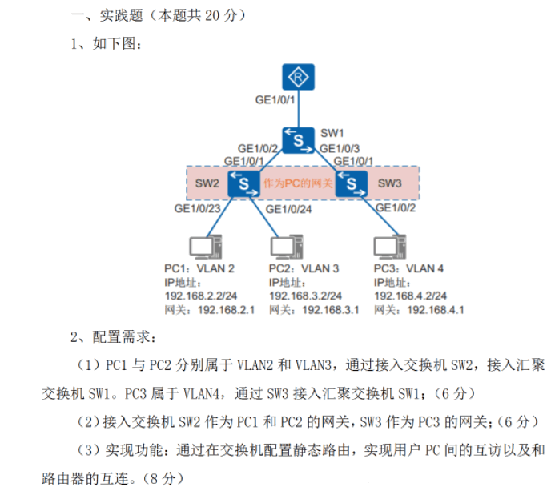
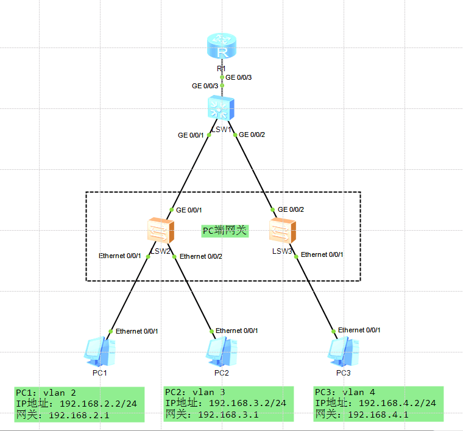
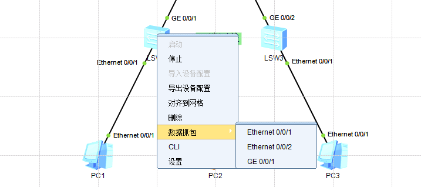
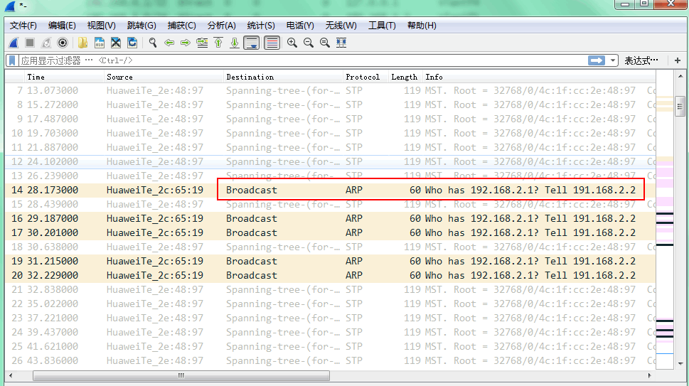
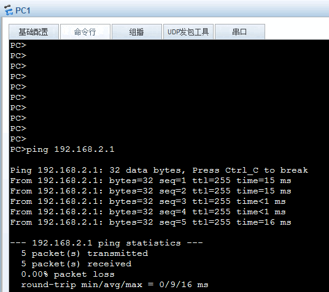
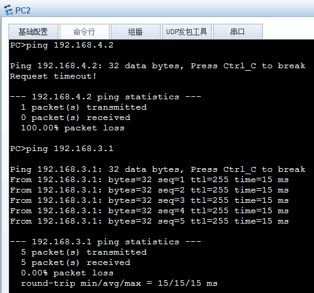
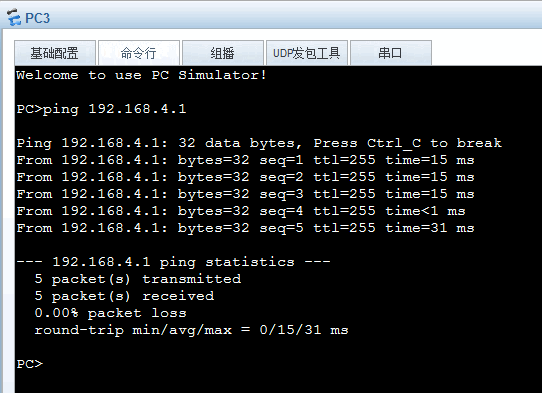
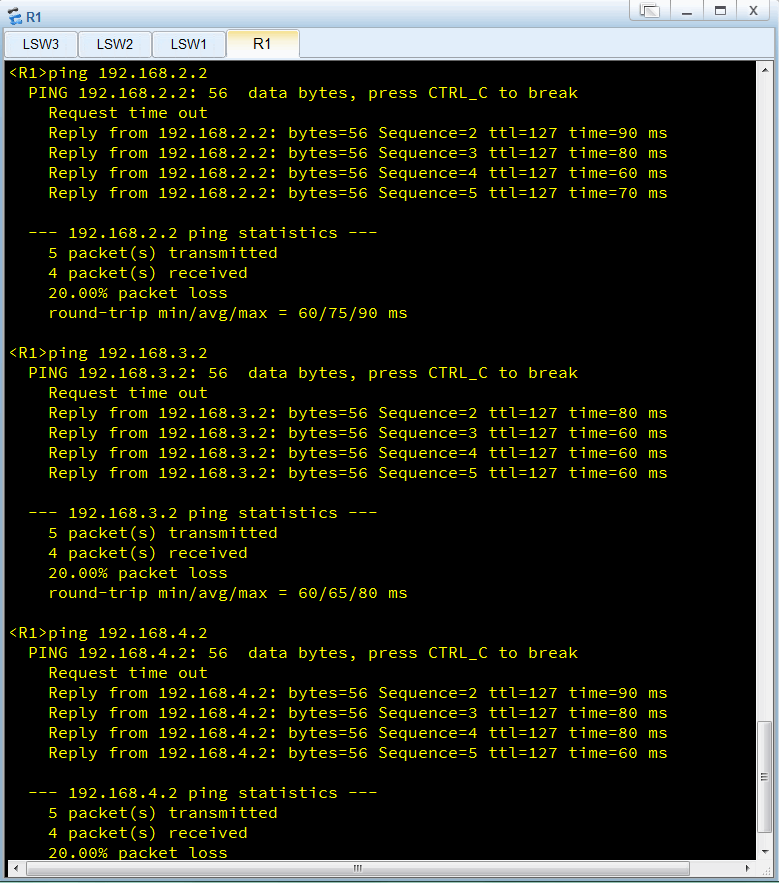
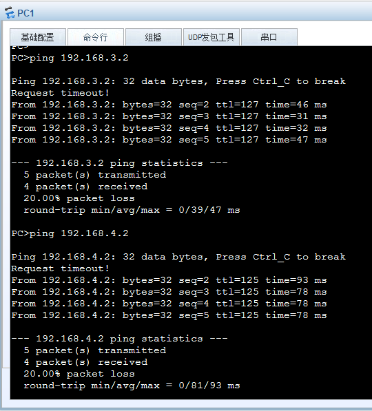
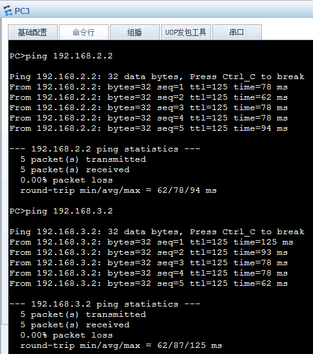

[TOC]


# 华为(ensp)静态路由实验	




## 1. 概念

静态路由（英语：Static routing），一种路由的方式，是由管理员通过手动配置的方式创建的路由，可以让路由器便捷的获知到达目的网络的路由。与动态路由不同，静态路由是固定的，不会改变，即使网络状况已经改变或是重新被组态。在静态路由基础上也可使用负载均衡、路由备份等技术。


## 2. 优缺点

**优点：**

- 网络安全保密性高。动态路由因为需要路由器之间频繁地交换各自的路由表，而对路由表的分析可以揭示网络的拓扑结构和网络地址等信息。
- 不占用网络带宽，因为静态路由不会产生更新流量。

**缺点：**

- 大型和复杂的网络环境通常不宜采用静态路由。一方面，网络管理员难以全面地了解整个网络的拓扑结构；另一方面，当网络的拓扑结构和链路状态发生变化时，路由器中的静态路由信息需要大范围地调整，这一工作的难度和复杂程度非常高。
- 当网络发生变化或网络发生故障时，不能重选路由，实验故障动态转移。


## 3. 网络拓扑图




## 4. 实验配置

### 4.1 LSW2交换机操作

```bash
<Huawei>sys		#进入系统视图
Enter system view, return user view with Ctrl+Z.
[Huawei]sysname LSW2		#修改设备名
[LSW2]
Aug 30 2020 09:26:00-08:00 LSW2 DS/4/DATASYNC_CFGCHANGE:OID 1.3.6.1.4.1.2011.5.2
5.191.3.1 configurations have been changed. The current change number is 4, the 
change loop count is 0, and the maximum number of records is 4095.    #此为提示信息，可以关闭

[LSW2]undo info-center enable		#关闭提示信息
Info: Information center is disabled.


[LSW2]vlan batch 2 3   # 划分多个vlan
[LSW2]vlan 5
[LSW2-vlan5]int e0/0/1		# 进入以太网接口1
[LSW2-Ethernet0/0/1]port link-type access		#设置接口为access模式
[LSW2-Ethernet0/0/1]port default vlan 2			#设置此网口的VLAN号为2
[LSW2-Ethernet0/0/1]int e0/0/2
[LSW2-Ethernet0/0/2]port link-type access 
[LSW2-Ethernet0/0/2]port default vlan 3
[LSW2-Ethernet0/0/2]q
[LSW2]int g0/0/1
[LSW2-GigabitEthernet0/0/1]port link-type access
[LSW2-GigabitEthernet0/0/1]port default vlan 5
[LSW2-GigabitEthernet0/0/1]q
[LSW2]int vlan 2
[LSW2-Vlanif2]ip add 192.168.2.1 24
[LSW2-Vlanif2]int vlan 3
[LSW2-Vlanif3]ip add 192.168.3.1 24
[LSW2-Vlanif3]int vlan 5
[LSW2-Vlanif5]ip add 192.168.5.2 24
[LSW2-Vlanif5]q
[LSW2]ip route-static 0.0.0.0 0.0.0.0 192.168.5.1
[LSW2]
```


### 4.2 LSW3交换机操作

```
<Huawei>sys
[Huawei]sysname LSW2
[LSW2]undo info-center enable


[LSW3]vlan 4
[LSW3-vlan4]vlan 5
[LSW3]int e0/0/1
[LSW3-Ethernet0/0/1]port link-type access
[LSW3-Ethernet0/0/1]port default vlan 4
[LSW3-Ethernet0/0/1]q
[LSW3]int vlan 4
[LSW3-Vlanif4]ip add 192.168.4.1 24
[LSW3-Vlanif4]q
[LSW3]int g0/0/2
[LSW3-GigabitEthernet0/0/2]port link-type access
[LSW3-GigabitEthernet0/0/2]port default vlan 5
[LSW3-GigabitEthernet0/0/2]int vlan 5
[LSW3-Vlanif5]ip add 192.168.5.3 24
[LSW3-Vlanif5]q
[LSW3]ip route-static 0.0.0.0 0.0.0.0 192.168.5.1

```


### 4.4 LSW1交换机操作

```bash
<Huawei>sys
[Huawei]sysname LSW1
[LSW1]undo info-center enable

[LSW1]vlan 5
[LSW1-vlan5]q
[LSW1]int vlan 5
[LSW1-Vlanif5]ip add 192.168.5.1 24
[LSW1-Vlanif5]q
[LSW1]int g0/0/3
[LSW1-GigabitEthernet0/0/3]port link-type acc	
[LSW1-GigabitEthernet0/0/3]port link-type access 
[LSW1-GigabitEthernet0/0/3]port default vlan 5
[LSW1-GigabitEthernet0/0/3]q
[LSW1]int g0/0/1
[LSW1-GigabitEthernet0/0/1]port link-type access 
[LSW1-GigabitEthernet0/0/1]port default vlan 5
[LSW1-GigabitEthernet0/0/1]int g0/0/2
[LSW1-GigabitEthernet0/0/2]port link-type access
[LSW1-GigabitEthernet0/0/2]port default vlan 5
[LSW1-GigabitEthernet0/0/2]q
[LSW1]ip route-static 192.168.2.0 255.255.255.0 192.168.5.2
[LSW1]ip route-static 192.168.3.0 255.255.255.0 192.168.5.2
[LSW1]ip route-static 192.168.4.0 255.255.255.0 192.168.5.3
[LSW1]ip route-static 0.0.0.0 0.0.0.0 192.168.5.4
```


### 4.5 R1路由器操作

```bash
<Huawei>sys
[Huawei]sysname AR1
[R1]undo info-center enable

[R1]int g0/0/3 
[R1-GigabitEthernet0/0/3]ip add 192.168.5.4 24
[R1-GigabitEthernet0/0/3]q
[R1]ip route-static 0.0.0.0 0.0.0.0 192.168.5.1
[R1]q
<R1>save   #保存路由器配置
The current configuration will be written to the device.
Are you sure to continue?[Y/N]y
Info: Please input the file name ( *.cfg, *.zip ) [vrpcfg.zip]:r1.cfg   #文件名
Now saving the current configuration to the slot 17.
Save the configuration successfully.
```


### 4.6 查看交换机路由表信息

确保所有接口连线后，查看路由信息。注意接口。

```
<LSW1>display ip routing-table
Route Flags: R - relay, D - download to fib
------------------------------------------------------------------------------
Routing Tables: Public
         Destinations : 8        Routes : 8        

Destination/Mask    Proto   Pre  Cost      Flags NextHop         Interface

        0.0.0.0/0   Static  60   0          RD   192.168.5.4     Vlanif5
      127.0.0.0/8   Direct  0    0           D   127.0.0.1       InLoopBack0
      127.0.0.1/32  Direct  0    0           D   127.0.0.1       InLoopBack0
    192.168.2.0/24  Static  60   0          RD   192.168.5.2     Vlanif5
    192.168.3.0/24  Static  60   0          RD   192.168.5.2     Vlanif5
    192.168.4.0/24  Static  60   0          RD   192.168.5.3     Vlanif5
    192.168.5.0/24  Direct  0    0           D   192.168.5.1     Vlanif5
    192.168.5.1/32  Direct  0    0           D   127.0.0.1       Vlanif5


<LSW2>display ip routing-table
Route Flags: R - relay, D - download to fib
------------------------------------------------------------------------------
Routing Tables: Public
         Destinations : 9        Routes : 9        

Destination/Mask    Proto   Pre  Cost      Flags NextHop         Interface

        0.0.0.0/0   Static  60   0          RD   192.168.5.1     Vlanif5
      127.0.0.0/8   Direct  0    0           D   127.0.0.1       InLoopBack0
      127.0.0.1/32  Direct  0    0           D   127.0.0.1       InLoopBack0
    192.168.2.0/24  Direct  0    0           D   192.168.2.1     Vlanif2
    192.168.2.1/32  Direct  0    0           D   127.0.0.1       Vlanif2
    192.168.3.0/24  Direct  0    0           D   192.168.3.1     Vlanif3
    192.168.3.1/32  Direct  0    0           D   127.0.0.1       Vlanif3
    192.168.5.0/24  Direct  0    0           D   192.168.5.2     Vlanif5
    192.168.5.2/32  Direct  0    0           D   127.0.0.1       Vlanif5


<LSW3>display ip routing-table
Route Flags: R - relay, D - download to fib
------------------------------------------------------------------------------
Routing Tables: Public
         Destinations : 7        Routes : 7        

Destination/Mask    Proto   Pre  Cost      Flags NextHop         Interface

        0.0.0.0/0   Static  60   0          RD   192.168.5.1     Vlanif5
      127.0.0.0/8   Direct  0    0           D   127.0.0.1       InLoopBack0
      127.0.0.1/32  Direct  0    0           D   127.0.0.1       InLoopBack0
    192.168.4.0/24  Direct  0    0           D   192.168.4.1     Vlanif4
    192.168.4.1/32  Direct  0    0           D   127.0.0.1       Vlanif4
    192.168.5.0/24  Direct  0    0           D   192.168.5.3     Vlanif5
    192.168.5.3/32  Direct  0    0           D   127.0.0.1       Vlanif5
```


## 5.测试连通性

哪个环节有问题就抓包；



明显错误；ip地址有错。



### 5.1 测试PC端到网关的连通性







### 5.2 路由器测试到各PC端连通性



### 5.3 测试各VLAN间PC主机连通性





