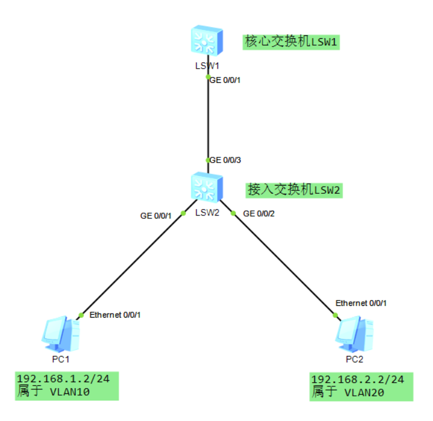
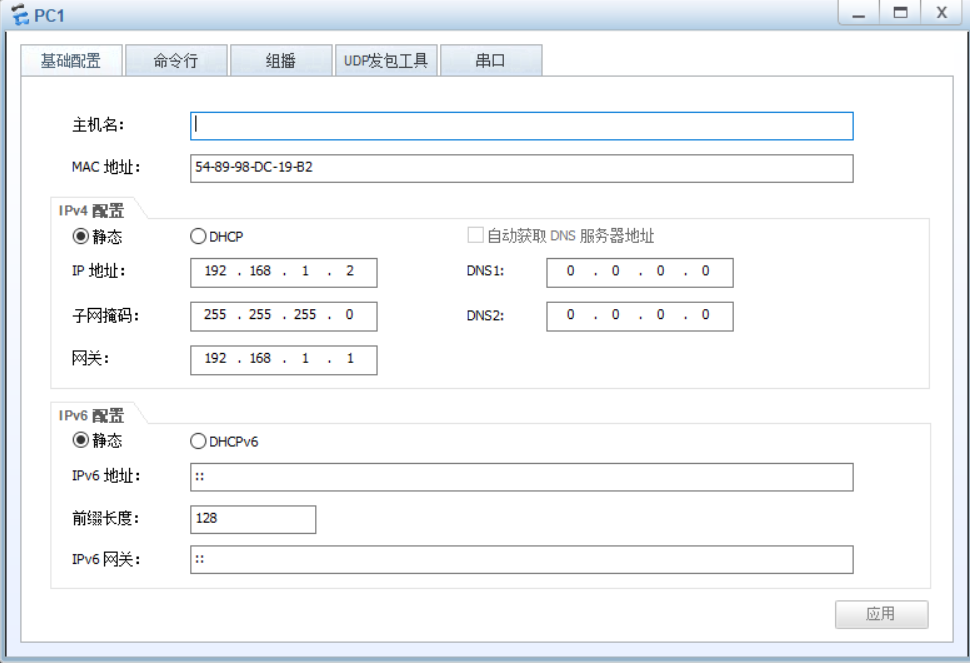
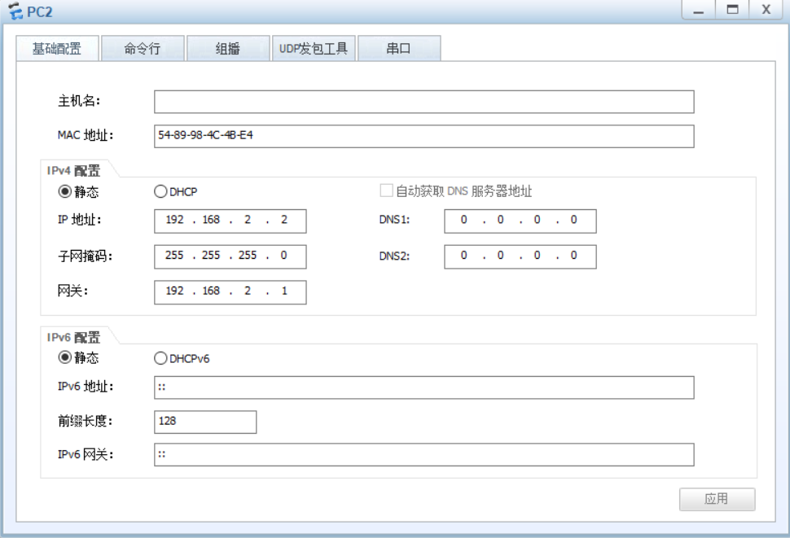
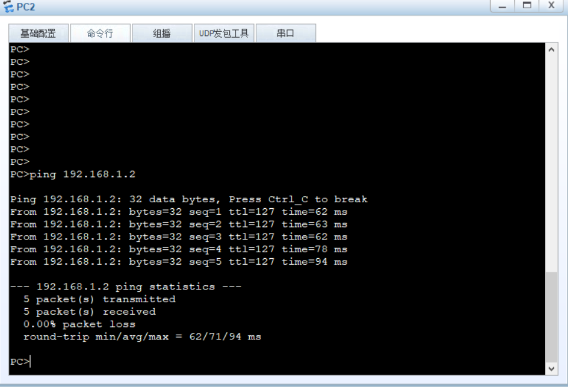
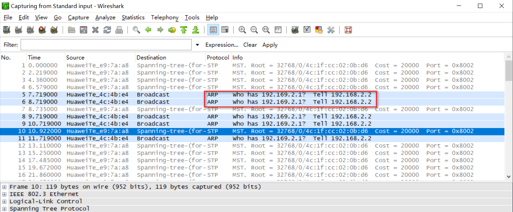

# 华为S5700交换机三层转发

## 1、网络拓扑



## 2、修改交换机名

```
<Huawei>sys
[Huawei]sysname LSW1

<Huawei>sys
[Huawei]sysname LSW2
```


## 3、PC1与PC2分别接入接入LSW2交换机的G0/0/1与G0/0/2口

**1）批量添加VLAN:**

```bash
[LSW2]vlan batch 10 20
Info: This operation may take a few seconds. Please wait for a moment...done.	
[LSW2]display this
#
sysname LSW2
#
undo info-center enable
#
vlan batch 10 20
#
cluster enable
ntdp enable
ndp enable
#
drop illegal-mac alarm
#
return
```

**2）PC所在接口加入VLAN：**

```
[LSW2]interface g0/0/1
[LSW2-GigabitEthernet0/0/1]port link-type access 
[LSW2-GigabitEthernet0/0/1]port default vlan 10
[LSW2-GigabitEthernet0/0/1]inte g0/0/2
[LSW2-GigabitEthernet0/0/2]port link-type access 
[LSW2-GigabitEthernet0/0/2]port default vlan 20
[LSW2-GigabitEthernet0/0/2]interface g0/0/3
[LSW2-GigabitEthernet0/0/3]port link-type trunk
[LSW2-GigabitEthernet0/0/3]port trunk allow-pass vlan 10 20
```

**3）LSW2互联接口设置：：**

```
[LSW2]interface g0/0/3
[LSW2-GigabitEthernet0/0/3]port link-type trunk
[LSW2-GigabitEthernet0/0/3]port trunk allow-pass vlan 10 20
```

## 4、三层交换机LSW1设置

**1）批量添加VLAN：**

```
[LSW1]vlan batch 10 20
```

**2）互联接口设置：**

```
[LSW1]interface g0/0/1
[LSW1-GigabitEthernet0/0/1]port link-type trunk
[LSW1-GigabitEthernet0/0/1]port trunk allow-pass vlan 10 20
```

**3）VLANIF 接口设置：**

`vlanif`接口和`vlan`端口的区别：

（1）vlan端口：是物理端口，通过配置access vlan 10 使某个物理接口属于vlan 10。

（2）vlan if ：就是创建三层虚拟接口，三层交换机才具备，通常这个接口地址作为vlan下面用户的网关。

```
[LSW1]interface Vlanif 10
[LSW1-Vlanif10]ip address 192.168.1.1 24
[LSW1]interface Vlanif 20
[LSW1-Vlanif20]ip add 192.168.2.1 24
```


## 5、PC设置







## 6、测试

使用ping进行测试连通性，PC1 ping PC2或者PC2 ping PC1都可以。




出现问题时，抓包。例如：下面问题时把ip地址写错了。

