# 华为交换机堆叠

# 1 堆叠iStack简介

​	 iStack，全称Intelligent Stack，智能堆叠，适用于S2700、S3700、S5700和S6700中低端交换机。而高端交换机中叫做CSS，全称Cluster Switch System，集群交换系统，适用于S7700、S9300、S9700等高端交换机。此类技术原理是将多台物理交换机在逻辑上合并成一台交换机，所以也叫做交换机虚拟化。在华为交换机中，iStack最多支持9台交换机合并，而在CSS中只支持2台交换机合并。

  如下为堆叠示意图：

通过交换机堆叠，可以实现网络高可靠性和网络大数据量转发，同时简化网络管理。

1、高可靠性。

堆叠系统多台成员交换机之间冗余备份；堆叠支持跨设备的链路聚合功能，实现跨设备的链路冗余备份。

2、强大的网络扩展能力。

通过增加成员交换机，可以轻松的扩展堆叠系统的端口数、带宽和处理能力；同时支持成员交换机热插拔，新加入的成员交换机自动同步主交换机的配置文件和系统软件版本。

3、简化配置和管理。

一方面，用户可以通过任何一台成员交换机登录堆叠系统，对堆叠系统所有成员交换机进行统一配置和管理；另一方面，堆叠形成后，不需要配置复杂的二层破环协议和三层保护倒换协议，简化了网络配置。

# 2 堆叠基本概念

## 2.1 iStack中的交换机角色

1、主交换机：负责管理整个堆叠系统，一个堆叠系统中有且只有一个，显示为master

2、备用交换机：负责在主交换机故障时进行接替，一个堆叠系统中有且只有一个，显示为Standby

3、从交换机：一个堆叠系统中除了主交换外的所有交换机都是从交换机（包括备交换机），显示为Slave

## 2.2 堆叠ID

​    为了方便管理堆叠中的交换机，在一个堆叠内每一个交换机都有唯一的一个堆叠ID，可手工配置默认为0，堆叠ID对交换端口的编号有影响，具体表现为，当交换机加入一个堆叠后，它的端口号将变为：堆叠ID/子卡号/端口号（如未加入堆叠前G0/0/1在加入堆叠后，如果该交换机的堆叠ID是2，那么端口G0/0/1的编号就变成了G2/0/1）

## 2.3 堆叠优先级

​    堆叠优先级是成员交换机的一个属性，主要用于角色选举过程中确定成员交换机的角色，优先级值越大表示优先级越高，优先级越高当选为主交换机的可能性越大。当优先级一样时候看MAC地址，小的成为主，堆叠系统的MAC地址是主交换机的MAC地址。

## 2.4 堆叠的物理成员端口

​    就是交换机堆叠之间连接的物理端口（根据交换机的型号不同，有固定的端口），用于收发堆叠交换机 之间的堆叠协议报文。

# 3 堆叠建立过程

堆叠建立的过程包括以下四个阶段：

## 3.1 物理连接

根据网络需求，选择适当的连接方式和连接拓扑，组建堆叠网络。根据连接介质的不同，堆叠可分为堆叠卡堆叠和业务口堆叠。

如下图：堆叠连接拓扑

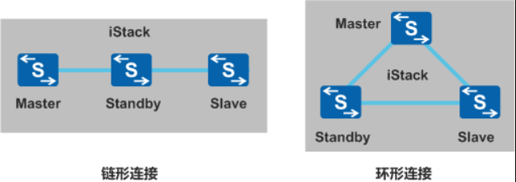

表1 堆叠连接拓扑对比

| 连接拓扑 | 优点                                                         | 缺点                                                         | 适用场景                                                     |
| -------- | ------------------------------------------------------------ | ------------------------------------------------------------ | ------------------------------------------------------------ |
| 链形连接 | 首尾不需要有物理连接，适合长距离堆叠。                       | 可靠性低：其中一条堆叠链路出现故障，就会造成堆叠分裂。堆叠链路带宽利用率低：整个堆叠系统只有一条路径。 | 堆叠成员交换机距离较远时，组建环形连接比较困难，可以使用链形连接。 |
| 环形连接 | 可靠性高：其中一条堆叠链路出现故障，环形拓扑变成链形拓扑，不影响堆叠系统正常工作。堆叠链路带宽利用率高：数据能够按照最短路径转发。 | 首尾需要有物理连接，不适合长距离堆叠。                       | 堆叠成员交换机距离较近时，从可靠性和堆叠链路利用率上考虑，建议使用环形连接。 |

## 3.2 主交换机选举

成员交换机之间相互发送堆叠竞争报文，并根据选举原则，选出堆叠系统主交换机。

确定出堆叠的连接方式和连接拓扑，完成成员交换机之间的物理连接之后，所有成员交换机上电。此时，堆叠系统开始进行主交换机的选举。在堆叠系统中每台成员交换机都具有一个确定的角色，其中，主交换机负责管理整个堆叠系统。主交换机选举规则如下（依次从第一条开始判断，直至找到最优的交换机才停止比较）：

1、运行状态比较，优先选举最先处于启动状态的交换机成为主交换机。

2、堆叠优先级高的交换机优先竞争为主交换机。

3、堆叠优先级相同时，MAC地址小的交换机优先竞争为主交换机。

## 3.3 拓扑收集和备交换机选举

主交换机收集所有成员交换机的拓扑信息，向所有成员交换机分配堆叠ID，之后选出堆叠系统备交换机。

主交换机选举完成后，主交换机会收集所有成员交换机的拓扑信息，根据拓扑信息计算出堆叠转发表项和破环点信息下发给堆叠中的所有成员交换机，并向所有成员交换机分配堆叠ID。之后进行备交换机的选举，作为主交换机的备份交换机。除主交换机外最先完成设备启动的交换机优先被选为备份交换机。当除主交换机外其它交换机同时完成启动时，备交换机的选举规则如下（依次从第一条开始判断，直至找到最优的交换机才停止比较）：

1、堆叠优先级最高的设备成为备交换机。

2、堆叠优先级相同时，MAC地址最小的成为备交换机。

除主交换机和备交换机之外，剩下的其他成员交换机作为从交换机加入堆叠。

## 3.4 稳定运行

主交换机将整个堆叠系统的拓扑信息同步给所有成员交换机，成员交换机同步主交换机的系统软件和配置文件，之后进入稳定运行状态。

角色选举、拓扑收集完成之后，所有成员交换机会自动同步主交换机的系统软件和配置文件：

堆叠具有自动加载系统软件的功能，待组成堆叠的成员交换机不需要具有相同软件版本，只需要版本间兼容即可。当备交换机或从交换机与主交换机的软件版本不一致时，备交换机或从交换机会自动从主交换机下载系统软件，然后使用新系统软件重启，并重新加入堆叠。

堆叠具有配置文件同步机制，备交换机或从交换机会将主交换机的配置文件同步到本设备并执行，以保证堆叠中的多台设备能够像一台设备一样在网络中工作，并且在主交换机出现故障之后，其余交换机仍能够正常执行各项功能。

# 4 堆叠登录与访问

堆叠建立后，多台成员交换机组成一台虚拟设备存在于网络中，堆叠系统的接口编号规则以及登录与访问的方式都发生了变化。

## 4.1 堆叠接口编号规则

堆叠系统的接口编号采用堆叠ID作为标识信息，所有成员交换机的堆叠ID都是唯一的。

对于单台没有运行堆叠的设备，接口编号采用：槽位号/子卡号/端口号（槽位号统一取值为0）。设备加入堆叠后，接口编号采用：堆叠ID/子卡号/端口号。

如：设备没有运行堆叠时，某个接口的编号为GigabitEthernet0/0/1；当该设备加入堆叠后，如果堆叠ID为2，则该接口的编号将变为GigabitEthernet2/0/1。对于管理网口，无论系统是否运行堆叠以及运行堆叠后堆叠ID是多少，接口的编号均为MEth 0/0/1。

子卡号与端口号的编号规则与单机状态下一致。如果设备曾加入过堆叠，在退出堆叠后，仍然会使用组成堆叠时的堆叠ID作为自身的槽位号。

## 4.2 堆叠系统的登录

登录堆叠系统的方式如下：

**本地登录：**通过任意成员交换机的Console口登录。

**远程登录**：通过任意成员交换机的管理网口或其他三层接口登录。只要保证到堆叠系统的路由可达，就可以使用Telnet、Stelnet、WEB以及SNMP等方式进行远程登录。

有管理网口的设备组建堆叠后，系统运行阶段，只有一台成员交换机的管理网口生效，称为主用管理网口。堆叠系统启动后默认选取主成员交换机的管理网口为主用管理网口，若主成员交换机的管理网口异常或不可用，则选取其他成员交换机的管理网口为主用管理网口。如果通过PC直连到非主用管理网口，则无法正常登录堆叠系统。

堆叠建立后，竞争为主的交换机的配置文件生效。如果远程登录堆叠，需要主交换机的IP地址。

不管通过哪台成员交换机登录到堆叠系统，实际登录的都是主交换机。主交换机负责将用户的配置下发给其他成员交换机，统一管理堆叠系统中所有成员交换机的资源。

## 4.3 堆叠文件系统的访问

文件系统的访问包括对存储器中文件和目录的创建、删除、修改以及文件内容的显示等。设备支持的存储器为Flash。

通过drive + path + filename这种格式，指定到某路径下的文件名，详细解释可参见[文件系统简介](http://www.023wg.com/jcpz/341.html)。其中：

drive指设备中的存储器。path指存储器中的目录以及子目录。filename指文件名。

堆叠环境与单机环境的不同点在于drive的命名：

flash：堆叠系统中主交换机Flash存储器的根目录。堆叠ID#flash：堆叠系统中某成员交换机Flash存储器的根目录。例如：slot2#flash:是指堆叠ID为2的成员交换机Flash存储器的根目录。

# 5 堆叠跨设备链路聚合

​        堆叠支持跨设备链路聚合技术，通过配置跨设备Eth-Trunk接口实现。用户可以将不同成员交换机上的物理以太网端口配置成一个聚合端口连接到上游或下游设备上，实现多台设备之间的链路聚合。当其中一条聚合链路故障或堆叠中某台成员交换机故障时，Eth-Trunk接口能够将流量重新分布到其他聚合链路上，实现了链路间和设备间的备份，保证了数据流量的可靠传输。

如图：跨设备Eth-Trunk接口实现链路间的备份

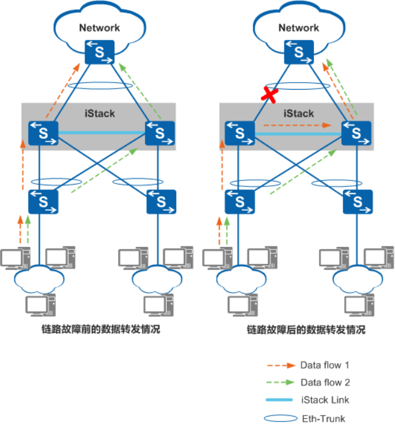

如上图所示，流向网络核心的流量将均匀分布在聚合链路上，当某一条聚合链路失效时，Eth-Trunk接口将流量通过堆叠线缆重新分布到其他聚合链路上，实现了链路间的备份。

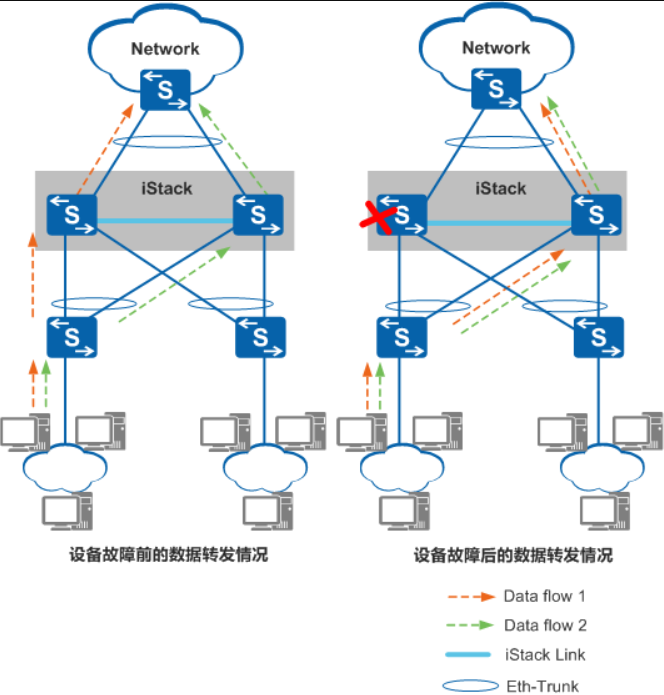

# 6 堆叠流量本地优先转发

​		跨设备链路聚合实现了数据流量的可靠传输和堆叠成员交换机的相互备份。但是由于堆叠设备间堆叠线缆的带宽有限，跨设备转发流量增加了堆叠线缆的带宽承载压力，同时也降低了流量转发效率。为了提高转发效率，减少堆叠线缆上的转发流量，设备支持流量本地优先转发。即从本设备进入的流量，优先从本设备相应的接口转发出去；如果本设备相应的接口故障或者流量已经达到接口的线速，那么就从其它堆叠成员交换机的接口转发出去。

下图为：流量本地优先转发

SwitchA与SwitchB组成堆叠，上下行都加入到Eth-Trunk。如果没有本地优先转发，则从SwitchA进入的流量，根据当前Eth-Trunk的负载分担方式，会有一部分经过堆叠线缆，从SwitchB的物理接口转发出去。设备支持本地优先转发之后，从SwitchA进入的流量，只会从SwitchA的接口转发，流量不经过堆叠线缆。

# 7 堆叠ID分配

​		设备堆叠ID缺省为0。堆叠时由堆叠主对设备的堆叠ID进行管理，当堆叠系统有新成员加入时，如果新成员与已有成员堆叠ID冲突，则堆叠主从0～最大的堆叠ID进行遍历，找到第一个空闲的ID分配给该新成员。

​		新建堆叠或堆叠成员变化时，如果不在堆叠前手动指定各设备的堆叠ID，则由于启动顺序等原因，最终堆叠系统中各成员的堆叠ID是随机的。

​		因此，在建立堆叠时，建议提前规划好设备的堆叠ID，或通过特定的操作顺序，使设备启动后的堆叠ID与规划的堆叠ID一致。修改堆叠ID设备需要重启。

# 8 堆叠成员加入

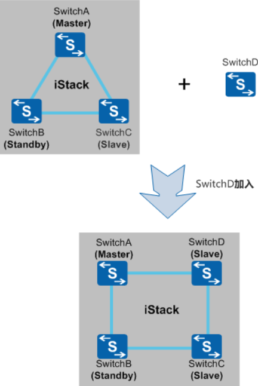

如上图所示，堆叠成员加入是指向已经稳定运行的堆叠系统添加一台新的交换机。

堆叠成员加入分为新成员交换机带电加入和不带电加入，带电加入将在后面的堆叠合并章节中说明，此处堆叠成员加入是指不带电加入。

新成员交换机加入堆叠时，建议采用不带电加入。

**堆叠成员加入的过程如下：**

1、新加入的交换机连线上电启动后，进行角色选举，新加入的交换机会选举为从交换机，堆叠系统中原有主备从角色不变。

2、角色选举结束后，主交换机更新堆叠拓扑信息，同步到其他成员交换机上，并向新加入的交换机分配堆叠ID（新加入的交换机没有配置堆叠ID或配置的堆叠ID与原堆叠系统的冲突时）。

3、新加入的交换机更新堆叠ID，并同步主交换机的配置文件和系统软件，之后进入稳定运行状态。

**用户可按照以下操作完成堆叠成员加入：**

1、分析当前堆叠的物理连接，选择加入点。

如果是链形连接，新加入的交换机建议添加到链形的两端，这样对现有的业务影响最小。如果是环形连接，需要把当前环形拆成链形，然后在链形的两端添加设备。

2、进行堆叠的配置。

如果是业务口堆叠，新加入的交换机需要配置物理成员端口加入逻辑堆叠端口；并且链形连接时，当前堆叠系统链形两端（或一端）的成员交换机也需要配置物理成员端口加入逻辑堆叠口。

如果是堆叠卡堆叠，新加入的成员交换机需要使能堆叠功能。为了便于管理，建议为新加入的交换机配置堆叠ID。如果不配置，堆叠系统会为其分配一个堆叠ID。

3、新加入的交换机下电后连接堆叠线缆，然后重新上电。

4、如果需要加入多台交换机，重复1-3的过程。

5、保存配置。

# 9 堆叠成员退出

堆叠成员退出是指成员交换机从堆叠系统中离开。根据退出成员交换机角色的不同，对堆叠系统的影响也有所不同：

当主交换机退出，备份交换机升级为主交换机，重新计算堆叠拓扑并同步到其他成员交换机，指定新的备交换机，之后进入稳定运行状态。

当备交换机退出，主交换机重新指定备交换机，重新计算堆叠拓扑并同步到其他成员交换机，之后进入稳定运行状态。

当从交换机退出，主交换机重新计算堆叠拓扑并同步到其他成员交换机，之后进入稳定运行状态。

堆叠成员交换机退出的过程，主要就是拆除堆叠线缆和移除交换机的过程：

对于环形堆叠：成员交换机退出后，为保证网络的可靠性还需要把退出交换机连接的两个端口通过堆叠线缆进行连接。

对于链形堆叠：拆除中间交换机会造成堆叠分裂。这时需要在拆除前进行业务分析，尽量减少对业务的影响。

# 10 堆叠合并

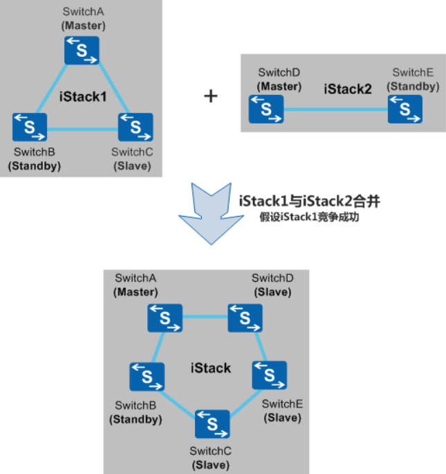

​		堆叠合并是指稳定运行的两个堆叠系统合并成一个新的堆叠系统。如上图1所示，两个堆叠系统的主交换机通过竞争，选举出一个更优的作为新堆叠系统的主交换机。

​		竞争成功的主交换机所在的堆叠系统将保持原有主备从角色和配置不变，业务也不会受到影响；而另外一个堆叠系统的所有成员交换机将重新启动，以从交换机的角色加入到新堆叠系统，其堆叠ID将由新主交换机重新分配，并将同步新主交换机的配置文件和系统软件，该堆叠系统的原有业务也将中断。

​		堆叠系统合并流程与堆叠成员加入流程类似，具体可参见前面章节堆叠成员加入。堆叠合并时主交换机的选举规则为：比较运行时间，运行时间较早的堆叠系统竞争为主；如果两个堆叠系统的运行时间一样，其主交换机的选举规则与堆叠建立时一样。

​		堆叠合并通常在以下两种情形下出现：

​		堆叠链路或设备故障导致堆叠分裂，链路或设备故障恢复后，分裂的堆叠系统重新合并。

​		待加入堆叠系统的交换机配置了堆叠功能，在不下电的情况下，使用堆叠线缆连接到正在运行的堆叠系统。通常情况下，不建议使用该方式形成堆叠。

# 11 堆叠分裂

​		堆叠分裂是指稳定运行的堆叠系统中带电移出部分成员交换机，或者堆叠线缆多点故障导致一个堆叠系统变成多个堆叠系统。

​		根据原堆叠系统主备交换机分裂后所处位置的不同，堆叠分裂可分为以下两类：

​		1、堆叠分裂后，原主备交换机被分裂到同一个堆叠系统中：

​		原主交换机会重新计算堆叠拓扑，将移出的成员交换机的拓扑信息删除，并将新的拓扑信息同步给其他成员交换机；而移出的成员交换机检测到堆叠协议报文超时，将自行复位，重新进行选举。

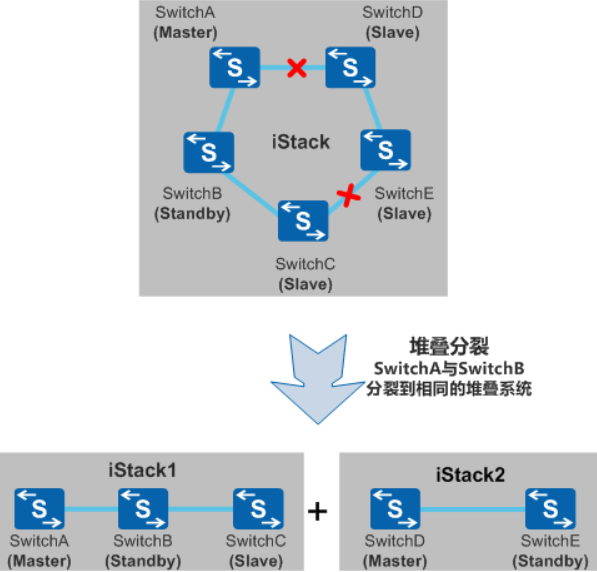

​																			图示为原主备交换机被分裂到同一个堆叠系统中

如上图所示，堆叠系统分裂后，原主交换机SwitchA删除SwitchD和SwitchE的拓扑信息，并将新的拓扑信息同步给SwitchB和SwitchC；SwitchD和SwitchE重启后，重新进行堆叠建立。

​		2、堆叠分裂后，原主备交换机被分裂到不同的堆叠系统中：

​		原主交换机所在堆叠系统重新指定备交换机，重新计算拓扑信息并同步给其他成员交换机；原备交换机所在堆叠系统将发生备升主，原备交换机升级为主交换机，重新计算堆叠拓扑并同步到其他成员交换机，并指定新的备交换机。

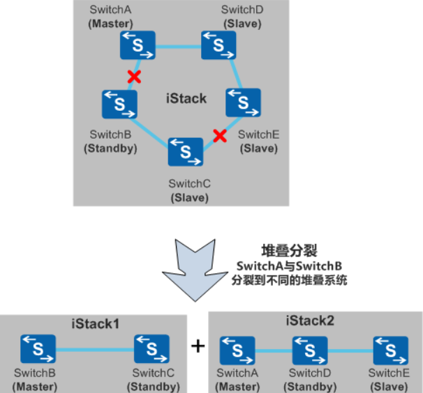

​																图示为原主备交换机被分裂到不同的堆叠系统中

如上图所示，堆叠系统分裂后，原主交换机SwitchA指定SwitchD作为新的备交换机，重新计算拓扑信息，并将新的拓扑信息同步给SwitchD和SwitchE；原备交换机SwitchB升级为主交换机，重新计算堆叠拓扑并同步给SwitchC，并指定SwitchC作为新的备交换机。

# 12 堆叠多主检测

由于堆叠系统中所有成员交换机都使用同一个IP地址和MAC地址（堆叠系统MAC），一个堆叠分裂后，可能产生多个具有相同IP地址和MAC地址的堆叠系统。为防止堆叠分裂后，产生多个具有相同IP地址和MAC地址的堆叠系统，引起网络故障，必须进行IP地址和MAC地址的冲突检查。

多主检测MAD（Multi-Active Detection），是一种检测和处理堆叠分裂的协议。链路故障导致堆叠系统分裂后，MAD可以实现堆叠分裂的检测、冲突处理和故障恢复，降低堆叠分裂对业务的影响。

**1、MAD检测方式**

MAD检测方式有两种：直连检测方式和代理检测方式。在同一个堆叠系统中，两种检测方式互斥，不可以同时配置。

**1.1、直连检测方式**

直连检测方式是指堆叠成员交换机间通过普通线缆直连的专用链路进行多主检测。在直连检测方式中，堆叠系统正常运行时，不发送MAD报文；堆叠系统分裂后，分裂后的两台交换机以1s为周期通过检测链路发送MAD报文以进行多主冲突处理。

直连检测的连接方式包括通过中间设备直连和堆叠成员交换机Full-mesh方式直连：

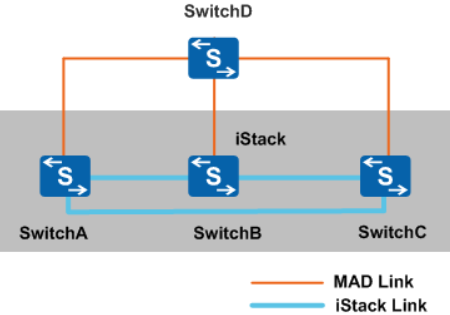

​																					图示为通过中间设备的直连检测方式

1.1.1、通过中间设备直连：

如上图所示，堆叠系统的所有成员交换机之间至少有一条检测链路与中间设备相连。

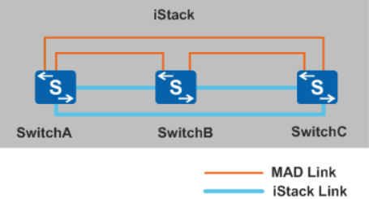

 																			图示为堆叠成员交换机Full-mesh方式直连

1.1.2、Full-mesh方式直连：

如上图所示，堆叠系统的各成员交换机之间通过检测链路建立Full-mesh全连接，即每两台成员交换机之间至少有一条检测链路。

通过中间设备直连可以实现通过中间设备缩短堆叠成员交换机之间的检测链路长度，适用于成员交换机相距较远的场景。与通过中间设备直连相比，Full-mesh方式直连可以避免由中间设备故障导致的MAD检测失败，但是每两台成员交换机之间都建立全连接会占用较多的接口，所以该方式适用于成员交换机数目较少的场景。

接口配置直连多主检测功能后，不能再配置其他业务。为保证可靠性，成员交换机之间最多可以配置8条直连检测链路。由于MAD报文是BPDU报文，采用通过中间设备的直连检测方式时，在直连检测链路的中间设备上需要配置转发BPDU报文，配置方法请参见后面将要发布的基于接口的二层协议透明传输章节。

**1.2、代理检测方式**

代理检测方式是在堆叠系统Eth-Trunk上启用代理检测，在代理设备上启用MAD检测功能。

此种检测方式要求堆叠系统中的所有成员交换机都与代理设备连接，并将这些链路加入同一个Eth-Trunk内。与直连检测方式相比，代理检测方式无需占用额外的接口，Eth-Trunk接口可同时运行MAD代理检测和其他业务。

在代理检测方式中，堆叠系统正常运行时，堆叠成员交换机以30s为周期通过检测链路发送MAD报文。堆叠成员交换机对在正常工作状态下收到的MAD报文不做任何处理；堆叠分裂后，分裂后的两台交换机以1s为周期通过检测链路发送MAD报文以进行多主冲突处理。

下图为单机作代理设备的代理检测方式：

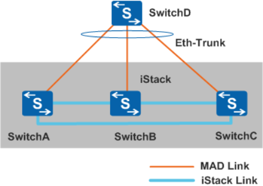

下图为两套堆叠系统互为代理的代理检测方式：

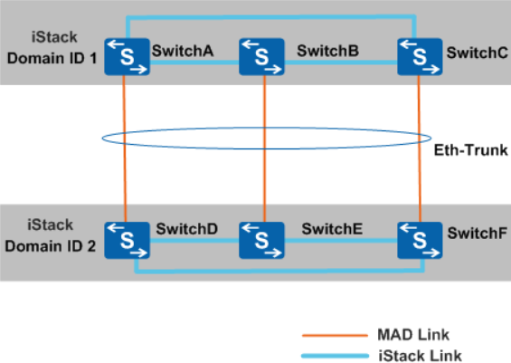

根据代理设备的不同，代理检测方式可分为单机作代理（如上图）和两套堆叠系统互为代理（如上图）。

代理设备必须为支持MAD代理功能的交换机，设备支持两套堆叠系统互为代理进行多主检测，此时必须通过配置保证两套堆叠系统的堆叠域的域编号（Domain ID）不同。

组成一个堆叠系统的交换机构成一个堆叠域。一个网络中可以部署多个堆叠系统，因此会有多个堆叠域，不同的堆叠域的域编号不同。

当有9台设备堆叠时，由于每个Eth-Trunk最多加入8个成员接口，导致一个Eth-Trunk不能包含所有的成员交换机。此时需要配置多个Eth-Trunk，来保证任意两台成员交换机之间都有检测链路。

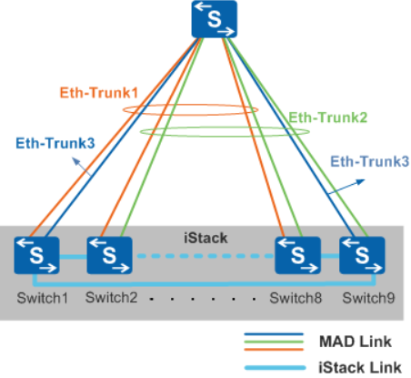

   																			图示为在多个Eth-Trunk上配置代理检测

如上图所示，Switch1-8配置在Eth-Trunk1里，Switch2-9配置在Eth-Trunk2里，Switch1和Switch9配置在Eth-Trunk3里。

2、MAD冲突处理

堆叠分裂后，MAD冲突处理机制会使分裂后的堆叠系统处于Detect状态或Recovery状态。Detect状态表示堆叠正常工作状态，Recovery状态表示堆叠禁用状态。

MAD冲突处理机制如下：MAD分裂检测机制会检测到网络中存在多个处于Detect状态的堆叠系统，这些堆叠系统之间相互竞争，竞争成功的堆叠系统保持Detect状态，竞争失败的堆叠系统会转入Recovery状态；并且在Recovery状态堆叠系统的所有成员交换机上，关闭除保留端口以外的其它所有物理端口，以保证该堆叠系统不再转发业务报文。

3、MAD故障恢复

通过修复故障链路，分裂后的堆叠系统重新合并为一个堆叠系统。重新合并的方式有以下两种：

堆叠链路修复后，处于Recovery状态的堆叠系统重新启动，与Detect状态的堆叠系统合并，同时将被关闭的业务端口恢复Up，整个堆叠系统恢复。

如果故障链路修复前，承载业务的Detect状态的堆叠系统也出现了故障。此时，可以先将Detect状态的堆叠系统从网络中移除，再通过命令行启用Recovery状态的堆叠系统，接替原来的业务，然后再修复原Detect状态堆叠系统的故障及链路故障。故障修复后，重新合并堆叠系统。

# 13 堆叠主备倒换

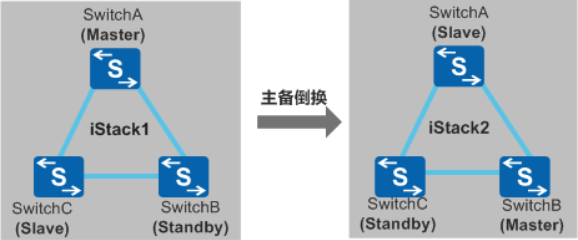

