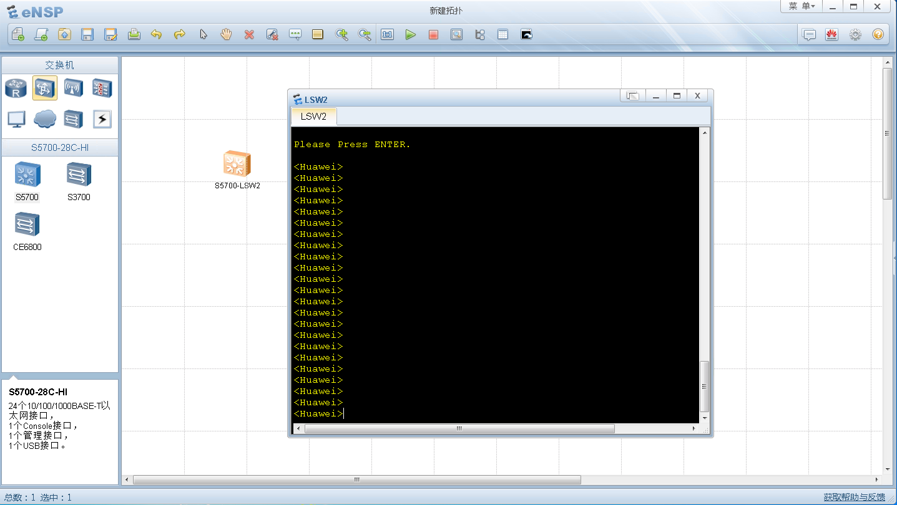
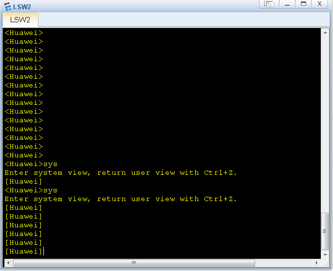
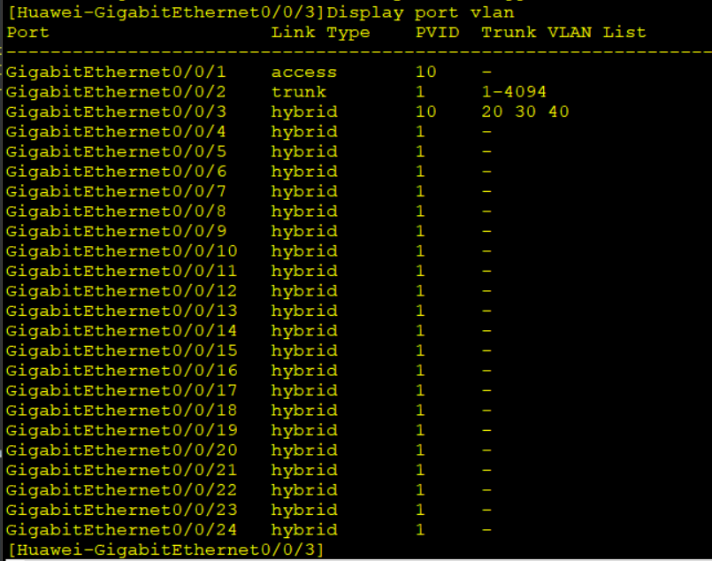

# 华为交换机常用命令(s5700-SI)

[TOC]


## 华为模拟器eNSP安装

eNSP(Enterprise Network Simulation Platform)是一款由华为提供的免费的、可扩展的、图形化操作的网络仿真工具平台，主要对企业网络路由器、交换机进行软件仿真，完美呈现真实设备实景，支持大型网络模拟，让广大用户有机会在没有真实设备的情况下能够模拟演练，学习网络技术。

链接：https://pan.baidu.com/s/1CVM0SyhmItum9Y5H8vRAvQ 
提取码：3ikk


## 交换机的三种端口链路类型

**Access模式:只能属于1个VLAN，一般用于连接计算机的端口；**

一般用来连接计算机与交换机. 此模式下有一个PVID就是本端口所属的VLAN号,如果从链路上收到无标签的帧,则打上默认VLAN号,然后发给其他端口,如果从链路上收到有标签的帧,如果这个帧的VLAN等于PVID,则直接发给其他端口,如果不等于PVID,则直接丢弃.如果从其他端口收到一个有标签的帧,且VLAN等于PVID,则直接剥离掉标签从此端口发出,如果此标签不等于PVID,则直接丢弃.

**Trunk模式:可以属于多个VLAN，可以接收和发送多个VLAN的报文，一般用于交换机之间连接的端口；**

一般用于各交换机之间连接.此模式下有一个PVID和允许通过的VLAN ID列表. 如果从链路上收到一个不带标签的帧,则直接打上PVID号,转发到其他端口, 如果从链路上收到一个带标签的帧,且此帧的VLAN号在允许通过的VLAN列表里,则直接转发给其他端口; 如果从其他端口收到一个有标签的帧,且此帧的VLAN等于PVID,则直接剥离掉标签,并从此端口发出,如果此标签不等于PVID,则查看此帧的VLAN号是否在允许通过的VLAN列表里,如果在,则直接从此端口发出,否则丢弃.

**Hybrid模式:可以属于多个VLAN，可以接收和发送多个VLAN的报文，可以用于交换机之间连接，也可以用于连接用户的计算机。**

此模式下,有一个默认的PVID号,一个untagged列表和一个tagged列表. 如果从链路上收到一个无标签的帧,则打上PVID号,转发到其他端口,如果从链路上收到一个带标签的帧,且此帧的VLAN号在untagged或者tagged列表中的其中任意一个列表里,则直接转发到其他端口,否则丢弃. 如果从其他端口收到一个有标签的帧,且帧的VLAN号在tagged列表里,则直接从此端口发出,如果VLAN号在untagged列表里,这剥离掉帧的VLAN标签,然后从此端口发出。


其中，Hybrid端口和Trunk端口的相同之处在于两种链路类型的端口都可以允许多个VLAN的报文发送时打标签；不同之处在于Hybrid端口可以允许多个VLAN的报文发送时不打标签，而Trunk端口只允许缺省VLAN的报文发送时不打标签。

三种类型的端口可以共存在一台以太网交换机上，但Trunk端口和Hybrid端口之间不能直接切换，只能先设为Access端口，再设置为其他类型端口。例如：Trunk端口不能直接被设置为Hybrid端口，只能先设为Access端口，再设置为Hybrid端口。

**各类型端口使用注意事项：**

配置Trunk端口或Hybrid端口，并利用Trunk端口或Hybrid端口发送多个VLAN报文时一定要注意：本端端口和对端端口的缺省VLAN ID(端口的PVID)要保持一致。

当在交换机上使用isolate-user-vlan来进行二层端口隔离时，参与此配置的端口的链路类型会自动变成Hybrid类型。

Hybrid端口的应用比较灵活，主要为满足一些特殊应用需求。此类需求多为在无法下发访问控制规则的交换机上，利用Hybrid端口收发报文时的处理机制，来完成对同一网段的PC机之间的二层访问控制。


## 华为交换机的三种视图

**用户视图**：刚开始登入交换机时的视图,一般看到的是尖括号`<> `。

```
save    // 配置完交换机后保存当前配置的命令
system-view    // 进入系统视图的命令
clock  timezone  BJ  add|minus 8   // 设置时区
clock  datetime  16:36:00 2016-07-01    //设置交换机的时间

交换机文件处理命令
1．  查看交换机配置文件名和备份文件
用户视图： dir flash:/ 
用户视图 ：dir /all               #查看所有问价包括缓存
2．  查看当前所在文件夹
用户视图： Pwd
3．  查看当前配置文件名和下次启动加载配置文件
用户视图： display startup
4．  改变下次启动加载文件
用户视图 ：startup saved-configuration 文件名
5．  备份当前配置文件
用户视图 ：save 文件名.cfg/zip（一般跟日期，后缀为cfg或zip）
6．  创建文件夹
用户视图 ：mkdir
7.  删除文件
用户视图 ：delete 文件名     #删除但还在回收站中 使用dir /all查看回收站中的缓存
用户视图：reset recycle-bin     #彻底清除回收站
用户视图：undelete  文件名   #恢复回收站中的文件
用户视图：delete /unreserved  文件名    #彻底删除文件不保存回收站
```




**系统视图：**在用户视图下输入`system-view`后进入系统视图,一般为方括号`[]`。

```
sys    //进入系统视图
quit   //返回上一级
undo info-center enable //关闭提示信息
display current-configuration  // 显示当前配置
#相关查看命令
[Quidway] display version //显示 VRP 版本号
[Quidway] display current-configuration //显示系统运行配置信息
[Quidway] display saved-configuration //显示保存的配置信息
[Quidway] display interfaces brief //显示接口配置信息
user-interface maximum-vty 15  //配置vty最大连接数
user-interface vty 0 14     //进入vty用户界面视图
user privilege level 2      //设置vty登入的用户等级为2(配置用户级别)
authentication-mode aaa  //设置vty登入时的验证模式为用户名和密码验证

aaa  //进入AAA视图
local-user admin password cipher admin@123  //设置aaa登入的用户名和密码
local-user admin service-type telnet  //设置admin用户远程登入时的协议

user-interface console 0     //进入第0个console口的用户界面
authentication-mode password   //配置从console口登入交换机的认证模式为密码认证
set authentication password cipher admin@123  //配置从console口登入交换机的密码


Quidway交换机维护

显示系统版本信息：display version
显示诊断信息：display diagnostic-information
显示系统当前配置：display current-configuration
显示系统保存配置： display saved-configuration
显示接口信息：display interface
显示路由信息：display ip routing-table
显示VLAN信息：display vlan
显示生成树信息：display stp
显示MAC地址表：display mac-address
显示ARP表信息：display arp
显示系统CPU使用率：display cpu
显示系统内存使用率：display memory
显示系统日志：display log
显示系统时钟：display clock
验证配置正确后，使用保存配置命令：save
删除某条命令，一般使用命令： undo
```



创建一个VLAN

```
vlan 10  //创建一个VLAN

interface meth 0/0/1   //进入交换机的第一个管理网口
ip address 192.168.1.110 24 //设置管理网口的ip地址和子网掩码

interface GigabitEthernet 0/0/1 //进入第一个业务网口
port link-type access  //设置第1个网口位access模式
port default vlan 10   //设置此网口的VLAN号为10

interface GigabitEthernet 0/0/2 //进入第2个业务网口
port link-type trunk   //设置第二个网口位trunk模式
port trunk allow-pass vlan 10 20 30  //设置此端口可以通过的VLAN号
port trunk allow-pass vlan all  表示可以通过所有的带VLAN的帧

Interface GigabitEthernet 0/0/3  //进入第3个业务网口
Port link-type hybrid     //设置此端口为hybrid模式,每个端口默认就是hybrid模式
Port hybrid pvid vlan 10   //设置pvid为10
Port hybrid tagged vlan 20 30 40 //设置tagged列表为20,30,40
Port hybrid untagged vlan 50 60 //设置untagged列表为50,60

Display port vlan  //显示当前各端口的VLAN情况
```




清除某个端口的配置

```
方法一：进入对应接口清除
Interface gigabitethernet 0/0/2
display this   // 查看当前端口信息
Clear configuration this
Undo shutdown    //开启端口
方法二：全局模式清除对应接口
[Huawei]clear configuration interface GigabitEthernet 0/0/2


Interface gigabitethernet 0/0/3
Undo port default vlan  //access 模式的端口
Undo port link-type 
Undo port hybrid pvid vlan vlanid  //hybrid 模式的端口
Undo port hybrid untagged vlan vlanid 
Undo port hybrid tagged vlan vlanid 
Undo port trunk pvid vlan  //trunk 模式的端口
Undo port trunk allow-pass vlan vlanid 
Undo port link-type

恢复出厂设置s5700SI
在用户视图下(按Ctrl+z组合键回到用户视图)输入如下命令操作
reset saved-configuration
Y
Reboot
N
Y
```

设置交换机的mux-vlan模式

```
假设主VLAN是10,从VLAN中group模式的有VLAN 20, separate模式的有VLAN 30,server连接1号端口,PC1和PC2连接2和3号端口,PC3和PC4连接4和5号端口
Vlan batch 10 20 30
Vlan 10
Mux-vlan
Subordinate group 20
Subordinate separate 30
把各连接的端口设为access模式,并且加入到各自的VLAN中,且同时开启mux-vlan功能,
Interface gigabitethernet 0/0/1        
Port link-type access
Port default vlan 10
Port mux-vlan enable
Interface gigabitethernet 0/0/2       //3号端口设置方法类似
Port link-type access
Port default vlan 20
Port mux-vlan enable
Interface gigabitethernet 0/0/4      //5号端口设置方法类似
Port link-type access
Port default vlan 30
Port mux-vlan enable
```

三层交换机接路由器LAN口

```
Vlan 60 70
Interface vlanif 60
ip address 192.168.60.1 24
interface vlanif 70
ip address 192.168.1.238 24
interface gigabitethernet 0/0/3
port link-type access
port default vlan 60
interface gigabitethernet 0/0/4
port link-type access
port default vlan 70
ip route-static 0.0.0.0 0.0.0.0 192.168.1.1
在与交换机相连的路由器上设置一条静态ip地址,目的地址为交换机相关的各个网段地址,网关为交换机与路由器相连的vlanif的ip地址
```

批量配置交换机端口

```
vlan batch 10 20
port-group 1
group-member gigabitethernet 0/0/1 to gigabitethernet 0/0/10
port link-type access
port default vlan 10
```

